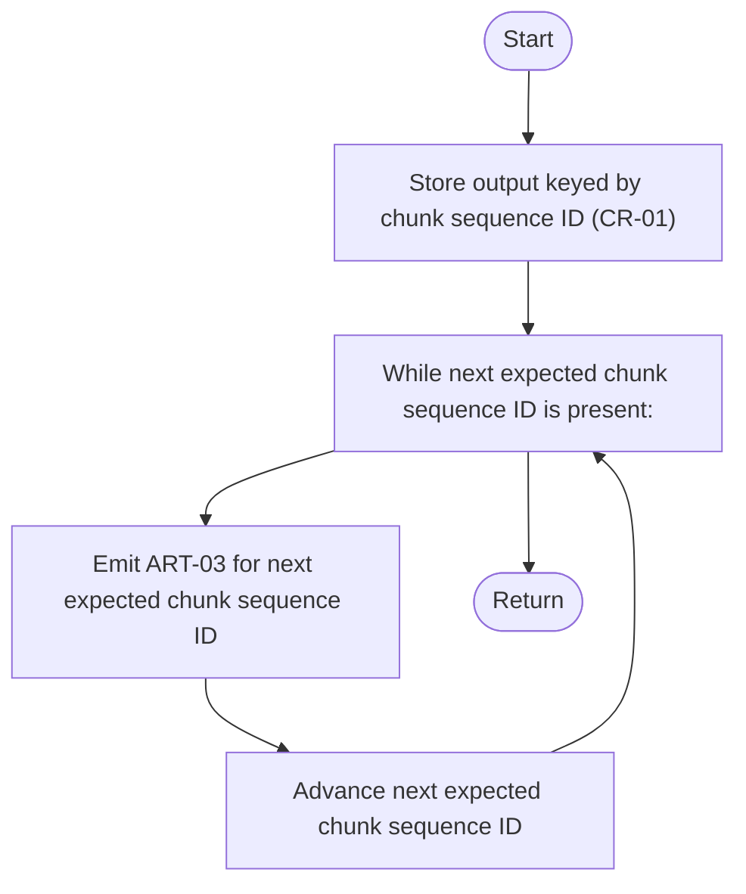
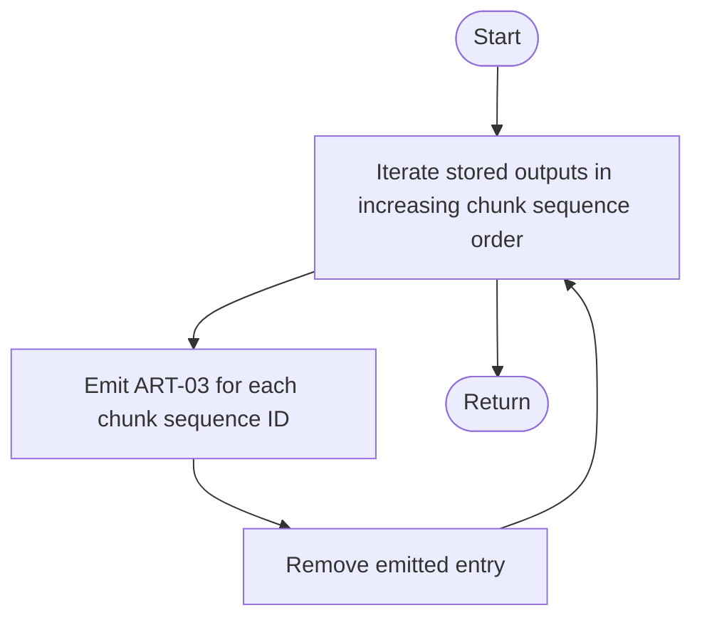

# Component: COM-15 — OrderedOutputBuffer

Sources: [requirements.md](../requirements.md) | [design-map.md](../design-map.md) | [plan.md](../plan.md) | [architecture.md](architecture.md) | [components architecture.md](../../../../processes/components/architecture.md)

Implements: (ALG-15)
Cross-references: (requires: OUT-03, PROC-07; satisfies: GOAL-04)

## Capabilities

- CAP-15 — Buffer output and flush deterministically by chunk sequence.
  Derived-from: (GOAL-04)

## Surface: SUR-15

Contracts: (CON-16)

- CON-16 — Ordered output streaming. Spec: [design-map.md#contract-con-16-ordered-output](../design-map.md#contract-con-16-ordered-output)

## State holders (IAR-XX / ART-XX)

- IAR-10 — Chunk results (includes chunk sequence ID)
- ART-03 — Text output stream

## Algorithms (ALG-XX)

### ALG-15 — Buffer and flush ordered output by chunk sequence ID

Guarantees: (INV-02)

