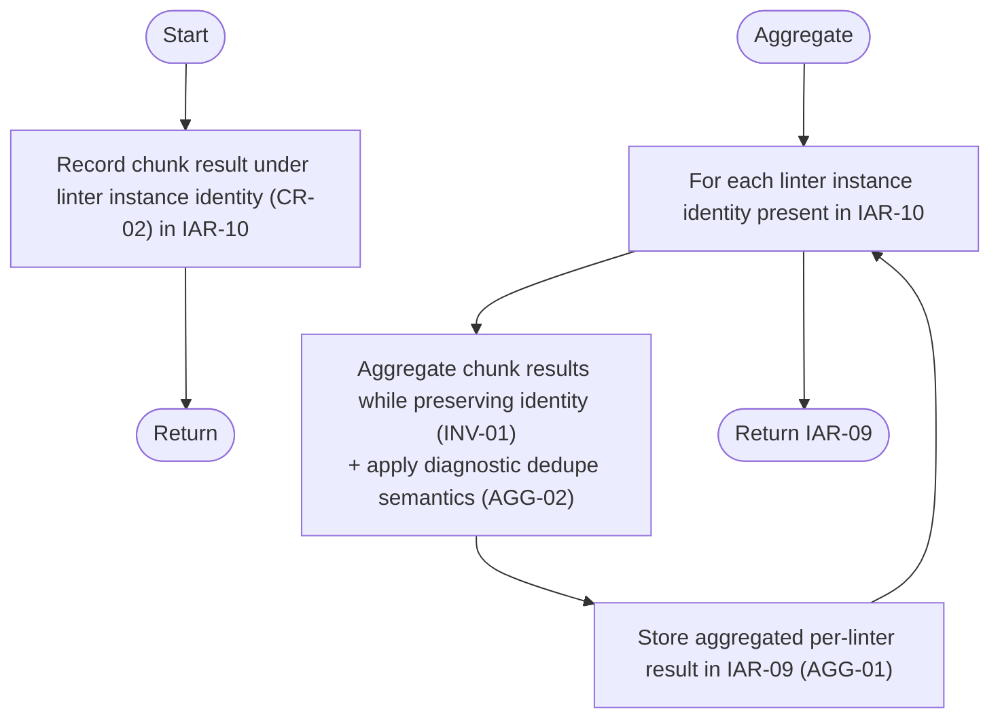

# Component: COM-16 — ResultCollector

Sources: [requirements.md](../requirements.md) | [design-map.md](../design-map.md) | [plan.md](../plan.md) | [architecture.md](architecture.md) | [components architecture.md](../../../../processes/components/architecture.md)

Implements: (ALG-16)
Cross-references: (requires: INV-01, OUT-01; satisfies: GOAL-02)

## Capabilities

- CAP-16 — Aggregate results and diagnostics keyed by linter instance identity.
  Derived-from: (GOAL-02, GOAL-04)

## Surface: SUR-16

Contracts: (CON-15)

- CON-15 — Aggregate chunk results. Spec: [design-map.md#contract-con-15-aggregate-chunks](../design-map.md#contract-con-15-aggregate-chunks)

## State holders (IAR-XX)

- IAR-10 — Chunk results
- IAR-09 — Aggregated results

## Algorithms (ALG-XX)

### ALG-16 — Aggregate chunk results (identity-preserving) and dedupe diagnostics

Guarantees: (INV-01, INV-02)

