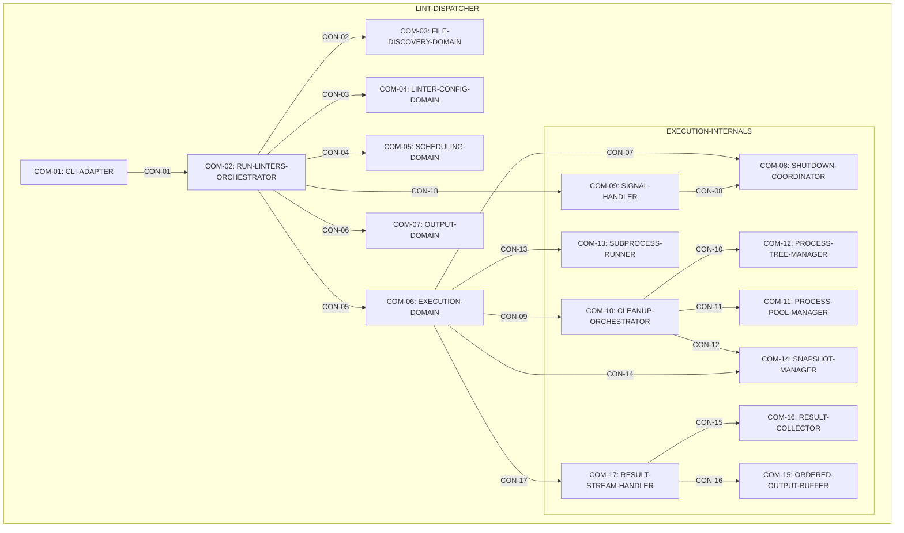

# Lint Dispatcher Design Map

Sources: [requirements.md](requirements.md) | [design map structure.md](../../../processes/design%20map%20structure.md) | [graph-schema.md](../../../processes/graph-schema.md) | [propagation-rules.md](../../../processes/propagation-rules.md)

---

## System Hierarchy

---

## Component: COM-01 (CLI-ADAPTER)

Pattern: cli-adapter
Implements: (GOAL-01)
Cross-references: (requires: EXEC-01, EXEC-02; uses: RES-01, RES-04, CON-01)
Needs: ()
Consumes: (ART-01)
Produces: (IAR-01, IAR-02)

### Capabilities

- CAP-01 — Parse lint invocation into run inputs.
  Derived-from: (GOAL-01)

### Surface: SUR-01

Contracts: ()

### Uses contracts

- CON-01: invokes COM-02 (RUN-LINTERS-ORCHESTRATOR)

### Algorithms

- ALG-01 — Parse run inputs and invoke orchestrator
  Guarantees: (INV-02)

### State Holders

- IAR-01 — Run Args
- IAR-02 — Runtime Facts

---

## Component: COM-02 (RUN-LINTERS-ORCHESTRATOR)

Pattern: orchestrator
Implements: (GOAL-01, GOAL-03)
Cross-references: (requires: EXEC-03, EXEC-04, OUT-05, INV-01, INV-05; uses: CON-02, CON-03, CON-04, CON-05, CON-06, CON-18; satisfies: GOAL-02)
Needs: ()
Consumes: (IAR-01, IAR-02)
Produces: (IAR-06, IAR-07)

### Capabilities

- CAP-02 — Drive the run lifecycle and coordinate domains.
  Derived-from: (GOAL-01, GOAL-03)

### Surface: SUR-02

Contracts: (CON-01)

### Uses contracts

- CON-02: queries COM-03 (FILE-DISCOVERY-DOMAIN)
- CON-03: queries COM-04 (LINTER-CONFIG-DOMAIN)
- CON-04: queries COM-05 (SCHEDULING-DOMAIN)
- CON-05: invokes COM-06 (EXECUTION-DOMAIN)
- CON-06: invokes COM-07 (OUTPUT-DOMAIN)
- CON-18: installs COM-09 (SIGNAL-HANDLER) for SIGINT

### Algorithms

- ALG-02 — Orchestrate a lint run
  Guarantees: (INV-02, INV-05)

### State Holders

- IAR-04 — File Registry

---

## Component: COM-03 (FILE-DISCOVERY-DOMAIN)

Pattern: leaf-domain
Implements: (GOAL-01, GOAL-04)
Cross-references: (uses: RES-03; requires: EXEC-02, IN-06, INV-02, INV-03; satisfies: IN-06)
Needs: ()
Consumes: (IAR-01)
Produces: (IAR-03)

### Capabilities

- CAP-03 — Produce a deterministic candidate fileset for the run.
  Derived-from: (GOAL-01, GOAL-04)

### Surface: SUR-03

Contracts: (CON-02)

### Algorithms

- ALG-03 — File discovery pipeline (git → normalize → dedupe → exists → sort)
  Guarantees: (INV-02, INV-03)

### State Holders

- IAR-03 — File Discovery Result

---

## Component: COM-04 (LINTER-CONFIG-DOMAIN)

Pattern: domain
Implements: (GOAL-02)
Cross-references: (requires: INV-01, IN-01, IN-02, IN-03, PROC-01, EXEC-03; satisfies: IN-01)
Needs: ()
Consumes: (IAR-03)
Produces: (IAR-04)

### Capabilities

- CAP-04 — Expand linter specs into operational instances and filesets.
  Derived-from: (GOAL-02)

### Surface: SUR-04

Contracts: (CON-03)

### Algorithms

- ALG-04 — Spec expansion, instance creation, fileset computation, preflight
  Guarantees: (INV-01, INV-03)

---

## Component: COM-05 (SCHEDULING-DOMAIN)

Pattern: scheduler
Implements: (GOAL-02, GOAL-04)
Cross-references: (requires: INV-02, INV-04, PROC-03, PROC-04, PROC-05, PROC-06, PROC-07, PERF-01, PERF-02; satisfies: GOAL-02, PERF-02)
Needs: ()
Consumes: (IAR-04)
Produces: (IAR-05)

### Capabilities

- CAP-05 — Build deterministic, conflict-free phases and ARG_MAX-safe chunks.
  Derived-from: (GOAL-02, GOAL-04)

### Surface: SUR-05

Contracts: (CON-04)

### Algorithms

- ALG-05 — Phase plan generation + chunk IDs + ARG_MAX chunking
  Guarantees: (INV-02, INV-04)

### State Holders

- IAR-05 — Scheduling Result

---

## Component: COM-06 (EXECUTION-DOMAIN)

Pattern: executor
Implements: (GOAL-02, GOAL-03, GOAL-04)
Cross-references: (requires: INV-02, INV-03, INV-04, PROC-08, PROC-09, PROC-10, PROC-11; uses: CON-07, CON-09, CON-13, CON-14, CON-17; satisfies: GOAL-02, PERF-02)
Needs: ()
Consumes: (IAR-05, IAR-04)
Produces: (IAR-06)

### Capabilities

- CAP-06 — Execute scheduled phases with drift handling, snapshot safety, and shutdown.
  Derived-from: (GOAL-02, GOAL-03, GOAL-04)

### Surface: SUR-06

Contracts: (CON-05)

### Uses contracts

- CON-07: coordinates shutdown via COM-08
- CON-09: registers cleanup via COM-10
- CON-13: runs commands via COM-13
- CON-14: snapshots/restore via COM-14
- CON-17: collects results via COM-17

### Algorithms

- ALG-06 — Phase execution with drift handling, snapshots, shutdown, and ordered output
  Guarantees: (INV-03, INV-04)

### State Holders

- IAR-06 — Execution Result
- IAR-13 — Inflight Task Registry
- IAR-17 — Subprocess Invocation

---

## Component: COM-07 (OUTPUT-DOMAIN)

Pattern: presentation-domain
Implements: (GOAL-04)
Cross-references: (requires: OUT-01, OUT-02, OUT-03, OUT-04, OUT-05, INV-02; satisfies: OUT-05)
Needs: ()
Consumes: (IAR-06, IAR-07)
Produces: (ART-02, ART-03, ART-04)

### Capabilities

- CAP-07 — Render deterministic output and compute the process exit code.
  Derived-from: (GOAL-04)

### Surface: SUR-07

Contracts: (CON-06)

### Algorithms

- ALG-07 — Output strategy + exit-code computation
  Guarantees: (INV-02)

### State Holders

- IAR-07 — Output Meta

---

## Component: COM-08 (SHUTDOWN-COORDINATOR)

Pattern: coordinator
Implements: (GOAL-03)
Cross-references: (requires: PROC-11; satisfies: GOAL-03)
Needs: ()
Consumes: (IAR-12)
Produces: (IAR-11)

### Capabilities

- CAP-08 — Coordinate shutdown initiation and shared shutdown state.
  Derived-from: (GOAL-03)

### Surface: SUR-08

Contracts: (CON-07, CON-08)

### Algorithms

- ALG-08 — Shutdown initiation
  Guarantees: (INV-02)

### State Holders

- IAR-11 — Shutdown Event
- IAR-12 — Shutdown Trigger

---

## Component: COM-09 (SIGNAL-HANDLER)

Pattern: signal-adapter
Implements: (GOAL-03)
Cross-references: (uses: CON-08; satisfies: GOAL-03)
Needs: ()
Consumes: (ART-05)
Produces: (IAR-12)

### Capabilities

- CAP-09 — Translate OS signals into shutdown initiation.
  Derived-from: (GOAL-03)

### Surface: SUR-09

Contracts: (CON-18)

### Uses contracts

- CON-08: routes signals to COM-08

### Algorithms

- ALG-09 — Signal handling
  Guarantees: (INV-02)

---

## Component: COM-10 (CLEANUP-ORCHESTRATOR)

Pattern: cleanup-orchestrator
Implements: (GOAL-03)
Cross-references: (requires: PROC-11; uses: CON-10, CON-11, CON-12; satisfies: GOAL-02)
Needs: ()
Consumes: (IAR-13)
Produces: (IAR-18)

### Capabilities

- CAP-10 — Enforce deterministic cleanup ordering and restore semantics.
  Derived-from: (GOAL-03)

### Surface: SUR-10

Contracts: (CON-09)

### Uses contracts

- CON-10: terminates via COM-12
- CON-11: shuts down executor via COM-11
- CON-12: restores snapshots via COM-14

### Algorithms

- ALG-10 — Cleanup ordering
  Guarantees: (INV-02)

### State Holders

- IAR-18 — Cleanup Result

---

## Component: COM-11 (PROCESS-POOL-MANAGER)

Pattern: pool-manager
Implements: (GOAL-02, GOAL-03)
Cross-references: (requires: PERF-01, PERF-02; satisfies: PERF-02)
Needs: ()
Consumes: (IAR-01, IAR-02, IAR-05)
Produces: (IAR-14)

### Capabilities

- CAP-11 — Provide deterministic pool sizing and shutdown behavior.
  Derived-from: (GOAL-02, GOAL-03)

### Surface: SUR-11

Contracts: (CON-11)

### Algorithms

- ALG-11 — Process pool sizing
  Guarantees: (INV-02)

### State Holders

- IAR-14 — Process Pool Handle

---

## Component: COM-12 (PROCESS-TREE-MANAGER)

Pattern: platform-boundary
Implements: (GOAL-03)
Cross-references: (uses: RES-05; requires: PROC-10)
Needs: ()
Consumes: (IAR-15)
Produces: (IAR-15)

### Capabilities

- CAP-12 — Isolate and terminate process trees deterministically.
  Derived-from: (GOAL-03)

### Surface: SUR-12

Contracts: (CON-10)

### Algorithms

- ALG-12 — Process tree termination
  Guarantees: (INV-02)

### State Holders

- IAR-15 — Process Tree Handles

---

## Component: COM-13 (SUBPROCESS-RUNNER)

Pattern: subprocess-adapter
Implements: (GOAL-02, GOAL-03)
Cross-references: (uses: RES-05; requires: PROC-10)
Needs: ()
Consumes: (IAR-17, IAR-15)
Produces: (IAR-16)

### Capabilities

- CAP-13 — Execute subprocesses in killable process trees with timeout/crash markers.
  Derived-from: (GOAL-02, GOAL-03)

### Surface: SUR-13

Contracts: (CON-13)

### Algorithms

- ALG-13 — Subprocess execution
  Guarantees: (INV-02)

### State Holders

- IAR-16 — Subprocess Result

---

## Component: COM-14 (SNAPSHOT-MANAGER)

Pattern: snapshot-service
Implements: (GOAL-03)
Cross-references: (uses: RES-05; requires: PROC-09; satisfies: GOAL-02)
Needs: ()
Consumes: (IAR-05, IAR-13)
Produces: (IAR-08)

### Capabilities

- CAP-14 — Create and restore snapshots for mutator safety.
  Derived-from: (GOAL-03)

### Surface: SUR-14

Contracts: (CON-12, CON-14)

### Algorithms

- ALG-14 — Snapshots
  Guarantees: (INV-02)

### State Holders

- IAR-08 — Snapshot Store

---

## Component: COM-15 (ORDERED-OUTPUT-BUFFER)

Pattern: ordering-buffer
Implements: (GOAL-04)
Cross-references: (requires: OUT-03, INV-02; satisfies: GOAL-04)
Needs: ()
Consumes: (IAR-10)
Produces: (ART-03)

### Capabilities

- CAP-15 — Buffer output and flush deterministically by chunk sequence.
  Derived-from: (GOAL-04)

### Surface: SUR-15

Contracts: (CON-16)

### Algorithms

- ALG-15 — Ordered output buffering
  Guarantees: (INV-02)

---

## Component: COM-16 (RESULT-COLLECTOR)

Pattern: aggregator
Implements: (GOAL-02, GOAL-04)
Cross-references: (requires: INV-01, OUT-01; satisfies: GOAL-02)
Needs: ()
Consumes: (IAR-10)
Produces: (IAR-09)

### Capabilities

- CAP-16 — Aggregate results and diagnostics keyed by linter instance identity.
  Derived-from: (GOAL-02, GOAL-04)

### Surface: SUR-16

Contracts: (CON-15)

### Algorithms

- ALG-16 — Result aggregation
  Guarantees: (INV-01, INV-02)

### State Holders

- IAR-09 — Aggregated Results

---

## Component: COM-17 (RESULT-STREAM-HANDLER)

Pattern: result-stream
Implements: (GOAL-03, GOAL-04)
Cross-references: (requires: PROC-11; uses: CON-15, CON-16; satisfies: GOAL-03, GOAL-04)
Needs: ()
Consumes: (IAR-13)
Produces: (IAR-09)

### Capabilities

- CAP-17 — Stream results while honoring shutdown and deterministic output ordering.
  Derived-from: (GOAL-03, GOAL-04)

### Surface: SUR-17

Contracts: (CON-17)

### Uses contracts

- CON-15: forwards results to COM-16
- CON-16: forwards output to COM-15

### Algorithms

- ALG-17 — Result stream handling
  Guarantees: (INV-02)

### State Holders

- IAR-10 — Ordered Output Buffer Input

---

## Capability: CAP-01

Owner: (COM-01)
Derived-from: (GOAL-01)
Description: Parse lint invocation into run inputs.

---

## Capability: CAP-02

Owner: (COM-02)
Derived-from: (GOAL-01, GOAL-03)
Description: Drive the run lifecycle and coordinate domains.

---

## Capability: CAP-03

Owner: (COM-03)
Derived-from: (GOAL-01, GOAL-04)
Description: Produce a deterministic candidate fileset for the run.

---

## Capability: CAP-04

Owner: (COM-04)
Derived-from: (GOAL-02)
Description: Expand linter specs into operational instances and filesets.

---

## Capability: CAP-05

Owner: (COM-05)
Derived-from: (GOAL-02, GOAL-04)
Description: Build deterministic, conflict-free phases and ARG_MAX-safe chunks.

---

## Capability: CAP-06

Owner: (COM-06)
Derived-from: (GOAL-02, GOAL-03, GOAL-04)
Description: Execute scheduled phases with drift handling, snapshot safety, and shutdown.

---

## Capability: CAP-07

Owner: (COM-07)
Derived-from: (GOAL-04)
Description: Render deterministic output and compute the process exit code.

---

## Capability: CAP-08

Owner: (COM-08)
Derived-from: (GOAL-03)
Description: Coordinate shutdown initiation and shared shutdown state.

---

## Capability: CAP-09

Owner: (COM-09)
Derived-from: (GOAL-03)
Description: Translate OS signals into shutdown initiation.

---

## Capability: CAP-10

Owner: (COM-10)
Derived-from: (GOAL-03)
Description: Enforce deterministic cleanup ordering and restore semantics.

---

## Capability: CAP-11

Owner: (COM-11)
Derived-from: (GOAL-02, GOAL-03)
Description: Provide deterministic pool sizing and shutdown behavior.

---

## Capability: CAP-12

Owner: (COM-12)
Derived-from: (GOAL-03)
Description: Isolate and terminate process trees deterministically.

---

## Capability: CAP-13

Owner: (COM-13)
Derived-from: (GOAL-02, GOAL-03)
Description: Execute subprocesses in killable process trees with timeout/crash markers.

---

## Capability: CAP-14

Owner: (COM-14)
Derived-from: (GOAL-03)
Description: Create and restore snapshots for mutator safety.

---

## Capability: CAP-15

Owner: (COM-15)
Derived-from: (GOAL-04)
Description: Buffer output and flush deterministically by chunk sequence.

---

## Capability: CAP-16

Owner: (COM-16)
Derived-from: (GOAL-02, GOAL-04)
Description: Aggregate results and diagnostics keyed by linter instance identity.

---

## Capability: CAP-17

Owner: (COM-17)
Derived-from: (GOAL-03, GOAL-04)
Description: Stream results while honoring shutdown and deterministic output ordering.

---

## Surface: SUR-01

Owner: (COM-01)
Contracts: ()

---

## Surface: SUR-02

Owner: (COM-02)
Contracts: (CON-01)

---

## Surface: SUR-03

Owner: (COM-03)
Contracts: (CON-02)

---

## Surface: SUR-04

Owner: (COM-04)
Contracts: (CON-03)

---

## Surface: SUR-05

Owner: (COM-05)
Contracts: (CON-04)

---

## Surface: SUR-06

Owner: (COM-06)
Contracts: (CON-05)

---

## Surface: SUR-07

Owner: (COM-07)
Contracts: (CON-06)

---

## Surface: SUR-08

Owner: (COM-08)
Contracts: (CON-07, CON-08)

---

## Surface: SUR-09

Owner: (COM-09)
Contracts: (CON-18)

---

## Surface: SUR-10

Owner: (COM-10)
Contracts: (CON-09)

---

## Surface: SUR-11

Owner: (COM-11)
Contracts: (CON-11)

---

## Surface: SUR-12

Owner: (COM-12)
Contracts: (CON-10)

---

## Surface: SUR-13

Owner: (COM-13)
Contracts: (CON-13)

---

## Surface: SUR-14

Owner: (COM-14)
Contracts: (CON-12, CON-14)

---

## Surface: SUR-15

Owner: (COM-15)
Contracts: (CON-16)

---

## Surface: SUR-16

Owner: (COM-16)
Contracts: (CON-15)

---

## Surface: SUR-17

Owner: (COM-17)
Contracts: (CON-17)

---

## State Holder: IAR-01 (Run Args)

Pattern: state-object
Kind: internal-api
Owner: (COM-01)
Implements: (EXEC-01, EXEC-02)
Cross-references: (satisfies: GOAL-01)
Needs: ()

### State Invariants (IDs only; no schema fields/types)

- RA-01 — Mode selection for file discovery (changed-only / commit / explicit / whole-repo)
  Cross-references: (derived-from: EXEC-02)
- RA-02 — Commit reference when in commit mode
  Cross-references: (derived-from: EXEC-02)
- RA-03 — Explicit file list when in explicit mode
  Cross-references: (derived-from: EXEC-02)
- RA-04 — Linter selection specs (ordered)
  Cross-references: (requires: IN-03)
- RA-05 — Output mode selection (text vs YAML)
  Cross-references: (requires: OUT-02, OUT-04)
- RA-06 — Fail-fast selection
  Cross-references: (requires: EXEC-04)
- RA-07 — Concurrency cap selection (unset or positive)
  Cross-references: (requires: PERF-02)

### Access via contracts

- CON-01: write/read
  Cross-references: (derived-from: IAR-01)

---

## State Holder: IAR-02 (Runtime Facts)

Pattern: state-object
Kind: internal-api
Owner: (COM-01)
Cross-references: (satisfies: PERF-02)
Needs: ()

### State Invariants (IDs only; no schema fields/types)

- RF-01 — Available CPU count (positive integer)
  Cross-references: (derived-from: IN-04)
- RF-02 — Environment size estimate used for ARG_MAX budgeting
  Cross-references: (derived-from: IN-04)

### Access via contracts

- CON-01: write/read
  Cross-references: (derived-from: IAR-02)

---

## State Holder: IAR-03 (File Discovery Result)

Pattern: domain-result
Kind: internal-api
Owner: (COM-03)
Cross-references: (satisfies: IN-06)
Needs: ()

### State Invariants (IDs only; no schema fields/types)

- FDR-01 — Repo-relative file paths (deduped and deterministically ordered)
  Cross-references: (derived-from: IN-06)
- FDR-02 — Existence-filtered file list (deleted paths removed)
  Cross-references: (requires: INV-03)
- FDR-03 — Warnings list (non-fatal)
  Cross-references: (derived-from: IN-06)
- FDR-04 — Errors list (fatal)
  Cross-references: (derived-from: IN-06)

### Access via contracts

- CON-02: write/read
  Cross-references: (derived-from: IAR-03)

---

## State Holder: IAR-04 (File Registry)

Pattern: state-object
Kind: internal-api
Owner: (COM-02)
Cross-references: (requires: PROC-02, INV-03, INV-04)
Needs: ()
Spec: [components/shared-file-registry.md](components/shared-file-registry.md)

### State Invariants (IDs only; no schema fields/types)

- FR-01 — Current file list (repo-relative, deterministic order)
  Cross-references: (requires: INV-02)
- FR-02 — Fileset cache keyed by linter instance identity
  Cross-references: (requires: INV-01)
- FR-03 — Existence-only pruning support (no new git queries / no fileset recompute)
  Cross-references: (requires: INV-03)
- FR-04 — Drop-instances support after preflight (remove non-operational instances from cache)
  Cross-references: (requires: EXEC-03)
- FR-05 — Phase-boundary mutation rule (no mutation while tasks are in flight)
  Cross-references: (requires: PROC-08)

### Access via contracts

- CON-03: read/write
  Cross-references: (derived-from: IAR-04)
- CON-05: read/write
  Cross-references: (derived-from: IAR-04)

---

## State Holder: IAR-05 (Scheduling Result)

Pattern: domain-result
Kind: internal-api
Owner: (COM-05)
Cross-references: (requires: INV-04; satisfies: PERF-02)
Needs: ()

### State Invariants (IDs only; no schema fields/types)

- SR-01 — Deterministic phase ordering
  Cross-references: (requires: INV-02)
- SR-02 — Phase items include linter instance identity and fileset chunk
  Cross-references: (requires: INV-01, PROC-01)
- SR-03 — Chunk sequence IDs are contiguous and monotonic across the full schedule
  Cross-references: (requires: PROC-07)
- SR-04 — Snapshot-needed marker for mutators
  Cross-references: (derived-from: PROC-09)
- SR-05 — Skipped items surfaced without breaking chunk-ID contiguity
  Cross-references: (requires: PROC-07)
- SR-06 — Warnings/errors surfaced without aborting schedule construction unless fatal
  Cross-references: (requires: INV-04)

### Access via contracts

- CON-04: write/read
  Cross-references: (derived-from: IAR-05)

---

## State Holder: IAR-06 (Execution Result)

Pattern: domain-result
Kind: internal-api
Owner: (COM-06)
Cross-references: (requires: INV-04)
Needs: ()

### State Invariants (IDs only; no schema fields/types)

- ER-01 — Chunk results grouped by linter instance identity
  Cross-references: (requires: INV-01)
- ER-02 — Phase-modified flags for mutator phases
  Cross-references: (requires: PROC-09)
- ER-03 — Error markers for failures/crashes/timeouts/shutdown
  Cross-references: (requires: OUT-05)

### Access via contracts

- CON-05: write/read
  Cross-references: (derived-from: IAR-06)
- CON-06: read
  Cross-references: (derived-from: IAR-06)

---

## State Holder: IAR-07 (Output Meta)

Pattern: state-object
Kind: internal-api
Owner: (COM-07)
Cross-references: (satisfies: OUT-05)
Needs: ()
Spec: [components/shared-diagnostic-collector.md](components/shared-diagnostic-collector.md)

### State Invariants (IDs only; no schema fields/types)

- OM-01 — Warning accumulation for non-fatal issues
  Cross-references: (requires: OUT-01)
- OM-02 — Error accumulation for fatal issues
  Cross-references: (requires: OUT-05)

### Access via contracts

- CON-06: write/read
  Cross-references: (derived-from: IAR-07)

---

## State Holder: IAR-08 (Snapshot Store)

Pattern: file-artifact
Kind: filesystem
Owner: (COM-14)
Cross-references: (satisfies: GOAL-02; requires: PROC-09)
Needs: ()

### State Invariants (IDs only; no schema fields/types)

- SNAP-01 — Snapshot stored per mutator chunk identity
  Cross-references: (requires: PROC-09)
- SNAP-02 — Restore behavior differs for crash vs shutdown
  Cross-references: (requires: PROC-09, PROC-11)

### Access via contracts

- CON-12: write/read/restore
  Cross-references: (derived-from: IAR-08)
- CON-14: write/read/restore
  Cross-references: (derived-from: IAR-08)

---

## State Holder: IAR-09 (Aggregated Results)

Pattern: domain-result
Kind: internal-api
Owner: (COM-16)
Cross-references: (satisfies: GOAL-02)
Needs: ()

### State Invariants (IDs only; no schema fields/types)

- AGG-01 — Aggregated per-linter results keyed by linter instance identity
  Cross-references: (requires: INV-01)
- AGG-02 — Diagnostic dedupe semantics applied during aggregation
  Cross-references: (requires: OUT-01)

### Access via contracts

- CON-15: write/read
  Cross-references: (derived-from: IAR-09)
- CON-06: read
  Cross-references: (derived-from: IAR-09)

---

## State Holder: IAR-10 (Chunk Results)

Pattern: domain-result
Kind: internal-api
Owner: (COM-17)
Cross-references: (satisfies: GOAL-03, GOAL-04)
Needs: ()

### State Invariants (IDs only; no schema fields/types)

- CR-01 — Chunk sequence ID
  Cross-references: (requires: PROC-07)
- CR-02 — Linter instance identity
  Cross-references: (requires: INV-01)
- CR-03 — Chunk outcome classification (success/failure/crash/timeout/skipped/empty)
  Cross-references: (requires: OUT-05)
- CR-04 — Files-modified marker for mutators
  Cross-references: (requires: PROC-09)
- CR-05 — Human-readable chunk output (text) or structured chunk output (YAML)
  Cross-references: (requires: OUT-02, OUT-03, OUT-04)

### Access via contracts

- CON-15: publish/consume
  Cross-references: (derived-from: IAR-10)
- CON-16: publish/consume
  Cross-references: (derived-from: IAR-10)
- CON-17: publish/consume
  Cross-references: (derived-from: IAR-10)

---

## State Holder: IAR-11 (Shutdown Event)

Pattern: state-object
Kind: internal-api
Owner: (COM-08)
Cross-references: (satisfies: GOAL-03; requires: PROC-11)
Needs: ()

### State Invariants (IDs only; no schema fields/types)

- SHUT-01 — Set-once shutdown signal
  Cross-references: (requires: PROC-11)
- SHUT-02 — Shutdown reason available to consumers
  Cross-references: (requires: GOAL-03)

### Access via contracts

- CON-07: write/read
  Cross-references: (derived-from: IAR-11)
- CON-17: read
  Cross-references: (derived-from: IAR-11)

---

## State Holder: IAR-12 (Shutdown Reason)

Pattern: state-object
Kind: internal-api
Owner: (COM-08)
Cross-references: (satisfies: GOAL-03)
Needs: ()

### State Invariants (IDs only; no schema fields/types)

- SHR-01 — Shutdown reason classification (SIGINT vs fail-fast vs crash/timeout)
  Cross-references: (derived-from: OUT-05)

### Access via contracts

- CON-08: write/read
  Cross-references: (derived-from: IAR-12)
- CON-07: write/read
  Cross-references: (derived-from: IAR-12)

---

## State Holder: IAR-13 (Inflight Task Registry)

Pattern: state-object
Kind: internal-api
Owner: (COM-06)
Cross-references: (requires: PROC-09, PROC-10, PROC-11)
Needs: ()

### State Invariants (IDs only; no schema fields/types)

- IF-01 — Per-task mapping from task identity to process/snapshot/future handles
  Cross-references: (requires: PROC-09, PROC-10)
- IF-02 — Deterministic cleanup ordering keys for in-flight tasks
  Cross-references: (requires: PROC-11)

### Access via contracts

- CON-09: write/read
  Cross-references: (derived-from: IAR-13)
- CON-17: read
  Cross-references: (derived-from: IAR-13)

---

## State Holder: IAR-14 (Executor Handle)

Pattern: state-object
Kind: internal-api
Owner: (COM-11)
Cross-references: (satisfies: PERF-02; requires: PROC-11)
Needs: ()

### State Invariants (IDs only; no schema fields/types)

- POOL-01 — Executor handle supporting deterministic sizing and shutdown semantics
  Cross-references: (requires: PERF-02, PROC-11)

### Access via contracts

- CON-11: write/read
  Cross-references: (derived-from: IAR-14)

---

## State Holder: IAR-15 (Process Tree Handles)

Pattern: state-object
Kind: internal-api
Owner: (COM-12)
Cross-references: (requires: PROC-10)
Needs: ()

### State Invariants (IDs only; no schema fields/types)

- TREE-01 — Per-task platform process tree handle
  Cross-references: (requires: PROC-10)

### Access via contracts

- CON-10: write/read
  Cross-references: (derived-from: IAR-15)
- CON-13: read
  Cross-references: (derived-from: IAR-15)

---

## State Holder: IAR-16 (Subprocess Result)

Pattern: domain-result
Kind: internal-api
Owner: (COM-13)
Cross-references: (requires: PROC-10)
Needs: ()

### State Invariants (IDs only; no schema fields/types)

- SUBR-01 — Captured stdout/stderr bytes (bounded)
  Cross-references: (requires: PROC-10)
- SUBR-02 — Exit status or timeout/crash marker
  Cross-references: (requires: OUT-05)

### Access via contracts

- CON-13: write/read
  Cross-references: (derived-from: IAR-16)

---

## State Holder: IAR-17 (Subprocess Invocation)

Pattern: state-object
Kind: internal-api
Owner: (COM-06)
Cross-references: (requires: PROC-10)
Needs: ()

### State Invariants (IDs only; no schema fields/types)

- SUBI-01 — Command invocation derived from linter instance + fileset chunk
  Cross-references: (derived-from: PROC-01)
- SUBI-02 — Timeout policy for subprocess runs
  Cross-references: (requires: PROC-10)
- SUBI-03 — Process isolation requirement for killable process trees
  Cross-references: (requires: PROC-10)

### Access via contracts

- CON-13: write/read
  Cross-references: (derived-from: IAR-17)

---

## State Holder: IAR-18 (Cleanup Result)

Pattern: domain-result
Kind: internal-api
Owner: (COM-10)
Cross-references: (requires: PROC-11)
Needs: ()

### State Invariants (IDs only; no schema fields/types)

- CLEAN-01 — Cleanup completion marker honoring terminate → shutdown → restore ordering
  Cross-references: (derived-from: PROC-11)

### Access via contracts

- CON-09: write/read
  Cross-references: (derived-from: IAR-18)
- CON-10: write/read
  Cross-references: (derived-from: IAR-18)
- CON-11: write/read
  Cross-references: (derived-from: IAR-18)
- CON-12: write/read
  Cross-references: (derived-from: IAR-18)

---

## Contract: CON-01 (CLI-INVOKE)

Pattern: function-call
Surface: (SUR-02)
Between: (COM-01, COM-02)
For: (IAR-01, IAR-02, ART-02)
Interaction: function-call
Implements: (EXEC-01)
Guarantees: (INV-02)
Demands: (OBL-01, OBL-02)
Needs: ()

Input MUST include (IDs only; no schema fields/types):

- IAR-01 — Run args
- IAR-02 — Runtime facts

Output MUST include (IDs only; no schema fields/types):

- ART-02 — Process exit code

### Guarantees (what this contract promises)

- INV-02 — Deterministic ordering

### Demands (what callers must satisfy)
- OBL-01 — Parse arguments deterministically
  Cross-references: (requires: INV-01)
- OBL-02 — Produce run args and runtime facts before invoking orchestrator

---

## Contract: CON-02 (DISCOVER-FILES)

Pattern: domain-call
Surface: (SUR-03)
Between: (COM-02, COM-03)
For: (IAR-03)
Interaction: request-response
Implements: (IN-06)
Guarantees: (INV-02, INV-03)
Demands: (OBL-03, OBL-04)
Needs: ()

Input MUST include (IDs only; no schema fields/types):

- IAR-01 — Run args (mode selection + optional commit/explicit parameters)

Output MUST include (IDs only; no schema fields/types):

- IAR-03 — File discovery result

### Guarantees (what this contract promises)

- INV-02 — Deterministic ordering
- INV-03 — Existence-only drift handling

### Demands (what callers must satisfy)
- OBL-03 — Return repo-relative, deduped, deterministically ordered file list
- OBL-04 — Existence checks only (no side effects)

---

## Contract: CON-03 (CONFIGURE-LINTERS)

Pattern: domain-call
Surface: (SUR-04)
Between: (COM-02, COM-04)
For: (IAR-04)
Interaction: request-response
Implements: (IN-01)
Cross-references: (requires: INV-01)
Guarantees: (INV-01, INV-02)
Demands: (OBL-05, OBL-06)
Needs: ()

Input MUST include (IDs only; no schema fields/types):

- IAR-01 — Run args (linter specs)
- IAR-03 — File discovery result (candidate files)

Output MUST include (IDs only; no schema fields/types):

- IAR-04 — File registry (includes fileset cache keyed by linter instance identity)

### Guarantees (what this contract promises)

- INV-01 — Linter instance identity is correctness-critical
- INV-02 — Deterministic ordering

### Demands (what callers must satisfy)
- OBL-05 — Preserve linter instance identity end-to-end
- OBL-06 — Maintain stable linter ordering under spec expansion
  Cross-references: (requires: INV-01)

---

## Contract: CON-04 (BUILD-SCHEDULE)

Pattern: domain-call
Surface: (SUR-05)
Between: (COM-02, COM-05)
For: (IAR-05)
Interaction: request-response
Cross-references: (requires: INV-04; satisfies: PERF-02)
Guarantees: (INV-02, INV-04)
Demands: (OBL-07, OBL-08)
Needs: ()

Input MUST include (IDs only; no schema fields/types):

- IAR-01 — Run args (commit mode + concurrency cap)
- IAR-02 — Runtime facts (ARG_MAX budgeting inputs)
- IAR-04 — File registry (instances + fileset cache)

Output MUST include (IDs only; no schema fields/types):

- IAR-05 — Scheduling result (phases + items + contiguous chunk IDs)

### Guarantees (what this contract promises)

- INV-02 — Deterministic ordering
- INV-04 — Parallel execution must be conflict-free

### Demands (what callers must satisfy)
- OBL-07 — Never schedule overlapping filesets concurrently
  Cross-references: (requires: INV-04)
- OBL-08 — Assign contiguous chunk sequence IDs deterministically

---

## Contract: CON-05 (EXECUTE-SCHEDULE)

Pattern: domain-call
Surface: (SUR-06)
Between: (COM-02, COM-06)
For: (IAR-06)
Interaction: request-response
Cross-references: (requires: INV-04)
Guarantees: (INV-03, INV-04)
Demands: (OBL-09, OBL-10)
Needs: ()

Input MUST include (IDs only; no schema fields/types):

- IAR-04 — File registry (for existence-only pruning and cache ownership)
- IAR-05 — Scheduling result (phases + phase items)
- IAR-11 — Shutdown event (set by SIGINT/fail-fast/crash paths)

Output MUST include (IDs only; no schema fields/types):

- IAR-06 — Execution result (chunk results + errors)
- IAR-13 — Inflight task registry (used for coordinated cleanup)

### Guarantees (what this contract promises)

- INV-03 — Existence-only drift handling
- INV-04 — Parallel execution must be conflict-free

### Demands (what callers must satisfy)
- OBL-09 — Perform existence-only prune + scheduled chunk re-evaluation at phase boundaries (hard barrier; no phase pipelining)
- OBL-10 — Respect fail-fast and shutdown semantics (return partial results)

---

## Contract: CON-06 (PRESENT-RESULTS)

Pattern: presentation-call
Surface: (SUR-07)
Between: (COM-02, COM-07)
For: (ART-02, ART-03, ART-04)
Interaction: request-response
Implements: (OUT-05)
Guarantees: (INV-02)
Demands: (OBL-11, OBL-12)
Needs: ()

Input MUST include (IDs only; no schema fields/types):

- IAR-01 — Run args (output mode selection)
- IAR-06 — Execution result
- IAR-07 — Output meta (warnings/errors)

Output MUST include (IDs only; no schema fields/types):

- ART-02 — Process exit code
- ART-03 — Text output stream (when configured)
- ART-04 — YAML output artifact (when configured)

### Guarantees (what this contract promises)

- INV-02 — Deterministic ordering

### Demands (what callers must satisfy)
- OBL-11 — Exit code reflects aggregate failures
  Cross-references: (requires: OUT-05)
- OBL-12 — SIGINT/shutdown maps to exit code 130

---

## Contract: CON-07 (SHUTDOWN-INITIATION)

Pattern: shutdown-contract
Surface: (SUR-08)
Between: (COM-06, COM-08)
For: (IAR-11)
Interaction: request-response
Cross-references: (satisfies: GOAL-03)
Guarantees: (INV-02)
Demands: (OBL-13, OBL-14)
Needs: ()

Input MUST include (IDs only; no schema fields/types):

- IAR-12 — Shutdown reason

Output MUST include (IDs only; no schema fields/types):

- IAR-11 — Shutdown event (set-once)

### Guarantees (what this contract promises)

- INV-02 — Deterministic ordering

### Demands (what callers must satisfy)
- OBL-13 — Shutdown initiation is idempotent
- OBL-14 — Shutdown callbacks run in deterministic order

---

## Contract: CON-08 (SIGNAL-TO-SHUTDOWN)

Pattern: signal-contract
Surface: (SUR-08)
Between: (COM-09, COM-08)
For: (IAR-12)
Interaction: pub-sub
Cross-references: (satisfies: GOAL-03)
Guarantees: (INV-02)
Demands: (OBL-15)
Needs: ()

Input MUST include (IDs only; no schema fields/types):

- ART-05 — SIGINT signal

Output MUST include (IDs only; no schema fields/types):

- IAR-12 — Shutdown reason

### Guarantees (what this contract promises)

- INV-02 — Deterministic ordering

### Demands (what callers must satisfy)
- OBL-15 — SIGINT sets shutdown flag without raising in handler

---

## Contract: CON-09 (CLEANUP-REGISTRATION)

Pattern: cleanup-contract
Surface: (SUR-10)
Between: (COM-06, COM-10)
For: (IAR-13, IAR-18)
Interaction: request-response
Cross-references: (satisfies: GOAL-02)
Guarantees: (INV-02)
Demands: (OBL-16)
Needs: ()

Input MUST include (IDs only; no schema fields/types):

- IAR-13 — Inflight task registry

Output MUST include (IDs only; no schema fields/types):

- IAR-18 — Cleanup result

### Guarantees (what this contract promises)

- INV-02 — Deterministic ordering

### Demands (what callers must satisfy)
- OBL-16 — Cleanup order is: terminate → shutdown → restore

---

## Contract: CON-10 (TERMINATE-TREES)

Pattern: platform-kill
Surface: (SUR-12)
Between: (COM-10, COM-12)
For: (IAR-15)
Interaction: request-response
Cross-references: (uses: RES-05)
Guarantees: (INV-02)
Demands: (OBL-17)
Needs: ()

Input MUST include (IDs only; no schema fields/types):

- IAR-15 — Process tree handles

Output MUST include (IDs only; no schema fields/types):

- TERM-01 — Termination complete for all tracked process trees
  Cross-references: (derived-from: PROC-10)

### Guarantees (what this contract promises)

- INV-02 — Deterministic ordering

### Demands (what callers must satisfy)
- OBL-17 — Terminates entire process tree (not only parent PID)

---

## Contract: CON-11 (POOL-SHUTDOWN)

Pattern: executor-contract
Surface: (SUR-11)
Between: (COM-10, COM-11)
For: (IAR-14)
Interaction: request-response
Cross-references: (satisfies: PERF-02)
Guarantees: (INV-02)
Demands: (OBL-18)
Needs: ()

Input MUST include (IDs only; no schema fields/types):

- IAR-14 — Executor handle

Output MUST include (IDs only; no schema fields/types):

- POOL-SHUT-01 — Executor shutdown initiated with required semantics
  Cross-references: (derived-from: PROC-11)

### Guarantees (what this contract promises)

- INV-02 — Deterministic ordering

### Demands (what callers must satisfy)
- OBL-18 — Shut down executor without waiting and cancel pending work

---

## Contract: CON-12 (RESTORE-SNAPSHOTS)

Pattern: snapshot-contract
Surface: (SUR-14)
Between: (COM-10, COM-14)
For: (IAR-08)
Interaction: request-response
Cross-references: (satisfies: GOAL-02; requires: INV-04)
Guarantees: (INV-04)
Demands: (OBL-19)
Needs: ()

Input MUST include (IDs only; no schema fields/types):

- IAR-08 — Snapshot store

Output MUST include (IDs only; no schema fields/types):

- SNAP-RESTORE-01 — Snapshot restore completed for required tasks
  Cross-references: (derived-from: PROC-09, PROC-11)

### Guarantees (what this contract promises)

- INV-04 — Parallel execution must be conflict-free

### Demands (what callers must satisfy)
- OBL-19 — Restore snapshots for all in-flight mutators on shutdown

---

## Contract: CON-13 (RUN-SUBPROCESS)

Pattern: subprocess-contract
Surface: (SUR-13)
Between: (COM-06, COM-13)
For: (IAR-16)
Interaction: request-response
Cross-references: (uses: RES-05)
Guarantees: (INV-02)
Demands: (OBL-20)
Needs: ()

Input MUST include (IDs only; no schema fields/types):

- IAR-15 — Process tree handles (killable isolation boundary)
- IAR-17 — Subprocess invocation

Output MUST include (IDs only; no schema fields/types):

- IAR-16 — Subprocess result

### Guarantees (what this contract promises)

- INV-02 — Deterministic ordering

### Demands (what callers must satisfy)
- OBL-20 — Timeout kills entire process tree

---

## Contract: CON-14 (SNAPSHOT-PER-CHUNK)

Pattern: snapshot-contract
Surface: (SUR-14)
Between: (COM-06, COM-14)
For: (IAR-08)
Interaction: request-response
Cross-references: (satisfies: GOAL-02; requires: INV-04)
Guarantees: (INV-04)
Demands: (OBL-21, OBL-22)
Needs: ()

Input MUST include (IDs only; no schema fields/types):

- IAR-05 — Scheduling result (phase items/chunks)

Output MUST include (IDs only; no schema fields/types):

- IAR-08 — Snapshot store

### Guarantees (what this contract promises)

- INV-04 — Parallel execution must be conflict-free

### Demands (what callers must satisfy)
- OBL-21 — Snapshot created in main process before submit for mutators
- OBL-22 — Crash restores only the crashed task snapshot

---

## Contract: CON-15 (AGGREGATE-CHUNKS)

Pattern: aggregation-contract
Surface: (SUR-16)
Between: (COM-17, COM-16)
For: (IAR-09)
Interaction: request-response
Cross-references: (requires: INV-01; satisfies: GOAL-02)
Guarantees: (INV-01)
Demands: (OBL-23)
Needs: ()

Input MUST include (IDs only; no schema fields/types):

- IAR-10 — Chunk results

Output MUST include (IDs only; no schema fields/types):

- IAR-09 — Aggregated results

### Guarantees (what this contract promises)

- INV-01 — Linter instance identity is correctness-critical

### Demands (what callers must satisfy)
- OBL-23 — Aggregation dedupes diagnostics and preserves instance identity

---

## Contract: CON-16 (ORDERED-OUTPUT)

Pattern: ordering-contract
Surface: (SUR-15)
Between: (COM-17, COM-15)
For: (ART-03)
Interaction: stream
Cross-references: (satisfies: GOAL-04)
Guarantees: (INV-02)
Demands: (OBL-24)
Needs: ()

Input MUST include (IDs only; no schema fields/types):

- IAR-10 — Chunk results (including chunk sequence ID)

Output MUST include (IDs only; no schema fields/types):

- ART-03 — Text output stream (ordered by chunk sequence ID)

### Guarantees (what this contract promises)

- INV-02 — Deterministic ordering

### Demands (what callers must satisfy)
- OBL-24 — Output ordering is by chunk sequence regardless of completion order

---

## Contract: CON-17 (RESULT-COLLECTION-LOOP)

Pattern: as-completed-loop
Surface: (SUR-17)
Between: (COM-06, COM-17)
For: (IAR-10, IAR-09)
Interaction: stream
Cross-references: (satisfies: GOAL-03, PERF-02)
Guarantees: (INV-02)
Demands: (OBL-25)
Needs: ()

Input MUST include (IDs only; no schema fields/types):

- IAR-11 — Shutdown event
- IAR-13 — Inflight task registry (includes futures)

Output MUST include (IDs only; no schema fields/types):

- IAR-10 — Chunk results (streamed from as-completed futures)
- IAR-09 — Aggregated results

### Guarantees (what this contract promises)

- INV-02 — Deterministic ordering

### Demands (what callers must satisfy)
- OBL-25 — Stops processing new results after shutdown is initiated

---

## Contract: CON-18 (INSTALL-SIGINT-HANDLER)

Pattern: signal-setup
Surface: (SUR-09)
Between: (COM-02, COM-09)
For: (IAR-11)
Interaction: setup
Cross-references: (satisfies: GOAL-03; requires: OUT-05)
Guarantees: (INV-02)
Demands: (OBL-26)
Needs: ()

Input MUST include (IDs only; no schema fields/types):

- ART-05 — SIGINT signal
- IAR-11 — Shutdown event

Output MUST include (IDs only; no schema fields/types):

- IAR-11 — Shutdown event (will be set when SIGINT is observed)

### Guarantees (what this contract promises)

- INV-02 — Deterministic ordering

### Demands (what callers must satisfy)
- OBL-26 — Install SIGINT handler before file discovery/preflight to guarantee exit=130 without stack traces
