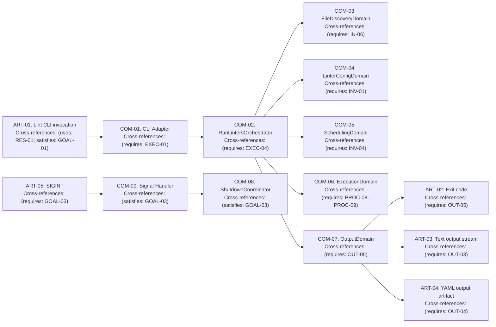

# Lint Dispatcher Requirements

Sources: [components/architecture.md](components/architecture.md) | [design-map.md](design-map.md) | [plan.md](plan.md) | [parallel linter requirements.md](../requirements.md) | [prd structure.md](../../../processes/prd%20structure.md)

## Resources

* `RES-01` uv — CLI entrypoint for `uv run lint`.
* `RES-02` Python — orchestration runtime for the dispatcher components.
* `RES-03` Git — file discovery via `git diff`, `git diff-tree`, `git ls-files`.
* `RES-04` Filesystem — existence checks and snapshot copy/restore.
* `RES-05` OS process APIs — process tree isolation + termination (POSIX process groups / Windows Job Objects).

## External Artifacts / Boundaries

* **ART-01 — Lint CLI invocation:** lint dispatcher run initiation via `uv run lint` + args/env.
  Cross-references: (uses: RES-01; satisfies: GOAL-01; validated-by: TEST-04)
* **ART-02 — Process exit code:** process exit code emitted by the lint dispatcher.
  Cross-references: (requires: OUT-05; validated-by: MET-02, TEST-04, TEST-05)
* **ART-03 — Text output stream:** human-readable output emitted during and after the run.
  Cross-references: (requires: OUT-03; validated-by: MET-01, TEST-03)
* **ART-04 — YAML output artifact:** structured output emitted once after execution completes.
  Cross-references: (requires: OUT-04; validated-by: MET-01, TEST-03)
* **ART-05 — SIGINT signal:** OS-level interrupt signal that may arrive at any time.
  Cross-references: (requires: GOAL-03; validated-by: TEST-05)

## Problem Statement

The current lint CLI path mixes argument parsing, file discovery, linter config, scheduling, execution, output rendering, and shutdown recovery in a single flow, making parallel execution, deterministic output, and snapshot-safe shutdown behavior hard to reason about and test.

## Goal List

* **GOAL-01 — Thin adapter layers:** CLI is a thin adapter; orchestration logic lives in explicit domains and the composition root.
  Cross-references: (validated-by: MET-02, TEST-04)
* **GOAL-02 — Safe parallelism:** schedule and execute lint work in parallel only when resource/fileset conflicts are prevented.
  Cross-references: (validated-by: MET-04, TEST-02)
* **GOAL-03 — Responsive execution + safe shutdown:** support fail-fast and SIGINT with deterministic cleanup and snapshot restoration.
  Cross-references: (validated-by: MET-02, MET-03, TEST-05)
* **GOAL-04 — Deterministic output:** text output is deterministic regardless of completion order; YAML output is structured and emitted once.
  Cross-references: (validated-by: MET-01, TEST-03)

## Indexed rule list

### Invariants

* **Precedence:** invariants apply globally and override any conflicting requirements.
* **INV-01 — Linter instance identity is correctness-critical:** per-run linter instances MUST carry a stable instance identity key that participates in hashing/equality; caches and aggregated results MUST be keyed by linter instance identity (not name alone).
  Cross-references: (validated-by: TEST-01)
* **INV-02 — Deterministic ordering:** given identical repo state and inputs, file lists, expanded linter lists, phase plans, phase items, and rendered outputs MUST be deterministic.
  Cross-references: (validated-by: MET-01, TEST-03)
* **INV-03 — Existence-only drift handling:** execution-time drift handling MUST use existence checks only; it MUST NOT re-run git queries or recompute fileset membership.
  Cross-references: (validated-by: TEST-03)
* **INV-04 — Parallel execution must be conflict-free:** within a single run, tasks executing concurrently MUST be resource-disjoint (including fileset overlap); mutating work MUST execute before read-only work, and mutator ordering MUST be deterministic.
  Cross-references: (validated-by: MET-04, TEST-02)
* **INV-05 — No compatibility layer:** legacy scheduling/execution pathways MUST be removed; the dispatcher must have a single orchestrator-driven implementation path.
  Cross-references: (validated-by: TEST-04)

### Execution rules

* **EXEC-01 — CLI entrypoint contract:** `uv run lint` MUST parse CLI args/env into immutable run inputs (run args + runtime facts) and invoke the composition root (COM-02), which returns the process exit code.
  Cross-references: (validated-by: MET-02, TEST-04)
* **EXEC-02 — Mode selection:** file discovery MUST support changed-only, commit, explicit, and whole-repo modes; invalid combinations (missing commit, empty explicit list when required, etc.) MUST be rejected as errors.
  Cross-references: (validated-by: TEST-03)
* **EXEC-03 — Preflight is self-healing:** preflight failures for individual *applicable* linters (non-empty filesets) MUST be recorded as warnings and those linters removed from the operational set; linters with empty filesets MUST be treated as non-applicable (skip, no-op); the run MUST abort only when (a) at least one linter was applicable and (b) zero operational linters remain after preflight (otherwise “no applicable linters” is a success/no-op).
  Cross-references: (validated-by: TEST-04)
* **EXEC-04 — Continue-on-failure (unless configured):** by default, all scheduled work MUST run (subject to INV-04) even if some chunks fail; if fail-fast mode is enabled, execution MUST initiate shutdown after the first failure marker is observed.
  Cross-references: (validated-by: TEST-04, TEST-05)

### Input rules

* **IN-01 — Linter registry and ordering:** the linter registry MUST define a total ordering of unique linter IDs/names used for deterministic spec expansion and scheduling.
  Cross-references: (validated-by: TEST-01)
* **IN-02 — Linter metadata required for scheduling:** linters MUST expose scheduling-relevant metadata (at minimum: mutation behavior, parallel-safety behavior, deterministic priority, and resource scope information).
  Cross-references: (validated-by: TEST-02)
* **IN-03 — Linter spec expansion:** selection specs MUST expand deterministically based on registry ordering; unknown endpoints MUST be errors; expansions that select nothing SHOULD produce a warning.
  Cross-references: (validated-by: TEST-01)
* **IN-04 — Runtime facts:** available CPU count MUST be computed as a positive integer; environment-size estimate MUST represent the effective environment size used for ARG_MAX budgeting.
  Cross-references: (validated-by: MET-05, TEST-02)
* **IN-06 — File discovery result shape:** file discovery MUST return repo-relative, deduped, existence-filtered, deterministically ordered paths, plus warnings/errors explaining empty results.
  Cross-references: (validated-by: TEST-03)

### Processing rules

* **PROC-01 — Fileset resolution per instance:** for each operational linter instance, filesets MUST be computed from the discovered file list; file-not-found races during computation MUST be treated as “non-match” (not a crash).
  Cross-references: (validated-by: TEST-01, TEST-03)
* **PROC-02 — File registry ownership:** a single file registry MUST own the evolving candidate file list and per-linter fileset cache; only the file registry may prune deleted paths and drop non-operational instances.
  Cross-references: (validated-by: TEST-03)
* **PROC-03 — Scheduling classification and ordering:** scheduling MUST classify linters into mutating, read-only parallel-safe, and read-only sequential; mutators MUST be sorted deterministically (e.g., priority then name).
  Cross-references: (validated-by: TEST-02)
* **PROC-04 — Commit mode forbids mutators:** when running in commit mode, mutating linters MUST be rejected as a scheduling error.
  Cross-references: (validated-by: TEST-02)
* **PROC-05 — Mutator packing:** mutators MUST be packed into phases such that concurrently executing mutators have disjoint resource sets (scope-aware); read-only sequential linters MUST run in their own phases.
  Cross-references: (validated-by: MET-04, TEST-02)
* **PROC-06 — ARG_MAX chunking:** scheduling MUST chunk per-linter filesets to satisfy ARG_MAX budgeting using the environment-size estimate and a safety margin; invalid budgets (budget ≤ 0, or a single path exceeding budget) MUST be treated as errors.
  Cross-references: (validated-by: MET-05, TEST-02)
* **PROC-07 — Chunk sequencing contract:** scheduling MUST assign monotonically increasing, contiguous chunk sequence numbers across all scheduled items; execution MUST preserve contiguity even when a scheduled chunk becomes empty (emit a skipped/empty-result marker for that chunk).
  Cross-references: (validated-by: TEST-02, TEST-03)
* **PROC-08 — Phase boundary re-evaluation:** before executing each phase, execution MUST (a) perform existence-only pruning and (b) re-evaluate each scheduled chunk against current disk reality; deleted-file handling MUST not rebuild the schedule.
  Cross-references: (validated-by: TEST-03)
* **PROC-09 — Snapshot semantics for mutators:** mutator chunks MUST have snapshots created in the main process before submission; crash recovery MUST restore only the crashed chunk snapshot; fail-fast/SIGINT MUST restore all in-flight mutator snapshots.
  Cross-references: (validated-by: MET-03, TEST-05)
* **PROC-10 — Process tree safety:** each chunk run MUST be isolated in a killable process tree; timeouts MUST terminate the entire tree and return structured timeout/crash markers.
  Cross-references: (validated-by: TEST-05)
* **PROC-11 — Coordinated shutdown:** shutdown MUST be idempotent, callback-driven, and deterministic in cleanup ordering: terminate processes → shut down executor without waiting and cancel pending work → restore snapshots; late results after shutdown initiation MUST be ignored.
  Cross-references: (validated-by: TEST-05)

### Output rules

* **OUT-01 — Single owner of rendering:** only the output domain (COM-07) may render human output and compute exit codes; other components MUST record warnings/errors via the diagnostic collector (IAR-07) and domain result objects.
  Cross-references: (validated-by: TEST-04)
* **OUT-02 — Output-mode strategy centralizes mode switches:** YAML vs text conditionals MUST be centralized in a single output-mode strategy to avoid scattered presentation logic.
  Cross-references: (validated-by: TEST-03)
* **OUT-03 — Deterministic text streaming:** in text mode, outputs MUST be emitted in increasing chunk sequence order regardless of completion order; buffered output MUST be flushed on shutdown/fail-fast.
  Cross-references: (validated-by: MET-01, TEST-03)
* **OUT-04 — YAML is non-streaming:** in YAML mode, streaming output MUST be suppressed; final structured output is emitted once after execution completes.
  Cross-references: (validated-by: MET-01, TEST-03)
* **OUT-05 — Exit code semantics:** return `130` on SIGINT/shutdown; otherwise return `1` when any errors are present (invalid args, scheduling errors, chunk failure/crash/timeout, or meta errors), else return `0`.
  Cross-references: (validated-by: MET-02, TEST-04, TEST-05)

### QA rules

* **QA-01 — Contracts and identity tests:** tests MUST validate the shared contracts and linter instance identity semantics (instance-id participates in hash/eq; results keyed by instance).
  Cross-references: (validated-by: TEST-01)
* **QA-02 — Scheduling tests:** tests MUST validate commit-mode mutator rejection, deterministic packing/ordering, ARG_MAX chunking errors, and contiguous chunk IDs.
  Cross-references: (validated-by: TEST-02)
* **QA-03 — File and output determinism tests:** tests MUST validate deterministic file discovery, existence-only pruning behavior, ordered output buffering (including empty-chunk advancement), and YAML-mode non-streaming.
  Cross-references: (validated-by: TEST-03)
* **QA-04 — Orchestrator integration tests:** tests MUST validate end-to-end orchestration wiring (CLI → orchestrator → domains → output), including continue-on-failure and fail-fast modes.
  Cross-references: (validated-by: TEST-04)
* **QA-06 — Shutdown and snapshot tests:** tests MUST validate SIGINT-triggered shutdown, idempotent cleanup, cleanup ordering, snapshot restore semantics (crash vs fail-fast), and late-result ignoring.
  Cross-references: (validated-by: TEST-05)

### Performance rules

* **PERF-01 — Deterministic pool sizing:** process pool sizing MUST be deterministic and bounded by available CPU count, configured concurrency cap, and task count.
  Cross-references: (validated-by: TEST-02)
* **PERF-02 — Configurable concurrency:** the dispatcher MUST support a configured concurrency cap, treat non-positive/absent caps as “unset”, and otherwise default to available CPU count (minimum 1) for both preflight and execution pools.
  Cross-references: (validated-by: TEST-02)

### Algorithms

* **ALG-01 — CLI adapter:** parse run inputs and invoke orchestrator. Spec: [components/com-01-cli-adapter.md](components/com-01-cli-adapter.md)
  Cross-references: (requires: EXEC-01; satisfies: GOAL-01)
* **ALG-02 — RunLintersOrchestrator:** compose domains and drive the run lifecycle. Spec: [components/com-02-run-linters-orchestrator.md](components/com-02-run-linters-orchestrator.md)
  Cross-references: (requires: EXEC-03, EXEC-04; satisfies: GOAL-01, GOAL-03)
* **ALG-03 — FileDiscoveryDomain:** file discovery pipeline (git → normalize → dedupe → exists → sort). Spec: [components/com-03-file-discovery-domain.md](components/com-03-file-discovery-domain.md)
  Cross-references: (requires: IN-06; satisfies: GOAL-01)
* **ALG-04 — LinterConfigDomain:** spec expansion + instance creation + fileset computation + preflight. Spec: [components/com-04-linter-config-domain.md](components/com-04-linter-config-domain.md)
  Cross-references: (requires: INV-01, IN-01, IN-03, PROC-01, EXEC-03; satisfies: GOAL-02)
* **ALG-05 — SchedulingDomain:** phase plan generation + chunk IDs + ARG_MAX chunking. Spec: [components/com-05-scheduling-domain.md](components/com-05-scheduling-domain.md)
  Cross-references: (requires: INV-04, PROC-06, PROC-07; satisfies: GOAL-02)
* **ALG-06 — ExecutionDomain:** phase execution with drift handling, snapshots, shutdown, and ordered output. Spec: [components/com-06-execution-domain.md](components/com-06-execution-domain.md)
  Cross-references: (requires: INV-03, INV-04, PROC-08, PROC-09, PROC-11; satisfies: GOAL-02, GOAL-03, GOAL-04)
* **ALG-07 — OutputDomain:** output strategy + exit-code computation. Spec: [components/com-07-output-domain.md](components/com-07-output-domain.md)
  Cross-references: (requires: OUT-01, OUT-05; satisfies: GOAL-04)

### Test artifacts

* **TEST-01 — Contracts + identity unit tests:** shared contract/identity behaviors (instance identity, registry ordering, spec expansion). Cross-references: (validated-by: QA-01)
* **TEST-02 — Scheduling unit tests:** commit-mode mutator rejection, deterministic packing/ordering, ARG_MAX chunking, contiguous chunk IDs. Cross-references: (validated-by: QA-02)
* **TEST-03 — Determinism unit/integration tests:** deterministic file discovery, existence-only pruning, ordered output buffering, YAML-mode non-streaming. Cross-references: (validated-by: QA-03)
* **TEST-04 — Orchestrator integration tests:** CLI → orchestrator → domains → output wiring; continue-on-failure + fail-fast. Cross-references: (validated-by: QA-04)
* **TEST-05 — Shutdown + snapshot tests:** SIGINT handling, idempotent cleanup ordering, crash/fail-fast snapshot restores, late-result ignoring. Cross-references: (validated-by: QA-06)

## Component diagrams

## Components (packages)

* `components/architecture.md` — root component package index
* `components/com-01-cli-adapter.md` — COM-01 package
* `components/com-02-run-linters-orchestrator.md` — COM-02 package
* `components/com-03-file-discovery-domain.md` — COM-03 package
* `components/com-04-linter-config-domain.md` — COM-04 package
* `components/com-05-scheduling-domain.md` — COM-05 package
* `components/com-06-execution-domain.md` — COM-06 package
* `components/com-07-output-domain.md` — COM-07 package
* `components/com-08-shutdown-coordinator.md` — COM-08 package
* `components/com-09-signal-handler.md` — COM-09 package
* `components/com-10-cleanup-orchestrator.md` — COM-10 package
* `components/com-11-process-pool-manager.md` — COM-11 package
* `components/com-12-process-tree-manager.md` — COM-12 package
* `components/com-13-subprocess-runner.md` — COM-13 package
* `components/com-14-snapshot-manager.md` — COM-14 package
* `components/com-15-ordered-output-buffer.md` — COM-15 package
* `components/com-16-result-collector.md` — COM-16 package
* `components/com-17-result-stream-handler.md` — COM-17 package

## Success Metrics

| ID | Metric | Target | Measurement | Cross-references |
|----|--------|--------|-------------|------------------|
| `MET-01` | Deterministic outputs | Text/YAML outputs identical across repeated runs | Run the dispatcher multiple times on identical repo state and diff emitted outputs | (derived-from: INV-02, GOAL-04) |
| `MET-02` | Exit-code correctness | 0/1/130 semantics match requirements | Integration tests covering success, failure, and SIGINT paths | (derived-from: OUT-05, GOAL-03) |
| `MET-03` | Snapshot restore correctness | No retained file modifications after crash/fail-fast/SIGINT in mutator phases | Tests that simulate crashes/SIGINT and compare filesystem state before/after restore | (derived-from: PROC-09, GOAL-03) |
| `MET-04` | Conflict-free parallelism | No overlapping filesets in concurrently executing scheduled items | Scheduling tests that assert resource-disjoint packing and deterministic ordering | (derived-from: INV-04, GOAL-02) |
| `MET-05` | ARG_MAX safety | No invocation exceeds computed command budget | Unit tests that force extreme budgets and validate error handling + chunking | (derived-from: PROC-06, PERF-02) |

## Open Questions

* None
