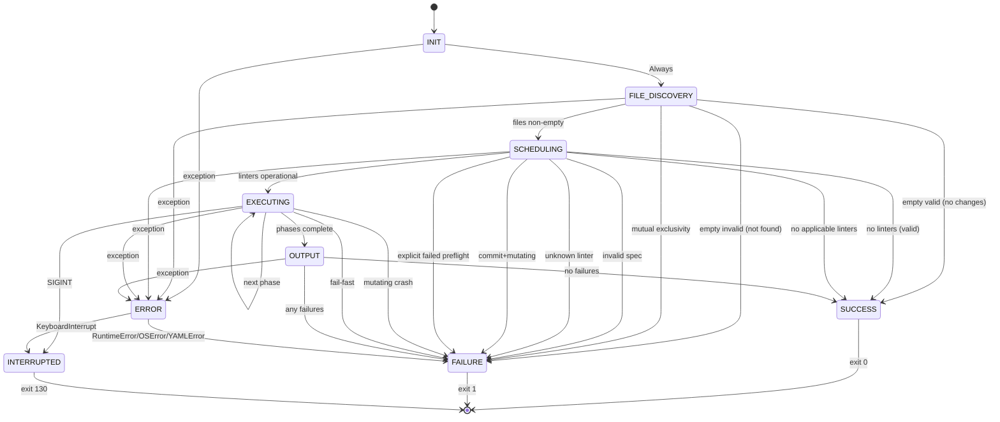
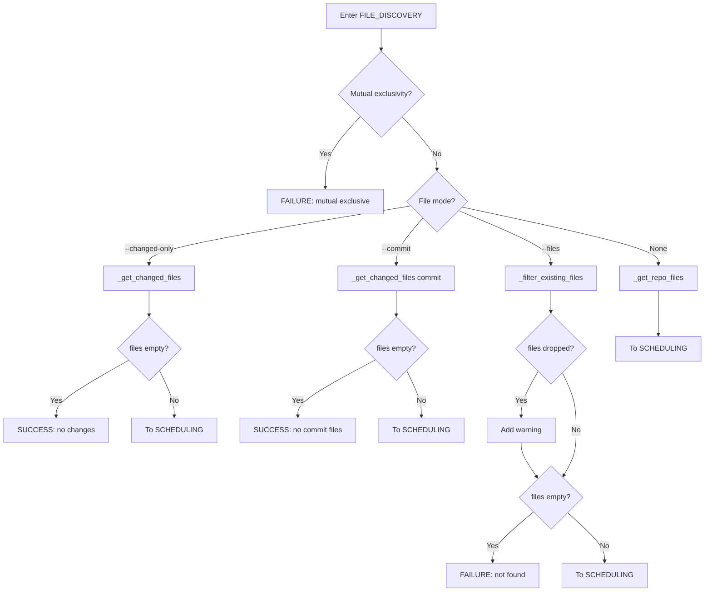
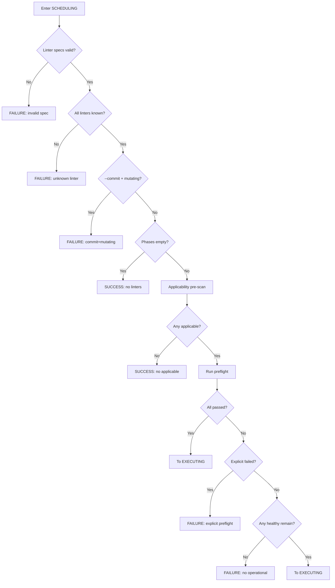
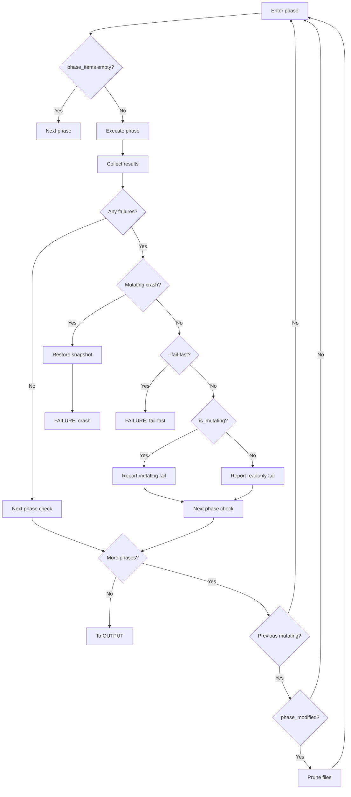

# Candidate 4: State Machine Decomposition

## Executive Summary

The parallel linter algorithm exhibits clear state machine characteristics with well-defined states, transitions, and decision points. This analysis identifies 6 major states, 18 state transitions, and multiple decision points that control flow through the system. A state machine decomposition would make the control flow explicit, enable independent testing of each state handler, and provide clear hooks for monitoring and recovery.

## Major States

### 1. INIT (Initialization)
**Responsibility**: Parse arguments, detect system resources, configure output mode, initialize global state containers.

**State Data**:
- `args`: Parsed command-line arguments
- `available_cpus`: CPU count from `os.sched_getaffinity(0)` or `os.cpu_count()`
- `yaml_output`: Boolean flag for output format
- `meta`: Container for `{warnings: [], errors: []}`
- `all_results`: Empty result container `{}`
- `shutdown_event`: Signal handler registration status

**Exit Conditions**:
- Always proceeds to FILE_DISCOVERY
- No failure exits (argument parsing errors would occur before state machine entry)

**Terminal**: No

---

### 2. FILE_DISCOVERY (File Determination)
**Responsibility**: Determine which files to lint based on input mode (changed-only, commit, explicit files, whole repo).

**State Data**:
- `files`: List of file paths to lint
- `file_source`: One of `{changed-only, commit, explicit, whole-repo}`
- `meta.warnings`: Updated with missing file warnings
- `meta.errors`: Updated with validation errors (mutual exclusivity, missing files)

**Decision Points**:
- Mutual exclusivity check: `--changed-only`, `--files`, `--commit`
- File source selection: Which input mode?
- Empty file list handling: Should we exit or continue?
- Explicit file validation: Were any requested files not found?

**Exit Conditions**:
- **Success**: `files` is non-empty → proceed to SCHEDULING
- **Terminal Success**: `files` is empty for valid reasons (no changes, no commit files) → exit 0
- **Terminal Failure**: `files` is empty due to error (requested files not found) → exit 1
- **Terminal Failure**: Mutual exclusivity violation → exit 1

**Terminal**: Conditionally (3 of 4 exits are terminal)

---

### 3. SCHEDULING (Linter Selection & Scheduling)
**Responsibility**: Expand linter specifications, validate linters exist, create phases, check applicability, run preflight tests.

**State Data**:
- `linter_instances`: List of linter instances with unique `instance_id`
- `explicit_linters`: Set of explicitly requested linter names
- `phases`: Ordered list of execution phases
  - Each phase has: `{linters: [], is_mutating: bool}`
- `fileset_by_linter`: Cache of `{linter: fileset}` from applicability pre-scan
- `preflight_results`: Results from `linter.test()` parallel execution

**Decision Points**:
- Linter spec validation: Are all specs valid?
- Unknown linter check: Are all linters known?
- Commit mode + mutating linter check: Forbidden combination?
- Empty phases check: Any linters to run?
- Applicability pre-scan: Any linters have matching files?
- Preflight validation: Do all linters pass their tests?
- Explicit linter preflight failure: Was a user-requested linter unavailable?

**Exit Conditions**:
- **Success**: At least one operational linter remains → proceed to EXECUTING
- **Terminal Failure**: Invalid linter spec → exit 1
- **Terminal Failure**: Unknown linter → exit 1
- **Terminal Failure**: Mutating linter with `--commit` → exit 1
- **Terminal Success**: No linters to run (valid but nothing applicable) → exit 0
- **Terminal Success**: No applicable linters (no matching files) → exit 0
- **Terminal Failure**: Explicitly requested linter failed preflight → exit 1
- **Terminal Failure**: No operational linters remain after preflight → exit 1

**Terminal**: Conditionally (7 of 8 exits are terminal)

---

### 4. EXECUTING (Phase Execution Loop)
**Responsibility**: Execute linters in phases, collect results, handle failures, manage file drift.

**State Data**:
- `current_phase`: Currently executing phase
- `phase_index`: Index of current phase
- `phase_items`: Tasks for current phase `[(linter, fileset_chunk, chunk_id), ...]`
- `phase_results`: Results from current phase execution
- `all_results`: Accumulated results across all phases
- `phase_modified`: Boolean indicating if current mutating phase modified files
- `files`: Updated file list (pruned after mutating phases)
- `fileset_by_linter`: Updated cache (pruned after mutating phases)
- `shutdown_event`: Flag indicating cancellation requested

**Decision Points**:
- Phase empty check: Any tasks in this phase?
- Failure detection: Did any linters fail?
- Mutating crash check: Did a mutating linter crash?
- Fail-fast check: Should we abort on first failure?
- More phases check: Are there remaining phases?
- Previous phase mutating check: Was the previous phase mutating?
- Files modified check: Did the mutating phase actually modify files?

**Substates** (Internal to EXECUTING):
- `EXECUTING.RUNNING`: Active phase execution
- `EXECUTING.COLLECTING`: Aggregating chunk results
- `EXECUTING.HANDLING_FAILURE`: Processing failures
- `EXECUTING.PRUNING_FILES`: Updating file lists after mutating phase

**Exit Conditions**:
- **To OUTPUT**: All phases complete successfully
- **Terminal Failure**: Mutating linter crashed → exit 1 (after recovery)
- **Terminal Failure**: Fail-fast triggered → exit 1
- **To OUTPUT**: All phases complete with failures (but not fail-fast or crash)
- **Terminal Interrupted**: SIGINT/KeyboardInterrupt → exit 130

**Terminal**: Conditionally (2 direct terminal exits, rest go to OUTPUT)

---

### 5. OUTPUT (Final Output Generation)
**Responsibility**: Generate final output in YAML or text format, calculate exit code.

**State Data**:
- `all_results`: Complete results from all linters
- `meta`: Complete warnings and errors
- `yaml_output`: Output format flag
- `any_failure`: Boolean indicating if any failures occurred

**Decision Points**:
- Output format check: YAML or text?
- Failure detection: Are there any errors or failed linters?

**Exit Conditions**:
- **Terminal Success**: No failures → exit 0
- **Terminal Failure**: Any failures → exit 1

**Terminal**: Yes (always terminal)

---

### 6. ERROR (Error State)
**Responsibility**: Handle exceptions, perform cleanup, restore snapshots if needed.

**State Data**:
- `exception_type`: Type of exception (RuntimeError, OSError, YAMLError, KeyboardInterrupt)
- `error_message`: Error description
- `meta.errors`: Updated with error information
- `snapshots_to_restore`: List of mutator snapshots requiring recovery

**Decision Points**:
- Exception type classification: What kind of error?
- SIGINT handling: Need to cancel executors and terminate processes?
- Snapshot restoration: Are there in-flight mutating tasks?

**Exit Conditions**:
- **Terminal Failure**: RuntimeError/OSError/YAMLError → exit 1
- **Terminal Interrupted**: KeyboardInterrupt/SIGINT → exit 130

**Terminal**: Yes (always terminal)

---

## State Transition Diagram



---

## State Transition Table

| From State | To State | Trigger/Condition | Data Transformations | Side Effects |
|------------|----------|-------------------|----------------------|--------------|
| `[*]` | `INIT` | Program start | Initialize `args`, `available_cpus`, `yaml_output`, `meta`, `all_results` | Register SIGINT handler |
| `INIT` | `FILE_DISCOVERY` | Always | None | None |
| `FILE_DISCOVERY` | `SCHEDULING` | `files` non-empty | Set `files`, `file_source` | May add warnings to `meta` |
| `FILE_DISCOVERY` | `SUCCESS` | `files` empty (valid: no changes/commit) | None | None |
| `FILE_DISCOVERY` | `FAILURE` | `files` empty (error: not found) | Add error to `meta.errors` | Print to stderr (text mode) |
| `FILE_DISCOVERY` | `FAILURE` | Mutual exclusivity violation | Add error to `meta.errors` | Print to stderr (text mode) |
| `SCHEDULING` | `EXECUTING` | Linters operational after preflight | Set `linter_instances`, `phases`, `fileset_by_linter`, `explicit_linters` | Create process pool |
| `SCHEDULING` | `SUCCESS` | No linters to run (empty after spec expansion) | None | Print info to stderr |
| `SCHEDULING` | `SUCCESS` | No applicable linters (no matching files) | Update `all_results` with skipped entries | Print info to stderr |
| `SCHEDULING` | `FAILURE` | Invalid linter spec | Add error to `meta.errors` | Print to stderr (text mode) |
| `SCHEDULING` | `FAILURE` | Unknown linter name | Add error to `meta.errors` | Print to stderr (text mode) |
| `SCHEDULING` | `FAILURE` | Commit mode + mutating linter | Add error to `meta.errors` | Print to stderr (text mode) |
| `SCHEDULING` | `FAILURE` | Explicit linter failed preflight | Add error to `meta.errors` | Print to stderr (text mode) |
| `EXECUTING` | `EXECUTING` | More phases remain | Update `all_results`, prune `files` and `fileset_by_linter` if mutating phase modified | Execute next phase |
| `EXECUTING` | `OUTPUT` | All phases complete | Final `all_results` | Flush output buffers |
| `EXECUTING` | `FAILURE` | Mutating linter crashed | Update `all_results` with crash, add error to `meta.errors` | Restore snapshot, kill process tree |
| `EXECUTING` | `FAILURE` | Fail-fast triggered | Update `all_results` | Cancel futures, kill processes, restore snapshots |
| `EXECUTING` | `INTERRUPTED` | SIGINT/KeyboardInterrupt | Set `shutdown_event` | Shutdown executors, terminate processes, restore snapshots |
| `OUTPUT` | `SUCCESS` | `len(meta.errors) == 0` and all linters succeeded | None | Flush stdout/stderr |
| `OUTPUT` | `FAILURE` | `len(meta.errors) > 0` or any linter failed | None | Flush stdout/stderr |
| Any | `ERROR` | Exception raised | Set `exception_type`, `error_message`, update `meta.errors` | May restore snapshots |
| `ERROR` | `FAILURE` | RuntimeError/OSError/YAMLError | None | Print to stderr |
| `ERROR` | `INTERRUPTED` | KeyboardInterrupt | Set `shutdown_event` | Cleanup and flush |

---

## Data Flow Across State Transitions

### State Context Object Structure

```python
@dataclass
class LinterContext:
    """Shared context carried across all states."""

    # Configuration (set in INIT, read-only afterward)
    args: argparse.Namespace
    available_cpus: int
    yaml_output: bool

    # Accumulating state (written by multiple states)
    meta: dict[str, list]  # {warnings: [...], errors: [...]}
    all_results: dict[Linter, LinterResult]

    # File state (set in FILE_DISCOVERY, updated in EXECUTING)
    files: list[str]
    file_source: str | None  # 'changed-only' | 'commit' | 'explicit' | 'whole-repo'

    # Linter state (set in SCHEDULING)
    linter_instances: list[Linter]
    explicit_linters: set[str]
    phases: list[Phase]
    fileset_by_linter: dict[Linter, list[str]]

    # Execution state (used in EXECUTING)
    current_phase: Phase | None
    phase_index: int
    phase_modified: bool
    shutdown_event: Event

    # Error state (set in ERROR)
    exception_type: type | None
    error_message: str | None

    # Exit state
    exit_code: int | None
```

### Data Transformations by State

**INIT**:
- Inputs: Command-line arguments, system environment
- Outputs: `args`, `available_cpus`, `yaml_output`, `meta`, `all_results`, `shutdown_event`
- Transformations: Parse arguments, detect CPUs, initialize containers

**FILE_DISCOVERY**:
- Inputs: `args.changed_only`, `args.commit`, `args.files`
- Outputs: `files`, `file_source`, updated `meta.warnings`, updated `meta.errors`
- Transformations: Git operations, path normalization, deduplication, sorting, existence filtering

**SCHEDULING**:
- Inputs: `args.linters`, `files`
- Outputs: `linter_instances`, `explicit_linters`, `phases`, `fileset_by_linter`
- Transformations: Spec expansion, instance creation, applicability pre-scan, preflight execution, phase building

**EXECUTING**:
- Inputs: `phases`, `fileset_by_linter`, `args.fail_fast`
- Outputs: Updated `all_results`, updated `files`, updated `fileset_by_linter`
- Transformations: Phase execution, result aggregation, file pruning after mutating phases

**OUTPUT**:
- Inputs: `all_results`, `meta`, `yaml_output`
- Outputs: `exit_code`, formatted output to stdout/stderr
- Transformations: YAML generation or text formatting, exit code calculation

**ERROR**:
- Inputs: Exception, current context state
- Outputs: `exception_type`, `error_message`, updated `meta.errors`, `exit_code`
- Transformations: Exception classification, cleanup operations, snapshot restoration

---

## Decision Points & Branching Logic

### FILE_DISCOVERY Decision Tree



### SCHEDULING Decision Tree



### EXECUTING Decision Tree



---

## Terminal States Analysis

### Success States

1. **FILE_DISCOVERY → SUCCESS**:
   - No changes detected (`--changed-only` yielded empty)
   - No files in commit (`--commit SHA` yielded empty)
   - Exit code: 0

2. **SCHEDULING → SUCCESS**:
   - No linters to run (specs expanded to empty list)
   - No applicable linters (no files matched any linter)
   - Exit code: 0

3. **OUTPUT → SUCCESS**:
   - All linters succeeded
   - No errors in `meta.errors`
   - Exit code: 0

### Failure States

1. **FILE_DISCOVERY → FAILURE**:
   - Mutual exclusivity violation
   - Requested files not found
   - Exit code: 1

2. **SCHEDULING → FAILURE**:
   - Invalid linter spec
   - Unknown linter
   - Commit mode + mutating linter
   - Explicitly requested linter failed preflight
   - No operational linters after preflight
   - Exit code: 1

3. **EXECUTING → FAILURE**:
   - Mutating linter crashed
   - Fail-fast triggered
   - Exit code: 1

4. **OUTPUT → FAILURE**:
   - Any linter failed
   - Any errors in `meta.errors`
   - Exit code: 1

5. **ERROR → FAILURE**:
   - RuntimeError, OSError, YAMLError
   - Exit code: 1

### Interrupted State

1. **EXECUTING → INTERRUPTED**:
   - SIGINT/KeyboardInterrupt
   - Exit code: 130

2. **ERROR → INTERRUPTED**:
   - KeyboardInterrupt during error handling
   - Exit code: 130

---

## Component Mapping

### State Handler Components

```python
class StateHandler(Protocol):
    """Protocol for state handlers."""

    def enter(self, ctx: LinterContext) -> None:
        """Called when entering this state."""
        ...

    def execute(self, ctx: LinterContext) -> StateTransition:
        """Execute state logic, return next state."""
        ...

    def exit(self, ctx: LinterContext) -> None:
        """Called when exiting this state."""
        ...
```

### Proposed Component Structure

```
linter_state_machine/
├── __init__.py
├── context.py              # LinterContext dataclass
├── states/
│   ├── __init__.py
│   ├── base.py            # StateHandler protocol, State enum
│   ├── init.py            # InitState handler
│   ├── file_discovery.py  # FileDiscoveryState handler
│   ├── scheduling.py      # SchedulingState handler
│   ├── executing.py       # ExecutingState handler
│   ├── output.py          # OutputState handler
│   └── error.py           # ErrorState handler
├── transitions.py         # StateTransition dataclass
├── machine.py            # StateMachine orchestrator
└── handlers/
    ├── __init__.py
    ├── file_handlers.py   # _get_changed_files, _get_repo_files, etc.
    ├── linter_handlers.py # _expand_linter_spec, schedule_linters, etc.
    └── phase_handlers.py  # execute_phase, _run_linter_safe, etc.
```

---

## State-Component Design

### 1. InitState Component

**Responsibilities**:
- Parse command-line arguments
- Detect system resources (`available_cpus`)
- Configure output mode (`yaml_output`)
- Initialize `meta` and `all_results`
- Register signal handlers

**Dependencies**:
- `argparse`
- `os.sched_getaffinity` / `os.cpu_count`
- Signal handling utilities

**Outputs**:
- Populated `LinterContext` with configuration
- Always transitions to `FILE_DISCOVERY`

**Testability**: Highly testable (pure initialization logic)

---

### 2. FileDiscoveryState Component

**Responsibilities**:
- Validate mutual exclusivity of file options
- Determine file source mode
- Execute git operations to retrieve file lists
- Normalize, deduplicate, filter, and sort files
- Add warnings for dropped files
- Add errors for invalid conditions

**Dependencies**:
- Git CLI (`git diff`, `git ls-files`, `git diff-tree`)
- File system (`os.path.exists`)
- Path normalization utilities

**Outputs**:
- `files` list
- `file_source` identifier
- Updated `meta.warnings` and `meta.errors`
- Transitions to: `SCHEDULING`, `SUCCESS`, or `FAILURE`

**Testability**: Highly testable with mocked git/filesystem

---

### 3. SchedulingState Component

**Responsibilities**:
- Expand linter specifications with range operators
- Validate linter names
- Create linter instances with unique `instance_id`
- Track explicitly requested linters
- Run applicability pre-scan (`calculate_fileset`)
- Run preflight tests in parallel (`linter.test()`)
- Build execution phases (mutating vs read-only, parallel packing)
- Check for commit mode + mutating linter conflict

**Dependencies**:
- Linter registry (`LINTER_NAMES`)
- Linter factory functions
- `ThreadPoolExecutor` for preflight
- Scheduler logic (`schedule_linters`)

**Outputs**:
- `linter_instances`
- `explicit_linters`
- `phases`
- `fileset_by_linter` cache
- Updated `all_results` with skipped entries
- Transitions to: `EXECUTING`, `SUCCESS`, or `FAILURE`

**Testability**: Testable with mocked linter registry and executors

---

### 4. ExecutingState Component

**Responsibilities**:
- Iterate through phases
- Build `phase_items` from cached `fileset_by_linter`
- Execute phases (single or parallel)
- Aggregate chunk results per linter
- Deduplicate diagnostics
- Handle failures (crash, fail-fast, normal)
- Prune files and fileset cache after mutating phases
- Manage `shutdown_event` for cancellation
- Restore snapshots on crash or interruption

**Dependencies**:
- `ProcessPoolExecutor` for parallel execution
- Subprocess management (process groups, Job Objects)
- Snapshot utilities (file backup/restore)
- Output buffering (sliding window)
- ARG_MAX chunking logic

**Outputs**:
- Updated `all_results` with linter results
- Updated `files` (pruned if mutating phase modified)
- Updated `fileset_by_linter` (pruned if mutating phase modified)
- Transitions to: `OUTPUT`, `FAILURE`, or `INTERRUPTED`

**Testability**: Complex but testable with mocked executors and filesystem

**Substates** (internal FSM):
- `RUNNING`: Active execution
- `COLLECTING`: Aggregating results
- `HANDLING_FAILURE`: Processing errors
- `PRUNING_FILES`: Updating file lists

---

### 5. OutputState Component

**Responsibilities**:
- Format output as YAML or text
- Calculate final exit code
- Flush stdout/stderr

**Dependencies**:
- YAML library
- Output formatting utilities

**Outputs**:
- `exit_code` (0 or 1)
- Formatted output to stdout/stderr
- Transitions to: `SUCCESS` or `FAILURE`

**Testability**: Highly testable (pure formatting logic)

---

### 6. ErrorState Component

**Responsibilities**:
- Classify exception type
- Add error to `meta.errors`
- Perform cleanup (shutdown executors, terminate processes)
- Restore snapshots for in-flight mutating tasks
- Determine appropriate exit code

**Dependencies**:
- Exception handling utilities
- Cleanup utilities (shutdown, terminate, restore)

**Outputs**:
- `exception_type`, `error_message`
- Updated `meta.errors`
- `exit_code` (1 or 130)
- Transitions to: `FAILURE` or `INTERRUPTED`

**Testability**: Testable with injected exceptions

---

## Error Handling by State

### Error State Transitions

Each state has specific error transitions:

| State | Error Condition | Target State | Recovery Action |
|-------|-----------------|--------------|-----------------|
| `INIT` | Exception during init | `ERROR` | Record error, exit |
| `FILE_DISCOVERY` | Git command failure | `ERROR` | Record error, exit |
| `FILE_DISCOVERY` | Path normalization error | `ERROR` | Record error, exit |
| `SCHEDULING` | Preflight exception | `ERROR` | Record error, exit |
| `SCHEDULING` | Phase building error | `ERROR` | Record error, exit |
| `EXECUTING` | Mutating linter crash | `FAILURE` | Restore snapshot, exit |
| `EXECUTING` | Process spawn failure | `ERROR` | Record error, exit |
| `EXECUTING` | SIGINT | `INTERRUPTED` | Cancel, restore, exit 130 |
| `OUTPUT` | YAML generation error | `ERROR` | Record error, exit |

### Error Context Preservation

When transitioning to `ERROR` state, the context preserves:
- Original exception type and message
- Current state name (for debugging)
- Partial `all_results` (if any)
- File snapshots requiring restoration
- Active executors requiring shutdown

---

## State Machine Orchestrator

### StateMachine Class

```python
class StateMachine:
    """Main state machine orchestrator."""

    def __init__(self) -> None:
        self.states: dict[State, StateHandler] = {
            State.INIT: InitState(),
            State.FILE_DISCOVERY: FileDiscoveryState(),
            State.SCHEDULING: SchedulingState(),
            State.EXECUTING: ExecutingState(),
            State.OUTPUT: OutputState(),
            State.ERROR: ErrorState(),
        }
        self.current_state: State = State.INIT
        self.ctx: LinterContext | None = None

    def run(self, args: list[str]) -> int:
        """Execute the state machine, return exit code."""
        self.ctx = LinterContext()  # Initialize empty context

        while True:
            handler = self.states[self.current_state]

            try:
                # Enter state
                handler.enter(self.ctx)

                # Execute state logic
                transition = handler.execute(self.ctx)

                # Exit state
                handler.exit(self.ctx)

                # Check for terminal state
                if transition.is_terminal:
                    return self.ctx.exit_code

                # Transition to next state
                self.current_state = transition.next_state

            except Exception as e:
                # Unhandled exception, transition to ERROR
                self.ctx.exception_type = type(e)
                self.ctx.error_message = str(e)
                self.current_state = State.ERROR
```

---

## Advantages of State Machine Decomposition

### 1. Explicit Control Flow
- All transitions are explicit and documented
- No hidden state changes buried in nested functions
- Easy to visualize and reason about

### 2. Independent Testability
- Each state handler can be tested in isolation
- Mock transitions without executing the full pipeline
- Test specific error paths without complex setup

### 3. Monitoring & Observability
- Hook into state transitions for logging/metrics
- Track time spent in each state
- Identify bottlenecks in the pipeline

### 4. Recovery & Resilience
- Clear boundaries for cleanup operations
- Well-defined error states with recovery paths
- Easy to add retry logic or fallback strategies

### 5. Extensibility
- Add new states without modifying existing ones
- Insert intermediate states (e.g., caching, validation)
- Add parallel state execution (e.g., preflight as separate state)

### 6. Code Organization
- Clear separation of concerns
- Smaller, focused components
- Reduced coupling between pipeline stages

---

## Disadvantages & Challenges

### 1. Complexity Overhead
- Introduces state machine abstraction layer
- Requires understanding of state machine concepts
- More files and indirection

### 2. Shared State Management
- `LinterContext` is large and mutable
- Risk of hidden dependencies between states
- Need careful design to avoid coupling

### 3. Performance Considerations
- Extra function calls for enter/exit/execute
- Context copying if immutability is desired
- Potential memory overhead for large contexts

### 4. Transition Logic Duplication
- Some decision logic duplicated in transition conditions
- Need to keep state handlers and transition table in sync

### 5. Testing Complexity
- Need to mock `LinterContext` for each test
- Integration tests still required for full pipeline
- More test fixtures needed

---

## Migration Strategy

### Phase 1: Extract State Handlers
1. Create `LinterContext` dataclass
2. Extract `InitState` handler (smallest, easiest)
3. Extract `FileDiscoveryState` handler
4. Add tests for each handler

### Phase 2: Build State Machine Infrastructure
1. Create `StateHandler` protocol
2. Create `State` enum
3. Create `StateTransition` dataclass
4. Create `StateMachine` orchestrator
5. Add transition table validation

### Phase 3: Migrate Remaining States
1. Extract `SchedulingState` handler
2. Extract `ExecutingState` handler (most complex)
3. Extract `OutputState` handler
4. Extract `ErrorState` handler

### Phase 4: Integration & Refinement
1. Replace `main()` with `StateMachine.run()`
2. Add state transition logging
3. Add metrics collection hooks
4. Refine error handling
5. Add integration tests

---

## Comparison with Original Algorithm

### Original Structure
- Single monolithic `main()` function
- Nested control flow with early returns
- State is implicit in local variables
- Error handling scattered throughout

### State Machine Structure
- Six independent state handlers
- Explicit state transitions
- State is explicit in `LinterContext`
- Error handling centralized in `ERROR` state

### Equivalent Behavior
The state machine decomposition preserves exact algorithmic behavior:
- Same git operations in same order
- Same linter scheduling logic
- Same phase execution strategy
- Same error conditions and exit codes
- Same output format

### Added Benefits
- **Observability**: Log every state transition
- **Testing**: Test states independently
- **Debugging**: Inspect context at state boundaries
- **Extensibility**: Add states without modifying existing ones

---

## Conclusion

The parallel linter algorithm is well-suited for state machine decomposition. The algorithm exhibits clear states (INIT, FILE_DISCOVERY, SCHEDULING, EXECUTING, OUTPUT, ERROR), well-defined transitions, and explicit decision points. Each state has distinct responsibilities, inputs, and outputs.

A state machine decomposition would:
- Make control flow explicit and auditable
- Enable independent testing of each pipeline stage
- Provide clear hooks for monitoring and recovery
- Improve code organization and maintainability

The main challenge is managing the shared `LinterContext` object, which must carry all data across state transitions. Careful design is needed to avoid tight coupling between states while maintaining the necessary data dependencies.

The executing state is the most complex (it's an internal FSM itself), but breaking it into substates (RUNNING, COLLECTING, HANDLING_FAILURE, PRUNING_FILES) would make it manageable.

Overall, this is a viable decomposition strategy with clear benefits for testability, maintainability, and extensibility.
