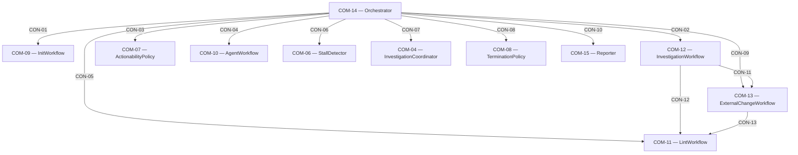

# Component: Architecture (root)

Sources: [requirements.md](../requirements.md) | [design-map.md](../design-map.md) | [components/architecture.md](../../../processes/components/architecture.md)

## Component and surface map

## Surfaces and Contracts (SUR/CON)

- SUR-04 (`COM-04`) — InvestigationCoordinator surface (see `com-04-investigation-coordinator.md`)
  - CON-07 — investigation-dispatch surface
- SUR-06 (`COM-06`) — StallDetector surface (see `com-06-stall-detector.md`)
  - CON-06 — stall-planning surface
- SUR-07 (`COM-07`) — ActionabilityPolicy surface (see `com-07-actionability-policy.md`)
  - CON-03 — actionability surface
- SUR-08 (`COM-08`) — TerminationPolicy surface (see `com-08-termination-policy.md`)
  - CON-08 — termination surface
- SUR-09 (`COM-09`) — InitWorkflow surface (see `com-09-init-workflow.md`)
  - CON-01 — init surface
- SUR-10 (`COM-10`) — AgentWorkflow surface (see `com-10-agent-workflow.md`)
  - CON-04 — agent surface
- SUR-11 (`COM-11`) — LintWorkflow surface (see `com-11-lint-workflow.md`)
  - CON-05 — lint surface (orchestrator call)
  - CON-12 — post-investigation lint surface (invoked by `COM-12`)
  - CON-13 — post-external-change lint surface (invoked by `COM-13`)
- SUR-12 (`COM-12`) — InvestigationWorkflow surface (see `com-12-investigation-workflow.md`)
  - CON-02 — investigation surface
- SUR-13 (`COM-13`) — ExternalChangeWorkflow surface (see `com-13-external-change-workflow.md`)
  - CON-09 — external-change surface (orchestrator call)
  - CON-11 — external-change surface (invoked by `COM-12`)
- SUR-15 (`COM-15`) — Reporter surface (see `com-15-reporter.md`)
  - CON-10 — reporting surface

## Component packages

- `com-01-diagnostic-store.md` — `COM-01` + `ALG-01`
- `com-02-target-status-store.md` — `COM-02` + `ALG-02`
- `com-03-change-tracker.md` — `COM-03` + `ALG-03`
- `com-04-investigation-coordinator.md` — `COM-04` + `ALG-04`
- `com-05-linter-staleness-manager.md` — `COM-05` + `ALG-05`
- `com-06-stall-detector.md` — `COM-06` + `ALG-06`
- `com-07-actionability-policy.md` — `COM-07` + `ALG-07`
- `com-08-termination-policy.md` — `COM-08` + `ALG-08`
- `com-09-init-workflow.md` — `COM-09` + `ALG-09`
- `com-10-agent-workflow.md` — `COM-10` + `ALG-10`
- `com-11-lint-workflow.md` — `COM-11` + `ALG-11`
- `com-12-investigation-workflow.md` — `COM-12` + `ALG-12`
- `com-13-external-change-workflow.md` — `COM-13` + `ALG-13`
- `com-14-orchestrator.md` — `COM-14` + `ALG-14`
- `com-15-reporter.md` — `COM-15` + `ALG-15`

## Algorithms (ALG-XX)

### ALG-00: Shared semantic primitives

Owner: (COM-14)
Guarantees: (INV-04)
Cross-references: (requires: INV-01, INV-04)

- Target identity includes file-level targets and a project-level sentinel target.
- Snapshot is an immutable per-target fingerprint set used for compare-and-swap (CAS) gating.
- Change set represents a set of changed targets and the source of the change (agent, investigator, external change, refresh-only).
- Investigation context is the minimum semantic input required to run (or re-run) a target investigation deterministically.
