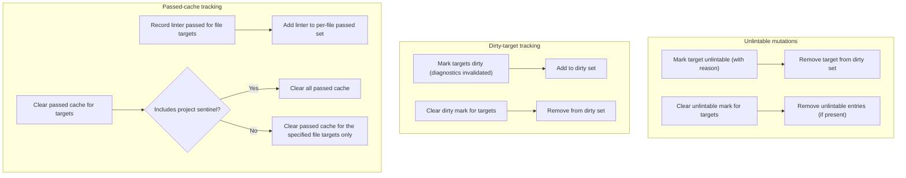

# Component: COM-02 — TargetStatusStore

Sources: [requirements.md](../requirements.md) | [design-map.md](../design-map.md)

## Capabilities

- CAP-02 — Target status tracking (unlintable, dirty, passed cache)
  Derived-from: (GOAL-01, GOAL-04, GOAL-06)

## Surface: SUR-02

Contracts: ()

## State Holders (IAR-XX)

### IAR-02 — Target status registry

Owner: (COM-02)
Kind: table
Invariants: (INV-03)
Access obligations: (OBL-22)
Cross-references: (requires: INV-03; satisfies: GOAL-01)
Details: [design-map.md](../design-map.md)

## Algorithms (ALG-XX)

### ALG-02: Target status mutations

Owner: (COM-02)
Guarantees: (INV-03)
Cross-references: (requires: INV-03; satisfies: GOAL-01, GOAL-04)

