```mermaid
flowchart TD
  %% Cross-references: (requires: INV-04)
  subgraph S["Snapshot for agent inputs"]
    S0["Input: set of file targets + include project?"] --> S1["Compute per-file fingerprints"]
    S1 --> S2{Include project fingerprint?}
    S2 -->|Yes| S3["Compute project fingerprint"]
    S2 -->|No| S4["No project fingerprint"]
    S3 --> S5["Return snapshot (file fingerprints + optional project fingerprint)"]
    S4 --> S5
  end

  subgraph I["Snapshot for one investigation target"]
    I0["If target is file-level: compute file fingerprint"] --> I2["Return snapshot for file target"]
    I1["If target is project-level: compute project fingerprint"] --> I3["Return snapshot for project target"]
  end

  subgraph V["verify_unchanged(snapshot) — CAS gate"]
    V0["Recompute current snapshot for the same target set"] --> V1{Current equals given snapshot?}
    V1 -->|Yes| V2["True"]
    V1 -->|No| V3["False"]
  end

  subgraph D["diff(before, after) — change detection"]
    D0["Compare per-file fingerprints"] --> D1["Collect changed file targets"]
    D1 --> D2["Compare project fingerprints"] --> D3["Return change set (changed targets + change classification)"]
  end

  subgraph R["Seen-fingerprint tracking"]
    R0["Record snapshot fingerprints as seen"] --> R1["Add each fingerprint to per-target seen set"]
    R2["Forget targets (external change reset)"] --> R3["Drop seen-fingerprint entries for targets"]
  end
```

# Component: COM-03 — ChangeTracker

Sources: [requirements.md](../requirements.md) | [design-map.md](../design-map.md)

## Capabilities

- CAP-03 — Snapshot CAS gating and change classification
  Derived-from: (GOAL-02)

## Surface: SUR-03

Contracts: ()

## State Holders (IAR-XX)

### IAR-03 — Snapshot ledger

Owner: (COM-03)
Kind: cache
Invariants: (INV-04)
Access obligations: (OBL-23)
Cross-references: (requires: INV-04; satisfies: GOAL-02)
Details: [design-map.md](../design-map.md)

## Algorithms (ALG-XX)

### ALG-03: Snapshot, CAS verification, diff, and seen-fingerprint tracking

Owner: (COM-03)
Guarantees: (INV-04)
Cross-references: (requires: INV-04; satisfies: GOAL-02)

