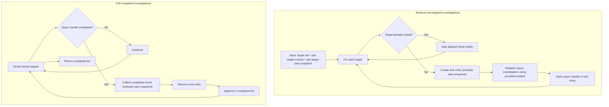

# Component: COM-04 — InvestigationCoordinator

Sources: [requirements.md](../requirements.md) | [design-map.md](../design-map.md)

## Capabilities

- CAP-04 — Investigation dispatch and lock management
  Derived-from: (GOAL-03)

## Surface: SUR-04

Contracts: (CON-07)

## State Holders (IAR-XX)

### IAR-04 — Investigation registry (locks + start snapshots)

Owner: (COM-04)
Kind: table
Invariants: (INV-05)
Access obligations: (OBL-24)
Cross-references: (requires: INV-05)
Details: [design-map.md](../design-map.md)

## Contracts (CON-XX)

### Contract: CON-07

Surface: (SUR-04)
Interaction: request-response
Guarantees: (INV-05)
Demands: (OBL-07)

Pattern: in-process call
Between: (COM-14, COM-04)
For: (IAR-04)
Implements: (ALG-04, INV-05, GOAL-03)
Cross-references: (requires: INV-05; satisfies: GOAL-03)
Needs: ()

Input MUST include (IDs only; no schema fields/types):

- CTX-07 — Target dispatch set
- CTX-08 — Investigation context per target
- CTX-09 — Start snapshot per target

Output MUST include (IDs only; no schema fields/types):

- CTX-10 — In-flight lock state visibility
- CTX-11 — Completed investigation results (target + start snapshot + payload)

Boundary obligations:

- OBL-07 — Enforce one in-flight investigation per target
  Cross-references: (requires: INV-05; satisfies: GOAL-03)

## Algorithms (ALG-XX)

### ALG-04: Reserve/dispatch and poll

Owner: (COM-04)
Guarantees: (INV-05)
Cross-references: (requires: INV-05; satisfies: GOAL-03)

