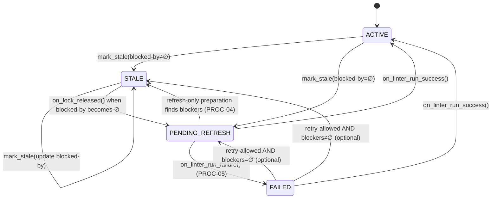
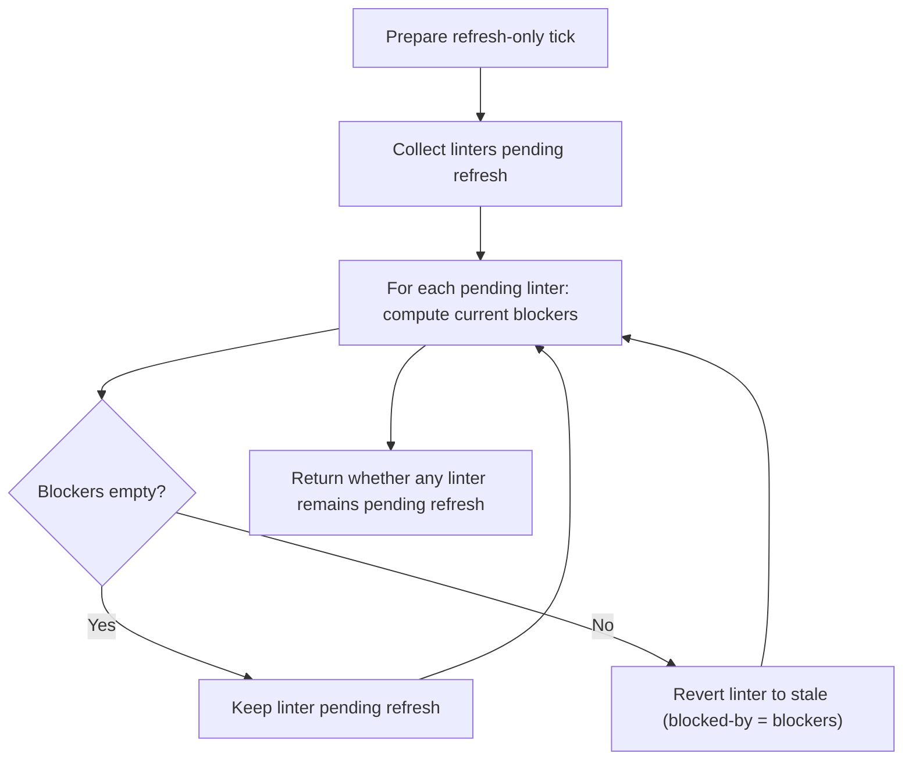

# Component: COM-05 — LinterStalenessManager

Sources: [requirements.md](../requirements.md) | [design-map.md](../design-map.md)

## Capabilities

- CAP-05 — Linter staleness tracking and refresh gating
  Derived-from: (GOAL-04)

## Surface: SUR-05

Contracts: ()

## State Holders (IAR-XX)

### IAR-05 — Linter staleness registry

Owner: (COM-05)
Kind: table
Invariants: (INV-06)
Access obligations: (OBL-25)
Cross-references: (requires: INV-06; satisfies: GOAL-04)
Details: [design-map.md](../design-map.md)

## Algorithms (ALG-XX)

### ALG-05: Staleness state machine + refresh-only preparation

Owner: (COM-05)
Guarantees: (INV-06)
Cross-references: (requires: INV-06, PROC-04, PROC-05; satisfies: GOAL-04)

