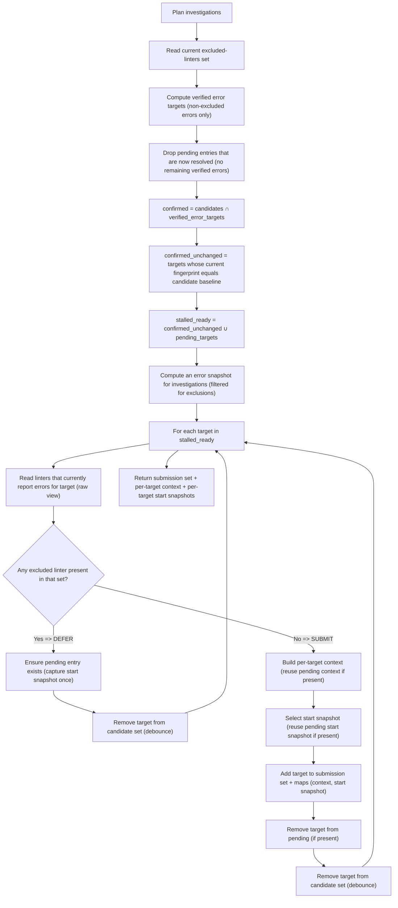

# Component: COM-06 — StallDetector

Sources: [requirements.md](../requirements.md) | [design-map.md](../design-map.md)

## Capabilities

- CAP-06 — Stall detection and investigation planning
  Derived-from: (GOAL-03, GOAL-04)

## Surface: SUR-06

Contracts: (CON-06)

## State Holders (IAR-XX)

### IAR-06 — Stall tracking state (candidates + pending investigations)

Owner: (COM-06)
Kind: table
Invariants: (INV-04, INV-06)
Access obligations: (OBL-26)
Cross-references: (requires: PROC-02, PROC-03, PROC-07)
Details: [design-map.md](../design-map.md)

## Contracts (CON-XX)

### Contract: CON-06

Surface: (SUR-06)
Interaction: request-response
Guarantees: (INV-04, INV-06)
Demands: (OBL-06)

Pattern: in-process call
Between: (COM-14, COM-06)
For: (IAR-06)
Implements: (ALG-06, PROC-02, PROC-03, PROC-07, PROC-08, PROC-09)
Cross-references: (requires: INV-04, INV-06; satisfies: GOAL-03, GOAL-04)
Needs: ()

Input MUST include (IDs only; no schema fields/types):

- CTX-06 — Candidate stall set (target identities)
- CTX-12 — Candidate baseline snapshot (per-target fingerprints)
- CTX-13 — Current diagnostics view (filtered for actionability)
- CTX-14 — Current excluded-linters set
- CTX-15 — Current tick identity (monotonic within a run)

Output MUST include (IDs only; no schema fields/types):

- CTX-16 — Eligible investigation submission set
- CTX-17 — Deferred (pending) target set
- CTX-18 — Investigation context per target
- CTX-19 — Start snapshot per target (captured once per pending entry)

Boundary obligations:

- OBL-06 — Defer and evict stalled targets safely
  Cross-references: (requires: PROC-03, PROC-07; satisfies: GOAL-03, GOAL-04)

## Algorithms (ALG-XX)

### ALG-06: Plan investigations (stall debouncing + deferral)

Owner: (COM-06)
Guarantees: (INV-04, INV-06)
Cross-references: (requires: PROC-03; satisfies: GOAL-03, GOAL-04)

