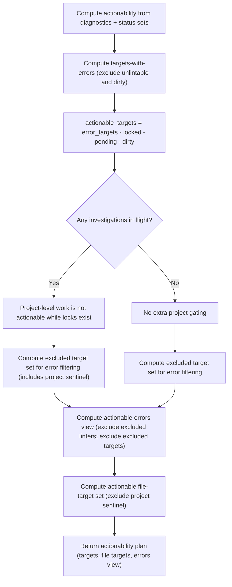

# Component: COM-07 — ActionabilityPolicy

Sources: [requirements.md](../requirements.md) | [design-map.md](../design-map.md)

## Capabilities

- CAP-07 — Actionability plan computation
  Derived-from: (GOAL-05)

## Surface: SUR-07

Contracts: (CON-03)

## Contracts (CON-XX)

### Contract: CON-03

Surface: (SUR-07)
Interaction: request-response
Guarantees: (INV-06)
Demands: (OBL-03)

Pattern: in-process call
Between: (COM-14, COM-07)
For: (IAR-01, IAR-02, IAR-04, IAR-05, IAR-06)
Implements: (ALG-07, PROC-01, PROC-11, GOAL-05)
Cross-references: (requires: PROC-01, PROC-11; satisfies: GOAL-05)
Needs: ()

Input MUST include (IDs only; no schema fields/types):

- CTX-01 — Current diagnostics view
- CTX-02 — Excluded linters set
- CTX-03 — Locked targets set
- CTX-04 — Pending targets set
- CTX-05 — Unlintable targets set
- CTX-20 — Dirty targets set

Output MUST include (IDs only; no schema fields/types):

- CTX-21 — Actionable targets set
- CTX-22 — Actionable file-target set
- CTX-23 — Actionable errors view

Boundary obligations:

- OBL-03 — Deterministic actionability computation
  Cross-references: (requires: PROC-01, PROC-11; satisfies: GOAL-05)

## Algorithms (ALG-XX)

### ALG-07: Compute actionable plan

Owner: (COM-07)
Guarantees: (INV-06)
Cross-references: (requires: PROC-01, PROC-11; satisfies: GOAL-05)

