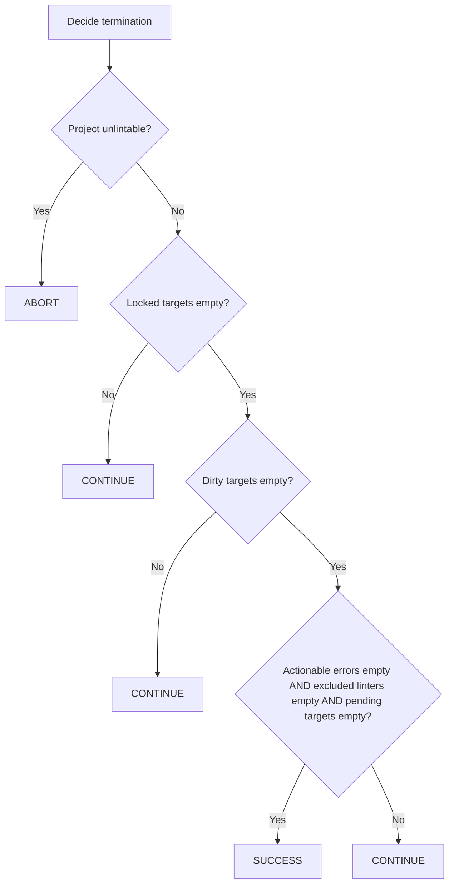

# Component: COM-08 — TerminationPolicy

Sources: [requirements.md](../requirements.md) | [design-map.md](../design-map.md)

## Capabilities

- CAP-08 — Termination decision computation
  Derived-from: (GOAL-01)

## Surface: SUR-08

Contracts: (CON-08)

## Contracts (CON-XX)

### Contract: CON-08

Surface: (SUR-08)
Interaction: request-response
Guarantees: (INV-03)
Demands: (OBL-08)

Pattern: in-process call
Between: (COM-14, COM-08)
For: (IAR-02, IAR-04, IAR-05, IAR-06)
Implements: (ALG-08, INV-03, PROC-13, GOAL-01)
Cross-references: (requires: INV-03, PROC-13; satisfies: GOAL-01)
Needs: ()

Input MUST include (IDs only; no schema fields/types):

- CTX-24 — Project-unlintable signal
- CTX-25 — Actionable-errors-empty signal
- CTX-26 — Excluded-linters-empty signal
- CTX-27 — Locked-targets-empty signal
- CTX-28 — Pending-targets-empty signal
- CTX-29 — Dirty-targets-empty signal

Output MUST include (IDs only; no schema fields/types):

- CTX-30 — Termination decision (CONTINUE | SUCCESS | ABORT)

Boundary obligations:

- OBL-08 — Termination is gated on dirty/locked/pending state
  Cross-references: (requires: INV-03, PROC-13; satisfies: GOAL-01)

## Algorithms (ALG-XX)

### ALG-08: Decide termination

Owner: (COM-08)
Guarantees: (INV-03)
Cross-references: (requires: INV-03, PROC-13; satisfies: GOAL-01)

