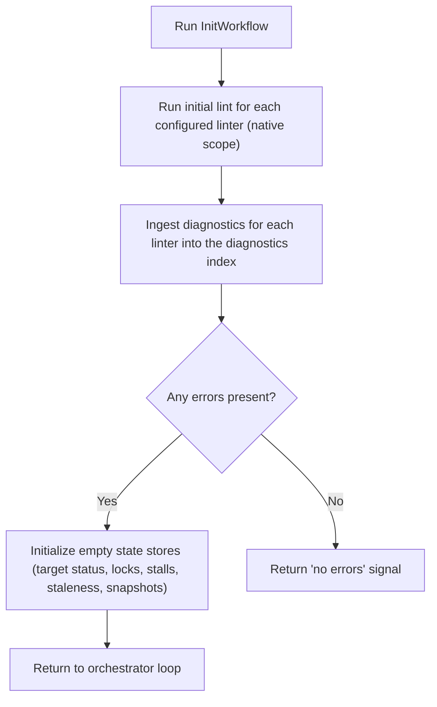

# Component: COM-09 — InitWorkflow

Sources: [requirements.md](../requirements.md) | [design-map.md](../design-map.md)

## Capabilities

- CAP-09 — Initialization from initial lint pass
  Derived-from: (GOAL-01)

## Surface: SUR-09

Contracts: (CON-01)

## Contracts (CON-XX)

### Contract: CON-01

Surface: (SUR-09)
Interaction: request-response
Guarantees: (INV-02)
Demands: (OBL-01)

Pattern: in-process call
Between: (COM-14, COM-09)
For: (ART-02, IAR-01, IAR-02, IAR-03, IAR-04, IAR-05, IAR-06)
Implements: (ALG-09, GOAL-01)
Cross-references: (requires: GOAL-01; satisfies: GOAL-01)
Needs: ()

Input MUST include (IDs only; no schema fields/types):

- CTX-31 — Configured linter set (including scope)
- CTX-32 — Repository state access for linting

Output MUST include (IDs only; no schema fields/types):

- CTX-33 — Initial diagnostics ingestion into the diagnostics index
- CTX-34 — Initialized empty state stores
- CTX-35 — Initial “has errors?” signal for the orchestrator loop

Boundary obligations:

- OBL-01 — Initialize state deterministically from initial lint results
  Cross-references: (requires: GOAL-01; satisfies: GOAL-01)

## Algorithms (ALG-XX)

### ALG-09: Initialize stores from initial lint pass

Owner: (COM-09)
Guarantees: (INV-02)
Cross-references: (satisfies: GOAL-01)

