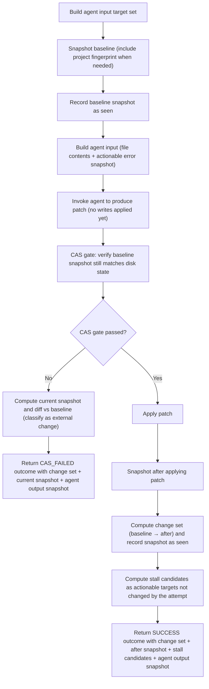

# Component: COM-10 — AgentWorkflow

Sources: [requirements.md](../requirements.md) | [design-map.md](../design-map.md)

## Capabilities

- CAP-10 — Agent run orchestration with CAS gating
  Derived-from: (GOAL-02, GOAL-03)

## Surface: SUR-10

Contracts: (CON-04)

## Contracts (CON-XX)

### Contract: CON-04

Surface: (SUR-10)
Interaction: request-response
Guarantees: (INV-04)
Demands: (OBL-04)

Pattern: in-process call
Between: (COM-14, COM-10)
For: (ART-03, IAR-03)
Implements: (ALG-10, INV-04, PROC-02, GOAL-02, GOAL-03)
Cross-references: (requires: INV-04; satisfies: GOAL-02, GOAL-03)
Needs: ()

Input MUST include (IDs only; no schema fields/types):

- CTX-36 — Actionable file targets
- CTX-37 — Actionable target identities (including optional project sentinel)
- CTX-38 — Actionable error snapshot (already filtered for excluded linters)
- CTX-39 — Project context file set (optional)

Output MUST include (IDs only; no schema fields/types):

- CTX-41 — Agent outcome classification (CAS_FAILED | SUCCESS)
- CTX-42 — Change set from the agent attempt
- CTX-43 — Baseline snapshot after the attempt (for stall baselining)
- CTX-44 — Candidate stalled target set (targets not changed by the attempt)
- CTX-45 — Agent output snapshot (opaque; used for investigations)

Boundary obligations:

- OBL-04 — Enforce CAS gate before applying agent writes
  Cross-references: (requires: INV-04; satisfies: GOAL-02)

## Algorithms (ALG-XX)

### ALG-10: Run agent with CAS gating + stall candidate extraction

Owner: (COM-10)
Guarantees: (INV-04)
Cross-references: (requires: INV-04, PROC-02; satisfies: GOAL-02, GOAL-03)

