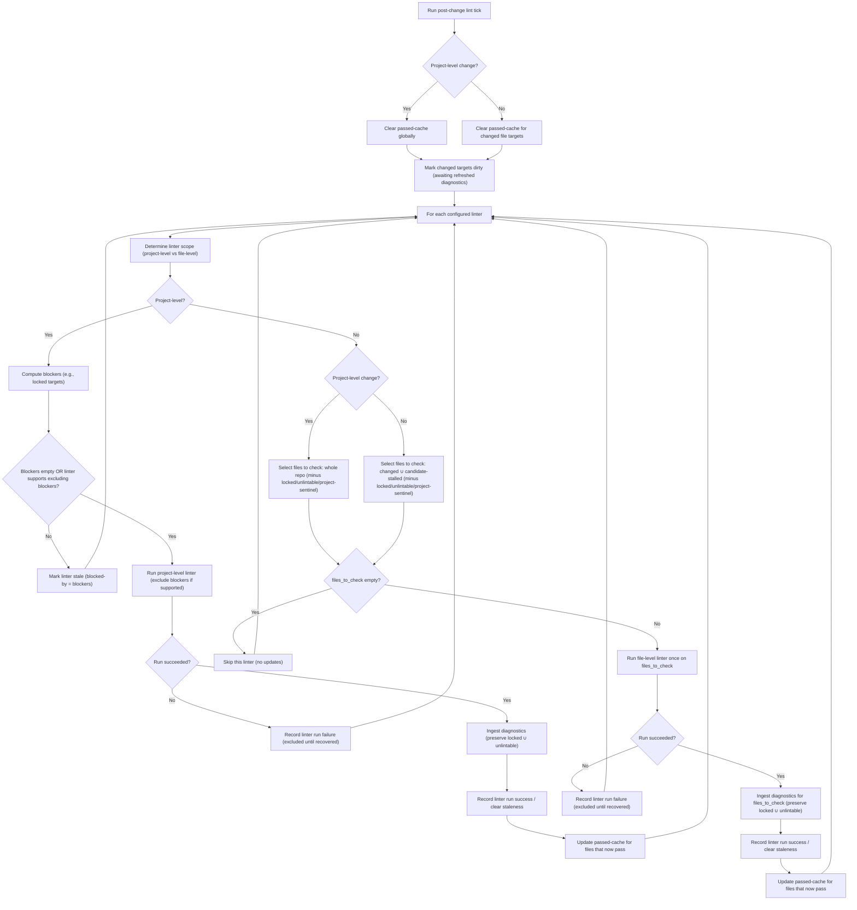
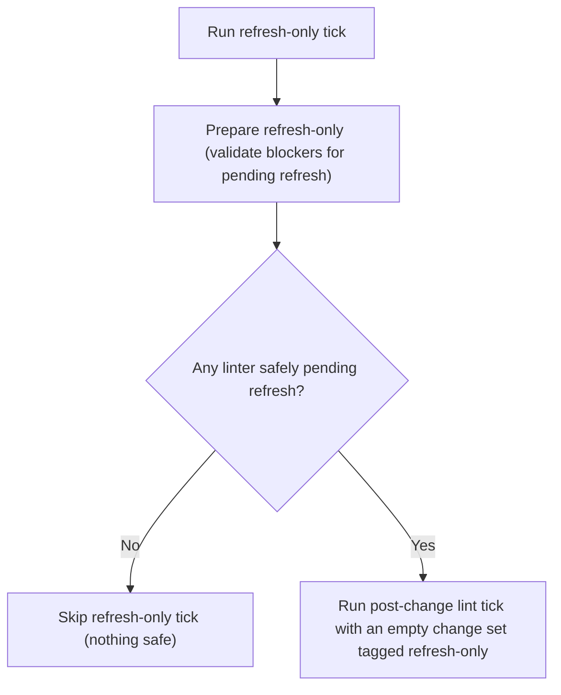

# Component: COM-11 — LintWorkflow

Sources: [requirements.md](../requirements.md) | [design-map.md](../design-map.md)

## Capabilities

- CAP-11 — Lint run orchestration and diagnostics ingestion
  Derived-from: (GOAL-02, GOAL-03, GOAL-04)

## Surface: SUR-11

Contracts: (CON-05, CON-12, CON-13)

## Contracts (CON-XX)

### Contract: CON-05

Surface: (SUR-11)
Interaction: request-response
Guarantees: (INV-02, INV-06)
Demands: (OBL-05)

Pattern: in-process call
Between: (COM-14, COM-11)
For: (ART-02, IAR-01, IAR-02, IAR-05)
Implements: (ALG-11, INV-02, PROC-04, PROC-05, GOAL-04)
Cross-references: (requires: INV-02, PROC-04, PROC-05; satisfies: GOAL-04)
Needs: ()

Input MUST include (IDs only; no schema fields/types):

- CTX-52 — Change set (targets changed + change classification)
- CTX-53 — Candidate stalled file set (for selective re-linting)
- CTX-03 — Locked targets set
- CTX-05 — Unlintable targets set

Output MUST include (IDs only; no schema fields/types):

- CTX-54 — Updated diagnostics ingestion
- CTX-55 — Updated passed-cache and dirty-target state
- CTX-56 — Updated linter staleness state

Boundary obligations:

- OBL-05 — Preserve locked/unlintable diagnostics and enforce staleness transitions
  Cross-references: (requires: INV-02, PROC-04, PROC-05; satisfies: GOAL-04)

### Contract: CON-12

Surface: (SUR-11)
Interaction: request-response
Guarantees: (INV-02)
Demands: (OBL-12)

Pattern: in-process call
Between: (COM-12, COM-11)
For: (ART-02, IAR-01, IAR-02, IAR-05)
Implements: (ALG-11, GOAL-03)
Cross-references: (satisfies: GOAL-03)
Needs: ()

Input MUST include (IDs only; no schema fields/types):

- CTX-52 — Change set (investigator-applied changes)
- CTX-03 — Locked targets set
- CTX-05 — Unlintable targets set

Output MUST include (IDs only; no schema fields/types):

- CTX-54 — Updated diagnostics ingestion
- CTX-55 — Updated passed-cache and dirty-target state

Boundary obligations:

- OBL-12 — Post-investigation lint refresh is conservative and deterministic
  Cross-references: (satisfies: GOAL-03)

### Contract: CON-13

Surface: (SUR-11)
Interaction: request-response
Guarantees: (INV-02)
Demands: (OBL-13)

Pattern: in-process call
Between: (COM-13, COM-11)
For: (ART-02, IAR-01, IAR-02, IAR-05)
Implements: (ALG-11, PROC-06)
Cross-references: (requires: PROC-06; satisfies: GOAL-02)
Needs: ()

Input MUST include (IDs only; no schema fields/types):

- CTX-52 — Change set (external-change classification)
- CTX-03 — Locked targets set
- CTX-05 — Unlintable targets set

Output MUST include (IDs only; no schema fields/types):

- CTX-54 — Updated diagnostics ingestion
- CTX-55 — Updated passed-cache and dirty-target state

Boundary obligations:

- OBL-13 — External-change-triggered lint refresh is conservative
  Cross-references: (requires: PROC-06; satisfies: GOAL-02)

## Algorithms (ALG-XX)

### ALG-11: Run linters and ingest diagnostics (post-change and refresh-only)

Owner: (COM-11)
Guarantees: (INV-02, INV-06)
Cross-references: (requires: INV-02, PROC-04, PROC-05; satisfies: GOAL-04)

- Dirty targets are not actionable until their diagnostics refresh has been ingested and the dirty mark cleared.

