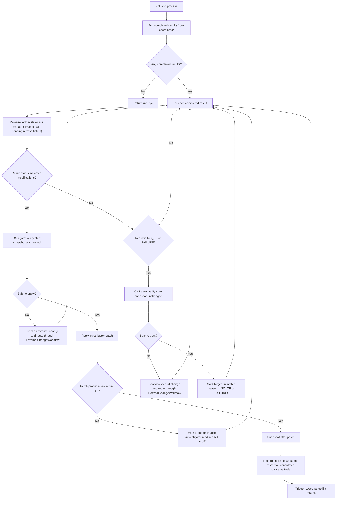

# Component: COM-12 — InvestigationWorkflow

Sources: [requirements.md](../requirements.md) | [design-map.md](../design-map.md)

## Capabilities

- CAP-12 — Investigation processing workflow
  Derived-from: (GOAL-03)

## Surface: SUR-12

Contracts: (CON-02)

Calls: (CON-11, CON-12)

## Contracts (CON-XX)

### Contract: CON-02

Surface: (SUR-12)
Interaction: request-response
Guarantees: (INV-04, INV-05)
Demands: (OBL-02)

Pattern: in-process call
Between: (COM-14, COM-12)
For: (ART-04, IAR-04, IAR-03, IAR-01, IAR-02, IAR-05)
Implements: (ALG-12, INV-04, INV-05, GOAL-03)
Cross-references: (requires: INV-04, INV-05; satisfies: GOAL-03)
Needs: ()

Input MUST include (IDs only; no schema fields/types):

- CTX-11 — Completed investigation results (target + start snapshot + payload)
- CTX-02 — Excluded linters set (staleness)
- CTX-48 — CAS verification capability for the start snapshot

Output MUST include (IDs only; no schema fields/types):

- CTX-50 — State updates reflecting investigation outcomes
- CTX-51 — Triggered lint refresh when investigator changes are applied

Boundary obligations:

- OBL-02 — Apply investigation results only under CAS safety
  Cross-references: (requires: INV-04; satisfies: GOAL-02, GOAL-03)

## Algorithms (ALG-XX)

### ALG-12: Poll and process investigations (CAS-gated)

Owner: (COM-12)
Guarantees: (INV-04, INV-05)
Cross-references: (requires: INV-04, INV-05; satisfies: GOAL-03)

