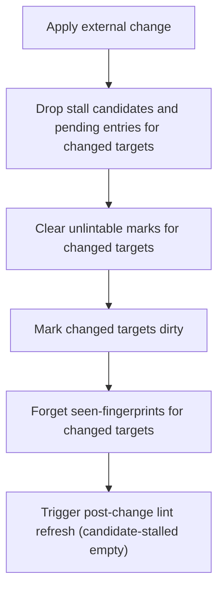

# Component: COM-13 — ExternalChangeWorkflow

Sources: [requirements.md](../requirements.md) | [design-map.md](../design-map.md)

## Capabilities

- CAP-13 — External change handling semantics
  Derived-from: (GOAL-02)

## Surface: SUR-13

Contracts: (CON-09, CON-11)

Calls: (CON-13)

## Contracts (CON-XX)

### Contract: CON-09

Surface: (SUR-13)
Interaction: request-response
Guarantees: (INV-04)
Demands: (OBL-09)

Pattern: in-process call
Between: (COM-14, COM-13)
For: (ART-01, IAR-02, IAR-03, IAR-06)
Implements: (ALG-13, PROC-06, GOAL-02)
Cross-references: (requires: PROC-06; satisfies: GOAL-02)
Needs: ()

Input MUST include (IDs only; no schema fields/types):

- CTX-52 — Change set (changed targets + change classification)

Output MUST include (IDs only; no schema fields/types):

- CTX-60 — State reset for changed targets (pending cleared, unlintable cleared, marked dirty, seen-forgotten)
- CTX-61 — Triggered lint refresh after external change

Boundary obligations:

- OBL-09 — External change forces conservative refresh
  Cross-references: (requires: PROC-06; satisfies: GOAL-02)

### Contract: CON-11

Surface: (SUR-13)
Interaction: request-response
Guarantees: (INV-04)
Demands: (OBL-11)

Pattern: in-process call
Between: (COM-12, COM-13)
For: (ART-01, IAR-02, IAR-03, IAR-06)
Implements: (ALG-13, PROC-06)
Cross-references: (requires: PROC-06; satisfies: GOAL-02)
Needs: ()

Input MUST include (IDs only; no schema fields/types):

- CTX-52 — Change set (unsafe-to-apply investigation classified as external change)

Output MUST include (IDs only; no schema fields/types):

- CTX-60 — State reset for changed targets (pending cleared, unlintable cleared, marked dirty, seen-forgotten)
- CTX-61 — Triggered lint refresh after external change

Boundary obligations:

- OBL-11 — Unsafe investigation results are treated as external change
  Cross-references: (requires: INV-04, PROC-06; satisfies: GOAL-02)

## Algorithms (ALG-XX)

### ALG-13: Apply external change semantics

Owner: (COM-13)
Guarantees: (INV-04)
Cross-references: (requires: PROC-06; satisfies: GOAL-02)

