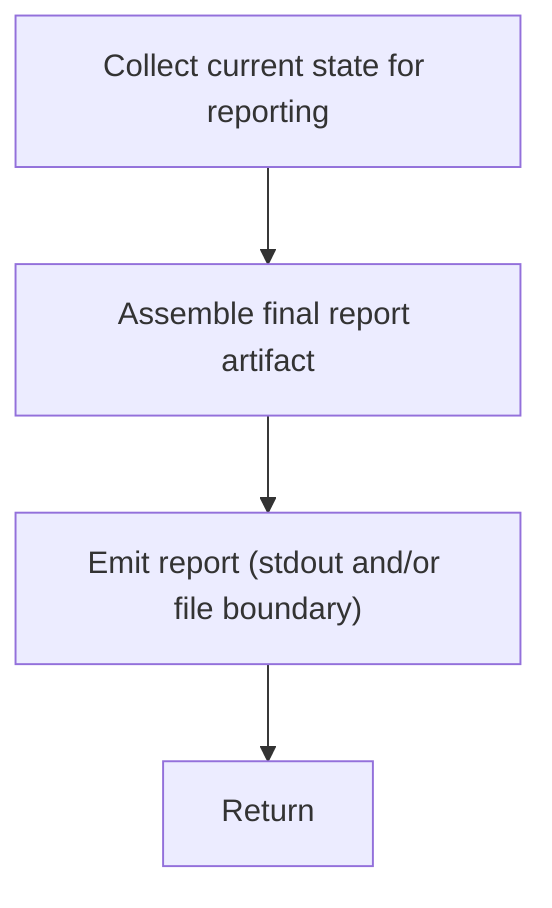

# Component: COM-15 — Reporter

Sources: [requirements.md](../requirements.md) | [design-map.md](../design-map.md)

## Capabilities

- CAP-15 — Final report emission
  Derived-from: (GOAL-06)

## Surface: SUR-15

Contracts: (CON-10)

## Contracts (CON-XX)

### Contract: CON-10

Surface: (SUR-15)
Interaction: request-response
Guarantees: ()
Demands: (OBL-10)

Pattern: in-process call
Between: (COM-14, COM-15)
For: (ART-05, IAR-01, IAR-02)
Implements: (ALG-15, GOAL-06)
Cross-references: (satisfies: GOAL-06)
Needs: ()

Input MUST include (IDs only; no schema fields/types):

- CTX-01 — Current diagnostics view
- CTX-05 — Unlintable targets set
- CTX-62 — Unlintable reasons view

Output MUST include (IDs only; no schema fields/types):

- CTX-63 — Final report artifact (unlintable targets + reasons + remaining diagnostics)

Boundary obligations:

- OBL-10 — Report includes unlintable targets, reasons, and remaining diagnostics
  Cross-references: (satisfies: GOAL-06)

## Algorithms (ALG-XX)

### ALG-15: Emit final report

Owner: (COM-15)
Guarantees: ()
Cross-references: (satisfies: GOAL-06)

