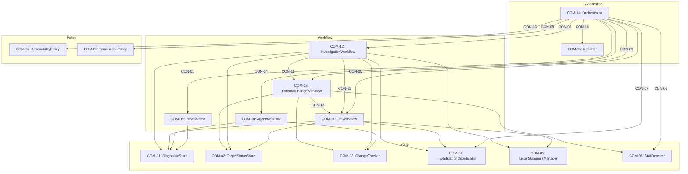

# Parallel Lint-Fixer Orchestrator Design Map

Sources: [requirements.md](requirements.md) | [components/architecture.md](components/architecture.md) | [graph-schema.md](../../processes/graph-schema.md) | [propagation-rules.md](../../processes/propagation-rules.md) | [design map structure.md](../../processes/design%20map%20structure.md)

## Invariants (Design Map)

- **INV-DM-01 — PRD traceability:** every `COM-XX` / `CON-XX` / `IAR-XX` node cites PRD
  IDs via `Implements:` or `Cross-references:`.
- **INV-DM-02 — Derived requirements allowed, PRD escalation only for ambiguity:** Design
  Map nodes may introduce deterministic derived requirements; ambiguous missing intent
  is escalated to PRD as `Q-XX` (no implicit choices).
- **INV-DM-03 — Boundary obligations:** every introduced boundary (`CON-XX` and any
  `IAR-XX` that creates a boundary) lists boundary obligation IDs (`OBL-XX`).
- **INV-DM-04 — ADR-only decisions:** decisions appear only as `(decided-by: ADR-###)`
  (no rationale prose embedded here).
- **INV-DM-05 — Surface invariants, not shapes:** boundaries are defined as IDs (what
  inputs/outputs must include / guarantee), not concrete schema fields/types.
- **INV-DM-06 — Graph-first IDs:** every node/relationship is representable as IDs +
  typed relationships; avoid free-form prose that cannot be attached to an ID.

## Identifier Vocabulary

PRD IDs (inputs):

- `GOAL-XX`, `INV-XX`, `PROC-XX`, `CFG-XX`, `OUT-XX`, `QA-XX`, `TEST-XX`, `ART-XX`,
  `RES-XX`

Design Map IDs (this document):

- `COM-XX` component · `SUR-XX` surface · `CON-XX` contract · `CAP-XX` capability ·
  `ALG-XX` algorithm · `IAR-XX` state holder · `OBL-XX` boundary obligation

Derived IDs (this document; domain-specific):

- `CTX-XX` boundary semantic inputs/outputs (ID-only; no schema fields/types)
- `ST-XX` state semantic invariants (ID-only; no schema fields/types)

## System Hierarchy

## Component: COM-01 — DiagnosticStore

Pattern: state-store
Surface: (SUR-01)
Implements: (GOAL-04, GOAL-05)
Capabilities: (CAP-01)
Algorithms: (ALG-01)
State-holders: (IAR-01)
Cross-references: (requires: INV-02; satisfies: GOAL-04)
Needs: ()
Consumes: ()
Produces: (IAR-01)

## Component: COM-02 — TargetStatusStore

Pattern: state-store
Surface: (SUR-02)
Implements: (GOAL-01, GOAL-04, GOAL-06)
Capabilities: (CAP-02)
Algorithms: (ALG-02)
State-holders: (IAR-02)
Cross-references: (requires: INV-03; satisfies: GOAL-01)
Needs: ()
Consumes: ()
Produces: (IAR-02)

## Component: COM-03 — ChangeTracker

Pattern: state-store
Surface: (SUR-03)
Implements: (GOAL-02)
Capabilities: (CAP-03)
Algorithms: (ALG-03)
State-holders: (IAR-03)
Cross-references: (requires: INV-04; satisfies: GOAL-02)
Needs: ()
Consumes: (ART-01)
Produces: (IAR-03)

## Component: COM-04 — InvestigationCoordinator

Pattern: coordinator
Surface: (SUR-04)
Implements: (GOAL-03)
Capabilities: (CAP-04)
Algorithms: (ALG-04)
State-holders: (IAR-04)
Cross-references: (requires: INV-05; satisfies: GOAL-03)
Needs: ()
Consumes: (IAR-03, ART-04)
Produces: (IAR-04)

## Component: COM-05 — LinterStalenessManager

Pattern: state-store
Surface: (SUR-05)
Implements: (GOAL-04)
Capabilities: (CAP-05)
Algorithms: (ALG-05)
State-holders: (IAR-05)
Cross-references: (requires: INV-06; satisfies: GOAL-04)
Needs: ()
Consumes: ()
Produces: (IAR-05)

## Component: COM-06 — StallDetector

Pattern: state-store
Surface: (SUR-06)
Implements: (GOAL-03, GOAL-04)
Capabilities: (CAP-06)
Algorithms: (ALG-06)
State-holders: (IAR-06)
Cross-references: (requires: INV-04, INV-06; satisfies: GOAL-03, GOAL-04)
Needs: ()
Consumes: (IAR-01, IAR-03, IAR-05)
Produces: (IAR-06)

## Component: COM-07 — ActionabilityPolicy

Pattern: policy
Surface: (SUR-07)
Implements: (GOAL-05)
Capabilities: (CAP-07)
Algorithms: (ALG-07)
State-holders: ()
Cross-references: (requires: PROC-01, PROC-11; satisfies: GOAL-05)
Needs: ()
Consumes: (IAR-01, IAR-02, IAR-04, IAR-05, IAR-06)
Produces: ()

## Component: COM-08 — TerminationPolicy

Pattern: policy
Surface: (SUR-08)
Implements: (GOAL-01)
Capabilities: (CAP-08)
Algorithms: (ALG-08)
State-holders: ()
Cross-references: (requires: INV-03, PROC-13; satisfies: GOAL-01)
Needs: ()
Consumes: (IAR-02, IAR-04, IAR-05, IAR-06)
Produces: ()

## Component: COM-09 — InitWorkflow

Pattern: workflow
Surface: (SUR-09)
Implements: (GOAL-01)
Capabilities: (CAP-09)
Algorithms: (ALG-09)
State-holders: ()
Cross-references: (satisfies: GOAL-01)
Needs: ()
Consumes: (ART-02)
Produces: (IAR-01, IAR-02, IAR-03, IAR-04, IAR-05, IAR-06)

## Component: COM-10 — AgentWorkflow

Pattern: workflow
Surface: (SUR-10)
Implements: (GOAL-02, GOAL-03)
Capabilities: (CAP-10)
Algorithms: (ALG-10)
State-holders: ()
Cross-references: (requires: INV-04, PROC-02; satisfies: GOAL-02, GOAL-03)
Needs: ()
Consumes: (ART-03, ART-01, IAR-03, IAR-01)
Produces: (IAR-03)

## Component: COM-11 — LintWorkflow

Pattern: workflow
Surface: (SUR-11)
Implements: (GOAL-04, GOAL-02, GOAL-03)
Capabilities: (CAP-11)
Algorithms: (ALG-11)
State-holders: ()
Cross-references: (requires: INV-02, PROC-04, PROC-05; satisfies: GOAL-04)
Needs: ()
Consumes: (ART-02, IAR-02, IAR-05, IAR-04)
Produces: (IAR-01, IAR-02, IAR-05)

## Component: COM-12 — InvestigationWorkflow

Pattern: workflow
Surface: (SUR-12)
Implements: (GOAL-03)
Capabilities: (CAP-12)
Algorithms: (ALG-12)
State-holders: ()
Cross-references: (requires: INV-04, INV-05; satisfies: GOAL-03)
Needs: ()
Consumes: (ART-04, IAR-04, IAR-03, IAR-02, IAR-05)
Produces: (IAR-01, IAR-02, IAR-03)
Calls: (CON-11, CON-12)

## Component: COM-13 — ExternalChangeWorkflow

Pattern: workflow
Surface: (SUR-13)
Implements: (GOAL-02)
Capabilities: (CAP-13)
Algorithms: (ALG-13)
State-holders: ()
Cross-references: (requires: PROC-06; satisfies: GOAL-02)
Needs: ()
Consumes: (ART-01, IAR-02, IAR-03, IAR-06)
Produces: (IAR-02, IAR-03, IAR-06)
Calls: (CON-13)

## Component: COM-14 — Orchestrator

Composed-of: (COM-01, COM-02, COM-03, COM-04, COM-05, COM-06, COM-07, COM-08, COM-09, COM-10, COM-11, COM-12, COM-13, COM-15)
Pattern: orchestrator
Surface: (SUR-14)
Implements: (GOAL-01, GOAL-06)
Capabilities: (CAP-14)
Algorithms: (ALG-00, ALG-14)
State-holders: ()
Cross-references: (requires: INV-03; satisfies: GOAL-01)
Needs: ()
Consumes: (IAR-01, IAR-02, IAR-03, IAR-04, IAR-05, IAR-06)
Produces: (ART-05)
Calls: (CON-01, CON-02, CON-03, CON-04, CON-05, CON-06, CON-07, CON-08, CON-09, CON-10)

## Component: COM-15 — Reporter

Pattern: reporter
Surface: (SUR-15)
Implements: (GOAL-06)
Capabilities: (CAP-15)
Algorithms: (ALG-15)
State-holders: ()
Cross-references: (satisfies: GOAL-06)
Needs: ()
Consumes: (IAR-01, IAR-02)
Produces: (ART-05)

## Surface: SUR-01

Owner: (COM-01)
Contracts: ()

## Surface: SUR-02

Owner: (COM-02)
Contracts: ()

## Surface: SUR-03

Owner: (COM-03)
Contracts: ()

## Surface: SUR-04

Owner: (COM-04)
Contracts: (CON-07)

## Surface: SUR-05

Owner: (COM-05)
Contracts: ()

## Surface: SUR-06

Owner: (COM-06)
Contracts: (CON-06)

## Surface: SUR-07

Owner: (COM-07)
Contracts: (CON-03)

## Surface: SUR-08

Owner: (COM-08)
Contracts: (CON-08)

## Surface: SUR-09

Owner: (COM-09)
Contracts: (CON-01)

## Surface: SUR-10

Owner: (COM-10)
Contracts: (CON-04)

## Surface: SUR-11

Owner: (COM-11)
Contracts: (CON-05, CON-12, CON-13)

## Surface: SUR-12

Owner: (COM-12)
Contracts: (CON-02)

## Surface: SUR-13

Owner: (COM-13)
Contracts: (CON-09, CON-11)

## Surface: SUR-14

Owner: (COM-14)
Contracts: ()

## Surface: SUR-15

Owner: (COM-15)
Contracts: (CON-10)

## Contract: CON-01 — Init surface

Surface: (SUR-09)
Interaction: request-response
Guarantees: (INV-02)
Demands: (OBL-01)

Pattern: in-process call
Between: (COM-14, COM-09)
For: (ART-02, IAR-01, IAR-02, IAR-03, IAR-04, IAR-05, IAR-06)
Implements: (ALG-09, GOAL-01)
Cross-references: (satisfies: GOAL-01)
Needs: ()

Barrier properties (INV propagation):

- Satisfies: (INV-02)
- Passes: ()
- Absorbs: ()

Input MUST include (IDs only; no schema fields/types):

- CTX-31 — Configured linter set (including scope)
- CTX-32 — Repository state access for linting

Output MUST include (IDs only; no schema fields/types):

- CTX-33 — Initial diagnostics ingestion into the diagnostics index
- CTX-34 — Initialized empty state stores
- CTX-35 — Initial “has errors?” signal for the orchestrator loop

Boundary obligations:

- OBL-01 — Initialize state deterministically from initial lint results
  Cross-references: (satisfies: GOAL-01)

## Contract: CON-02 — Investigation surface

Surface: (SUR-12)
Interaction: request-response
Guarantees: (INV-04, INV-05)
Demands: (OBL-02)

Pattern: in-process call
Between: (COM-14, COM-12)
For: (ART-04, IAR-04, IAR-03, IAR-01, IAR-02, IAR-05)
Implements: (ALG-12, INV-04, INV-05, GOAL-03)
Cross-references: (requires: INV-04, INV-05; satisfies: GOAL-03)
Needs: ()

Barrier properties (INV propagation):

- Satisfies: (INV-04, INV-05)
- Passes: ()
- Absorbs: ()

Input MUST include (IDs only; no schema fields/types):

- CTX-11 — Completed investigation results (target + start snapshot + payload)
- CTX-02 — Excluded linters set (staleness)
- CTX-48 — CAS verification capability for the start snapshot

Output MUST include (IDs only; no schema fields/types):

- CTX-50 — State updates reflecting investigation outcomes
- CTX-51 — Triggered lint refresh when investigator changes are applied

Boundary obligations:

- OBL-02 — Apply investigation results only under CAS safety
  Cross-references: (requires: INV-04; satisfies: GOAL-02, GOAL-03)

## Contract: CON-03 — Actionability surface

Surface: (SUR-07)
Interaction: request-response
Guarantees: (INV-06)
Demands: (OBL-03)

Pattern: in-process call
Between: (COM-14, COM-07)
For: (IAR-01, IAR-02, IAR-04, IAR-05, IAR-06)
Implements: (ALG-07, PROC-01, PROC-11, GOAL-05)
Cross-references: (requires: PROC-01, PROC-11; satisfies: GOAL-05)
Needs: ()

Barrier properties (INV propagation):

- Satisfies: (INV-06)
- Passes: ()
- Absorbs: ()

Input MUST include (IDs only; no schema fields/types):

- CTX-01 — Current diagnostics view
- CTX-02 — Excluded linters set
- CTX-03 — Locked targets set
- CTX-04 — Pending targets set
- CTX-05 — Unlintable targets set
- CTX-20 — Dirty targets set

Output MUST include (IDs only; no schema fields/types):

- CTX-21 — Actionable targets set
- CTX-22 — Actionable file-target set
- CTX-23 — Actionable errors view

Boundary obligations:

- OBL-03 — Deterministic actionability computation
  Cross-references: (requires: PROC-01, PROC-11; satisfies: GOAL-05)

## Contract: CON-04 — Agent surface

Surface: (SUR-10)
Interaction: request-response
Guarantees: (INV-04)
Demands: (OBL-04)

Pattern: in-process call
Between: (COM-14, COM-10)
For: (ART-03, IAR-03)
Implements: (ALG-10, INV-04, PROC-02, GOAL-02, GOAL-03)
Cross-references: (requires: INV-04; satisfies: GOAL-02, GOAL-03)
Needs: ()

Barrier properties (INV propagation):

- Satisfies: (INV-04)
- Passes: ()
- Absorbs: ()

Input MUST include (IDs only; no schema fields/types):

- CTX-36 — Actionable file targets
- CTX-37 — Actionable target identities (including optional project sentinel)
- CTX-38 — Actionable error snapshot (already filtered for excluded linters)
- CTX-39 — Project context file set (optional)

Output MUST include (IDs only; no schema fields/types):

- CTX-41 — Agent outcome classification (CAS_FAILED | SUCCESS)
- CTX-42 — Change set from the agent attempt
- CTX-43 — Baseline snapshot after the attempt (for stall baselining)
- CTX-44 — Candidate stalled target set (targets not changed by the attempt)
- CTX-45 — Agent output snapshot (opaque; used for investigations)

Boundary obligations:

- OBL-04 — Enforce CAS gate before applying agent writes
  Cross-references: (requires: INV-04; satisfies: GOAL-02)

## Contract: CON-05 — Lint surface (orchestrator)

Surface: (SUR-11)
Interaction: request-response
Guarantees: (INV-02, INV-06)
Demands: (OBL-05)

Pattern: in-process call
Between: (COM-14, COM-11)
For: (ART-02, IAR-01, IAR-02, IAR-05)
Implements: (ALG-11, INV-02, PROC-04, PROC-05, GOAL-04)
Cross-references: (requires: INV-02, PROC-04, PROC-05; satisfies: GOAL-04)
Needs: ()

Barrier properties (INV propagation):

- Satisfies: (INV-02, INV-06)
- Passes: ()
- Absorbs: ()

Input MUST include (IDs only; no schema fields/types):

- CTX-52 — Change set (targets changed + change classification)
- CTX-53 — Candidate stalled file set (for selective re-linting)
- CTX-03 — Locked targets set
- CTX-05 — Unlintable targets set

Output MUST include (IDs only; no schema fields/types):

- CTX-54 — Updated diagnostics ingestion
- CTX-55 — Updated passed-cache and dirty-target state
- CTX-56 — Updated linter staleness state

Boundary obligations:

- OBL-05 — Preserve locked/unlintable diagnostics and enforce staleness transitions
  Cross-references: (requires: INV-02, PROC-04, PROC-05; satisfies: GOAL-04)

## Contract: CON-06 — Stall-planning surface

Surface: (SUR-06)
Interaction: request-response
Guarantees: (INV-04, INV-06)
Demands: (OBL-06)

Pattern: in-process call
Between: (COM-14, COM-06)
For: (IAR-06)
Implements: (ALG-06, PROC-02, PROC-03, PROC-07, PROC-08, PROC-09)
Cross-references: (requires: INV-04, INV-06; satisfies: GOAL-03, GOAL-04)
Needs: ()

Barrier properties (INV propagation):

- Satisfies: (INV-04, INV-06)
- Passes: ()
- Absorbs: ()

Input MUST include (IDs only; no schema fields/types):

- CTX-06 — Candidate stall set (target identities)
- CTX-12 — Candidate baseline snapshot (per-target fingerprints)
- CTX-13 — Current diagnostics view (filtered for actionability)
- CTX-14 — Current excluded-linters set
- CTX-15 — Current tick identity (monotonic within a run)

Output MUST include (IDs only; no schema fields/types):

- CTX-16 — Eligible investigation submission set
- CTX-17 — Deferred (pending) target set
- CTX-18 — Investigation context per target
- CTX-19 — Start snapshot per target (captured once per pending entry)

Boundary obligations:

- OBL-06 — Defer and evict stalled targets safely
  Cross-references: (requires: PROC-03, PROC-07; satisfies: GOAL-03, GOAL-04)

## Contract: CON-07 — Investigation-dispatch surface

Surface: (SUR-04)
Interaction: request-response
Guarantees: (INV-05)
Demands: (OBL-07)

Pattern: in-process call
Between: (COM-14, COM-04)
For: (IAR-04)
Implements: (ALG-04, INV-05, GOAL-03)
Cross-references: (requires: INV-05; satisfies: GOAL-03)
Needs: ()

Barrier properties (INV propagation):

- Satisfies: (INV-05)
- Passes: ()
- Absorbs: ()

Input MUST include (IDs only; no schema fields/types):

- CTX-07 — Target dispatch set
- CTX-08 — Investigation context per target
- CTX-09 — Start snapshot per target

Output MUST include (IDs only; no schema fields/types):

- CTX-10 — In-flight lock state visibility
- CTX-11 — Completed investigation results (target + start snapshot + payload)

Boundary obligations:

- OBL-07 — Enforce one in-flight investigation per target
  Cross-references: (requires: INV-05; satisfies: GOAL-03)

## Contract: CON-08 — Termination surface

Surface: (SUR-08)
Interaction: request-response
Guarantees: (INV-03)
Demands: (OBL-08)

Pattern: in-process call
Between: (COM-14, COM-08)
For: (IAR-02, IAR-04, IAR-05, IAR-06)
Implements: (ALG-08, INV-03, PROC-13, GOAL-01)
Cross-references: (requires: INV-03, PROC-13; satisfies: GOAL-01)
Needs: ()

Barrier properties (INV propagation):

- Satisfies: (INV-03)
- Passes: ()
- Absorbs: ()

Input MUST include (IDs only; no schema fields/types):

- CTX-24 — Project-unlintable signal
- CTX-25 — Actionable-errors-empty signal
- CTX-26 — Excluded-linters-empty signal
- CTX-27 — Locked-targets-empty signal
- CTX-28 — Pending-targets-empty signal
- CTX-29 — Dirty-targets-empty signal

Output MUST include (IDs only; no schema fields/types):

- CTX-30 — Termination decision (CONTINUE | SUCCESS | ABORT)

Boundary obligations:

- OBL-08 — Termination is gated on dirty/locked/pending state
  Cross-references: (requires: INV-03, PROC-13; satisfies: GOAL-01)

## Contract: CON-09 — External-change surface (orchestrator)

Surface: (SUR-13)
Interaction: request-response
Guarantees: (INV-04)
Demands: (OBL-09)

Pattern: in-process call
Between: (COM-14, COM-13)
For: (ART-01, IAR-02, IAR-03, IAR-06)
Implements: (ALG-13, PROC-06, GOAL-02)
Cross-references: (requires: PROC-06; satisfies: GOAL-02)
Needs: ()

Barrier properties (INV propagation):

- Satisfies: (INV-04)
- Passes: ()
- Absorbs: ()

Input MUST include (IDs only; no schema fields/types):

- CTX-52 — Change set (changed targets + change classification)

Output MUST include (IDs only; no schema fields/types):

- CTX-60 — State reset for changed targets (pending cleared, unlintable cleared, marked dirty, seen-forgotten)
- CTX-61 — Triggered lint refresh after external change

Boundary obligations:

- OBL-09 — External change forces conservative refresh
  Cross-references: (requires: PROC-06; satisfies: GOAL-02)

## Contract: CON-10 — Reporting surface

Surface: (SUR-15)
Interaction: request-response
Guarantees: ()
Demands: (OBL-10)

Pattern: in-process call
Between: (COM-14, COM-15)
For: (ART-05, IAR-01, IAR-02)
Implements: (ALG-15, OUT-01, GOAL-06)
Cross-references: (satisfies: GOAL-06)
Needs: ()

Barrier properties (INV propagation):

- Satisfies: ()
- Passes: ()
- Absorbs: ()

Input MUST include (IDs only; no schema fields/types):

- CTX-01 — Current diagnostics view
- CTX-05 — Unlintable targets set
- CTX-62 — Unlintable reasons view

Output MUST include (IDs only; no schema fields/types):

- CTX-63 — Final report artifact (unlintable targets + reasons + remaining diagnostics)

Boundary obligations:

- OBL-10 — Report includes unlintable targets, reasons, and remaining diagnostics
  Cross-references: (satisfies: GOAL-06)

## Contract: CON-11 — External-change surface (from investigations)

Surface: (SUR-13)
Interaction: request-response
Guarantees: (INV-04)
Demands: (OBL-11)

Pattern: in-process call
Between: (COM-12, COM-13)
For: (ART-01, IAR-02, IAR-03, IAR-06)
Implements: (ALG-13, INV-04, PROC-06)
Cross-references: (requires: INV-04, PROC-06; satisfies: GOAL-02)
Needs: ()

Barrier properties (INV propagation):

- Satisfies: (INV-04)
- Passes: ()
- Absorbs: ()

Input MUST include (IDs only; no schema fields/types):

- CTX-52 — Change set (unsafe-to-apply investigation classified as external change)

Output MUST include (IDs only; no schema fields/types):

- CTX-60 — State reset for changed targets (pending cleared, unlintable cleared, marked dirty, seen-forgotten)
- CTX-61 — Triggered lint refresh after external change

Boundary obligations:

- OBL-11 — Unsafe investigation results are treated as external change
  Cross-references: (requires: INV-04, PROC-06; satisfies: GOAL-02)

## Contract: CON-12 — Post-investigation lint surface

Surface: (SUR-11)
Interaction: request-response
Guarantees: (INV-02)
Demands: (OBL-12)

Pattern: in-process call
Between: (COM-12, COM-11)
For: (ART-02, IAR-01, IAR-02, IAR-05)
Implements: (ALG-11, GOAL-03)
Cross-references: (satisfies: GOAL-03)
Needs: ()

Barrier properties (INV propagation):

- Satisfies: (INV-02)
- Passes: ()
- Absorbs: ()

Input MUST include (IDs only; no schema fields/types):

- CTX-52 — Change set (investigator-applied changes)
- CTX-03 — Locked targets set
- CTX-05 — Unlintable targets set

Output MUST include (IDs only; no schema fields/types):

- CTX-54 — Updated diagnostics ingestion
- CTX-55 — Updated passed-cache and dirty-target state

Boundary obligations:

- OBL-12 — Post-investigation lint refresh is conservative and deterministic
  Cross-references: (satisfies: GOAL-03)

## Contract: CON-13 — Post-external-change lint surface

Surface: (SUR-11)
Interaction: request-response
Guarantees: (INV-02)
Demands: (OBL-13)

Pattern: in-process call
Between: (COM-13, COM-11)
For: (ART-02, IAR-01, IAR-02, IAR-05)
Implements: (ALG-11, PROC-06)
Cross-references: (requires: PROC-06; satisfies: GOAL-02)
Needs: ()

Barrier properties (INV propagation):

- Satisfies: (INV-02)
- Passes: ()
- Absorbs: ()

Input MUST include (IDs only; no schema fields/types):

- CTX-52 — Change set (external-change classification)
- CTX-03 — Locked targets set
- CTX-05 — Unlintable targets set

Output MUST include (IDs only; no schema fields/types):

- CTX-54 — Updated diagnostics ingestion
- CTX-55 — Updated passed-cache and dirty-target state

Boundary obligations:

- OBL-13 — External-change-triggered lint refresh is conservative
  Cross-references: (requires: PROC-06; satisfies: GOAL-02)

## Capability: CAP-01 — Diagnostics indexing and query support

Owner: (COM-01)
Derived-from: (GOAL-04, GOAL-05)
Description: preserve and query diagnostics under lock/unlintable/exclusion semantics.

## Capability: CAP-02 — Target status tracking (unlintable, dirty, passed cache)

Owner: (COM-02)
Derived-from: (GOAL-01, GOAL-04, GOAL-06)
Description: track per-target terminal/dirty/passed state for convergence and reporting.

## Capability: CAP-03 — Snapshot CAS gating and change classification

Owner: (COM-03)
Derived-from: (GOAL-02)
Description: provide snapshot, verify, diff, and seen-fingerprint tracking for CAS safety.

## Capability: CAP-04 — Investigation dispatch and lock management

Owner: (COM-04)
Derived-from: (GOAL-03)
Description: enforce per-target investigation exclusivity and collect completed results.

## Capability: CAP-05 — Linter staleness tracking and refresh gating

Owner: (COM-05)
Derived-from: (GOAL-04)
Description: track stale/pending-refresh/failed linters and provide excluded-linters set.

## Capability: CAP-06 — Stall detection and investigation planning

Owner: (COM-06)
Derived-from: (GOAL-03, GOAL-04)
Description: plan investigations with deferral/eviction to avoid livelock and stale blockers.

## Capability: CAP-07 — Actionability plan computation

Owner: (COM-07)
Derived-from: (GOAL-05)
Description: compute actionable targets/files/errors deterministically under exclusion rules.

## Capability: CAP-08 — Termination decision computation

Owner: (COM-08)
Derived-from: (GOAL-01)
Description: decide CONTINUE/SUCCESS/ABORT under dirty/locked/pending/unlintable gates.

## Capability: CAP-09 — Initialization from initial lint pass

Owner: (COM-09)
Derived-from: (GOAL-01)
Description: initialize all stores from initial lint and provide early-exit signal.

## Capability: CAP-10 — Agent run orchestration with CAS gating

Owner: (COM-10)
Derived-from: (GOAL-02, GOAL-03)
Description: run agent, classify outcomes, and extract stall candidates under CAS safety.

## Capability: CAP-11 — Lint run orchestration and diagnostics ingestion

Owner: (COM-11)
Derived-from: (GOAL-02, GOAL-03, GOAL-04)
Description: run linters, ingest diagnostics, update staleness/passed/dirty state.

## Capability: CAP-12 — Investigation processing workflow

Owner: (COM-12)
Derived-from: (GOAL-03)
Description: poll investigations, apply results under CAS, and trigger post-investigation lint.

## Capability: CAP-13 — External change handling semantics

Owner: (COM-13)
Derived-from: (GOAL-02)
Description: apply external-change resets and trigger conservative lint refresh.

## Capability: CAP-14 — Orchestrator composition loop

Owner: (COM-14)
Derived-from: (GOAL-01, GOAL-06)
Description: compose workflows/policies to converge deterministically and emit final report.

## Capability: CAP-15 — Final report emission

Owner: (COM-15)
Derived-from: (GOAL-06)
Description: emit the final report artifact from current state.

## Algorithm: ALG-00 — Shared semantic primitives

Owner: (COM-14)
Guarantees: (INV-04)
Cross-references: (requires: INV-01, INV-04)
Details: [components/architecture.md](components/architecture.md)

## Algorithm: ALG-01 — Diagnostics ingestion + queries

Owner: (COM-01)
Guarantees: (INV-02)
Cross-references: (requires: INV-02; satisfies: GOAL-04)
Details: [components/com-01-diagnostic-store.md](components/com-01-diagnostic-store.md)

## Algorithm: ALG-02 — Target status mutations

Owner: (COM-02)
Guarantees: (INV-03)
Cross-references: (requires: INV-03; satisfies: GOAL-01, GOAL-04)
Details: [components/com-02-target-status-store.md](components/com-02-target-status-store.md)

## Algorithm: ALG-03 — Snapshot/CAS verification and diff

Owner: (COM-03)
Guarantees: (INV-04)
Cross-references: (requires: INV-04; satisfies: GOAL-02)
Details: [components/com-03-change-tracker.md](components/com-03-change-tracker.md)

## Algorithm: ALG-04 — Reserve/dispatch and poll investigations

Owner: (COM-04)
Guarantees: (INV-05)
Cross-references: (requires: INV-05; satisfies: GOAL-03)
Details: [components/com-04-investigation-coordinator.md](components/com-04-investigation-coordinator.md)

## Algorithm: ALG-05 — Staleness state machine + refresh-only preparation

Owner: (COM-05)
Guarantees: (INV-06)
Cross-references: (requires: INV-06; satisfies: GOAL-04)
Details: [components/com-05-linter-staleness-manager.md](components/com-05-linter-staleness-manager.md)

## Algorithm: ALG-06 — Plan investigations (stall debouncing + deferral)

Owner: (COM-06)
Guarantees: (INV-04, INV-06)
Cross-references: (requires: INV-04, INV-06; satisfies: GOAL-03, GOAL-04)
Details: [components/com-06-stall-detector.md](components/com-06-stall-detector.md)

## Algorithm: ALG-07 — Compute actionable plan

Owner: (COM-07)
Guarantees: (INV-06)
Cross-references: (requires: PROC-01, PROC-11; satisfies: GOAL-05)
Details: [components/com-07-actionability-policy.md](components/com-07-actionability-policy.md)

## Algorithm: ALG-08 — Decide termination

Owner: (COM-08)
Guarantees: (INV-03)
Cross-references: (requires: INV-03, PROC-13; satisfies: GOAL-01)
Details: [components/com-08-termination-policy.md](components/com-08-termination-policy.md)

## Algorithm: ALG-09 — Initialize stores from initial lint pass

Owner: (COM-09)
Guarantees: (INV-02)
Cross-references: (satisfies: GOAL-01)
Details: [components/com-09-init-workflow.md](components/com-09-init-workflow.md)

## Algorithm: ALG-10 — Run agent with CAS gating + stall candidate extraction

Owner: (COM-10)
Guarantees: (INV-04)
Cross-references: (requires: INV-04, PROC-02; satisfies: GOAL-02, GOAL-03)
Details: [components/com-10-agent-workflow.md](components/com-10-agent-workflow.md)

## Algorithm: ALG-11 — Run linters and ingest diagnostics

Owner: (COM-11)
Guarantees: (INV-02, INV-06)
Cross-references: (requires: INV-02, PROC-04, PROC-05; satisfies: GOAL-04)
Details: [components/com-11-lint-workflow.md](components/com-11-lint-workflow.md)

## Algorithm: ALG-12 — Poll and process investigations (CAS-gated)

Owner: (COM-12)
Guarantees: (INV-04, INV-05)
Cross-references: (requires: INV-04, INV-05; satisfies: GOAL-03)
Details: [components/com-12-investigation-workflow.md](components/com-12-investigation-workflow.md)

## Algorithm: ALG-13 — Apply external change semantics

Owner: (COM-13)
Guarantees: (INV-04)
Cross-references: (requires: PROC-06; satisfies: GOAL-02)
Details: [components/com-13-external-change-workflow.md](components/com-13-external-change-workflow.md)

## Algorithm: ALG-14 — Orchestration tick loop (composition-only)

Owner: (COM-14)
Guarantees: (INV-03)
Cross-references: (requires: INV-03, INV-04, INV-06, PROC-08, PROC-09, PROC-10, PROC-13; satisfies: GOAL-01)
Details: [components/com-14-orchestrator.md](components/com-14-orchestrator.md)

## Algorithm: ALG-15 — Emit final report

Owner: (COM-15)
Guarantees: ()
Cross-references: (satisfies: GOAL-06)
Details: [components/com-15-reporter.md](components/com-15-reporter.md)

## State Holder: IAR-01 — Diagnostics index

Pattern: state-store
Kind: index
Owner: (COM-01)
Invariants: (INV-02)
Access obligations: (OBL-21)
Implements: (ALG-01, INV-02)
Cross-references: (requires: INV-02)
Needs: ()

State MUST include / guarantee (IDs only; no schema fields/types):

- ST-01 — Diagnostics grouped by linter and target identity
- ST-02 — Preservation overlay for locked and unlintable targets during ingestion

### Contracts (how it is accessed)

- CON-01: write Cross-references: (requires: INV-02)
- CON-03: read Cross-references: (requires: PROC-01)
- CON-05: write Cross-references: (requires: INV-02)
- CON-10: read Cross-references: (derived-from: OUT-01)
- CON-06: read Cross-references: (requires: PROC-02)

Boundary obligations:

- OBL-21 — Preserve locked/unlintable targets during diagnostics ingestion
  Cross-references: (requires: INV-02; satisfies: GOAL-04)

## State Holder: IAR-02 — Target status registry

Pattern: state-store
Kind: table
Owner: (COM-02)
Invariants: (INV-03)
Access obligations: (OBL-22)
Implements: (ALG-02, INV-03, PROC-06, PROC-13)
Cross-references: (requires: INV-03)
Needs: ()

State MUST include / guarantee (IDs only; no schema fields/types):

- ST-03 — Unlintable targets with reasons (project-level included)
- ST-04 — Passed-cache per file target and linter
- ST-05 — Dirty targets tracking for diagnostics refresh

### Contracts (how it is accessed)

- CON-05: mutate Cross-references: (requires: PROC-13)
- CON-09: mutate Cross-references: (requires: PROC-06)
- CON-08: read Cross-references: (requires: PROC-13)
- CON-10: read Cross-references: (derived-from: OUT-01)

Boundary obligations:

- OBL-22 — Project-level unlintable status is terminal for the run
  Cross-references: (requires: INV-03; satisfies: GOAL-01)

## State Holder: IAR-03 — Snapshot ledger

Pattern: state-store
Kind: cache
Owner: (COM-03)
Invariants: (INV-04)
Access obligations: (OBL-23)
Implements: (ALG-03, INV-04)
Cross-references: (requires: INV-04)
Needs: ()

State MUST include / guarantee (IDs only; no schema fields/types):

- ST-06 — Per-target fingerprint snapshot capability (file-level and project-level)
- ST-07 — Seen-fingerprint ledger for debouncing and external-change resets

### Contracts (how it is accessed)

- CON-04: mutate Cross-references: (requires: INV-04)
- CON-02: mutate Cross-references: (requires: INV-04)
- CON-06: read Cross-references: (requires: PROC-02)
- CON-09: mutate Cross-references: (requires: PROC-06)

Boundary obligations:

- OBL-23 — Provide CAS verification of snapshots
  Cross-references: (requires: INV-04; satisfies: GOAL-02)

## State Holder: IAR-04 — Investigation registry

Pattern: state-store
Kind: table
Owner: (COM-04)
Invariants: (INV-05)
Access obligations: (OBL-24)
Implements: (ALG-04, INV-05)
Cross-references: (requires: INV-05)
Needs: ()

State MUST include / guarantee (IDs only; no schema fields/types):

- ST-08 — Per-target lock registry including start snapshots

### Contracts (how it is accessed)

- CON-07: mutate Cross-references: (requires: INV-05)
- CON-02: read Cross-references: (requires: GOAL-03)

Boundary obligations:

- OBL-24 — Prevent concurrent investigations per target
  Cross-references: (requires: INV-05; satisfies: GOAL-03)

## State Holder: IAR-05 — Linter staleness registry

Pattern: state-store
Kind: table
Owner: (COM-05)
Invariants: (INV-06)
Access obligations: (OBL-25)
Implements: (ALG-05, INV-06, PROC-04, PROC-05)
Cross-references: (requires: INV-06)
Needs: ()

State MUST include / guarantee (IDs only; no schema fields/types):

- ST-09 — Linter staleness entries (stale / pending refresh / failed) with current blockers

### Contracts (how it is accessed)

- CON-05: mutate Cross-references: (requires: PROC-04, PROC-05)
- CON-02: mutate Cross-references: (requires: INV-05)
- CON-03: read Cross-references: (requires: INV-06)
- CON-06: read Cross-references: (requires: INV-06)

Boundary obligations:

- OBL-25 — Excluded-linter set is the authoritative actionability filter
  Cross-references: (requires: INV-06; satisfies: GOAL-04)

## State Holder: IAR-06 — Stall tracking state

Pattern: state-store
Kind: table
Owner: (COM-06)
Invariants: (INV-04, INV-06)
Access obligations: (OBL-26)
Implements: (ALG-06, PROC-02, PROC-03, PROC-07)
Cross-references: (requires: PROC-02, PROC-03, PROC-07)
Needs: ()

State MUST include / guarantee (IDs only; no schema fields/types):

- ST-10 — Candidate stall set + baseline fingerprints for strict stall definition
- ST-11 — Pending investigation entries (context + start snapshot + enqueue tick)

### Contracts (how it is accessed)

- CON-06: mutate Cross-references: (requires: PROC-03, PROC-07)
- CON-09: mutate Cross-references: (requires: PROC-06)
- CON-08: read Cross-references: (requires: PROC-13)

Boundary obligations:

- OBL-26 — Pending investigations cannot livelock indefinitely
  Cross-references: (requires: PROC-07; satisfies: GOAL-01, GOAL-03)
