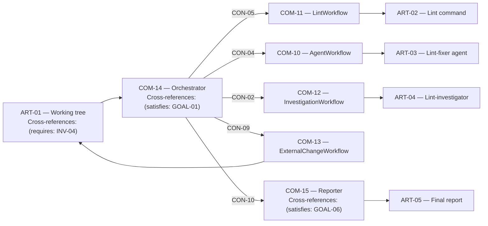

# Parallel Lint-Fixer Orchestrator Requirements

Sources: [design-map.md](design-map.md) | [components/architecture.md](components/architecture.md) | [plan.md](plan.md) | [prd structure.md](../../processes/prd%20structure.md)

## Resources

- `RES-01` Filesystem — hashing + fingerprint inputs for CAS gates
- `RES-02` Lint CLI — `uv run lint` for diagnostics collection
- `RES-03` Lint-fixer agent — `uv run python -m scripts.agents lint-fixer`
- `RES-04` Lint-investigator agent — `uv run python -m scripts.agents lint-investigator`
- `RES-05` Async executor — futures-based parallel investigation dispatch

## External Artifacts / Boundaries

- **ART-01 — Working tree boundary:** the repository working tree may change externally during execution.
  Cross-references: (requires: INV-04; validated-by: MET-02)
- **ART-02 — Lint command boundary:** a lint command produces diagnostics that must be ingested deterministically.
  Cross-references: (requires: INV-02; validated-by: MET-03)
- **ART-03 — Lint-fixer agent boundary:** an agent proposes file mutations that MUST be applied only under CAS safety.
  Cross-references: (requires: INV-04; validated-by: MET-02)
- **ART-04 — Lint-investigator boundary:** an investigator proposes target-scoped mutations and/or terminal outcomes.
  Cross-references: (requires: INV-04; validated-by: MET-02)
- **ART-05 — Final report artifact:** the orchestrator emits a final report of terminal/unresolved state.
  Cross-references: (requires: OUT-01; validated-by: MET-04)

## Problem Statement

Current lint-fixer orchestration mixes multiple state maps (diagnostics, passed cache, locks, staleness, stall candidates) inside one loop; this makes stale-linter/lock edge cases hard to reason about and test, and blocks incremental improvements like refresh-only ticks and safe investigation deferral.

## Goal List

- **GOAL-01 — Deterministic convergence loop:** iterate until `SUCCESS` (no actionable errors) or `ABORT` (project unlintable), without relying on implicit shared-state coupling.
  Cross-references: (validated-by: MET-01)
- **GOAL-02 — CAS-protected mutations:** never apply agent/investigator writes unless the pre-write snapshot matches the start snapshot; unsafe results are treated as external changes.
  Cross-references: (validated-by: MET-02)
- **GOAL-03 — Stalled-target recovery:** detect stalled targets and dispatch investigations, with per-target locking.
  Cross-references: (validated-by: MET-03)
- **GOAL-04 — Stale-linter safety:** stale/blocked linters are excluded from actionability and investigation submission; refresh-only ticks safely re-validate stale state.
  Cross-references: (validated-by: MET-03)
- **GOAL-05 — Deterministic actionability:** compute actionable targets/files deterministically from snapshot state (locked, pending, dirty, unlintable, stale).
  Cross-references: (validated-by: MET-03)
- **GOAL-06 — Reportability:** emit a final report including unlintable targets and reasons plus remaining diagnostics.
  Cross-references: (validated-by: MET-04)

## Indexed rule list

### Invariants

- **Precedence:** invariants apply globally and override any conflicting requirements.
- **INV-01 — Single-writer state ownership:** each state map is owned and mutated by exactly one component.
  Cross-references: (satisfies: GOAL-01; validated-by: MET-03)
- **INV-02 — Preserve locked/unlintable diagnostics:** diagnostics updates MUST preserve locked targets and unlintable targets.
  Cross-references: (satisfies: GOAL-04; validated-by: MET-03)
- **INV-03 — Project unlintable abort:** the project-level sentinel target marked unlintable MUST force `ABORT`.
  Cross-references: (satisfies: GOAL-01; validated-by: MET-01)
- **INV-04 — CAS gate at async boundaries:** agent/investigator changes are applied only when CAS verification of the start snapshot succeeds; otherwise treat as external change.
  Cross-references: (satisfies: GOAL-02; validated-by: MET-02)
- **INV-05 — One active investigation per target:** a target cannot have multiple concurrent investigations.
  Cross-references: (satisfies: GOAL-03; validated-by: MET-03)
- **INV-06 — Exclusion propagation:** stale linters are excluded from actionability, and any target whose error set includes an excluded linter is not submitted for investigation.
  Cross-references: (satisfies: GOAL-04; validated-by: MET-03)

### Processing rules

- **PROC-01 — Actionability gating:** actionable targets are error targets excluding locked, pending, dirty, and unlintable targets, with project-level work additionally gated on the lock set being empty.
  Cross-references: (requires: INV-03; satisfies: GOAL-05)
- **PROC-02 — Candidate stall semantics:** candidate stalled targets are computed from actionable targets and post-agent change classification.
  Cross-references: (requires: INV-04; satisfies: GOAL-03)
- **PROC-03 — Investigation deferral rule:** if any excluded linter appears in a target’s linter-error set, the target MUST be deferred into pending-investigation rather than submitted.
  Cross-references: (requires: INV-06; satisfies: GOAL-04)
- **PROC-04 — Refresh-only tick rule:** pending-refresh linters must be re-validated against current blockers and reverted to stale when blockers exist.
  Cross-references: (satisfies: GOAL-04)
- **PROC-05 — Failure staleness rule:** linter run failures must not strand a linter in pending-refresh; failures transition into a failed (excluded) state until recovery.
  Cross-references: (satisfies: GOAL-04)
- **PROC-06 — External change refresh:** external changes clear stalled/pending state for changed targets, clear unlintable for changed targets, mark changed targets dirty, forget seen fingerprints, and trigger a conservative re-lint.
  Cross-references: (requires: INV-04; satisfies: GOAL-02)
- **PROC-07 — Pending give-up rule:** targets MUST NOT remain in pending-investigation indefinitely. If a target is blocked by a hard failed linter or exceeds the configured pending tick threshold, it must be evicted from pending and marked unlintable (or otherwise surfaced as a terminal error) so the loop can converge.
  Cross-references: (requires: INV-03, CFG-01; satisfies: GOAL-01, GOAL-03, GOAL-04)
- **PROC-08 — Granular pending dispatch:** pending-investigation dispatch MUST be granular. For each pending target, dispatch only if its current linter-error set is disjoint from the excluded-linters set.
  Cross-references: (requires: INV-06; satisfies: GOAL-03, GOAL-04)
- **PROC-09 — Pending snapshot validation:** before dispatching a pending investigation, validate that the stored start snapshot still matches disk state; if it fails, do not dispatch and treat as external change.
  Cross-references: (requires: INV-04; satisfies: GOAL-02, GOAL-03)
- **PROC-10 — Idle responsiveness:** idle waiting MUST include filesystem events or a short timeout so the loop remains responsive to external file changes and can run external-change refresh.
  Cross-references: (satisfies: GOAL-02)
- **PROC-11 — Granular actionability (unaffected targets):** excluded-linter errors MUST NOT remove a target/file from actionability if it still has non-excluded errors.
  Cross-references: (requires: INV-06; satisfies: GOAL-04, GOAL-05)
- **PROC-12 — Fail-fast unlintable check:** the orchestrator SHOULD check project-level unlintable state at the start of each tick and abort immediately to save cycles.
  Cross-references: (requires: INV-03; satisfies: GOAL-01)
- **PROC-13 — Termination gating (dirty/locked):** `SUCCESS` MUST NOT be returned while any target is dirty or any investigation is in-flight.
  Cross-references: (satisfies: GOAL-01)

### Configuration rules

- **CFG-01 — Pending tick threshold:** the pending give-up rule uses a configurable positive integer tick threshold.
  Cross-references: (derived-from: PROC-07)

### Output rules

- **OUT-01 — Final report contents:** the final report MUST include unlintable targets, unlintable reasons, and remaining diagnostics.
  Cross-references: (satisfies: GOAL-06; validated-by: MET-04)

### QA rules

- **QA-01 — Diagnostic preservation tests:** verify diagnostics ingestion preserves locked targets and unlintable targets.
  Cross-references: (requires: INV-02; derived-from: GOAL-04)
- **QA-02 — CAS gate tests:** verify agent/investigator results are discarded when snapshots changed.
  Cross-references: (requires: INV-04; derived-from: GOAL-02)
- **QA-03 — Stale/refresh-only tests:** verify pending-refresh reverts to stale when blockers exist, and failures don’t strand pending-refresh.
  Cross-references: (requires: PROC-04, PROC-05; derived-from: GOAL-04)
- **QA-04 — Investigation deferral tests:** verify stall submissions are deferred when excluded linters are involved.
  Cross-references: (requires: PROC-03; derived-from: GOAL-04)
- **QA-05 — End-to-end convergence tests:** verify `SUCCESS`/`ABORT` paths, including termination gating and final report contents.
  Cross-references: (requires: GOAL-01, GOAL-06; derived-from: MET-01, MET-04)
- **QA-06 — Pending give-up tests:** verify pending targets are evicted on hard failed blockers and/or the configured pending tick threshold, and do not livelock the loop.
  Cross-references: (requires: PROC-07, CFG-01; derived-from: GOAL-01)
- **QA-07 — Granular pending dispatch tests:** verify pending dispatch does not globally block on unrelated excluded linters and only dispatches eligible targets.
  Cross-references: (requires: PROC-08; derived-from: GOAL-03)
- **QA-08 — Pending snapshot validation tests:** verify pending targets with stale start snapshots are treated as external change and not dispatched.
  Cross-references: (requires: PROC-09; derived-from: GOAL-02)
- **QA-09 — Granular actionability tests:** verify targets with mixed excluded and healthy linter errors remain actionable for healthy errors.
  Cross-references: (requires: PROC-11; derived-from: GOAL-05)

### Test artifacts

- **TEST-01 — Existing lint-fixer tests:** `scripts/tests/unit/lint_fixer/test_orchestrator.py` and `scripts/tests/integration/lint_fixer/test_orchestrator.py`.
  Cross-references: (validated-by: QA-05)
- **TEST-02 — State layer unit tests:** new unit tests covering stores/policies (diagnostic preservation, staleness transitions, stall planning).
  Cross-references: (validated-by: QA-01, QA-02, QA-03, QA-04)
- **TEST-03 — Orchestrator refactor regression tests:** updated integration tests exercising the refactored orchestrator loop under mocked linter/agent/investigator behaviors.
  Cross-references: (validated-by: QA-05)

## Component diagrams

## Components (packages)

- `components/architecture.md` — root component package (start here)
- `components/com-01-diagnostic-store.md` — `COM-01` / `ALG-01`
- `components/com-02-target-status-store.md` — `COM-02` / `ALG-02`
- `components/com-03-change-tracker.md` — `COM-03` / `ALG-03`
- `components/com-04-investigation-coordinator.md` — `COM-04` / `ALG-04`
- `components/com-05-linter-staleness-manager.md` — `COM-05` / `ALG-05`
- `components/com-06-stall-detector.md` — `COM-06` / `ALG-06`
- `components/com-07-actionability-policy.md` — `COM-07` / `ALG-07`
- `components/com-08-termination-policy.md` — `COM-08` / `ALG-08`
- `components/com-09-init-workflow.md` — `COM-09` / `ALG-09`
- `components/com-10-agent-workflow.md` — `COM-10` / `ALG-10`
- `components/com-11-lint-workflow.md` — `COM-11` / `ALG-11`
- `components/com-12-investigation-workflow.md` — `COM-12` / `ALG-12`
- `components/com-13-external-change-workflow.md` — `COM-13` / `ALG-13`
- `components/com-14-orchestrator.md` — `COM-14` / `ALG-14`
- `components/com-15-reporter.md` — `COM-15` / `ALG-15`

## Success Metrics

| ID | Metric | Target | Measurement | Cross-references |
|----|--------|--------|-------------|------------------|
| `MET-01` | Convergence (SUCCESS/ABORT) | 100% pass on end-to-end convergence scenarios | `TEST-01` / `TEST-03` cover SUCCESS/ABORT and termination gating | (derived-from: GOAL-01, INV-03, PROC-13) |
| `MET-02` | CAS safety | 0 unsafe applies (always route unsafe to external-change refresh) | Simulated external changes during agent/investigator phases in `TEST-03` | (derived-from: GOAL-02, INV-04, PROC-06) |
| `MET-03` | Staleness + actionability correctness | 100% pass on staleness/deferral/actionability scenarios | Unit coverage in `TEST-02` for PROC-03/04/05/08/11 | (derived-from: GOAL-03, GOAL-04, GOAL-05) |
| `MET-04` | Report completeness | 100% report-shape assertions pass | Snapshot/assertion checks in `TEST-03` for OUT-01 | (derived-from: GOAL-06, OUT-01) |
