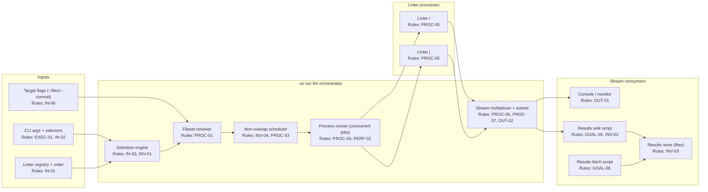
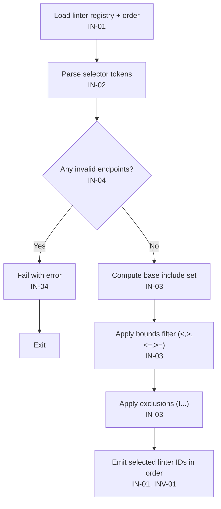
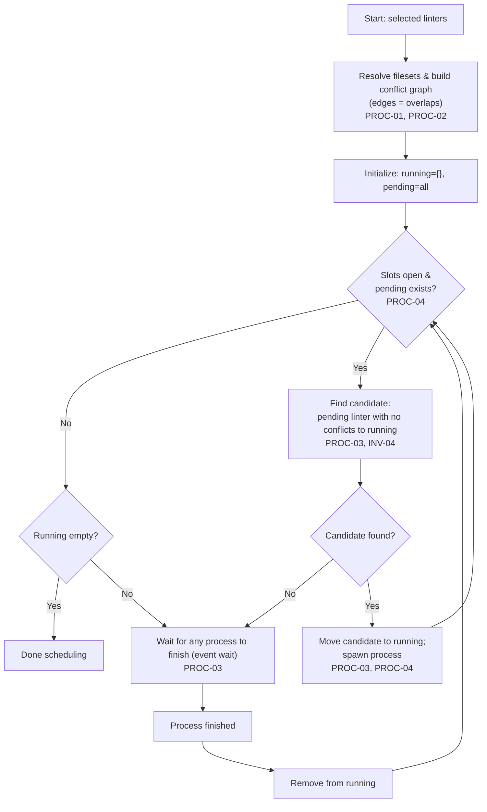
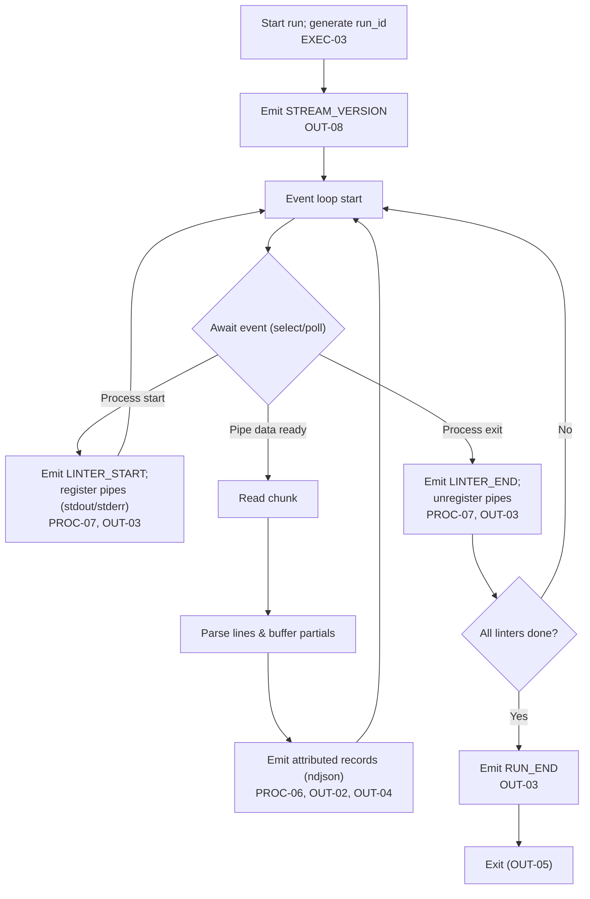
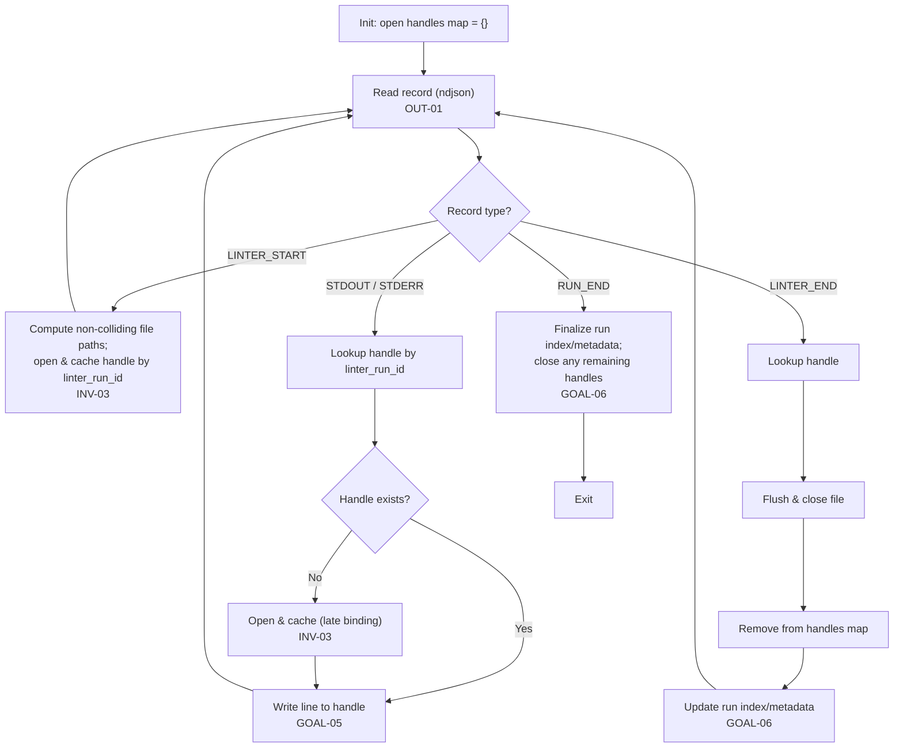
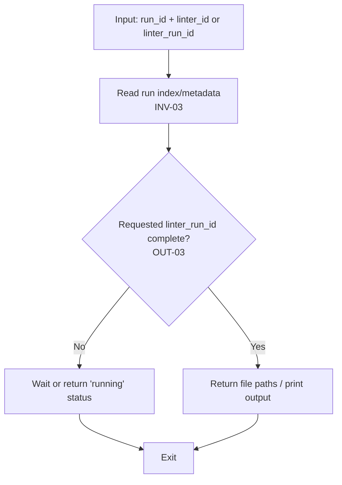
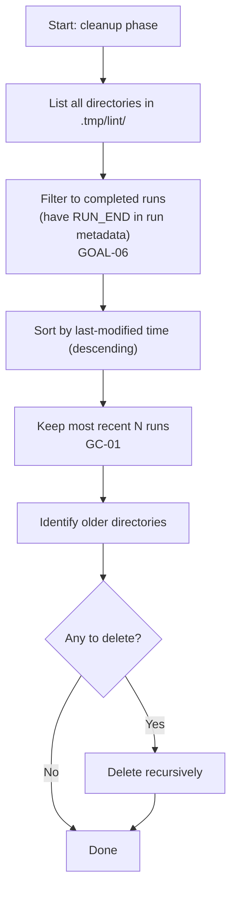

Sources: `.tasks/processes/prd structure.md`

## Resources

* `RES-01` uv — CLI entrypoint for `uv run lint` execution.
* `RES-02` Python — runtime for orchestration + helper scripts.
* `RES-03` Git — commit/diff resolution for `--commit`-scoped filesets.
* `RES-04` OS process APIs — spawning + streaming stdout/stderr from parallel linters.
* `RES-05` Filesystem — durable results store for concurrent linter runs.
* `RES-06` Repo-local `.tmp/` — non-colliding scratch space for run artifacts.

## Problem Statement

Current lint execution cannot precisely select/skip linter steps, cannot safely parallelize linter execution without file-overlap conflicts, and cannot stream per-linter attributed output with lifecycle signals suitable for real-time monitoring and durable result capture; this blocks fast iterative workflows where multiple linter runs overlap in time and where individual linters are rerun while other linters are still executing.

## Goal List

* **GOAL-01 — Step selection DSL:** Select and exclude linter steps using range + negation expressions.
* **GOAL-02 — Safe parallelism:** Run linters concurrently only when their resolved filesets do not overlap.
* **GOAL-03 — Streaming lifecycle signals:** Emit start/finish/done signals while linters run (not only at end).
* **GOAL-04 — Line-attributed output:** Attribute every emitted output line to a specific linter (filterable).
* **GOAL-05 — Durable results capture:** Provide a pipeable sink that writes per-linter outputs to non-colliding files.
* **GOAL-06 — Result retrieval:** Provide a fetch mechanism to obtain results for specific linter runs when complete.
* **GOAL-07 — Multi-run concurrency:** Support multiple concurrent `uv run lint` invocations without artifact collisions.
* **GOAL-08 — Documentation parity:** Update all linter-related documentation to describe the new behavior.
* **GOAL-09 — Bounded artifacts:** Provide garbage collection for `.tmp/lint/` artifacts so disk usage does not grow unbounded. (RES-06)

## Indexed rule list

### Invariants

* **Precedence:** invariants apply globally and override any conflicting requirements.
* **INV-01 — Deterministic selection:** given the same linter registry ordering + selection inputs, the selected linter set is identical. (GOAL-01)
* **INV-02 — No output ambiguity:** every emitted stream line is attributable to exactly one linter or to the orchestrator. (GOAL-04)
* **INV-03 — No artifact collisions:** results written to disk never overwrite or interleave across runs or reruns. (GOAL-05, GOAL-07)
* **INV-04 — No overlapping filesets in parallel:** two linters with overlapping resolved filesets MUST NOT execute concurrently within the same run. (GOAL-02)

### Execution rules

* **EXEC-01 — CLI entrypoint:** `uv run lint` accepts:

    * zero or more **selector tokens** (IN-02),
    * zero or more **targeting flags** that influence filesets (IN-06),
    * optional **parallelism limit** (PERF-02).
* **EXEC-02 — Default selection:** if no selector tokens are provided, the selected linter set is “all linters in registry order”. (IN-01, IN-03)
* **EXEC-03 — Run identity:** each invocation has a `run_id` used in stream events and results artifacts. (OUT-02, DOC-04)
* **EXEC-04 — Continue-on-failure:** all selected linters are scheduled to run (subject to INV-04), even if some fail; final exit code reflects aggregate failures. (OUT-05)
* **EXEC-05 — Registry introspection:** provide a way to list available linters + their ordering and IDs (e.g., `--list`). (IN-01, DOC-02)
* **EXEC-06 — Results store location:** linter run artifacts are stored repo-locally under `.tmp/` (gitignored) (e.g., `<repo_root>/.tmp/lint/<run_id>/...`). (INV-03, GOAL-05, GOAL-07, DOC-05)

### Input rules

* **IN-01 — Linter registry + ordering:** linters have unique IDs and a total order used for range evaluation. (GOAL-01)
* **IN-02 — Selector token forms (include/exclude):**

    * **Single:** `lint5`
    * **Exclude single:** `!lint5`
    * **Closed interval:** `[lint4,lint9]`
    * **Open/closed variants:** `(lint1,lint2]`, `[lint1,lint2)`, `(lint1,lint2)`
    * **Exclude interval:** `![lint3,lint8]`, `!(lint3,lint8)`, `![lint3,lint8)`, etc.
    * **Upper bound:** `<lint5` (strict), `<=lint5` (inclusive)
    * **Lower bound:** `>lint1` (strict), `>=lint1` (inclusive)
    * **Negation operator:** `!` prefixes a selector expression; it is not a standalone token.
* **IN-03 — Selection composition semantics (single invocation):**

    * **Base include set:**

        * if there are any positive include tokens (single or interval), base include set starts as the **union** of those tokens;
        * else base include set starts as **all linters** (EXEC-02).
    * **Bounds filter:** all positive bound tokens (`<,<=,>,>=`) apply as a filter (intersection) over the base include set. (supports `>lint1 <lint10` ⇒ `(lint1,lint10)`)
    * **Exclusions:** all negative tokens (`!…`) subtract from the current selection.
* **IN-04 — Endpoint validity:** any selector endpoint must reference an existing linter ID (or a documented alias). Unknown endpoints are errors. (INV-01)
* **IN-05 — Range validity:** intervals require ordered endpoints based on registry ordering; invalid or empty-by-definition ranges are allowed but select nothing (and remain subtractable). (INV-01)
* **IN-06 — Fileset targeting inputs:** linter execution supports inputs that constrain filesets (e.g., `--files …`, `--commit …`) and these inputs participate in fileset resolution. (PROC-01)

### Processing rules

* **PROC-01 — Fileset resolution per linter:** for each selected linter, compute its resolved fileset after applying:

    * linter-defined scope/boundaries (configured by the linter registry),
    * user targeting inputs (IN-06),
    * path normalization to a canonical comparable form using Python filesystem semantics: `canonical_path = os.path.normcase(os.path.realpath(os.path.abspath(path)))`. (INV-04)
* **PROC-02 — Overlap detection:** two linters overlap if their resolved filesets share any canonical path. (INV-04)
* **PROC-03 — Scheduling under non-overlap:** build an overlap conflict graph (edges = overlap per PROC-02) and schedule dynamically: when a job slot is free, run any pending linter that has no conflicts with any currently-running linter; if none are admissible, wait for a running linter to finish. (INV-04, PERF-02)
* **PROC-04 — Parallel execution:** at most `N` linters are running at any time, where `N` is the configured concurrency limit. (PERF-02)
* **PROC-05 — Per-linter run identity:** each linter execution has a unique `linter_run_id` (distinct across reruns), emitted in stream events and used for artifact naming. (INV-03, OUT-02)
* **PROC-06 — Streaming multiplexer:** stdout/stderr from each linter process is streamed line-by-line without waiting for completion. (GOAL-03, GOAL-04)
* **PROC-07 — Lifecycle events:** orchestrator emits events when a linter starts, finishes, and when the overall run finishes. (GOAL-03)

### Output rules

* **OUT-01 — Stream format contract:** stdout emits `ndjson` (one JSON object per line) by default and MUST NOT auto-switch formats based on TTY detection. `ndjson` is the only stable/contracted stream format.
* **OUT-02 — Required stream fields:** every emitted record includes:

    * `run_id`,
    * either `linter_id` + `linter_run_id` (for linter-attributed records) or `orchestrator=true`,
    * record kind: `event` | `stdout` | `stderr`,
    * for `event` records: an event discriminator (e.g., `event_type`),
    * monotonically increasing per-source `seq` (per linter run and per orchestrator stream).
* **OUT-03 — Event types (minimum):**

    * `STREAM_VERSION` (includes protocol schema/version),
    * `LINTER_START` (includes linter_id, linter_run_id, scheduler metadata optional),
    * `LINTER_END` (includes exit code + duration),
    * `RUN_END` (includes aggregate status + summary counts).
* **OUT-04 — Line attribution:** every stdout/stderr line from linters is emitted as a separate attributed record. (INV-02)
* **OUT-05 — Exit code semantics:** process exit code is non-zero if any linter fails (based on `LINTER_END` exit codes). (EXEC-04)
* **OUT-06 — NDJSON framing:** stdout records are UTF-8, newline-delimited JSON objects (`\n`, optionally `\r\n`); each record MUST be compact JSON with no literal newlines (newlines inside string values must be escaped).
* **OUT-07 — Stdout is protocol-only:** stdout MUST contain only NDJSON records; any human-readable or debug logs MUST be emitted to stderr.
* **OUT-08 — Stream version record:** the first stdout record MUST be `STREAM_VERSION`, and consumers MUST ignore unknown fields for forward compatibility.

### Maintenance rules

* **DOC-01 — Document selection DSL:** all linter docs must describe selector syntax, precedence (IN-03), and worked examples. (GOAL-08)
* **DOC-02 — Document registry introspection:** docs must describe how to list linter IDs + ordering. (EXEC-05)
* **DOC-03 — Document parallelism behavior:** docs must state the non-overlap execution guarantee and how fileset overlap affects scheduling. (INV-04, PROC-03)
* **DOC-04 — Document streaming protocol:** docs must describe the NDJSON protocol contract, event types, and required fields. (OUT-01..OUT-03, OUT-06..OUT-08)
* **DOC-05 — Document sink + fetch usage:** docs must describe the results sink and results fetch commands/scripts, including the default repo-local results store path under `.tmp/`. (GOAL-05, GOAL-06, EXEC-06)
* **DOC-06 — Document artifact GC:** docs must describe the artifact GC mechanism and retention policy. (GC-01, GOAL-09)
* **GC-01 — Artifact garbage collection:** provide a mechanism to prune `.tmp/lint/` artifacts to a bounded retention policy (e.g., keep last `N` completed runs), and MUST NOT delete artifacts for active runs (missing `RUN_END` in run metadata). (RES-06, GOAL-06, GOAL-07, GOAL-09)

### QA rules

* **QA-01 — Selector parser unit tests:** cover:

    * single include/exclude,
    * interval forms with each bracket type,
    * bounds filtering (`>… <…`, inclusive variants),
    * exclusion precedence,
    * invalid identifiers/ranges. (IN-02..IN-05)
* **QA-02 — Scheduler property tests:** verify no concurrently running linters share any file path under overlap scenarios. (INV-04, PROC-02..PROC-04)
* **QA-03 — Streaming attribution tests:** verify every emitted record carries required fields, stdout is NDJSON-only, the first record is `STREAM_VERSION`, and stdout/stderr is line-attributed. (INV-02, OUT-02..OUT-04, OUT-06..OUT-08)
* **QA-04 — Multi-run collision tests:** run two concurrent orchestrations writing results via sink and verify artifact isolation. (INV-03, GOAL-07)
* **QA-05 — Sink/fetch integration tests:** verify that:

    * sink writes expected per-linter files,
    * fetch retrieves correct linter_run_id outputs after completion,
    * reruns do not overwrite earlier outputs. (GOAL-05, GOAL-06)
* **QA-06 — Artifact GC tests:** verify GC retention behavior and verify that any run without a `RUN_END` marker in its run index/metadata is not deleted. (GC-01, GOAL-06, GOAL-07, GOAL-09)

### Performance rules

* **PERF-01 — Low-latency first signal:** emit initial `STREAM_VERSION` quickly after invocation (measured in MET-04). (GOAL-03, OUT-03)
* **PERF-02 — Configurable concurrency:** support a concurrency limit for concurrently running linters (e.g., `--jobs N`). (GOAL-02)

## Component diagrams

### Component diagram: Parallel linter run + results capture

## Algorithms as Mermaid flowcharts

### ALG-01: Selector evaluation

### ALG-02: Dynamic non-overlap scheduling

### ALG-03: Async stream multiplexer + lifecycle events

### ALG-04: Buffered results sink (pipe consumer)

### ALG-05: Results fetch

### ALG-06: Artifact garbage collection

## Success Metrics

| ID       | Metric                         |                Target | Measurement                                                                                                   | Goals              |
| -------- | ------------------------------ | --------------------: | ------------------------------------------------------------------------------------------------------------- | ------------------ |
| `MET-01` | Selector correctness           |             100% pass | Unit tests for all selector forms + precedence (QA-01)                                                        | GOAL-01            |
| `MET-02` | No-overlap guarantee           |          0 violations | Integration test asserts no concurrent overlap under adversarial filesets (QA-02)                             | GOAL-02            |
| `MET-03` | Attribution completeness       | 100% lines attributed | Stream validation test: every stdout/stderr record has linter_id + linter_run_id (QA-03)                      | GOAL-04            |
| `MET-04` | First lifecycle signal latency |               ≤ 250ms | Measure time from invocation to first emitted `STREAM_VERSION` record (PERF-01)                               | GOAL-03            |
| `MET-05` | Artifact collision rate        |          0 collisions | Two concurrent runs + reruns; verify unique output paths + no overwrites (QA-04)                              | GOAL-07            |
| `MET-06` | Sink/fetch usability           |                  Pass | End-to-end: sink persists outputs; fetch returns correct results after completion (QA-05)                     | GOAL-05, GOAL-06   |
| `MET-07` | Documentation parity           |                  100% | Checklist encourages that docs cover selectors + protocol + sink/fetch + GC (DOC-01..DOC-06)                  | GOAL-08            |
| `MET-08` | Artifact retention bound       |                  Pass | Create >N completed runs; GC keeps last N and deletes older artifacts (QA-06)                                 | GOAL-09            |

## Open Questions

* [x] **Q-01:** Default stream format — resolved: `ndjson` on stdout (no TTY-based auto-selection); `ndjson` is the stable/contracted interface. (OUT-01)
