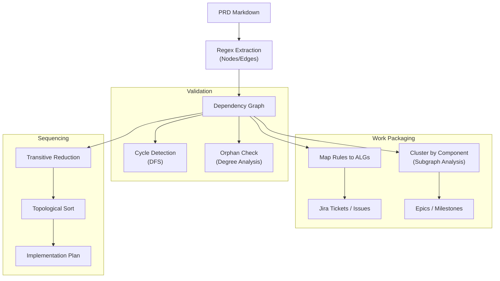

Based on the strict structure defined in `prd structure.md` and exemplified in `requirements.md`, the "best suite" of algorithms focuses on **graph theory** and **structural parsing**. Because your PRD format enforces explicit identifiers (`ID`) and cross-references (`REF`), the text can be treated as a serialization of a Directed Acyclic Graph (DAG).

Here is the recommended suite of algorithms for extracting dependencies and units of work.

### 1. Parsing & Graph Construction (The "Librarian")

Before analysis, the document must be converted into a computable structure.

* **Node Extraction (Regex):**
* Scan for lines matching `^\* \*\*([A-Z]+-\d+) — .*$`.
* Create a **Node** for each match (e.g., `EXEC-01`, `INV-01`).
* Assign attributes: `Type` (Prefix), `Description`, `Category` (Header).

* **Edge Extraction (Reference Resolution):**
* Scan the text body of each Node for patterns matching `\(([A-Z]+-\d+(?:, [A-Z]+-\d+)*)\)`.
* Create **Directed Edges** from the *Subject Node* (the rule containing the text) to the *Object Node* (the referenced rule).
* *Note:* In this PRD format, if `EXEC-02` references `(IN-01)`, `EXEC-02` *depends on* `IN-01`.

* **Diagram Parsing:**
* Parse `mermaid` blocks.
* Extract explicit dependencies from `A --> B` relationships.
* Map Diagram Nodes to Rule IDs using the annotations (e.g., `Rules: IN-01`).

### 2. Dependency Resolution (The "Sequencer")

Once the graph is built, use these algorithms to order the work and validate logic.

* **Cycle Detection (DFS):**
* Run Depth First Search to detect back-edges.
* **Purpose:** A cycle (e.g., A needs B, B needs A) indicates a logical error in requirements or a tight coupling that must be resolved before coding.

* **Transitive Reduction:**
* Remove redundant edges (if  and  and , remove ).
* **Purpose:** Simplifies the dependency map to show only *direct* prerequisites, making tickets cleaner.

* **Topological Sort:**
* Linearize the DAG.
* **Purpose:** Generates a valid implementation order where no task is started before its dependencies are met.
* *Heuristic Refinement:* Prioritize `INV` (Invariants) and `RES` (Resources) nodes as they form the "Foundation" layer.

### 3. Unit of Work Identification (The "Packager")

Rules are often too atomic for individual tickets. These algorithms group them into meaningful deliverables.

* **Subgraph Extraction (via Mermaid):**
* Use the `subgraph` definitions in Component Diagrams (e.g., `subgraph CORE`, `subgraph INPUTS`).
* **Algorithm:** Assign all Rules referenced within a `subgraph` block to a single **Epic** or **Feature Set**.

* **Connected Components (Clustering):**
* Treat the graph as undirected and find Connected Components within specific Categories (e.g., all `IN-*` rules).
* **Purpose:** Identifies clusters of rules that are tightly coupled and should be implemented by the same engineer to minimize context switching.

* **Algorithm-to-Rule Mapping:**
* Iterate through `## Algorithms` sections.
* For each `ALG-XX`, collect all Rule IDs referenced in its header comments (e.g., `%% Rules: EX-01, EX-02`).
* **Result:** The `ALG-XX` becomes the **Implementation Task**, and the referenced Rules become the **Acceptance Criteria**.

### 4. Completeness & Impact Analysis (The "Auditor")

Ensure nothing is missed.

* **Reverse Reachability (Impact Analysis):**
* Select a `GOAL-XX`.
* Perform a Reverse BFS (follow incoming edges) to find all Rules that contribute to this Goal.
* **Purpose:** Verifies that a Goal is fully supported by requirements. If a Goal has no incoming edges from Rules, it is an orphan (unimplemented).

* **Sink Identification:**
* Find nodes with Out-degree = 0 (excluding `MET` and `GOAL`).
* **Purpose:** Detect "dangling" rules that do not contribute to any higher-level process or output.

---

### Summary of Pipeline

| Step | Algorithm | Input | Output |
| --- | --- | --- | --- |
| **1** | **Regex/Parser** | Markdown File | `Nodes[]`, `Edges[]` |
| **2** | **DFS** | Graph | `Cycles` (Errors) |
| **3** | **Topo Sort** | DAG | `Execution_Order[]` |
| **4** | **Clustering** | DAG + Subgraphs | `Epics` (Grouped Units of Work) |
| **5** | **Reverse BFS** | DAG + Goals | `Traceability_Matrix` |

### Visual Representation of the Logic

### Next Step

Would you like me to execute **Step 1 and 2** (Parsing & Topological Sort) on your provided `requirements.md` file to generate a concrete implementation plan?