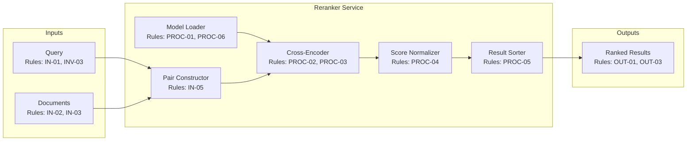

# Reranker Service PRD

Sources: AGENTS.md

## Resources

- `RES-01` Python 3.12+ — runtime environment
- `RES-02` PyTorch — tensor computation and model inference
- `RES-03` Qwen3 Reranker Model — query-document relevance scoring
- `RES-04` Sentence Transformers — cross-encoder wrapper (optional)
- `RES-05` NumPy — score operations
- `RES-06` Every Code — orchestration harness (consumer)

## Problem Statement

After initial retrieval (via embeddings or keyword search), results need reranking by
a more sophisticated model that considers query-document interaction. The Qwen3 reranker
provides cross-encoder scoring but requires Python/PyTorch runtime. This service wraps
the model in a CLI-invocable script for query-document pair scoring and result reordering.

## Goal List

* **GOAL-01 — CLI-invocable reranking:** Provide a command-line interface that accepts
  a query and candidate documents, returning relevance scores.
* **GOAL-02 — Batch scoring:** Score multiple query-document pairs efficiently in one call.
* **GOAL-03 — Sorted output:** Return documents sorted by relevance score (descending).
* **GOAL-04 — Score normalization:** Provide normalized scores (0-1) for comparability.
* **GOAL-05 — Top-k filtering:** Support returning only top-k results after reranking.

## Indexed Rule List

### Invariants

* **Precedence:** Invariants apply globally and override any conflicting requirements.
* **INV-01 — Determinism:** Same query-document pair always produces identical score.
* **INV-02 — No side effects:** Reranking must not modify any external state.
* **INV-03 — Query required:** Every scoring operation requires a query; no query-less mode.

### Input Rules

* **IN-01 — Query input:** Query provided as positional argument or `--query` flag.
* **IN-02 — Document input formats:** Documents via stdin (JSON array), file path, or
  inline JSON argument.
* **IN-03 — Document structure:** Each document is object with `id` (string) and `text` (string).
* **IN-04 — Encoding:** All text input must be UTF-8 encoded.
* **IN-05 — Max pair length:** Query+document exceeding model max tokens truncates document.

### Processing Rules

* **PROC-01 — Model loading:** Load Qwen3 reranker on first invocation; cache in process.
* **PROC-02 — Cross-encoding:** Compute relevance as cross-encoder score (query, document).
* **PROC-03 — Batching:** Process pairs in configurable batch sizes (default: 16).
* **PROC-04 — Score normalization:** Apply sigmoid to raw logits for 0-1 scores.
* **PROC-05 — Sorting:** Sort results by normalized score descending.
* **PROC-06 — Device selection:** Auto-detect GPU; fall back to CPU.

### Output Rules

* **OUT-01 — Result format:** JSON array of objects with `id`, `score`, `rank`.
* **OUT-02 — Include text option:** With `--include-text`, include document text in output.
* **OUT-03 — Top-k filtering:** With `--top-k N`, return only top N results.
* **OUT-04 — Error reporting:** Errors to stderr; non-zero exit on failure.

### CLI Rules

* **CLI-01 — Basic invocation:** `python -m scripts.reranker rerank "query" --docs docs.json`
* **CLI-02 — Stdin input:** `cat docs.json | python -m scripts.reranker rerank "query" --stdin`
* **CLI-03 — Top-k flag:** `--top-k 10` to limit results.
* **CLI-04 — Score threshold:** `--min-score 0.5` to filter low-relevance results.
* **CLI-05 — Raw scores:** `--raw` to output unnormalized logits.

## Component Diagrams

### Component Diagram: Reranker Service

## Success Metrics

| ID | Metric | Target | Measurement | Goals |
|----|--------|--------|-------------|-------|
| `MET-01` | Single pair latency | <50ms | Benchmark 100 pairs | GOAL-01 |
| `MET-02` | Batch throughput | >500 pairs/sec | Benchmark 5k pairs | GOAL-02 |
| `MET-03` | Ranking quality | NDCG@10 >0.8 | Evaluate on test queries | GOAL-03 |
| `MET-04` | Score calibration | Correlation >0.9 | Compare to reference model | GOAL-04 |
| `MET-05` | Determinism | 100% | Score comparison of 1000 re-rankings | INV-01 |
