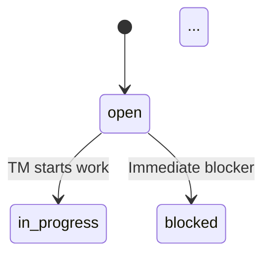

# Phase 0: Real Spec Patterns

Analysis of `.tasks/plans/workflow engine 3/` — a 78-file, 13,700-line
production spec. This is the kind of input Phase 0 must actually handle.

This document captures concrete patterns, not theory. Every pattern
listed here was observed in the real spec.

---

## Spec Profile

- **Files**: 78 (67 MD + 9 YAML + 1 shell + 1 directory index)
- **Lines**: ~13,700
- **Explicit libraries**: 14 (`Lib__*.md` files)
- **Workflow definitions**: 9 (YAML)
- **Agent prompt definitions**: 9 (MD + YAML frontmatter)
- **Cross-references per file**: 5-15 (average)
- **Estimated normative statements**: 500+
- **Spec gaps**: Very few — this spec is boundlessly detailed
- **Hidden underspecifications**: Present but hard to detect from the
  spec side (PDD discovers these by trying to implement)
- **Primary challenge**: Not dropping details during extraction

---

## Document Hierarchy

The spec has 6 layers, from highest to lowest abstraction:

| Layer | Files | What it contains |
|-------|-------|-----------------|
| **Epic Brief** | 1 (`Epic_Brief__*.md`) | Problem definition, product priorities, scope, system shape overview, user journeys, global invariants, risk register |
| **Core Flows** | 1 (`Core_Flows__*.md`) | 14 user-facing step sequences (install, project management, task execution, validation, rebase, monitoring) |
| **Tech Plan indices** | 6 top-level (`Tech_Plan__*.md`) | Component overview + library-to-package mapping tables + reading order + cross-library contracts |
| **Tech Plan specs** | 28 children (in subdirectories) | Detailed per-library specifications with schemas, algorithms, protocols |
| **Library specs** | 14 (`project_ticket_system/Lib__*.md`) | Code-module-level contracts: lifecycle, execution, decomposition, validation, export |
| **Workflow/Agent definitions** | 18 (YAML + MD) | Runtime definitions: workflow schemas, agent prompts with input/output contracts |

Additional: 4 usage guides, 1 shell script.

### PDD category distribution by layer

| Layer | Invariants | Analysis | Algorithms | Shapes | Stores |
|-------|-----------|----------|------------|--------|--------|
| Epic Brief | High (§1, §7) | High (§0.3, §8) | Medium (§4-6 flows) | Low | Low |
| Core Flows | Low | Low | Very high (all flows) | Low | Low |
| Tech Plan indices | None | Medium (cross-refs) | None | Medium (maps) | None |
| Tech Plan specs | Low (~5%) | Low (~5%) | High (~60%) | High (~30%) | Medium |
| Library specs | Low | Low | Very high | High | Medium |
| Workflow YAML | None | None | None | All (schema defs) | None |
| Agent prompts | None | None | All (procedures) | Frontmatter (schemas) | None |

**Key observation**: Invariants are concentrated in the Epic Brief and
Foundation spec. Everything else is predominantly algorithms and shapes
with invariant-sounding language ("MUST").

---

## Format Diversity

Phase 0 must handle 6 distinct content formats within this spec:

### Format 1: Pure Markdown

Standard markdown with headers, tables, code blocks, numbered lists.
Sections numbered with § notation. This is 67 of 78 files.

Parsing: standard markdown sectionizer.

### Format 2: YAML Workflow Definitions

```yaml
schema_version: 1
workflow_id: step_execute_v1
steps:
  - step_id: execute
    kind: agent
    entrypoint: "agent:step_executor_v1"
    capabilities_required: ["sandbox_exec", "apply_patch"]
    with:
      ticket_id: "${{ inputs.ticket_id }}"
```

These define workflow shapes — step structure, inputs, outputs,
capability requirements. 9 files.

PDD category: **Shape** (the workflow schema itself is a data
structure definition).

Parsing: YAML parser → extract step definitions as shape atoms.

### Format 3: Markdown + YAML Frontmatter (agent prompts)

```markdown
---
agent_id: step_executor_v1
capabilities_required: ["net_llm", "read_stack", "apply_patch"]
input_schema:
  type: object
  required: ["ticket_id", "task_id", "step_id"]
output_schema:
  type: object
  required: ["status", "mode_used", "artifacts", "summary"]
---

You are step_executor_v1.

Normative algorithm:
1) Validate inputs...
2) Mode selection...
3) Gather context...
```

Frontmatter = **Shape** (input/output schemas).
Body = **Algorithm** (the agent's procedure).

9 files. Parsing: split frontmatter from body, parse each separately.

### Format 4: Inline JSON Schemas (within markdown)

```json
{
  "schema_version": 2,
  "ticket_id": "<ticket_id>",
  "status": "open|in_progress|blocked|done|abandoned",
  "blocker_kind": "validation_failure|approval_required|...",
  "patches": [
    { "change_id": "<jj change_id>", "commit_id": "<jj commit_id>" }
  ]
}
```

These appear inline within markdown specs and are normative — they
define the actual data structures. Usually followed by "Field rules"
sections that add validation constraints (which are shape details,
not invariants — see `00_CLASSIFICATION.md`).

Parsing: detect JSON code blocks, extract as shape atoms. Link
following "field rules" sections to the same shape.

### Format 5: Inline Pseudocode/Algorithms

```text
parse workflow YAML → workflow
validate schema_version, unique step_id, DAG acyclic

order = workflow.steps in file order
state[step_id] = PENDING

while exists PENDING step:
  ready = [s in order where state[s] == PENDING and all deps COMPLETED]
  if ready is empty:
     blocked = [s where state[s] == PENDING and any dep FAILED]
     ...
  s = ready[0]
  execute s → result
```

Already pseudocode. Move to PDD details as-is — no rewriting needed.

Parsing: detect code blocks with pseudocode-like syntax (no language
tag or generic tags like `text`).

### Format 6: Mermaid Diagrams



These are informative visualizations of state machines or flows that
are defined normatively elsewhere in the same document.

PDD category: **Analysis** (they explain/visualize a design, they
don't define it — the normative text does).

Parsing: detect mermaid code blocks, extract as analysis atoms.

---

## Pre-Structured Input

This spec is already organized into libraries with explicit package
mappings. The Core Infrastructure index file contains:

```
| Library (suggested package)          | Spec                     |
| workflow_engine.core.foundation      | 00_Foundation.md         |
| workflow_engine.storage.wss          | 04_WSS_Workspace_State_Store.md |
| workflow_engine.core.ids             | 03_IDs_and_Time.md       |
```

Every library spec starts with structured metadata:

```
- **Library**: `workflow_engine.storage.wss`
- **Depends on**: [`00_Foundation.md`], [`03_IDs_and_Time.md`], [...]
- **Primary responsibility**: Define the durable hierarchical document
  store for mutable workflow state...
```

### Detection signals for pre-structured specs

Phase 0's Library Discovery should check for these signals before
attempting to discover libraries from scratch:

1. **Index files** that map components to spec files (library tables)
2. **Library-to-package mapping tables** with explicit package names
3. **"Depends on" headers** declaring inter-library dependencies
4. **"Primary responsibility" headers** declaring library scope
5. **Numbered file sequences** within directories (00_, 01_, 02_...)
6. **"Used by" headers** declaring consumer relationships

When these signals are present, Phase 0 should RESPECT the existing
structure rather than re-discovering. The extraction becomes:
1. Confirm the library boundaries make sense
2. Classify content within each library (algorithms, shapes, stores)
3. Extract cross-library references

When these signals are absent, Phase 0 falls back to co-occurrence
graph library discovery.

---

## Overlap Patterns

Some concepts appear in multiple files with different aspects. These
are NOT duplicates — each occurrence adds something different:

| Concept | Files | What each adds |
|---------|-------|---------------|
| Ticket status | Epic Brief §5.1, Lifecycle §1, WSS §5.4, Core Flows §6/§9/§10 | Epic: system overview. Lifecycle: **authoritative** transition rules. WSS: JSON schema. Flows: usage in procedures. |
| PAUSE protocol | Core Flows §12, Monitoring §3, Foundation §1.2 | Flows: step sequence. Monitoring: enforcement mechanism. Foundation: **invariant** ("PAUSE is mandatory"). |
| Error codes | Logs Store §8.2.5, Error Recovery §3-8, Monitoring §5.4.2 | Logs: **authoritative** code definitions. Recovery: user playbooks. Monitoring: machine investigation. |
| Sandbox lifecycle | Integration §9, Core Flows §8-9, Workflow schema §7.2 | Integration: **authoritative** implementation. Flows: usage sequences. Workflows: configuration. |
| Lock ordering | Multi-Writer §6.4, Lifecycle §1.5, Decomposition §4, Step Execution §0 | Multi-Writer: **authoritative** global order. Others: application of the rule. |

**Pattern**: One file is authoritative (defines the concept), others
apply or reference it. Phase 0 must detect which is which.

### Authority detection signals

- "authoritative definition of X"
- "canonical" terminology sections
- "(normative)" marking on definition sections
- "All other specs MUST reference §X"
- The most detailed/comprehensive occurrence is usually authoritative
- Index files often declare authority explicitly

---

## Coverage Risk

This spec has zero tolerance for dropped details. The consequences
of missing normative statements:

| Dropped statement type | Consequence |
|----------------------|-------------|
| Missing lock acquisition step | Data corruption under concurrency |
| Missing evidence emission step | Silent failure (no audit trail) |
| Missing capability check | Security bypass |
| Missing validation rule | Invalid data accepted |
| Missing error code | Unhandled failure mode |
| Missing state transition rule | Illegal state reached |
| Missing schema field | Data loss or schema mismatch |

Phase 0 must track coverage at the **sentence level** for sections
marked as normative. Every sentence containing "MUST", "MUST NOT",
"SHALL", "SHALL NOT", "REQUIRED" needs to appear in the output.

### Coverage tracking approach

1. During intake, count normative sentences per section
2. During classification, map each sentence to its output atom
3. After output, verify every normative sentence has a home
4. Report unaccounted sentences as extraction failures

---

## Terminology and Glossary Patterns

This spec has an explicit normative glossary (Foundation §0.1) with
50+ terms. It also has specialized terminology sections:

- "ID classes (semantic vs generated)" — defines which IDs are
  human-meaningful vs machine-generated
- "Flow vs Workflow" — disambiguates overloaded terms
- "Sandbox vs hydration" — disambiguates execution concepts
- "WSS and sandbox terminology" — resolves "workspace" ambiguity

Phase 0 should:
1. Detect glossary sections (headers containing "terminology",
   "glossary", "canonical terms")
2. Extract term definitions as shape atoms (they define data types)
3. Use the glossary to resolve references elsewhere in the spec

---

## Size Distribution

Not all files are equal. The spec has a heavy tail:

| Size category | File count | Total lines | Example |
|--------------|-----------|-------------|---------|
| Large (>500 lines) | 5 | ~6,000 | Enhanced Rebase (1000+), Error Recovery (800+) |
| Medium (200-500 lines) | 12 | ~4,000 | Lifecycle, Configuration, WSS |
| Small (50-200 lines) | 30 | ~3,000 | Most Tech Plan specs, Library specs |
| Tiny (<50 lines) | 31 | ~700 | Workflow YAML, agent prompts, usage guides |

The 5 large files contain ~44% of the content. These benefit from
per-section processing within the file (sectionize first, then
classify sections independently).

---

## Pre-Structured Input Detection Design

Some specs arrive with explicit library organization already in place.
The Workflow Engine 3 spec is a prime example: 14 declared libraries,
library-to-package mapping tables, "Depends on" headers, numbered file
sequences. Phase 0 must detect this structure and decide whether to
respect it or re-discover boundaries from scratch using the
co-occurrence graph (see `clean/07_LIBRARY_DISCOVERY.md`).

This section defines the detection signals, decision logic, hybrid
verification mode, and user override for pre-structured input.

### Detection Signals

Phase 0 scans the input corpus for these concrete signals before
invoking library discovery:

| # | Signal | What to look for | Example from WE3 |
|---|--------|-------------------|-------------------|
| 1 | **Index files** | README, INDEX.md, or top-level files that list libraries/components with links to spec files | `Tech_Plan__Core_Infrastructure.md` containing a table of libraries mapped to spec files |
| 2 | **Library-to-package mapping tables** | Markdown tables with columns like "Library (suggested package)" and "Spec" mapping library names to package paths | `workflow_engine.core.foundation` mapped to `00_Foundation.md` |
| 3 | **Dependency headers** | Metadata blocks at the top of files declaring "Depends on:", "Used by:", or "Imports:" with references to other libraries | `- **Depends on**: [00_Foundation.md], [03_IDs_and_Time.md]` |
| 4 | **Primary responsibility headers** | Metadata blocks declaring a single focused responsibility for the file/library | `- **Primary responsibility**: Define the durable hierarchical document store...` |
| 5 | **Directory structure matching library names** | Subdirectories whose names correspond to declared library or component names | `Tech_Plan__Core_Infrastructure/` containing numbered spec files |
| 6 | **Explicit "Library:" or "Module:" headers** | Files that declare their own library identity with a package-qualified name | `- **Library**: workflow_engine.storage.wss` |
| 7 | **Numbered file sequences** | Files within directories following a `00_`, `01_`, `02_` pattern indicating intentional reading/dependency order | `00_Foundation.md`, `01_Core_Flows.md`, `02_Lifecycle.md` |

Each signal found increments a signal count. Signals are binary per
type (present or absent across the corpus), not per file.

### Decision Logic

The signal count determines Phase 0's library organization strategy:

```
signal_count = count of distinct signal types detected (0-7)

if signal_count >= 3:
    strategy = RESPECT_EXISTING
    # High confidence that the input has intentional library organization.
    # Extract library boundaries directly from the declared structure.
    # Classify content within each declared library (algorithms, shapes,
    # stores, invariants, analysis).
    # Extract cross-library references from dependency headers.

elif signal_count in {1, 2}:
    strategy = RESPECT_AND_VERIFY
    # Some structure present but not enough for full confidence.
    # Extract library boundaries from the declared structure.
    # Run co-occurrence graph as verification pass.
    # Flag discrepancies between declared and discovered boundaries:
    #   - Entities that co-occur strongly across declared library boundaries
    #   - Declared libraries with no co-occurrence support (possibly empty)
    #   - Co-occurrence clusters that span multiple declared libraries

else:  # signal_count == 0
    strategy = FULL_DISCOVERY
    # No pre-existing structure detected.
    # Run full co-occurrence graph library discovery:
    #   BuildCooccurrenceGraphFromEntityTags -> ProposeLibraryCandidates
    #   -> MultiLabelUnitsToLibraries -> AggregateShapesAndRefine
    # (See clean/07_LIBRARY_DISCOVERY.md for the complete algorithm.)
```

**Rationale for threshold at 3**: A single signal (e.g., numbered
files) could be coincidental formatting rather than intentional library
design. Two signals (e.g., numbered files + directory structure) are
suggestive but could still be a project-organization convention
unrelated to library boundaries. Three or more signals — especially
when they include mapping tables or dependency headers — indicate
deliberate library architecture that the spec author intended.

### Hybrid Verification Mode

Even under `RESPECT_EXISTING`, Phase 0 runs the co-occurrence graph
as a secondary verification pass. The purpose is NOT to override the
declared structure but to detect three specific anomalies:

**1. Cross-library overlaps**

Entities that appear strongly in multiple declared libraries. These
are not necessarily errors — cross-cutting concerns are legitimate —
but they should be flagged for review.

Detection: After extracting entity tags per declared library, build
the co-occurrence graph. Any entity pair where both entities have
primary membership in different declared libraries but co-occurrence
weight exceeds the overlap threshold is a cross-library overlap.

Action: Record as multi-label membership (primary in declared library,
secondary in the other). The provenance system tracks this via
`UnitLabel.secondary_lib_ids` (see `DS-DISC-0003` in
`clean/07_LIBRARY_DISCOVERY.md`).

**2. Missing libraries**

Entities that do not fit any declared library. These are content
fragments that the declared structure does not account for.

Detection: After `MultiLabelUnitsToLibraries`, any unit where
`primary_lib_id` is null and confidence is below the assignment
threshold represents an orphan entity.

Action: Propose a new library candidate using
`ProposeLibraryCandidates` scoped to orphan entities only. Report the
proposed library as an addition to the declared structure, not a
replacement.

**3. Misplaced entities**

Entities whose co-occurrence pattern strongly suggests they belong in
a different declared library than the one they were found in.

Detection: After building the co-occurrence graph, for each entity
tagged to declared library L, check whether its strongest
co-occurrence cluster is centered in a different declared library M.
If the co-occurrence weight toward M exceeds the weight toward L by
a configurable ratio (default: 2x), flag as potentially misplaced.

Action: Report the discrepancy with co-occurrence evidence. Do NOT
automatically move the entity — the declared structure is respected.
The report enables a human or downstream phase to decide.

### Reporting

Under all strategies, Phase 0 produces a `StructureDetectionReport`:

```
StructureDetectionReport:
  strategy: RESPECT_EXISTING | RESPECT_AND_VERIFY | FULL_DISCOVERY
  signals_detected: list<{signal_type, evidence_locations}>
  declared_libraries: list<{name, source_file, package_path}>
  verification_findings:
    cross_library_overlaps: list<{entity, lib_a, lib_b, weight}>
    missing_libraries: list<{proposed_name, orphan_entities}>
    misplaced_entities: list<{entity, declared_lib, suggested_lib, evidence}>
  discrepancies: list<{description, severity}>  # RESPECT_AND_VERIFY only
```

This report is input to the coverage check pass (Pass 4). Any
`missing_libraries` or `misplaced_entities` entries count as
potential coverage risks.

### User Override

The user can force library discovery strategy regardless of detected
signals:

```
spec-manager extract [path] --library-discovery=force-rediscover
spec-manager extract [path] --library-discovery=force-respect
spec-manager extract [path] --library-discovery=auto  # default
```

- `force-rediscover`: Run full co-occurrence graph library discovery
  even when pre-structured input is detected. Useful when the existing
  structure is known to be outdated or wrong.
- `force-respect`: Treat the existing structure as authoritative even
  when few signals are detected. Useful when the user knows the
  structure is correct despite minimal metadata.
- `auto`: Use the signal-count decision logic above (default).

### Interaction with Cross-Reference Resolution

Pre-structured input detection runs BEFORE cross-reference resolution
(Pass 2 in `01_CROSS_REFERENCES.md`). The declared library boundaries
inform authority detection during cross-reference resolution:

- When a file declares "This document is the authoritative definition
  of X" and it lives in a declared library, that library owns the
  authority chain for X.
- Dependency headers (`Depends on: LibA, LibB`) pre-populate the
  reference graph, making Pass 2 faster and more accurate.
- The co-occurrence graph used for hybrid verification is the SAME
  graph used in Pass 2 for overlap detection — it is built once and
  shared.

### Interaction with Continuous Refinement

After Phase 0 completes, continuous refinement (see
`phase0/03_CONTINUOUS_REFINEMENT.md`) may split, merge, or
redistribute libraries based on coupling/cohesion analysis. The
declared structure from pre-structured input is the STARTING POINT,
not a permanent constraint. Continuous refinement can propose changes
to the initial library boundaries discovered or respected by Phase 0.

---

## Format-Aware Intake Design

Phase 0 must detect the content format of each input unit before
parsing it. Format detection happens once per file (or per code block
for inline formats). The result determines which parser runs and how
the parsed pieces are routed to PDD classification.

Key principle: **maximize 1:1 extractions without rewrites.** The
parser for each format extracts classifiable units that map directly
to PDD categories. Prose becomes pseudocode comments nearly verbatim.
Data structures become shapes verbatim. Only genuinely ambiguous
content requires the full surgical decomposition loop
(ALG-STRUCT-0004).

### Format 1: Pure Markdown

The dominant format (67 of 78 files in the WE3 reference spec).

**Detection**:
- File extension: `.md`
- Content: no YAML frontmatter (no leading `---` block)
- Not a YAML file misnamed as `.md` (check for markdown structural
  elements: headers starting with `#`, paragraph text, lists)

**Parsing**:
Standard sectionizer (ALG-STRUCT-0001 ProposeSectionSpansViaLLM).
Break the file into SectionSpan units by header hierarchy. Each
section becomes a classifiable unit. Within each section, detect
embedded code blocks (Format 4, 5, 6) and extract them as separate
units before classifying the surrounding prose.

Steps:
1. Split file into sections by header hierarchy (`#`, `##`, `###`, etc.)
2. For each section, scan for fenced code blocks (``` delimiters)
3. Extract code blocks as separate units with their language tag
4. Route extracted code blocks to Format 2/4/5/6 based on language tag
5. Classify remaining prose per section using the classifier guidance
   from `00_CLASSIFICATION.md`

**Classification routing**:
- Prose describing procedures/steps: **Algorithm** (detail)
- Prose defining data structures/fields/enums: **Shape** (detail)
- Prose describing storage layout/persistence: **Store** (detail)
- Prose expressing implementation-independent principles: **Invariant**
- Prose explaining decisions/tradeoffs: **Analysis**
- Tables mapping components to packages: **Shape** (data structure)
- Tables listing states/transitions: **Shape** (enum) + **Algorithm**
  (transition rules)
- Numbered step lists: **Algorithm**
- Glossary/terminology sections: **Shape** (type definitions)

**Edge cases**:
- Interleaved categories within a single section (common). The surgical
  decomposition loop must split at sentence level for normative content.
  See `00_CLASSIFICATION.md` "Interleaved Classification" section.
- Sections that are pure cross-references ("see X for details") with
  no standalone content. These become reference metadata, not classified
  units. Handled in Pass 2 (cross-file resolution).
- Markdown tables that embed JSON or code inline (not in fenced blocks).
  Detect by scanning table cell content for `{` patterns or code-like
  syntax. Extract and route to Format 4 if found.
- Headers that use section numbering (section 1.2.3) vs standard markdown
  headers. Both are valid section boundaries.

### Format 2: YAML Workflow Definitions

Pure YAML files defining workflow schemas, step sequences, capability
requirements. 9 files in WE3.

**Detection**:
- File extension: `.yaml` or `.yml`
- Content: valid YAML (parseable by a standard YAML parser)
- Presence of workflow-specific keys: `schema_version`, `workflow_id`,
  `steps`, `step_id`, `kind`, `entrypoint`

**Parsing**:
Parse with a YAML parser into a structured tree. Each top-level key
becomes a classifiable unit. Step definitions (`steps[].step_id`)
become individual shape atoms. Nested structures (input/output schemas,
capability lists) become child shapes.

Steps:
1. Parse YAML into document tree
2. Extract top-level metadata (schema_version, workflow_id) as shape
   metadata
3. For each step definition: extract step_id, kind, entrypoint,
   capabilities_required, with-bindings as a shape atom
4. For each step's input/output schema (if present): extract as a
   child shape linked to the step shape
5. Preserve the step ordering from the file (file order is normative
   for execution sequence)

**Classification routing**:
- The entire YAML file: **Shape** (the workflow schema is a data
  structure definition)
- Step definitions: **Shape** (each step is a record in the workflow
  schema)
- Step ordering/dependencies: **Algorithm** (execution sequence) only
  if explicit `depends_on` or ordering semantics are present, otherwise
  implicit in the shape
- Capability requirements: **Shape** (field on the step record)
- Template expressions (`${{ inputs.X }}`): **Shape** (binding
  definitions linking step inputs to workflow inputs)

**Edge cases**:
- YAML files that are not workflow definitions (configuration files,
  test fixtures). Detect by absence of workflow-specific keys. Fall
  back to generic YAML shape extraction: each top-level key becomes
  a shape atom.
- YAML with comments that contain normative text. YAML comments are
  typically informative, but if they contain "MUST"/"SHALL" language,
  extract as separate prose units and classify normally.
- Multi-document YAML (separated by `---`). Treat each document as a
  separate classifiable unit.
- YAML anchors and aliases (`&anchor`, `*anchor`). Resolve before
  extraction so each shape atom is self-contained.

### Format 3: Markdown + YAML Frontmatter

Agent prompt definitions: YAML frontmatter with input/output schemas
followed by a markdown body with the agent's procedure. 9 files in WE3.

**Detection**:
- File extension: `.md`
- Content starts with `---` on line 1, followed by YAML content,
  closed by a second `---` line. Markdown body follows.
- Frontmatter contains agent-specific keys: `agent_id`,
  `capabilities_required`, `input_schema`, `output_schema`

**Parsing**:
Split the file at the frontmatter boundary. Parse each half with its
native parser. The two halves produce separate classifiable units that
are linked by a shared entity (the agent).

Steps:
1. Find the closing `---` of the frontmatter block
2. Extract lines between the two `---` delimiters as YAML
3. Parse the YAML frontmatter: extract `agent_id`, `input_schema`,
   `output_schema`, `capabilities_required` as shape atoms
4. Parse the markdown body using Format 1 (standard sectionizer)
5. Link the frontmatter shapes and the body algorithms via the
   `agent_id` entity

**Classification routing**:
- Frontmatter `input_schema`: **Shape** (the agent's input contract)
- Frontmatter `output_schema`: **Shape** (the agent's output contract)
- Frontmatter `capabilities_required`: **Shape** (capability list)
- Frontmatter `agent_id`: **Shape** metadata (entity identifier)
- Body numbered steps ("1) Validate inputs, 2) Mode selection"):
  **Algorithm** (the agent's procedure)
- Body prose explaining why the agent works a certain way: **Analysis**
- Body "MUST" statements within the procedure: classify per
  `00_CLASSIFICATION.md` (usually algorithm steps, not invariants)

**Edge cases**:
- Frontmatter that contains non-schema metadata (version, author,
  date). Extract as shape metadata but mark as informative, not
  normative.
- Body that has no clear procedural structure (just prose paragraphs).
  Route to Format 1 pure markdown handling.
- Frontmatter with embedded JSON schemas (schemas defined inline in
  YAML). Parse the JSON schema portions using Format 4 handling.
- Missing frontmatter closing delimiter. If the second `---` is absent,
  treat the entire file as Format 1 pure markdown and log a parsing
  warning.

### Format 4: Inline JSON Schemas

JSON code blocks embedded within markdown files. These define normative
data structures. Typically followed by "Field rules" sections that add
validation constraints.

**Detection**:
- Fenced code block with language tag `json`
- Content is valid JSON (parseable)
- Contains schema-like keys: field names with type indicators, enum
  values, nested objects/arrays
- Often preceded by a header mentioning "schema", "format", "structure",
  or a data entity name

**Parsing**:
Extract the JSON block as a shape atom. Then look ahead in the
surrounding markdown for field rule sections that elaborate on the
schema fields. Link field rules to the shape as child atoms.

Steps:
1. Extract the JSON code block content
2. Parse as JSON to validate and build the field tree
3. Each top-level key becomes a field in the shape atom
4. For nested objects/arrays: create child shapes linked to the parent
5. Scan the markdown section following the JSON block for field rule
   patterns:
   - Bullet lists where each item starts with a field name in backticks
   - Subsections titled "Field rules", "Validation", "Constraints"
   - Prose containing "field X MUST be Y" patterns
6. Link discovered field rules to the corresponding field in the shape
7. Preserve the JSON structure verbatim in the shape atom (no rewriting)

**Classification routing**:
- The JSON schema itself: **Shape** (data structure definition)
- Field rules ("X MUST be present when Y"): **Shape** detail (validation
  logic on the shape, not an invariant per `00_CLASSIFICATION.md`)
- Enum value lists within the schema: **Shape** (type definition)
- Default value specifications: **Shape** detail
- Prose explaining WHY a field exists or WHY a constraint was chosen:
  **Analysis** (separate from the shape)

**Edge cases**:
- JSON blocks that are not schemas (example payloads, API responses,
  configuration snippets). Detect by context: if the surrounding prose
  says "example", "sample", "response", treat as informative, not
  normative. Still extract as a shape but mark confidence lower.
- JSON blocks with comments (technically invalid JSON). Strip comments
  before parsing. Common patterns: `//` line comments, `/* */` block
  comments.
- Field rules that span multiple sections after the JSON block. The
  look-ahead must continue until the next unrelated section header, not
  just the immediately following paragraph.
- JSON schemas that reference types defined in other files ("see X for
  the payment schema"). Record as a cross-reference for Pass 2
  resolution. Do not inline the referenced schema during Pass 1.
- Multiple JSON blocks in one section defining related schemas (e.g.,
  request and response). Link them as sibling shapes under a shared
  entity.

### Format 5: Inline Pseudocode

Code blocks containing algorithmic pseudocode that is already in the
target PDD format. These need no rewriting -- move as-is to details.

**Detection**:
- Fenced code block with no language tag, or with generic tags: `text`,
  `pseudo`, `pseudocode`, `algorithm`
- Content has pseudocode characteristics:
  - Assignment with `=` but no semicolons or language-specific syntax
  - Control flow keywords: `while`, `for`, `if`, `else`, `return`
  - Arrow notation: right-arrow (`->`), fat arrow (`=>`)
  - Descriptive variable names (snake_case, not abbreviated)
  - Indentation-based nesting (not brace-based)
- Does NOT have characteristics of a specific programming language
  (no `import`, `def`, `class`, `fn`, `func`, type annotations in a
  specific language syntax)

**Parsing**:
Extract the code block verbatim. No structural parsing needed -- the
pseudocode is already in the target format. Assign it a classification
and link it to the surrounding section's entity.

Steps:
1. Extract the fenced code block content verbatim
2. Confirm pseudocode characteristics (not a real language)
3. Assign to the entity described by the surrounding section header
4. Record the surrounding prose as pseudocode comments (the prose
   explains what the pseudocode does)
5. No rewriting. No reformatting. Move as-is.

**Classification routing**:
- Pseudocode with procedural steps (loops, conditionals, sequences):
  **Algorithm** (detail)
- Pseudocode defining data structures (records, types, enums):
  **Shape** (detail)
- Pseudocode defining storage operations (read/write/query patterns):
  **Store** (detail)
- Surrounding prose that contextualizes the pseudocode: becomes
  pseudocode comments in the output, preserving the prose nearly
  verbatim

**Edge cases**:
- Code blocks that look like pseudocode but are actually a real
  language (Python without imports, simplified Go). If the block uses
  language-specific syntax (`def`, `func`, `:=`), treat as code (for
  brownfield ingest), not pseudocode.
- Pseudocode with inconsistent style (mixing arrow notation with
  equals, mixing indentation levels). Accept as-is. Normalization is
  not Phase 0's job.
- Pseudocode that references undefined variables or functions. These
  are implicit cross-references. Record them for Pass 2 resolution
  but do not block extraction.
- Very short code blocks (1-2 lines) that could be either pseudocode
  or inline examples. Use surrounding context: if the section is
  describing a procedure, classify as pseudocode. If it is showing
  an example, mark as informative.

### Format 6: Mermaid Diagrams

Mermaid code blocks containing state diagrams, sequence diagrams, or
flowcharts. These visualize designs that are defined normatively
elsewhere in the same document.

**Detection**:
- Fenced code block with language tag `mermaid`
- Content starts with a Mermaid diagram type declaration:
  `stateDiagram-v2`, `sequenceDiagram`, `flowchart`, `graph`,
  `classDiagram`, `erDiagram`, `gantt`, `pie`

**Parsing**:
Extract the Mermaid block and classify based on diagram type. Do not
attempt to parse the Mermaid syntax into structured data -- the diagram
is informative, and the normative version of the same information
exists in the surrounding prose or in another section.

Steps:
1. Extract the fenced code block content
2. Identify the diagram type from the first line
3. Extract entity names and relationships from the diagram for
   cross-reference linking (state names in stateDiagram, participants
   in sequenceDiagram, nodes in flowchart)
4. Link to the surrounding section's entity
5. Record that the diagram is informative (the normative definition is
   elsewhere)

**Classification routing**:
- State diagrams: **Analysis** (visualize state machine design). The
  normative state definitions are in the prose (as shapes) and the
  transition rules are in the prose (as algorithms).
- Sequence diagrams: **Analysis** (visualize interaction flow). The
  normative interaction steps are in the prose (as algorithms).
- Flowcharts: **Analysis** (visualize decision flow). The normative
  logic is in the prose (as algorithms).
- Class/ER diagrams: **Analysis** (visualize data model). The normative
  schemas are in inline JSON or prose (as shapes).
- All Mermaid diagrams: they explain and visualize a design, they do
  not define it.

**Edge cases**:
- Mermaid diagrams that are the ONLY definition of a state machine or
  flow (no corresponding prose). This is unusual but possible. In this
  case, the diagram is normative, not just informative. Detect by
  checking whether the states/transitions/steps in the diagram appear
  in surrounding prose. If they do not, promote the diagram from
  Analysis to the appropriate Detail category (Shape for states,
  Algorithm for transitions).
- Mermaid syntax errors (invalid diagrams). Extract as-is and log a
  warning. The content is still useful for entity linking even if the
  diagram does not render.
- Very large Mermaid diagrams (50+ nodes). These may span multiple
  concepts. Link to all entities mentioned rather than just the
  surrounding section.
- Mermaid diagrams with notes or comments embedded (`note left of X`).
  These may contain normative text. Extract note content and classify
  separately.

### Format Detection Pipeline

The formats above are not mutually exclusive within a single file.
A pure markdown file (Format 1) will commonly contain inline JSON
schemas (Format 4), pseudocode blocks (Format 5), and Mermaid diagrams
(Format 6). The detection pipeline handles this nesting:

```
Input file
  |
  +-- Extension + first-line check
  |     |
  |     +-- .yaml/.yml --> Format 2 (YAML workflow)
  |     +-- .md with frontmatter --> Format 3 (split, then recurse)
  |     +-- .md without frontmatter --> Format 1 (markdown)
  |     +-- other --> attempt markdown, fall back to raw text
  |
  +-- Within markdown (Format 1 or Format 3 body):
        |
        +-- Scan for fenced code blocks
              |
              +-- ```json --> Format 4 (inline JSON schema)
              +-- ```mermaid --> Format 6 (Mermaid diagram)
              +-- ```yaml/```yml --> Format 2 (inline YAML shape)
              +-- ```text/```pseudo/no tag --> Format 5 (pseudocode)
              +-- ```<language> --> code block (brownfield or example)
              +-- Remaining prose --> classify per section
```

File-level format detection runs once. Inline format detection runs
per section during sectionization. Both produce classifiable units
that enter the same classification pipeline from `00_CLASSIFICATION.md`.

### Coverage Invariant

Across all 6 formats, the coverage invariant holds: every normative
sentence in the input must appear in exactly one classified output
unit. The format-aware parser must not drop content during format
detection or parsing. Specifically:

- Content between code blocks (interstitial prose) must be captured
  and classified, not silently discarded.
- YAML comments, JSON comments, and Mermaid notes are scanned for
  normative language before being discarded.
- Frontmatter/body splits must account for every line in the file.
- Failed parses (invalid YAML, invalid JSON) fall back to raw text
  extraction rather than dropping the content.

This is tracked by Pass 4 (verify) per the processing model in
`PDD_SOURCES_OF_TRUTH.md`.
