# Spec Manager System Analysis

## Purpose

The Spec Manager is a multi-phase, agent-orchestrated system for transforming
unstructured specification prose into a structured, traceable library of
requirements, invariants, flows, and decisions. It ingests raw markdown
documents ("patches"), decomposes them into atomic tracked units, discovers
library boundaries via NLP and LLM inference, builds formal specifications
per library, and produces a complete traceability chain from source atoms
through spec elements to implementation tasks.

The system guarantees **zero information loss** through provenance tracking,
coverage verification, and compliance gating at every phase transition.

---

## System Overview

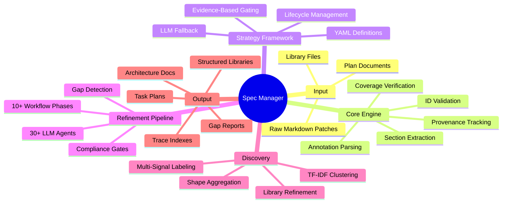

---

## High-Level Architecture

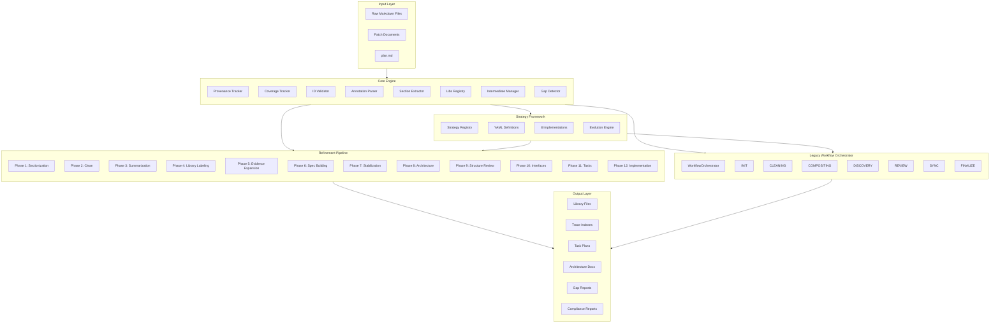

---

## Two Orchestration Paths

The system has **two** orchestration paths that coexist:

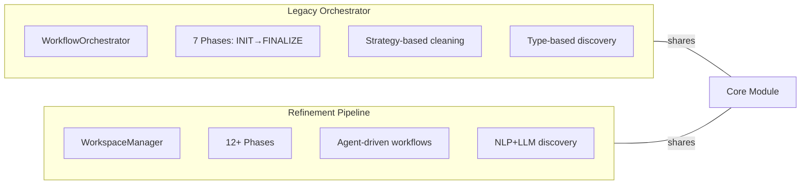

| Aspect | Legacy Orchestrator | Refinement Pipeline |
|--------|-------------------|-------------------|
| Entry | `workflow/orchestrator.py` | `refinement/cli.py` |
| Phases | 7 (INIT→FINALIZE) | 12+ (Sectionize→Implement) |
| Discovery | Type-based assignment | NLP+LLM+TF-IDF clustering |
| Agents | None (internal strategies) | 30+ external LLM agents |
| Compliance | Strategy-based gating | ComplianceScorer with penalties |

---

## Core Module

### Data Flow Through Core

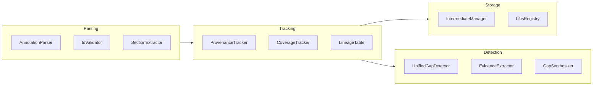

### The ID System

All content is identified by a comprehensive ID scheme:

| ID Format | Category | Example |
|-----------|----------|---------|
| `Algorithm #` | Algorithm | `Algorithm 1` |
| `I#` / `I#.#` | Invariant | `I1`, `I1.2` |
| `G#` / `G#.#` | Goal (legacy) | `G6`, `G1.2` |
| `C#` | Claim | `C1` |
| `D#` | Data Structure | `D10` |
| `S#` | Statement | `S1` |
| `T#` | Topic | `T1` |
| `P#` | Patch | `P1` |
| `P#.#` | Patch Section | `P8.10` |
| `P#I#` | Patch Invariant | `P6I5` |
| `P#C#` | Patch Claim | `P4C3` |
| `Lean#` | Lean Skeleton | `Lean9` |
| `NFG#` | Non-Functional Goal | `NFG1` |
| `Comp#` | Component | `Comp1` |
| `Gap G#.#` | Gap | `Gap G1.2` |
| `LIB-####` | Library | `LIB-0001` |
| `REQ-####` | Global Requirement | `REQ-0001` |
| `REQ-LIB-####-####` | Library Requirement | `REQ-LIB-0001-0042` |

**Refinement Pipeline IDs (additional):**

| ID Format | Category | Example |
|-----------|----------|---------|
| `F####` | File | `F0001` |
| `SEC-F####-####` | Section | `SEC-F0001-0001` |
| `ATOM-F####-L####` | Atom | `ATOM-F0001-L0042` |
| `FLOW-LIB-####-##` | Flow | `FLOW-LIB-0001-01` |
| `INV-LIB-####-####` | Library Invariant | `INV-LIB-0001-0001` |
| `DEC-LIB-####-####` | Decision | `DEC-LIB-0001-0001` |
| `TASK-####` | Task | `TASK-0001` |
| `EDGE-LIB-####-LIB-####` | Interface Edge | `EDGE-LIB-0001-LIB-0002` |
| `GAP-####` | Synthesized Gap | `GAP-0001` |

### Annotation System

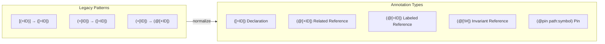

### Provenance Tracking

The provenance system ensures **every line is accounted for** through
transformations. Content is tracked at multiple granularity levels:

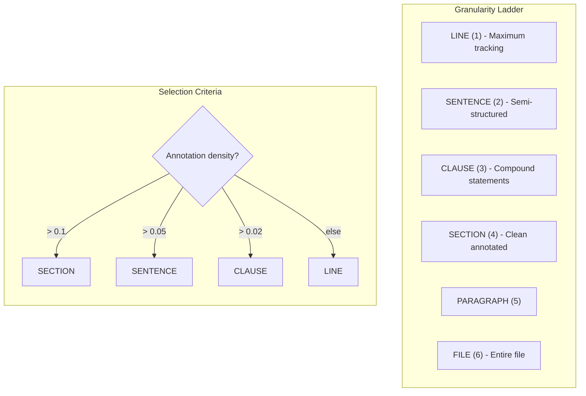

**TrackedUnit** is the core atom of the provenance system:

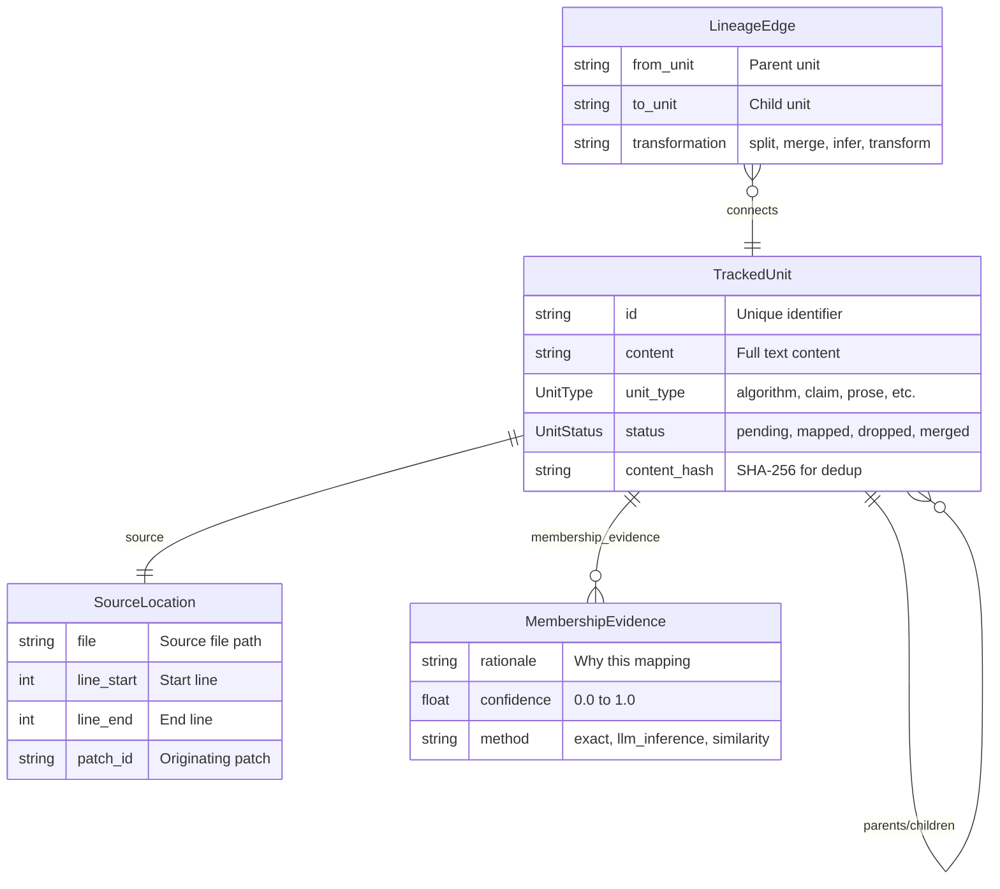

**Unit Types:**

| UnitType | Content |
|----------|---------|
| `ALGORITHM` | Algorithm definitions |
| `CLAIM` | Claims (C#, P#C#) |
| `DATA_STRUCTURE` | Data structures (D#) |
| `INVARIANT` | Invariants (I#, P#I#) |
| `GOAL` | Goals (G# - legacy) |
| `PROOF` | Proof sketches |
| `LEAN` | Lean skeletons |
| `PROSE` | Unstructured text |
| `MATH` | Mathematical content |
| `PSEUDOCODE` | Pseudocode blocks |
| `GAP` | Gap elements |

### Coverage Tracking (Surgical Decomposition)

The `CoverageTracker` ensures 100% byte-level coverage during decomposition:

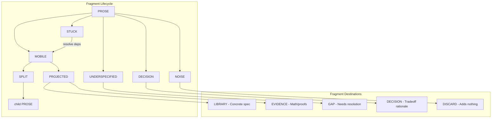

**Invariant:** At any point, the union of all leaf fragment traces must
cover 100% of the original content. No gaps, no losses.

### Gap Detection Engine

The gap detection system has two generations:

```mermaid
flowchart TB
    subgraph V2[v2.0 - Evidence Pipeline]
        direction TB
        ED[EvidenceExtractor]
        ED --> D1[FormatComplianceDetector]
        ED --> D2[DuplicateDetector]
        ED --> D3[UndefinedFunctionDetector]
        ED --> D4[SequenceAnalyzer]
        ED --> D5[ContentVerifier]
        ED --> D6[ProofChainDetector]
        ED --> D7[ProseFragmentInferenceDetector]
        ED --> D8[UncertaintyDetector]
        ED --> D9[StructuralHealthDetector]

        D1 & D2 & D3 & D4 & D5 & D6 & D7 & D8 & D9 --> FINDINGS[DetectorFinding list]
        FINDINGS --> SYNTH[GapSynthesizer]
        SYNTH --> GAPELEM[GapElement list with GAP-#### IDs]
    end

    subgraph LEGACY_GAP[Legacy - Dict API]
        direction TB
        DG["detect_gaps()"]
        DG --> LD1["_detect_undefined_references"]
        DG --> LD2["_detect_underspecified"]
        DG --> LD3["_detect_unknown_dependencies"]
        DG --> LD4["_detect_conflicts"]
        DG --> LD5["_detect_missing_integrations"]
        DG --> LD6["_detect_unsatisfied_invariants"]
        DG --> LD7["_detect_todos"]
        DG --> LD8["_detect_invalid_libraries"]
        DG --> LD9["_detect_vague_invariants"]
        DG --> LD10["_detect_cohesion_issues"]
        DG --> LD11["_detect_pin_gaps"]
        LD1 & LD2 & LD3 & LD4 & LD5 & LD6 & LD7 & LD8 & LD9 & LD10 & LD11 --> DICTGAPS["list[dict] gaps"]
    end
```

**Gap Synthesis Algorithm:**

1. Group findings by `element_id` (non-null IDs form one cluster per element)
2. Orphan findings grouped by `(detector, file)`
3. Each cluster becomes one `GapElement`
4. Severity = max(evidence severities)
5. Affects list capped at 10 entries
6. Sequential `GAP-####` IDs assigned

---

## Strategy Framework

### Strategy Architecture

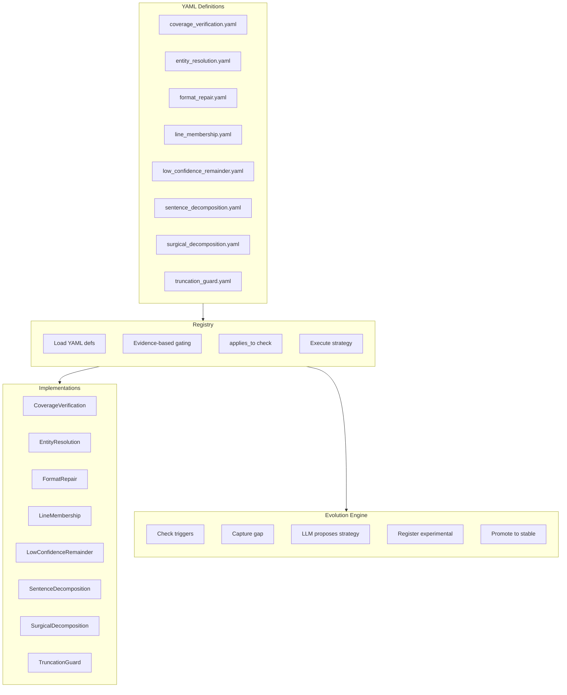

### Strategy Gating (Three Phases)

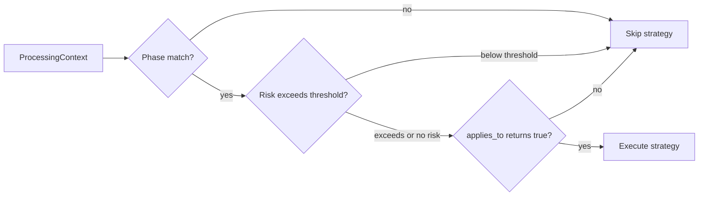

**Risk-to-Evidence Mapping:**

| Risk Category | Evidence Key | Default Threshold |
|---------------|-------------|-------------------|
| `compound_loss` | `prose_ratio` | 0.1 |
| `content_loss` | `remainder_ratio` | 0.01 |
| `information_loss` | `prose_ratio` | 0.1 |
| `vague_references` | `unresolved_references` | 1.0 |
| `low_confidence` | `low_confidence_mappings` | 1.0 |

### Strategy Implementations Detail

```mermaid
flowchart TB
    subgraph SENT_DECOMP[Sentence Decomposition]
        direction TB
        SD1[Detect compound sentences]
        SD2[Protect abbreviations: e.g., i.e.]
        SD3[Split on sentence boundaries]
        SD4[Split 'and' compounds if 2+ words each]
        SD5[Split semicolons]
        SD6[Record parent-child lineage]
    end

    subgraph ENTITY_RES[Entity Resolution]
        direction TB
        ER1[Scan for vague references]
        ER2[3 regex patterns]
        ER3[LLM resolution path]
        ER4[Heuristic fallback]
        ER5[Create derived units with lineage]
    end

    subgraph COVERAGE_VER[Coverage Verification]
        direction TB
        CV1[Convert to line-level atoms]
        CV2[SequenceMatcher diff]
        CV3[Exact matches: confidence 1.0]
        CV4[Fuzzy matches: threshold 0.8]
        CV5[Report coverage ratio]
    end

    subgraph SURGICAL[Surgical Decomposition]
        direction TB
        SU1[Initialize CoverageTracker per file]
        SU2[Find next PROSE leaf fragment]
        SU3[Call spec-manager-surgeon agent]
        SU4[Parse JSON response]
        SU5[Apply operation]
        SU6[Verify 100% coverage]
        SU7{More PROSE leaves?}
        SU7 -->|yes, < 100 iterations| SU2
        SU7 -->|no or limit reached| SU8[Convert fragments to TrackedUnits]
    end
```

### Vague Reference Patterns (Hardcoded)

| Pattern | Regex |
|---------|-------|
| Pronouns | `\b(this\|that\|it\|these\|those)\b` |
| Generic nouns | `\bthe\s+(algorithm\|claim\|invariant\|proof)\b` |
| Modification phrases | `\b(patch\|update\|modify)\s+(this\|that\|it\|...)` |

### Entity Resolution Four-Tier Indexing

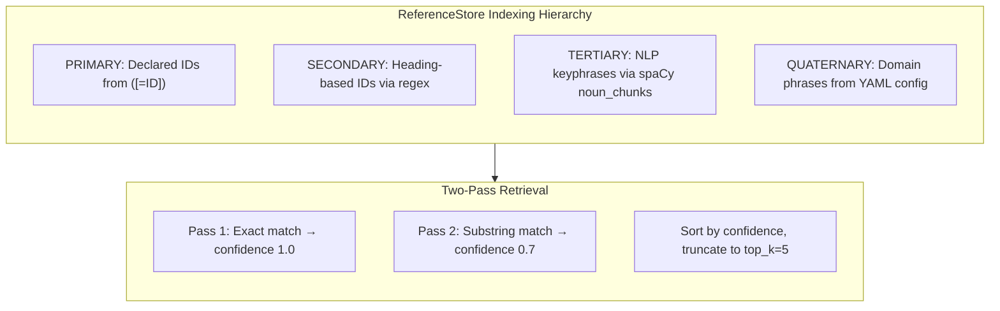

---

## Refinement Pipeline (Modern)

### Complete Phase Sequence

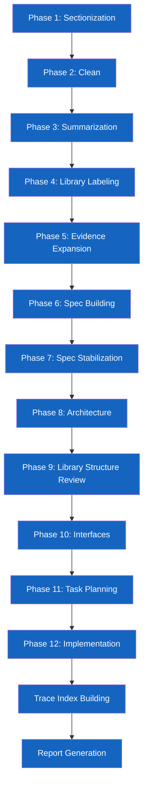

### Phase 1: Sectionization

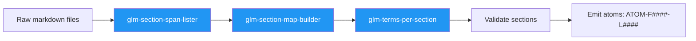

**Section ID format:** `SEC-{file_id}-{ordinal:04d}` (1-based, inclusive line ranges)

**Atom ID format:** `ATOM-{file_id}-L{line:04d}`

### Phase 3: Summarization

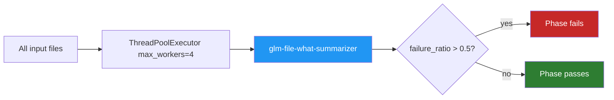

### Phase 4: Library Labeling

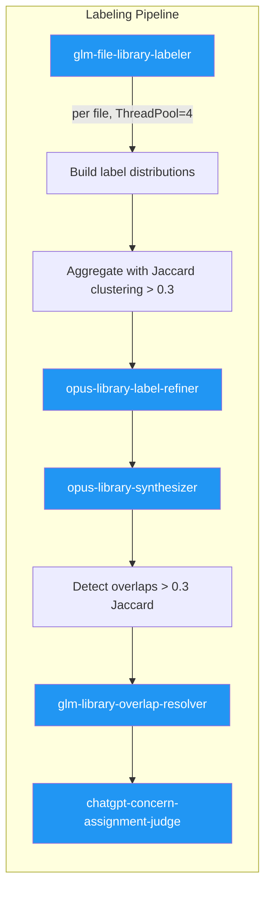

**Library ID assignment:** Libraries get `LIB-####` IDs, elements get
`{concern_type}-LIB-####-{seq}` IDs.

### Phase 5: Evidence Expansion


**Priority thresholds:** >= 0.7 high priority, < 0.3 drop, < 0.4 skip.
Confidence floor: 0.5.

### Phase 6: Spec Building

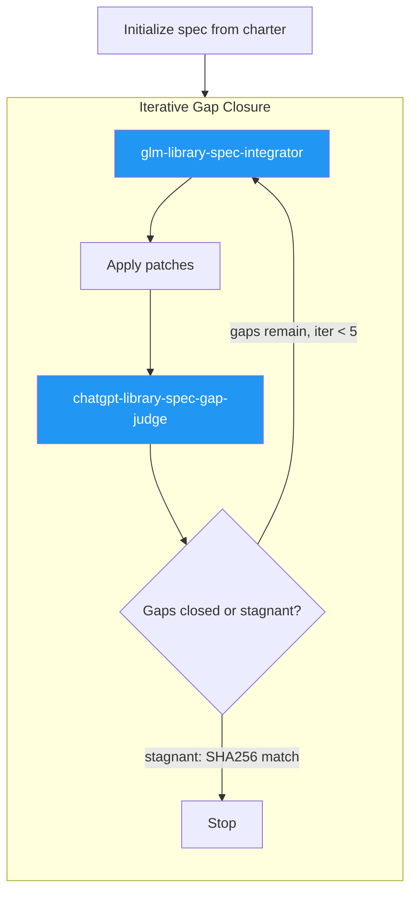

**Stagnation detection:** SHA-256 hash comparison of gap list. If gaps
haven't changed between iterations, stop.

**Max iterations:** 5 (configurable via `MAX_ITERATIONS_DEFAULT`)

### Phase 7: Spec Stabilization

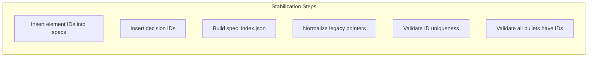

**Element ID formats and limits:**

| Prefix | Format | Counter Limit |
|--------|--------|---------------|
| `REQ` | `REQ-LIB-####-####` | 9999 |
| `FLOW` | `FLOW-LIB-####-##` | 99 |
| `INV` | `INV-LIB-####-####` | 9999 |
| `DEC` | `DEC-LIB-####-####` | 9999 |

### Phase 8: Architecture

```mermaid
flowchart LR
    BRIEF["glm-architecture-brief-extractor"]:::agent --> PROPOSE["opus-architecture-proposer"]:::agent
    PROPOSE -->|"3-5 candidates"| JUDGE["chatgpt-architecture-tradeoff-judge"]:::agent
    JUDGE -->|"selected arch"| MAP_LIB["glm-architecture-library-mapper"]:::agent

    classDef agent fill:#2196f3,color:#fff
```

**Parallelism:** `ThreadPoolExecutor(max_workers=10)`

### Phase 9: Library Structure Review

```mermaid
flowchart TB
    subgraph DETECT_ISSUES[Issue Detection]
        direction TB
        TFIDF[Build TF-IDF vectors per library]
        TFIDF --> COSINE[Pairwise cosine similarity]
        COSINE --> OVERLAP{similarity > 0.35 AND shared >= 5?}
        OVERLAP -->|yes| OC[Overlap candidate]

        CLUSTER[KMeans clustering k=2..5]
        CLUSTER --> SIL{silhouette > 0.3 AND elements >= 10?}
        SIL -->|yes| SC[Split candidate]
    end

    subgraph AGENT_REVIEW[Agent-Driven Review]
        direction TB
        OC --> BJ["chatgpt-library-boundary-judge"]:::agent
        SC --> SP["opus-library-split-planner"]:::agent
        BJ --> ACTIONS[ReviewActionsReport]
        SP --> ACTIONS
    end

    subgraph EXECUTE[Action Execution]
        direction TB
        ACTIONS --> MOVES[Apply move actions]
        ACTIONS --> SPLITS[Apply split actions]
        MOVES --> VALIDATE[Validate artifacts]
        SPLITS --> VALIDATE
    end

    classDef agent fill:#2196f3,color:#fff
```

**TF-IDF configuration:** `max_features=1000`, `stop_words="english"`,
`ngram_range=(1, 2)`, `min_df=1`

**KMeans:** `random_state=42`, `n_init=10`, k range 2..5

### Phase 11: Task Planning

```mermaid
flowchart TB
    CTX[Build planning context] --> DRAFT["opus-task-planner"]:::agent
    DRAFT --> VALIDATE["chatgpt-task-plan-judge"]:::agent
    VALIDATE --> CHECK{Valid?}
    CHECK -->|no, attempts < 3| DRAFT
    CHECK -->|yes| ASSIGN[Assign TASK-#### IDs]
    ASSIGN --> DEPS[Resolve dependencies]
    DEPS --> DAG[Build patch graph DAG]
    DAG --> CYCLE{Cycles?}
    CYCLE -->|yes| FIX[Remove cycles]
    CYCLE -->|no| WRITE[Write task artifacts]

    classDef agent fill:#2196f3,color:#fff
```

**Task ID allocation:** Deterministic, sorted by `(component, libraries, title)`

**Cycle detection:** Kahn's algorithm (topological sort)

### Trace Indexes

```mermaid
flowchart LR
    subgraph CHAIN[Full Traceability Chain]
        direction LR
        ATOM["ATOM-F####-L####"] -->|"atom_to_section"| SEC2["SEC-F####-####"]
        SEC2 -->|"section_to_spec_elements"| ELEM["REQ/FLOW/INV-LIB-####-####"]
        ELEM -->|"spec_element_to_tasks"| TASK2["TASK-####"]
        TASK2 -->|"task_to_patches"| PATCH2["patch file + SHA"]
    end
```

---

## Agent Catalog

### Complete Agent Registry

```mermaid
flowchart TB
    subgraph PHASE1[Phase 1: Sectionization]
        A1["glm-section-span-lister"]:::glm
        A2["glm-section-map-builder"]:::glm
        A3["glm-terms-per-section"]:::glm
    end

    subgraph PHASE3[Phase 3: Summarization]
        A4["glm-file-what-summarizer"]:::glm
    end

    subgraph PHASE4[Phase 4: Labeling]
        A5["glm-file-library-labeler"]:::glm
        A6["opus-library-label-refiner"]:::opus
        A7["opus-library-synthesizer"]:::opus
        A8["glm-library-overlap-resolver"]:::glm
        A9["chatgpt-concern-assignment-judge"]:::chatgpt
    end

    subgraph PHASE5[Phase 5: Evidence]
        A10["glm-library-evidence-mapper"]:::glm
        A11["glm-library-relevance-classifier"]:::glm
        A12["chatgpt-evidence-gap-judge"]:::chatgpt
    end

    subgraph PHASE6[Phase 6: Spec Building]
        A13["glm-library-spec-integrator"]:::glm
        A14["chatgpt-library-spec-gap-judge"]:::chatgpt
    end

    subgraph PHASE8[Phase 8: Architecture]
        A15["opus-architecture-proposer"]:::opus
        A16["chatgpt-architecture-tradeoff-judge"]:::chatgpt
        A17["glm-architecture-brief-extractor"]:::glm
        A18["glm-architecture-library-mapper"]:::glm
    end

    subgraph PHASE9[Phase 9: Structure Review]
        A19["chatgpt-library-boundary-judge"]:::chatgpt
        A20["opus-library-split-planner"]:::opus
    end

    subgraph PHASE10[Phase 10: Interfaces]
        A21["glm-interface-edge-extractor"]:::glm
        A22["opus-interface-contract-writer"]:::opus
    end

    subgraph PHASE11[Phase 11: Tasks]
        A23["opus-task-planner"]:::opus
        A24["chatgpt-task-plan-judge"]:::chatgpt
    end

    subgraph PHASE12[Phase 12: Implementation]
        A25["glm-task-implementer"]:::glm
        A26["chatgpt-patch-repairer"]:::chatgpt
        A27["chatgpt-patch-audit-judge"]:::chatgpt
    end

    subgraph REPAIR[Repair / QA]
        A28["chatgpt-qa-judge"]:::chatgpt
        A29["gpt-5.2-low fallback repair"]:::chatgpt
    end

    classDef glm fill:#4caf50,color:#fff
    classDef opus fill:#9c27b0,color:#fff
    classDef chatgpt fill:#ff9800,color:#fff
```

### Agent Model Distribution

| Model Family | Count | Used For |
|-------------|-------|----------|
| `glm` (Gemini) | 10 | Fast structured extraction, mapping, classification |
| `opus` (Claude) | 5 | Complex planning, synthesis, architecture proposals |
| `chatgpt` (GPT-5.2) | 9 | Judging, evaluation, repair, gap assessment |
| `spaCy en_core_web_sm` | 3 locations | NLP fallback for sentence/clause splitting |

### Agent Execution Pattern

```mermaid
flowchart LR
    CALL[run_agent call] --> BUILD[Build prompt]
    BUILD --> EXEC["uv run agents <agent_name>"]
    EXEC --> PARSE[Parse response]
    PARSE --> VALID{Valid?}
    VALID -->|yes| RESULT[Return parsed output]
    VALID -->|no| RETRY{retries < 2?}
    RETRY -->|yes| REPAIR_A["Repair via repair agent"]
    RETRY -->|no| FAIL[Raise error]
    REPAIR_A --> EXEC
```

**Retry config:** Max 2 retries, backoff `2^attempt` seconds

---

## Compliance System

### Compliance Scoring

```mermaid
flowchart TB
    subgraph METRICS[Three Compliance Metrics]
        direction LR
        FC[Format Compliance]
        AC[Annotation Coverage]
        ID_N[ID Normalization]
    end

    subgraph SCORING[Score Calculation]
        direction TB
        AVG["score = avg(FC, AC, ID_N)"]
        PEN["penalty = (blockers * 0.10) + (warnings * 0.02)"]
        FINAL["final = score - penalty"]
    end

    METRICS --> SCORING

    subgraph GATE[Compliance Gate]
        direction TB
        CHECK{final >= threshold?}
        CHECK -->|">= 0.90"| PASS[Proceed to next phase]:::success
        CHECK -->|"< 0.90"| BLOCK[Generate run-level gaps report]:::error
    end

    SCORING --> GATE

    classDef success fill:#2e7d32,color:#fff
    classDef error fill:#c62828,color:#fff
```

**Gate thresholds:**

| Parameter | Value |
|-----------|-------|
| `compliance_threshold` | 0.90 |
| `blocker_threshold` | 0.0 |
| `warning_threshold` | 0.05 |
| `max_remainder_ratio` | 0.05 |
| Error penalty | -10% per error |
| Warning penalty | -2% per warning |

### Canonical vs Legacy ID Classification

| Canonical (counted) | Legacy/Non-Canonical |
|--------------------|---------------------|
| `Algorithm #` | `G#` (Goal - prefer I#) |
| `D#` | `P#I#` (Patch Invariant) |
| `I#`, `I#.#` | `P#C#` (Patch Claim) |
| `C#` | |
| `Comp#` | |
| `Lean#` | |
| `S#`, `T#`, `NFG#` | |

---

## Workspace Structure

```mermaid
flowchart TB
    subgraph WORKSPACE[.workspace/]
        direction TB
        WR[reports/]
        WC[cleaning/]
        WD[discovery/]
        WRE[review/]
        WF[finalization/]
        WI[intermediates/]
        WX[indexes/]
        WS[strategies/]
    end

    subgraph RUNS[runs/<run_id>/]
        direction TB
        MAN[manifest/]
        SS[spec_snapshot/]
        LIB2[libraries/]
        REP[reports/]
        AUD[audits/]
        TASK3[tasks/]
    end

    subgraph MANIFEST[manifest/]
        direction LR
        FM[files.json]
        SM[sections/]
        AM[atoms/]
        TM[terms/]
    end

    RUNS --> MANIFEST
```

**Run ID format:** `{slug}-{timestamp}`

**Pass directory format:** `pass_{num:02d}`

**Intermediate state format:** `state_{version:04d}_{phase}.json`

---

## Testing Framework

### Test Architecture

```mermaid
flowchart TB
    subgraph UNIT[Unit Tests - scripts/tests/unit/]
        direction TB
        U1[spec_manager/core/]
        U2[spec_manager/decomposition/]
        U3[spec_manager/workspace/]
        U4[spec_refinement/]
        U5[spec_refinement/core/]
        U6[spec_refinement/workspace/]
    end

    subgraph COMPONENT[Component Tests - scripts/tests/component/]
        direction TB
        C1[test_spec_building.py]
    end

    subgraph INTEGRATION[Integration Tests - tests/spec_refinement/]
        direction TB
        I1[Schema validation tests]
        I2[Workflow tests]
        I3[Smoke tests]
        I4[Performance tests]
    end

    subgraph QA[QA Framework - refinement/qa/]
        direction TB
        Q1[7 registered QA cases]
        Q2[Agent execution + judge]
        Q3[Bad signature scanning]
        Q4[Contract lint]
    end
```

### QA Cases

| Case ID | Agent | Phase |
|---------|-------|-------|
| `phase0_determinism` | none | 0 (no LLM) |
| `phase0_mode_detection` | none | 0 (no LLM) |
| `phase3_evidence_mapper_allowlist` | `glm-library-evidence-mapper` | 3 |
| `phase4_spec_integrator_unsupported_assertion` | `glm-library-spec-integrator` | 4 |
| `phase6_arch_proposal` | `opus-architecture-proposer` | 6 |
| `phase6_arch_selection` | `chatgpt-architecture-tradeoff-judge` | 6 |
| `phase6_arch_library_mapping` | `glm-architecture-library-mapper` | 6 |

### QA Execution Flow

```mermaid
flowchart LR
    PREP[Prepare case] --> EXEC["uv run agents <agent>"]
    EXEC --> SCAN[Scan for bad signatures]
    SCAN --> TRUNC[Truncate output: 9000 head + 2000 tail]
    TRUNC --> JUDGE["chatgpt-qa-judge"]:::agent
    JUDGE --> SCORE[Score 0-100]
    SCORE --> BOARD[Append to scoreboard JSONL]

    classDef agent fill:#2196f3,color:#fff
```

### 5 Known Bad Signature Patterns

| Pattern | Catches |
|---------|---------|
| `derived_pointer` | charter/libraries/runs citations |
| `arch_file_pointer` | `[F####::]` or `spec_snapshot` in arch outputs |
| `legacy_pointer_format` | `[F####::LABEL]` format |
| `runner_file_pointer` | "see \`...\` for details" |
| `evidence_mapper_heading_sections` | Components/Workflows/Algorithms as sections |

### Contract Lint

Validates agent prompt files for correctness:

```mermaid
flowchart TB
    subgraph CHECKS[Lint Checks]
        direction TB
        CK1[Legacy file_001/lib_001 patterns → ERROR]
        CK2[Missing format examples → ERROR]
        CK3[Legacy pointer-only → WARNING]
        CK4[Agent reference without .md file → ERROR]
        CK5[JSON-only + prose requirement conflict → WARNING]
        CK6[Missing derived pointer prohibition → WARNING]
    end
```

### Repair Bakeoff (Model Evaluation)

| Model | Provider | Cost (in/out per 1k) |
|-------|----------|---------------------|
| `gpt-5.2-none` | OpenAI | $0.00175 / $0.014 |
| `gpt-5.2-low` | OpenAI | $0.00175 / $0.014 |
| `claude-haiku` | Anthropic | $0.001 / $0.005 |
| `gemini-3-flash` | Gemini | $0.0005 / $0.003 |

---

## Complete Hardcoded Values Registry

### Confidence Thresholds

| Context | Value | Location |
|---------|-------|----------|
| Coverage verification (default) | 0.95 | `coverage_verification.py` |
| Coverage fuzzy match | 0.80 | `coverage_verification.py` |
| Entity resolution acceptance | 0.70 | `entity_resolution.py` |
| Low-confidence remainder routing | 0.70 | `low_confidence_remainder.py` |
| Ambiguity detection (top-2 gap) | 0.10 | `low_confidence_remainder.py` |
| Heuristic typed match | 0.60 | `entity_resolution.py` |
| Heuristic untyped match | 0.55 | `entity_resolution.py` |
| Prose fragment promotion | 0.70 | `llm_inference.py` |
| Rediscovery match | 0.30 | `entity_index.py` |
| Multi-label minimum | 0.10 | `labeling.py` |
| Shape weak/medium boundary | 0.40 | `labeling.py` |
| Shape strong boundary | 0.70 | `labeling.py` |
| Merge threshold (Jaccard) | 0.60 | `aggregation.py` |
| Overlap significance | 0.10 | `aggregation.py` |
| Well-defined convergence | 0.70 | `aggregation.py` |
| Problematic convergence | 0.30 | `aggregation.py` |
| Drift fuzzy match | 0.85 | `orchestrator.py` |
| Content mismatch | 0.80 | `verification/operations.py` |
| Evidence priority high | 0.70 | `evidence_expansion.py` |
| Evidence priority drop | 0.30 | `evidence_expansion.py` |
| Evidence confidence floor | 0.50 | `evidence_expansion.py` |
| Overlap cosine similarity | 0.35 | `library_structure_review.py` |
| Element match similarity | 0.70 | `library_structure_review.py` |
| Split silhouette minimum | 0.30 | `library_structure_review.py` |
| Compliance pass (QA rate) | 0.80 | `reports.py` |

### Iteration & Size Limits

| Parameter | Value | Location |
|-----------|-------|----------|
| Max cleaning passes | 5 / 10 | `config.py` / `pipeline.py` |
| Max discovery iterations | 10 | `config.py` / `refinement.py` |
| Max spec build iterations | 5 | `spec_building.py` |
| Max surgical iterations | 100 | `surgical.py` |
| Subprocess timeout | 60 seconds | `surgical.py` |
| Max unit content length | 50,000 chars | `config.py` |
| Truncation guard default | 50,000 chars | `truncation_guard.py` |
| Max relevant lines/section | 12 | `spec_building.py` |
| Gap stagnation threshold | 3 | `gap_queue.py` |
| Task plan repair attempts | 3 | `tasks.py` |
| Archive retention count | 10 | `execution.py` |
| Archive retention days | 30 | `execution.py` |
| Batch size (planning) | 10 | `planning/operations.py` |

### Thread Pool Sizes

| Workflow | Workers | Location |
|----------|---------|----------|
| Sectionization | 4 | `phase_01_sectionization.py` |
| Summarization | 4 | `summarization.py` |
| Library labeling | 4 | `library_labeling.py` |
| Evidence expansion | 4 | `evidence_expansion.py` |
| Architecture | 10 | `architecture.py` |
| Interfaces | 10 | `interfaces.py` |

### NLP Configuration

| Parameter | Value | Location |
|-----------|-------|----------|
| spaCy model | `en_core_web_sm` | Multiple (3 locations) |
| NLP content limit | 5,000 chars | `entity_resolution.py` |
| Keyphrase filter | 2+ words, < 40 chars | `entity_resolution.py` |
| TF-IDF max_features | 1,000 | `library_structure_review.py` |
| TF-IDF ngram_range | (1, 2) | `library_structure_review.py` |
| KMeans random_state | 42 | `library_structure_review.py` |
| KMeans n_init | 10 | `library_structure_review.py` |
| KMeans k range | 2..5 | `library_structure_review.py` |

### Heuristic Pattern Confidences

| Pattern | Base Confidence | Location |
|---------|----------------|----------|
| `must/shall` | 0.80 | `llm_inference.py`, `gaps.py` |
| `should` | 0.60 | `llm_inference.py`, `gaps.py` |
| `always/never` | 0.70 | `llm_inference.py` |
| `requires` | 0.70 | `llm_inference.py` |
| `ensure/guarantee/maintain` | 0.75 | `gaps.py` |
| `converges/stable/bounded` | 0.70 | `gaps.py` |
| `correct/sound/complete` | 0.65 | `gaps.py` |
| `invariant/preserved/maintained` | 0.75 | `gaps.py` |
| `theorem/lemma/proposition` | 0.85 | `gaps.py` |

### Content & Token Limits

| Limit | Value | Location |
|-------|-------|----------|
| Context bundle requirements | 10K chars | `implementation.py` |
| Context bundle specs | 20K chars | `implementation.py` |
| Context bundle code | 20K chars | `implementation.py` |
| Context bundle total | 50K chars | `implementation.py` |
| Per-file read limit | 5,000 chars | `implementation.py` |
| Interface contract truncation | 2,000 chars | `implementation.py` |
| QA judge truncation | 12,000 chars (9K head + 2K tail) | `runner.py` |
| Token estimation formula | `max(1, (len(text)+3)//4)` | `implementation.py` |

### Gap Detection Thresholds

| Threshold | Value | Location |
|-----------|-------|----------|
| Coupling alert (cross-refs) | > 10 | `StructuralHealthDetector` |
| Low cohesion ratio | < 0.30 | `StructuralHealthDetector` |
| Cross-cutting keywords | >= 2 | `StructuralHealthDetector` |
| Stub content length | < 50 chars | `StructuralHealthDetector` |
| Goal range | G1-G50 | `FormatComplianceDetector` |
| Similarity error | < 0.50 | `ContentVerifier` |
| Similarity warning | < 0.80 | `ContentVerifier` |
| Similarity info | < 0.95 | `ContentVerifier` |
| Sequence hole minimum items | > 3 | `SequenceAnalyzer` |
| Gap affects list cap | 10 | `GapSynthesizer` |
| Builtin functions | 34 names | `UndefinedFunctionDetector` |
| Category prefixes | 9 prefixes | `UndefinedFunctionDetector` |
| Banned library names | 8 names | `_detect_invalid_libraries` |

---

## Legacy Code & Backwards Compatibility Issues

### Identified Legacy Patterns

```mermaid
flowchart TB
    subgraph ACTIVE_LEGACY[Active Legacy Code]
        direction TB
        L1["gaps.py: Lines 2099-2894 — Complete parallel dict-based gap API"]:::warn
        L2["libs_registry.py: from_content() returns empty registry"]:::warn
        L3["libs_registry.py: Docstring says 'backwards-compatible API'"]:::warn
        L4["annotations.py: LEGACY_PATTERNS list + normalize_legacy()"]:::info
        L5["discovery/refinement.py: discover_libraries_keyword_only() — deprecated with warning"]:::warn
        L6["compliance/metrics.py: G#, P#I#, P#C# classified as non-canonical"]:::info
        L7["workspace/state.py: Pre-v2.0 state migration code"]:::info
        L8["compliance/scorer.py: _resolve_artifacts() dual path check"]:::info
    end

    subgraph MODULE_NAMING[Legacy Module Names]
        direction TB
        M1["planning/operations.py → maps to DISCOVERY phase"]:::info
        M2["merging/operations.py → maps to REVIEW phase"]:::info
        M3["verification/operations.py → maps to FINALIZATION phase"]:::info
    end

    subgraph DATA_COMPAT[Data Format Compatibility]
        direction TB
        D1["finalize.py + graph.py: _relation_edges() handles 3 relation formats"]:::info
        D2["edge_list.py: contracts_ready=None default for backwards compat"]:::info
        D3["spec_stabilization.py: Legacy pointer migration [F####::SECTION] → canonical"]:::info
    end

    classDef warn fill:#e65100,color:#fff
    classDef info fill:#616161,color:#fff
```

### Legacy Code Details

| Location | What | Severity | Action Needed |
|----------|------|----------|---------------|
| `gaps.py:2099-2894` | Complete parallel `dict`-based gap API alongside v2.0 `GapElement` API | High | Remove legacy functions, migrate callers to `UnifiedGapDetector` |
| `gaps.py: format_gaps_md()` (module-level) | Duplicate of `UnifiedGapDetector.format_gaps_md()` | High | Remove module-level version |
| `gaps.py: FormatComplianceDetector.LEGACY_PATTERNS` | Detects old ID naming conventions | Low | Keep (used for migration detection) |
| `libs_registry.py: from_content()` | Returns empty registry "for backwards compatibility" | Medium | Remove if no callers |
| `libs_registry.py: docstring` | Says "backwards-compatible API for existing code" | Low | Clean up docstring |
| `discovery/refinement.py: discover_libraries_keyword_only()` | Deprecated with `warnings.warn(DeprecationWarning)` | Medium | Remove function and callers |
| `planning/operations.py` | Module docstring says "Legacy module name 'planning' maps to DISCOVERY" | Medium | Rename module or remove |
| `merging/operations.py` | Module docstring says "Legacy module name 'merging' maps to REVIEW" | Medium | Rename module or remove |
| `verification/operations.py` | Module docstring says "Legacy module name 'verification' maps to FINALIZATION" | Medium | Rename module or remove |
| `workspace/state.py` | Pre-v2.0 state migration logic | Low | Keep until all workspaces migrated |
| `compliance/scorer.py: _resolve_artifacts()` | Dual-path check for per-file and legacy single-file formats | Low | Remove legacy path when safe |
| `finalize.py + graph.py` | `_relation_edges()` handles 3 relation shape formats | Low | Normalize to single format |
| `edge_list.py` | `contracts_ready=None` default | Low | Clean up |
| `spec_stabilization.py` | `_count_legacy_pointers()` and pointer migration | Low | Keep (one-way migration) |
| `gaps.py: _detect_unsatisfied_invariants()` | Tracks `is_legacy_goal`, suggests G# → I# migration | Low | Keep (migration helper) |

### Duplicate/Parallel Systems

The most significant legacy issue is the **two complete gap detection
systems** in `gaps.py`:

```mermaid
flowchart LR
    subgraph CALLERS[Callers]
        C1[Legacy callers]
        C2[Modern callers]
    end

    subgraph V1[Legacy API - 796 lines]
        direction TB
        DG["detect_gaps() → list[dict]"]
        FG["format_gaps_md(list[dict]) → str"]
    end

    subgraph V2[Modern API - 1303 lines]
        direction TB
        UGD["UnifiedGapDetector"]
        EE["EvidenceExtractor → DetectorFinding"]
        GS["GapSynthesizer → GapElement"]
        FG2["format_gaps_md(list[GapElement]) → str"]
    end

    C1 --> V1
    C2 --> V2
```

Both APIs coexist and produce different output formats. The legacy API
should be removed and all callers migrated to `UnifiedGapDetector`.

---

## Schemas Module (Pydantic Models)

### Schema Overview

```mermaid
flowchart TB
    subgraph MANIFEST[Manifest Schemas]
        direction LR
        FS[FilesManifest]
        FSEC[FileSections]
        FA[LineAtom]
        FT[FileTerms]
    end

    subgraph LIBRARY[Library Schemas]
        direction LR
        LL[LibraryLabelsOutput]
        EP[EvidenceMapperOutput]
        SP2[SpecPatchesOutput]
        SI[SpecIndexSchema]
    end

    subgraph ARCH_S[Architecture Schemas]
        direction LR
        AB[ArchitectureBriefOutput]
        AS2[ArchitectureSelectionOutput]
        AM[ArchitectureMappingOutput]
    end

    subgraph INTERFACE_S[Interface Schemas]
        direction LR
        EL[EdgeListOutput]
        IC[InterfaceContractOutput]
    end

    subgraph TASK_S[Task Schemas]
        direction LR
        TS[TaskPlanOutput]
        TSS[TaskStatusSchema]
    end

    subgraph REVIEW_S[Review Schemas]
        direction LR
        RA[ReviewActionsReport]
        GJ[GapJudgeOutput]
        QJ[QaJudgeOutput]
    end
```

All schemas use Pydantic for validation with strict field constraints
and are used as output contracts for LLM agents.

---

## Decomposition Module

### Decomposition Pipeline

```mermaid
flowchart TB
    INIT2[init_workspace] --> STAGE[Stage files]
    STAGE --> TAG[Tag facts: F-###]
    TAG --> EXTRACT[Extract entities: E-###]
    EXTRACT --> RELATE[Extract relations: R-###]
    RELATE --> DISC2[Discover new entities]
    DISC2 --> RECOMP[Recompose: spec.json + facts.md + entities.md]
    RECOMP --> FINALIZE2[Finalize output]
```

**ID formats:**

| Type | Format | Example |
|------|--------|---------|
| Entity | `E-###` | `E-001` |
| Relation | `R-###` | `R-005` |
| Context | `C-###` | `C-003` |
| Composition | `X-###` | `X-001` |
| Orphan | `O-###` | `O-002` |
| Snippet | `S-###` | `S-010` |
| Fact | `F-###` | `F-042` |

### Entity Index Rediscovery

```mermaid
flowchart LR
    SEARCH[Search terms] --> MATCH[Match against existing entities]
    MATCH --> SCORE["confidence = (exact + 0.5 * partial) / max(search, existing)"]
    SCORE --> CHECK{confidence > 0.3?}
    CHECK -->|yes| EXISTING[Link to existing entity]
    CHECK -->|no| NEW[Create new entity]
```

---

## Discovery Module

### Multi-Signal Library Discovery

```mermaid
flowchart TB
    subgraph SIGNALS[5 Discovery Signals]
        direction TB
        SIG1["Reference Graph (weight: 0.4)"]
        SIG2["Unit Type Clustering (weight: 0.3)"]
        SIG3["Relation Annotations (weight: 0.15)"]
        SIG4["Content Clustering via TF-IDF (weight: 0.1)"]
        SIG5["LLM Summaries (weight: 0.05)"]
    end

    subgraph PIPELINE[Discovery Pipeline]
        direction TB
        BFS[BFS connected components from refs]
        BFS --> TFIDF2[TF-IDF discriminating words]
        TFIDF2 --> MERGE[Merge candidates by weighted signals]
        MERGE --> LABEL[Multi-label confidence scoring]
    end

    SIGNALS --> PIPELINE
```

### Multi-Label Confidence Scoring

| Signal | Weight |
|--------|--------|
| Keyword matches (normalized /10) | 40% |
| References to exemplars (normalized /3) | 30% |
| Is exemplar | 20% |
| Name similarity | 10% |

### Shape Analysis

| Category | Confidence Range |
|----------|-----------------|
| Strong matches | > 0.7 |
| Medium matches | 0.4 - 0.7 |
| Weak matches | 0.2 - 0.4 |

**Split heuristic:** medium > 2x strong AND convergence < 0.5

**Merge heuristic:** Jaccard overlap > 0.6, merge smaller into larger

---

## Legacy Workflow Orchestrator (Detailed)

### Phase Sequence

```mermaid
flowchart LR
    INIT3[INIT] --> CLEAN2[CLEANING]
    CLEAN2 --> COMP2[COMPOSITING]
    COMP2 --> DISC3[DISCOVERY]
    DISC3 --> REV2[REVIEW]
    REV2 --> SYNC2[SYNC]
    SYNC2 --> FIN2[FINALIZE]
    FIN2 --> DONE[COMPLETE]
```

### INIT Phase

```mermaid
flowchart TB
    LOAD_PATCHES[Load patches: patches/*.md or p*.md]
    LOAD_PATCHES --> INDEX_PLAN[Index plan.md + libraries/ as strata]
    INDEX_PLAN --> BUILD_CTX[Build ContextIndex from manifests]
```

### CLEANING Phase (Iterative)

```mermaid
flowchart TB
    START2[Start pass] --> APPLY2[Apply cleaning strategies]
    APPLY2 --> VALIDATE2[Validate compliance]
    VALIDATE2 --> CHECK2{Compliance >= 0.90?}
    CHECK2 -->|yes| SNAPSHOT[Save snapshot]
    CHECK2 -->|no| FIX[Fix issues]
    FIX --> PASS_CHECK{pass < max_cleaning_passes?}
    PASS_CHECK -->|yes| APPLY2
    PASS_CHECK -->|no| BLOCKED[Generate run-level gaps report]:::error

    classDef error fill:#c62828,color:#fff
```

### COMPOSITING Phase

```mermaid
flowchart TB
    UNITS[All tracked units] --> GROUP[Group by declaration ID]
    GROUP --> DENSITY{Annotation density?}
    DENSITY -->|"> 0.1"| SEC_GRAN[SECTION granularity]
    DENSITY -->|"> 0.05"| SENT_GRAN[SENTENCE granularity]
    DENSITY -->|"> 0.02"| CL_GRAN[CLAUSE granularity]
    DENSITY -->|else| LINE_GRAN[LINE granularity]

    SEC_GRAN & SENT_GRAN & CL_GRAN & LINE_GRAN --> ATOMS2[Convert to atoms]
    ATOMS2 --> DIFF[SequenceMatcher diff hunks]
    DIFF --> MERGE2[Merge with lineage tracking]
    MERGE2 --> REMAINDER[Partition remainders]
```

### REVIEW Phase

```mermaid
flowchart TB
    PROOF_CHECK[Check proof chains]
    PROOF_CHECK --> NON_AUTH{Missing claims?}
    NON_AUTH -->|yes| QUARANTINE[Mark NON_AUTHORITATIVE]
    NON_AUTH -->|no| KEEP[Keep as ACTIVE]

    EARLY_CHECK[Check early provenance]
    EARLY_CHECK -->|"first 1/3 of patch range"| EARLY_FLAG[Flag as early]

    OVERLAP_CHECK[Check library overlaps]
    OVERLAP_CHECK --> ACTIONS2[Generate SPLIT/DROP/LEGACY actions]
```

### SYNC Phase

```mermaid
flowchart LR
    LIBS2[Libraries are authoritative] --> REGEN[Regenerate plan.md from libraries]
    REGEN --> DRIFT{Fuzzy match > 0.85?}
    DRIFT -->|yes| OK[No drift]
    DRIFT -->|no| REPORT_DRIFT[Report drift]:::warn

    classDef warn fill:#e65100,color:#fff
```

### FINALIZE Phase

```mermaid
flowchart TB
    GAP_DET[Run gap detection on projection]
    GAP_DET --> STRIP[Strip provenance stamps]
    STRIP --> QUARANTINE2[Quarantine non-authoritative units]
    QUARANTINE2 --> WRITE_LIBS[Write libraries with relations]
    WRITE_LIBS --> CROSS_LINKS[Generate cross-links index]
```

---

## Repair System

### Repair Flow

```mermaid
flowchart TB
    INPUT3[LLM output with errors] --> DETECT2[Detect artifact type by keywords]
    DETECT2 --> REPAIR2[Build repair prompt with errors + allowlists]
    REPAIR2 --> AGENT2[Call repair agent]
    AGENT2 --> VALIDATE3{Valid now?}
    VALIDATE3 -->|yes| RETURN[Return repaired output]
    VALIDATE3 -->|no| FALLBACK[Return original with issues]
```

**Artifact Type Detection (keyword-based):**

| Keywords | ArtifactType |
|----------|-------------|
| `candidate_labels` + `uncertain_labels` | LIBRARY_LABELS |
| `patches` + `file_id` + `lib_id` | SPEC_PATCHES |
| `selected_arch_id` + `rejected_architectures` | ARCHITECTURE_SELECTION |
| `components` + `tradeoffs` | ARCHITECTURE_MAPPING |
| `evidence` + `file_id` | EVIDENCE_JSON |
| `responsibilities` + `boundaries` | CHARTER |
| (default) | SPEC |

**Fallback repair model:** `gpt-5.2-low`

---

## Proof Chain Validation

```mermaid
flowchart LR
    ALG2[Algorithm] --> CLAIM2[Claim reference?]
    CLAIM2 -->|yes| PROOF2[Proof sketch exists?]
    CLAIM2 -->|no| PROSE_INF["LLM: infer claims from prose"]:::llm
    PROOF2 -->|yes| LEAN2[Lean skeleton exists?]
    PROOF2 -->|no| PROSE_PROOF["LLM: find prose proof"]:::llm
    LEAN2 -->|yes| COMPLETE[Chain complete]:::success
    LEAN2 -->|no| GAP2[Gap: missing lean]:::warn

    classDef llm fill:#1565c0,color:#fff
    classDef success fill:#2e7d32,color:#fff
    classDef warn fill:#e65100,color:#fff
```

**Chain:** Algorithm -> Claim -> Proof Sketch -> Lean Skeleton

Each missing link can be inferred by LLM (with confidence scores). Missing
links without inference trigger gap records.

---

## Intermediate State Management

```mermaid
flowchart LR
    PASS2[After each pass] --> SNAPSHOT2[Create IntermediateState]
    SNAPSHOT2 --> SAVE2["Save state_####_{phase}.json"]
    SAVE2 --> FILES2["Save v####/ directory with markdown"]

    COMPARE[Compare states] --> DIFF2[Units added/removed/changed]
    DIFF2 --> COVERAGE_CHANGE[Coverage delta]
```

**Stored per snapshot:**
- Full unit content (not previews)
- File snapshots with SHA-256 hashes
- Atom-to-target mapping
- Intermediate markdown files
- Lineage edges
- Processing metrics

---

## Patch Processing (Implementation Phase)

### Unified Diff Application

```mermaid
flowchart TB
    PARSE_P[Parse unified diff] --> VALIDATE_P{Valid?}
    VALIDATE_P -->|no paths, immutable, binary| REJECT[Reject]
    VALIDATE_P -->|yes| BACKUP["Backup files (SHA-256)"]
    BACKUP --> GIT_APPLY["git apply"]
    GIT_APPLY --> SUCCESS{Success?}
    SUCCESS -->|yes| LOG2[Write apply_log.json]
    SUCCESS -->|no| MANUAL[Manual apply: exact match → closest scan]
    MANUAL --> LOG2
```

**Immutable paths:** `runs/*/spec_snapshot/**`, `runs/*/manifest/**`

---

## Summary

The Spec Manager is a comprehensive specification management system with:

- **2 orchestration paths** (legacy 7-phase + modern 12+ phase)
- **30+ LLM agents** across 3 model families (GLM, Opus, ChatGPT)
- **8 strategy implementations** with YAML-driven definitions
- **10+ gap detectors** in a two-generation architecture
- **Full provenance tracking** with lineage graphs and atom-level membership
- **100% coverage guarantee** through surgical decomposition
- **Compliance gating** at phase transitions (90% threshold)
- **4-tier trace indexes** from atoms through tasks to patches
- **Comprehensive testing** with unit, component, integration, and QA frameworks

The most significant technical debt is the **dual gap detection system**
(~800 lines of legacy dict-based API alongside the modern evidence
pipeline) and **three legacy module names** (planning, merging,
verification) that map to renamed workflow phases.
