# Spec Manager System Analysis (v2)

## Purpose

The Spec Manager is a multi-phase, agent-orchestrated system for transforming
unstructured specification prose into structured, traceable libraries of
requirements, invariants, flows, and decisions. It employs a sophisticated
pipeline architecture with:

- **13+ refinement workflow phases** with agent-driven transformations
- **Evidence-based atomization** with SHA256-hashed line-level tracking
- **Multi-signal library discovery** using TF-IDF, clustering, and LLM inference
- **Compliance gating** at phase transitions with repair mechanisms
- **Full provenance chains** from source atoms through tasks to patches

The system guarantees **zero information loss** through coverage verification,
100% atom accounting, and compliance gates at every phase transition.

---

## System Overview

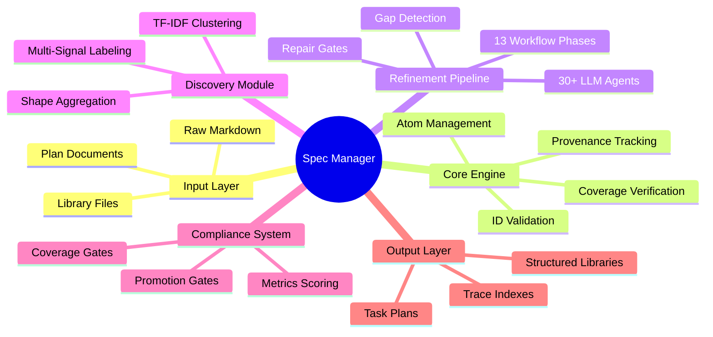

---

## High-Level Architecture

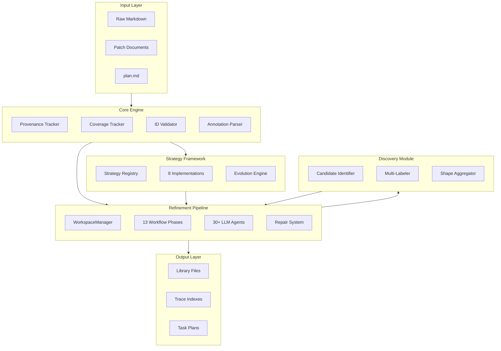

---

## Refinement Pipeline Architecture

### Complete Phase Sequence

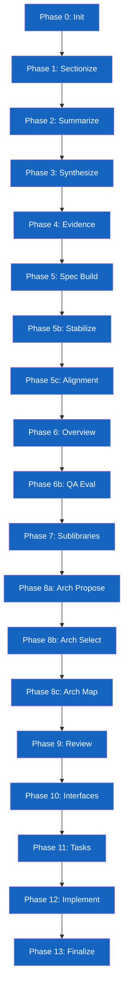

### Workspace Run Structure

```
runs/<run_id>/
├── state.json                    # Persistent phase state
├── spec_snapshot/                # Immutable input copy
├── manifest/
│   ├── files.json               # File enumeration
│   ├── sections/<file>.json     # Per-file sections
│   ├── atoms/<file>.jsonl       # Line-level atoms
│   └── terms/<file>.json        # Terminology
├── summaries/
│   └── <file>.what.md           # File inventories
├── libraries/<lib_id>/
│   ├── charter.md               # Library definition
│   ├── spec.md                  # Formal spec
│   ├── evidence.json            # Mapped evidence
│   ├── gaps.md                  # Gap tracking
│   └── spec_index.json          # Stabilized elements
├── architecture/
│   ├── candidates/              # Proposals
│   ├── selected.md              # Winner
│   └── mapping.md               # Assignments
├── tasks/
│   ├── task_index.json          # Task registry
│   └── TASK-####/               # Per-task artifacts
└── workspace/indexes/
    ├── trace_index.json         # Provenance
    └── edge_list.json           # Interface edges
```

---

## Core Module

### Data Structures

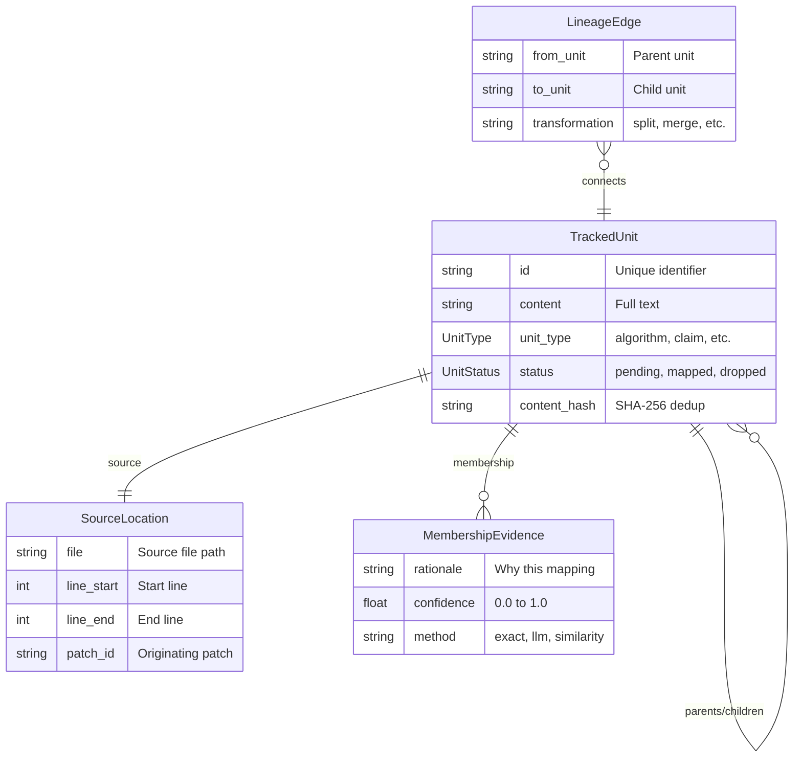

### Unit Types and Statuses

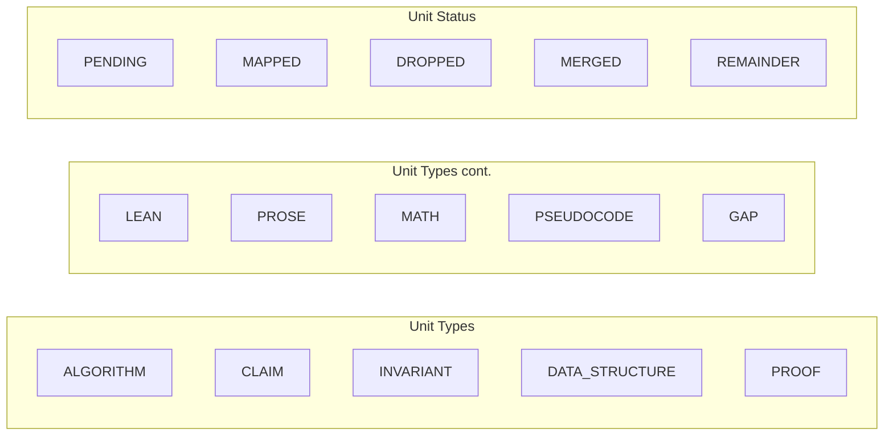

### Granularity Levels

| Level | Value | Use Case |
|-------|-------|----------|
| LINE | 1 | Maximum tracking for dirty prose |
| SENTENCE | 2 | Semi-structured content |
| CLAUSE | 3 | Compound statements |
| SECTION | 4 | Clean annotated content (default) |
| PARAGRAPH | 5 | Paragraph-level grouping |
| FILE | 6 | Entire file |

---

## ID System

### Canonical ID Formats

| ID Format | Category | Example |
|-----------|----------|---------|
| `Algorithm #` | Algorithm | Algorithm 1 |
| `I#` / `I#.#` | Invariant | I1, I1.2 |
| `C#` | Claim | C1 |
| `D#` | Data Structure | D10 |
| `Comp#` | Component | Comp1 |

### Refinement Pipeline IDs

| ID Format | Category | Example |
|-----------|----------|---------|
| `F####` | File | F0001 |
| `R####` | Revision | R0001 |
| `SEC-F####-####` | Section | SEC-F0001-0001 |
| `ATOM-F####-R####-L####` | Atom | ATOM-F0001-R0001-L0042 |
| `EVID-F####-R####-L#-L#` | Evidence | EVID-F0001-R0001-L10-L20 |

### Library & Element IDs

| ID Format | Category | Example |
|-----------|----------|---------|
| `LIB-####` | Library | LIB-0001 |
| `DTL-LIB-####-####` | Detail | DTL-LIB-0001-0042 |
| `CON-LIB-####-####` | Constraint | CON-LIB-0001-0003 |
| `ANL-LIB-####-####` | Analysis | ANL-LIB-0001-0007 |
| `EDGE-LIB-####-LIB-####` | Interface Edge | EDGE-LIB-0001-LIB-0002 |
| `TASK-####` | Task | TASK-0001 |

### Decomposition IDs

| ID Format | Category | Example |
|-----------|----------|---------|
| `E-###` | Entity | E-001 |
| `R-###` | Relation | R-042 |
| `C-###` | Context | C-007 |
| `S-###` | Snippet | S-089 |
| `F-###` | Fact | F-156 |
| `O-###` | Orphan | O-003 |

---

## Annotation System

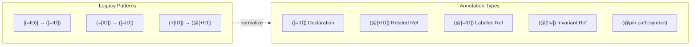

---

## Discovery Module

### Multi-Signal Discovery Pipeline

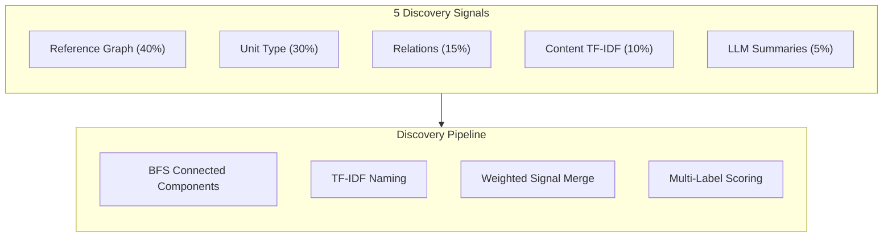

### TF-IDF Naming Algorithm

```
1. Compute global document frequency (DF)
   - DF[word] = count of units containing word

2. For each cluster:
   - Compute TF within cluster
   - TF-IDF[word] = TF * log(total_units / DF)

3. Select highest TF-IDF word as name
   - Filters generic terms (low IDF)
   - Picks domain-specific terms (high IDF)
```

### Shape Analysis & Aggregation

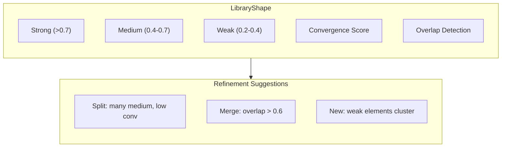

### Confidence Scoring Hierarchy

| Level | Components | Weight |
|-------|-----------|--------|
| Discovery | Reference graph candidates | 0.4 |
| Discovery | Unit type candidates | 0.3 |
| Discovery | Relation extraction | 0.15 |
| Discovery | Content clustering | 0.1 |
| Discovery | LLM summaries | 0.05 |
| Labeling | Keyword match | 40% |
| Labeling | Reference citations | 30% |
| Labeling | Exemplar status | 20% |
| Labeling | Name similarity | 10% |

---

## Strategy Framework

### Strategy Architecture

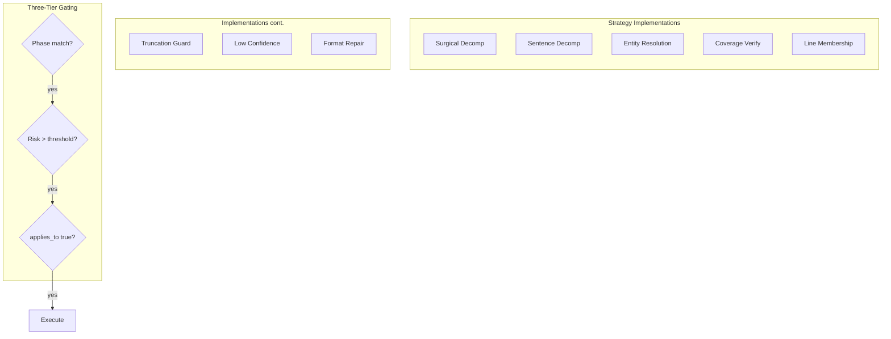

### Risk-to-Evidence Mapping

| Risk Category | Evidence Key | Threshold |
|---------------|-------------|-----------|
| `compound_loss` | `prose_ratio` | 0.1 |
| `content_loss` | `remainder_ratio` | 0.01 |
| `information_loss` | `prose_ratio` | 0.1 |
| `vague_references` | `unresolved_references` | 0.0 |
| `low_confidence` | `low_confidence_mappings` | 1.0 |

### Surgical Decomposition Flow

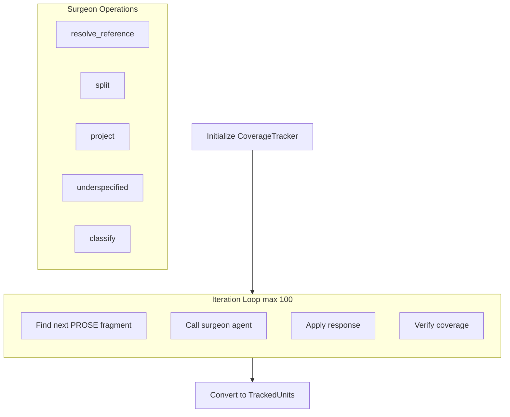

### Unitizer Selection

| Unitizer | Granularity | Selection Condition |
|----------|------------|---------------------|
| Section | SECTION | Annotation density > 0.1 |
| Clause | CLAUSE | Has complex statements |
| Sentence | SENTENCE | Has clear sentence boundaries |
| Line | LINE | Sparse/no annotations |
| LLM | CLAUSE | Hard-to-segment prose |

---

## Compliance System

### Compliance Metrics

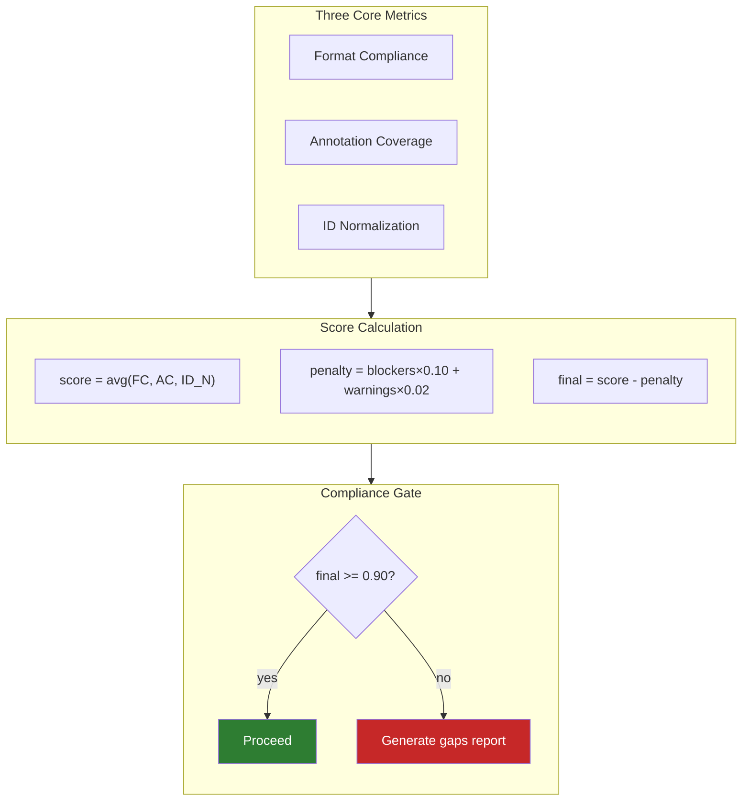

### Gate Thresholds

| Parameter | Value |
|-----------|-------|
| `compliance_threshold` | 0.90 |
| `blocker_threshold` | 0.0 |
| `warning_threshold` | 0.05 |
| `max_remainder_ratio` | 0.05 |
| Error penalty | -10% per error |
| Warning penalty | -2% per warning |

### Coverage Gate (ALG-PROV-0003)

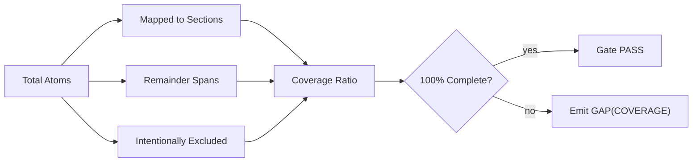

### Promotion Gates

| Gate ID | Default Mode | Description |
|---------|--------------|-------------|
| NO_REMAINING_COMMENTS | REQUIRED | All pseudocode translated |
| NO_STUB_FUNCTIONS | REQUIRED | All atoms implemented |
| ALL_TESTS_PASS | ADVISORY | Algorithmic tests pass |
| PIN_COVERAGE | REQUIRED | Arch pins to algorithmic |
| PROVENANCE_COMPLETE | REQUIRED | Full provenance tracking |

---

## Schema Module

### Schema Categories

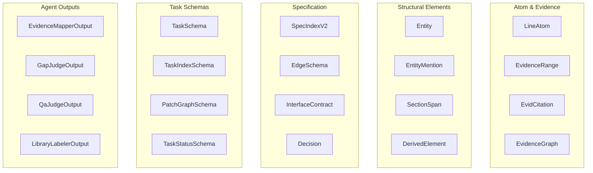

### Key Schema Validators

| Schema | Key Validation |
|--------|---------------|
| LineAtom | SHA256/fingerprint hex, atom_id format |
| EvidenceRange | Line range end ≥ start, atom count match |
| DerivedElement | CON-0005 evidence grounding (≥1 atom) |
| TaskSchema | Non-empty acceptance criteria |
| PatchGraphSchema | Acyclic graph validation |

---

## Agent Catalog

### Agent Distribution by Phase

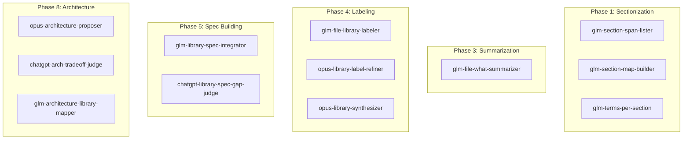

### Agent Model Distribution

| Model Family | Count | Used For |
|-------------|-------|----------|
| `glm` (Gemini) | 10 | Fast extraction, mapping, classification |
| `opus` (Claude) | 5 | Complex planning, synthesis, architecture |
| `chatgpt` (GPT-5.2) | 9 | Judging, evaluation, repair |
| `spaCy` | 3 | NLP fallback for splitting |

### Agent Execution Pattern

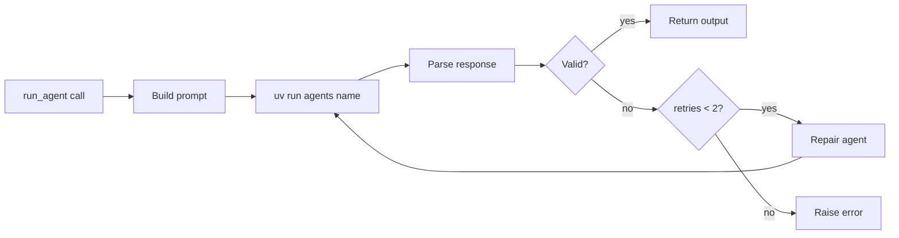

---

## Decomposition Module

### Decomposition Pipeline

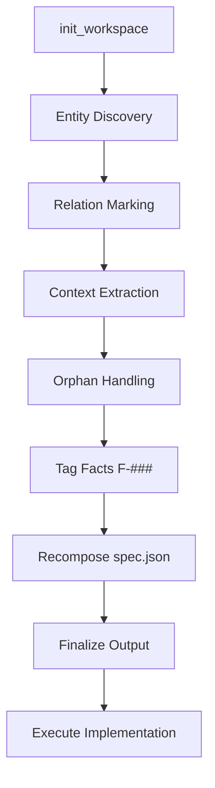

### Entity Index Structure

```json
{
  "E-001": {
    "name": "Authentication Service",
    "keywords": ["auth", "login"],
    "aliases": [],
    "sources": ["spec.md:42"],
    "discovered_from": null
  }
}
```

### Rediscovery Algorithm

```
1. Match search keywords against existing entity keywords
2. Calculate confidence:
   confidence = (exact + 0.5 × partial) / max(search, existing)
3. Return match if confidence >= 0.3
```

### Workspace Structure

```
workspace/
├── staging/
│   ├── discovery/          # Mutable (gets redacted)
│   └── investigation/      # Fresh per entity
├── original/               # Immutable snapshots
├── entities/               # E-### documents
├── relations/              # R-### documents
├── context/                # C-### documents
├── orphans/                # O-### documents
├── output/
│   ├── spec.json           # Machine-friendly
│   ├── facts.md            # Human-readable
│   └── entities.md         # Entity reference
├── id_map.json             # ID to source mapping
├── facts.json              # Canonical fact store
└── entity_index.json       # Keyword lookup
```

---

## Workflow Orchestration

### Two Orchestration Paths

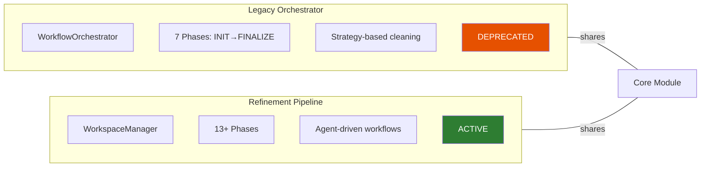

### Legacy Phase Sequence (Deprecated)

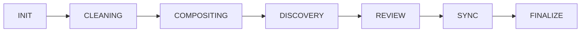

### WorkflowState Critical Fields

| Field | Purpose |
|-------|---------|
| `compliance_passed` | Gates downstream phases |
| `current_projection_path` | Input for next phase |
| `sync_drift` | Plan-only content as evidence |
| `non_authoritative_units` | Quarantined broken chains |

### Authority Model

**Principle:** Libraries are ALWAYS authoritative

| Content Type | Authority Level |
|--------------|-----------------|
| Libraries | DEFINITIVE (source of truth) |
| plan.md | PROJECTION (derived from libraries) |
| Plan-only content | DRIFT EVIDENCE (never authority) |
| Broken proof chains | NON-AUTHORITATIVE (quarantined) |

---

## Evaluation Framework

### Evals Architecture

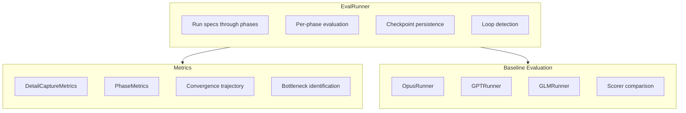

### Loop Detection Algorithm

```
1. Hash phase output (spec, elements, gaps)
2. Compare to previous iteration
3. Increment stagnation_count if unchanged
4. Set is_looped when count >= threshold (default: 3)
```

---

## QA Framework

### QA Case Execution Flow

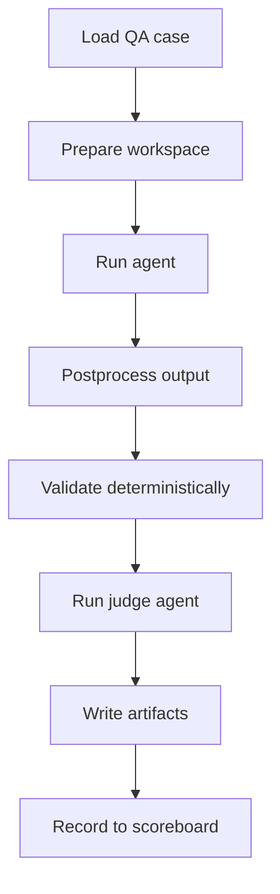

### Known Bad Signature Patterns

| Pattern | Catches |
|---------|---------|
| `derived_pointer` | charter/libraries/runs citations |
| `arch_file_pointer` | `[F####::]` in arch outputs |
| `legacy_pointer_format` | `[F####::LABEL]` format |
| `runner_file_pointer` | "see \`...\` for details" |
| `evidence_mapper_heading_sections` | Components/Workflows as sections |

---

## Hardcoded Values Registry

### Confidence Thresholds

| Context | Value |
|---------|-------|
| Coverage verification | 0.95 |
| Coverage fuzzy match | 0.80 |
| Entity resolution acceptance | 0.70 |
| Low-confidence remainder | 0.70 |
| Heuristic typed match | 0.60 |
| Merge threshold (Jaccard) | 0.60 |
| Overlap significance | 0.10 |
| Evidence priority high | 0.70 |
| Overlap cosine similarity | 0.35 |
| Split silhouette minimum | 0.30 |

### Iteration & Size Limits

| Parameter | Value |
|-----------|-------|
| Max cleaning passes | 5 / 10 |
| Max discovery iterations | 10 |
| Max spec build iterations | 5 |
| Max surgical iterations | 100 |
| Subprocess timeout | 60 seconds |
| Max unit content length | 50,000 chars |
| Gap stagnation threshold | 3 |
| Task plan repair attempts | 3 |

### Thread Pool Sizes

| Workflow | Workers |
|----------|---------|
| Sectionization | 4 |
| Summarization | 4 |
| Library labeling | 4 |
| Evidence expansion | 4 |
| Architecture | 10 |
| Interfaces | 10 |

---

## Repair System

### Repair Flow

```mermaid
flowchart TB
    INPUT[LLM output with errors] --> DETECT[Detect artifact type]
    DETECT --> PROMPT[Build repair prompt]
    PROMPT --> AGENT[Call repair agent]
    AGENT --> CHECK{Valid now?}
    CHECK -->|yes| RETURN[Return repaired]
    CHECK -->|no| FALLBACK[Return original]
```

### Artifact Type Detection

| Keywords | ArtifactType |
|----------|-------------|
| `candidate_labels` | LIBRARY_LABELS |
| `patches` + `file_id` | SPEC_PATCHES |
| `selected_arch_id` | ARCHITECTURE_SELECTION |
| `components` + `tradeoffs` | ARCHITECTURE_MAPPING |
| `evidence` + `file_id` | EVIDENCE_JSON |
| (default) | SPEC |

---

## Trace Indexes

### Full Traceability Chain

```mermaid
flowchart LR
    ATOM["ATOM-F####-R####-L####"]
    SEC["SEC-F####-####"]
    ELEM["DTL/CON-LIB-####-####"]
    TASK["TASK-####"]
    PATCH["patch.diff + SHA"]

    ATOM -->|atom_to_section| SEC
    SEC -->|section_to_elements| ELEM
    ELEM -->|element_to_tasks| TASK
    TASK -->|task_to_patches| PATCH
```

---

## Evidence Graph

### Graph Structure

```mermaid
flowchart TB
    subgraph NODES[Node Types]
        direction LR
        N1[ATOM]
        N2[EVIDENCE_RANGE]
        N3[SECTION]
        N4[ENTITY]
        N5[DERIVED_ELEMENT]
    end

    subgraph EDGES[Edge Types]
        direction LR
        E1[SUPPORTS]
        E2[MENTIONS]
        E3[DERIVES]
        E4[DEPENDS_ON]
        E5[RELATES_TO]
    end
```

---

## Co-occurrence Analysis

### Weighted Graph Construction

```mermaid
flowchart TB
    subgraph WEIGHTS[Window Policy]
        direction TB
        W1["Same atom: 1.0"]
        W2["Adjacent atom: 0.5"]
        W3["Same section: 0.25"]
        W4["Window size: 5"]
    end

    subgraph ALGO[Algorithm]
        direction TB
        A1[Build atom → entity mapping]
        A2[Same-atom co-occurrence]
        A3[Adjacent atom co-occurrence]
        A4[Track provenance]
    end

    WEIGHTS --> ALGO
```

### Cluster Finding

```
1. Build adjacency with weight threshold
2. Find connected components via BFS
3. Filter clusters >= min_size
4. Return all clusters found

Parameters:
  - min_cluster_size: 2
  - weight_threshold: 0.5
```

---

## Key Design Principles

### 1. Non-Destructive Processing
- Original files stored immutably in `original/`
- Staging uses markers (no line number drift)
- All evidence references source line numbers

### 2. 100% Coverage Guarantee
- Leaf fragments cover 100% of original content
- verify_coverage() returns (True, []) or (False, gaps)
- Coverage gates block phase transitions on failure

### 3. Atom-Based Membership
- Preserves order and duplicates (not set-based)
- Uses SequenceMatcher for sequence-aware comparison
- Many-to-many atom-to-element mappings

### 4. Evidence-Driven Gating
- Every decision recorded with severity and evidence
- Per-category aggregation for compliance scoring
- Run-level gaps report synthesizes all evidence

### 5. Stable Element IDs
- Phase 5b assigns canonical IDs
- Counters persist in `id_counters.json`
- Enables consistent provenance chains

---

## Summary

The Spec Manager is a comprehensive specification management system with:

- **2 orchestration paths** (legacy 7-phase deprecated + modern 13+ phase)
- **30+ LLM agents** across 3 model families (GLM, Opus, ChatGPT)
- **8 strategy implementations** with YAML-driven definitions
- **Full provenance tracking** with lineage graphs and atom-level membership
- **100% coverage guarantee** through surgical decomposition
- **Compliance gating** at phase transitions (90% threshold)
- **4-tier trace indexes** from atoms through tasks to patches
- **Comprehensive evaluation** with QA framework and baseline comparison
- **Evidence graph** for structured relationship tracking
- **Multi-signal discovery** with TF-IDF, clustering, and LLM inference
