# Spec Manager System Analysis v3

## Purpose

The Spec Manager is a multi-phase, agent-orchestrated system for transforming
unstructured specification prose into a structured, traceable library of
requirements, invariants, flows, and decisions. It ingests raw markdown
documents, decomposes them into atomic tracked units, discovers library
boundaries via NLP and LLM inference, builds formal specifications per library,
and produces a complete traceability chain from source atoms through spec
elements to implementation tasks.

The system guarantees **zero information loss** through provenance tracking,
coverage verification, and compliance gating at every phase transition.

---

## System Overview

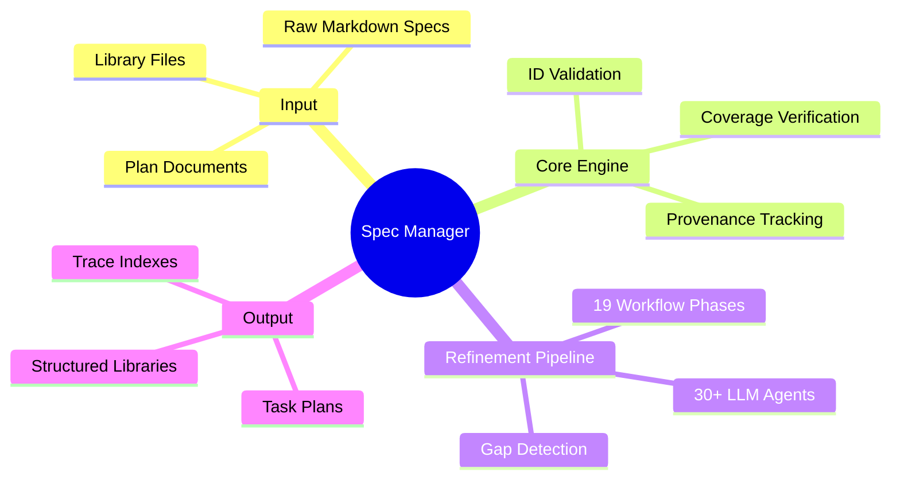

---

## High-Level Architecture

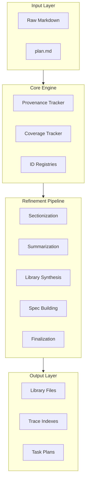

---

## Complete Phase Workflow

The pipeline consists of **19 sequential phases**:

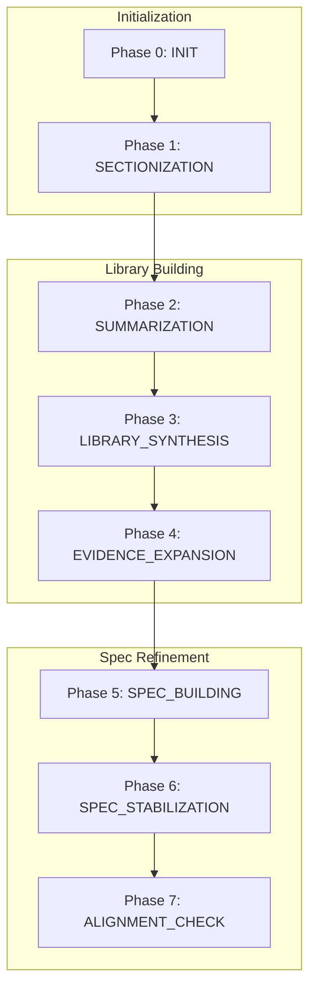

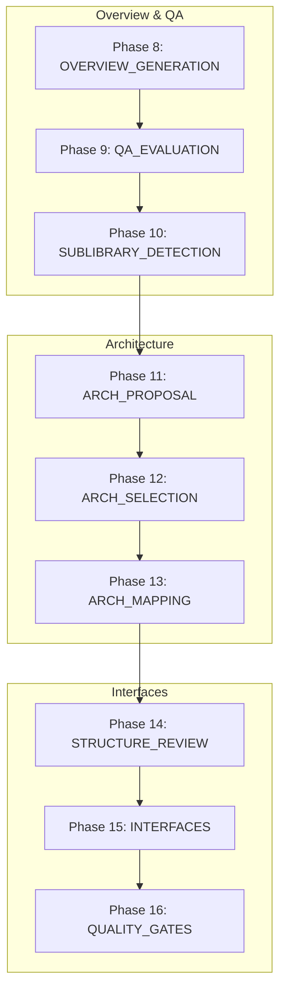

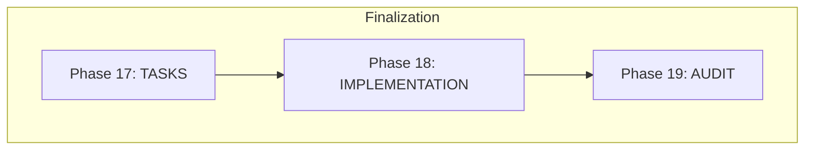

---

## Phase Details with Outputs

### Phase 0: Initialization (INIT)

**Purpose:** Create immutable spec snapshot and file manifest.

**CLI:** `uv run spec init <run_id> <input_folder>`

**Outputs:**

* `spec_snapshot/` - Immutable copy of input specs
* `manifest/files.json` - File manifest with stable IDs
* `state.json` - Workspace state

### Phase 1: Sectionization

**Purpose:** LLM-based section detection, atom emission, term extraction.

**CLI:** `uv run spec spec sectionize <run_id>`

**Agents:** `glm-section-span-lister`, `glm-section-map-builder`, `glm-terms-per-section`

**Outputs:**
* `manifest/sections/{file_id}.sections.json`
* `manifest/atoms/{file_id}.atoms.jsonl`
* `manifest/terms/{file_id}.terms.json`

### Phase 2: Summarization

**Purpose:** Extract file inventories (algorithms, components, workflows).

**CLI:** `uv run spec spec summarize <run_id>`

**Agent:** `glm-file-what-summarizer`

**Outputs:**
* `summaries/{file_id}.what.md`

### Phase 3: Library Synthesis

**Purpose:** Discover library boundaries and generate charters.

**CLI:** `uv run spec spec synthesize <run_id>`

**Agents:** `opus-library-synthesizer`, `glm-library-overlap-resolver`

**Outputs:**
* `libraries/LIB-####/charter.md`
* `libraries/LIB-####/evidence.json`
* `libraries/LIB-####/events.jsonl`
* `libraries/library_index.md`

### Phase 4: Evidence Expansion

**Purpose:** Map evidence sources to libraries.

**CLI:** `uv run spec spec expand-evidence <run_id>`

**Agents:** `glm-library-evidence-mapper`, `glm-library-relevance-classifier`

**Outputs:**
* Updated `libraries/LIB-####/evidence.json`

### Phase 5: Spec Building

**Purpose:** Iterative spec integration with gap closure loop.

**CLI:** `uv run spec spec build-specs <run_id>`

**Agents:** `glm-library-spec-integrator`, `chatgpt-library-spec-gap-judge`

**Outputs:**

* `libraries/LIB-####/spec.md`
* `libraries/LIB-####/gaps.md`
* `libraries/LIB-####/gap_queue.json`
* `libraries/LIB-####/decisions.md`

### Phase 6: Spec Stabilization

**Purpose:** Assign stable element IDs and build indexes.

**CLI:** `uv run spec spec stabilize-specs <run_id>`

**Outputs:**

* `libraries/LIB-####/spec_index.json`
* `libraries/LIB-####/id_counters.json`
* `libraries/LIB-####/decisions_index.json`

### Phase 7-10: Quality Assurance

**Phases:** Alignment Check, Overview Generation, QA Evaluation, Sublibrary Detection

**Agents:** `opus-alignment-checker`, `opus-overview-writer`, `chatgpt-qa-evaluator`

**Outputs:**

* `reports/alignment_report.md`
* `reports/overview.md`
* `reports/qa_evaluation.md`

### Phase 11-13: Architecture

**Phases:** Architecture Proposal, Selection, Mapping

**CLI:**

* `uv run spec spec propose-architectures <run_id>`
* `uv run spec spec select-architecture <run_id>`
* `uv run spec spec map-libraries <run_id>`

**Agents:** `opus-architecture-proposer`, `chatgpt-architecture-tradeoff-judge`, `glm-architecture-mapper`

**Outputs:**

* `architecture/candidates/arch_*.md`
* `architecture/selected.md`
* `architecture/rejected.md`
* `architecture/mapping.md`

### Phase 14-16: Interfaces & Quality

**Phases:** Library Structure Review, Interfaces, Quality Gates

**CLI:**
* `uv run spec spec review-structure <run_id>`
* `uv run spec spec build-interfaces <run_id>`
* `uv run spec spec quality-gates <run_id>`

**Agents:** `chatgpt-library-boundary-judge`, `opus-interface-contract-writer`

**Outputs:**
* `reports/review_actions.json`
* `workspace/indexes/edge_list.json`
* `workspace/indexes/interface_index.json`
* `libraries/LIB-####/interfaces/EDGE-*.md`

### Phase 17-19: Tasks & Implementation

**CLI:**
* `uv run spec spec plan-tasks <run_id>`
* `uv run spec spec implement <run_id>`
* `uv run spec spec finalize-run <run_id>`

**Agents:** `opus-task-planner`, `chatgpt-task-plan-judge`

**Outputs:**

* `tasks/TASK-####/task.json`
* `tasks/TASK-####/task.md`
* `tasks/TASK-####/patch.diff`
* `workspace/indexes/trace_index.json`

---

## ID System

### Complete ID Formats

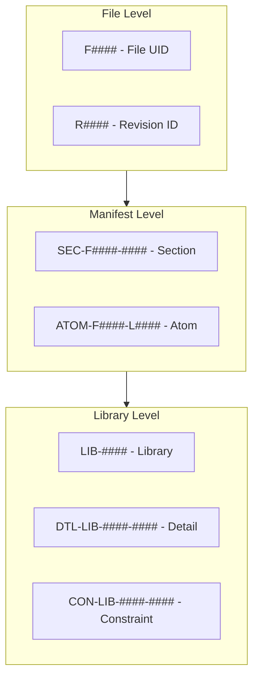

| ID Type | Pattern | Example | Usage |
|---------|---------|---------|-------|
| File UID | `F####` | `F0001` | File identifier |
| Revision | `R####` | `R0001` | Content revision |
| Section | `SEC-{file_id}-####` | `SEC-F0001-0002` | Section span |
| Atom | `ATOM-{file_id}-L####` | `ATOM-F0001-L0042` | Line atom |
| Library | `LIB-####` | `LIB-0001` | Library |
| Detail | `DTL-LIB-####-####` | `DTL-LIB-0001-0023` | Detail element |
| Constraint | `CON-LIB-####-####` | `CON-LIB-0001-0005` | Constraint |
| Analysis | `ANL-LIB-####-####` | `ANL-LIB-0001-0001` | Decision |
| Overview | `OVW-LIB-####-####` | `OVW-LIB-0001-0001` | Overview |
| Edge | `EDGE-LIB-####-LIB-####` | `EDGE-LIB-0001-LIB-0002` | Interface |
| Task | `TASK-####` | `TASK-0001` | Task |
| Evidence | `EVID-F####-R####-L#-L#` | `EVID-F0001-R0001-L1-L25` | Evidence range |
| Entity | `ENT-####` | `ENT-0001` | Domain entity |
| Gap | `GAP-{hash}` | `GAP-abc123` | Gap identifier |
| Pin | `PIN-####` | `PIN-0001` | Projection pin |

---

## Workspace Directory Structure

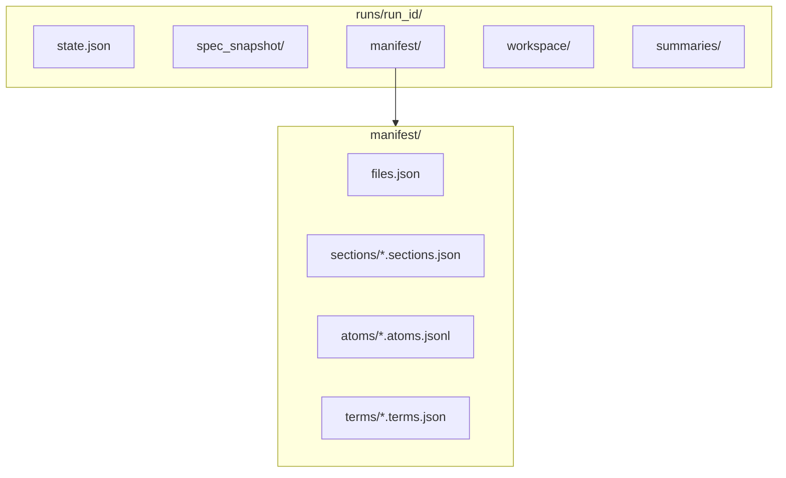

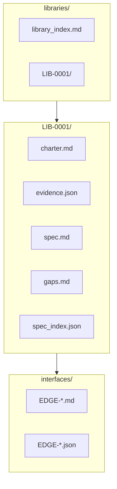

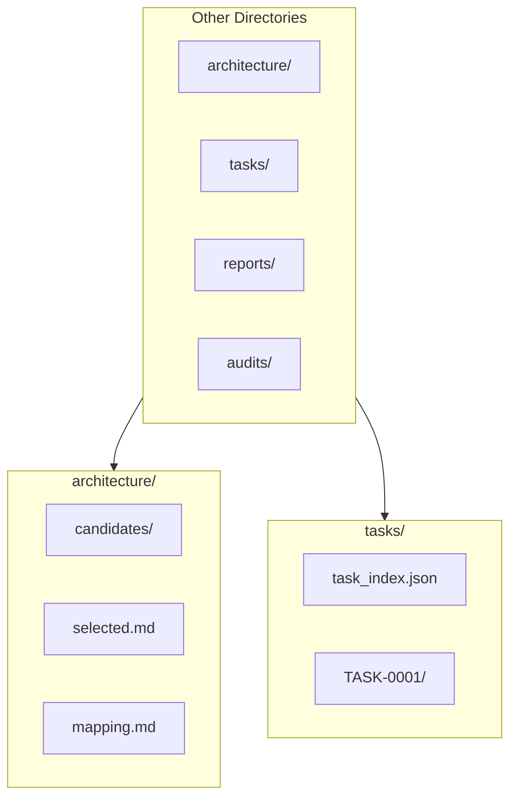

### Complete Directory Tree

```text
runs/<run_id>/
├── state.json                    # Workspace state
├── spec_snapshot/                # Immutable input copy
├── manifest/
│   ├── files.json               # File manifest
│   ├── sections/                # Section definitions
│   │   └── *.sections.json
│   ├── atoms/                   # Line atoms
│   │   └── *.atoms.jsonl
│   └── terms/                   # Domain terms
│       └── *.terms.json
├── summaries/
│   └── *.what.md                # File summaries
├── libraries/
│   ├── library_index.md
│   └── LIB-####/
│       ├── charter.md
│       ├── evidence.json
│       ├── events.jsonl
│       ├── spec.md
│       ├── gaps.md
│       ├── gap_queue.json
│       ├── decisions.md
│       ├── spec_index.json
│       ├── id_counters.json
│       └── interfaces/
│           └── EDGE-*.md
├── architecture/
│   ├── candidates/
│   │   └── arch_*.md
│   ├── selected.md
│   ├── rejected.md
│   └── mapping.md
├── tasks/
│   ├── task_index.json
│   └── TASK-####/
│       ├── task.json
│       ├── task.md
│       ├── patch.diff
│       ├── status.json
│       └── audit.md
├── workspace/
│   ├── intermediates/
│   │   └── pass_##/
│   └── indexes/
│       ├── edge_list.json
│       ├── interface_index.json
│       ├── trace_index.json
│       └── library_shapes.json
├── reports/
│   ├── overview.md
│   ├── alignment_report.md
│   ├── qa_evaluation.md
│   └── quality_gates.json
├── audits/
│   └── migration.log
└── agent_prompts/               # Debug logs
    └── *.txt
```

---

## Core Data Structures

### TrackedUnit (Provenance)

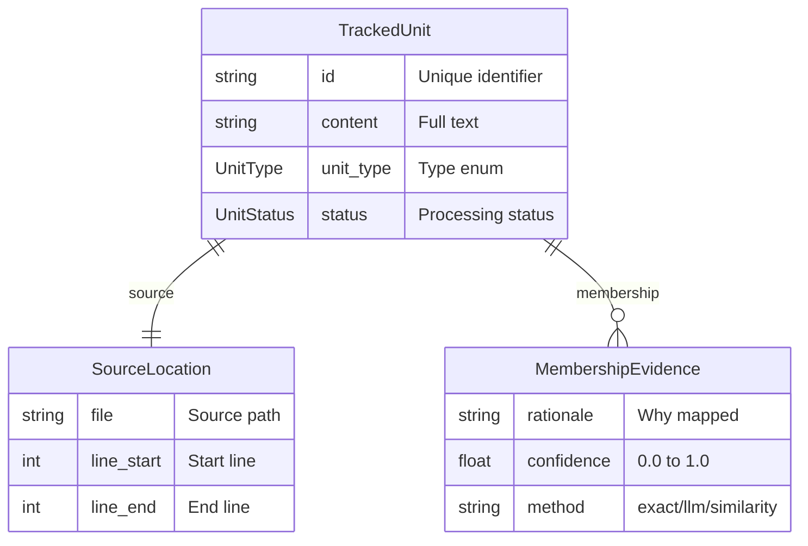

### UnitType Values

| UnitType | Description |
|----------|-------------|
| `ALGORITHM` | Algorithm definitions |
| `CLAIM` | Claims (C#, P#C#) |
| `DATA_STRUCTURE` | Data structures (D#) |
| `INVARIANT` | Invariants (I#, P#I#) |
| `PROSE` | Unstructured text |
| `PROOF` | Proof sketches |
| `GAP` | Gap elements |

### UnitStatus Values

| Status | Description |
|--------|-------------|
| `PENDING` | Not yet processed |
| `MAPPED` | Assigned to target |
| `DROPPED` | Excluded with reason |
| `MERGED` | Combined with others |

---

## Schema Output Formats

### File Manifest (`files.json`)

```json
{
  "F0001": {
    "file_uid": "F0001",
    "rev_id": "R0001",
    "relpath": "requirements/core.md",
    "sha256": "abc123..."
  }
}
```

### Sections (`*.sections.json`)

```json
{
  "file_id": "F0001",
  "sections": [
    {
      "section_id": "SEC-F0001-0001",
      "start_line": 1,
      "end_line": 25,
      "label": "OVERVIEW"
    }
  ],
  "total_lines": 250
}
```

### Atoms (`*.atoms.jsonl`)

Each line is a JSON object:

```json
{"atom_id":"ATOM-F0001-L0001","line_no":1,"section_id":"SEC-F0001-0001","sha256":"...","text":"# Overview"}
```

### Library Charter (`charter.md`)

```markdown
# Library Charter: LIB-0001

## Intent
Request intake, routing, and validation.

## Boundaries
- Owns the inbound request pipeline
- Does NOT own data storage

## Responsibilities
- Request routing and dispatch
- Input validation

## Evidence
- [spec_snapshot/alpha.md::SEC-F0001-0002]
```

### Evidence (`evidence.json`)

```json
{
  "lib_id": "LIB-0001",
  "sources": [
    {
      "file_id": "F0001",
      "file_ref": "spec_snapshot/core.md",
      "sections": ["SEC-F0001-0001", "SEC-F0001-0002"]
    }
  ]
}
```

### Spec Index (`spec_index.json`)

```json
{
  "lib_id": "LIB-0001",
  "elements": [
    {
      "element_id": "DTL-LIB-0001-0001",
      "kind": "DTL",
      "title": "Component X must support Y",
      "text": "...",
      "evidence_atom_ids": ["ATOM-F0001-L0042"]
    }
  ]
}
```

### Gaps (`gaps.md`)

```markdown
## Coverage Metrics
- **Total Gaps**: 12
- **Open Gaps**: 3
- **Convergence Ratio**: 75.00%

## Open Gaps
### GAP-abc123
**Type:** content_gap
**Severity:** ERROR
**Source:** [spec_snapshot/alpha.md::SEC-F0001-0003]
**Description:** Missing algorithm for X
```

### Edge List (`edge_list.json`)

```json
{
  "edges": [
    {
      "edge_id": "EDGE-LIB-0001-LIB-0002",
      "consumer_lib": "LIB-0001",
      "provider_lib": "LIB-0002",
      "kind": "api",
      "summary": "Auth calls payment API"
    }
  ]
}
```

### Task (`task.json`)

```json
{
  "task_id": "TASK-0001",
  "title": "Implement password validation",
  "priority": "p1",
  "component": "auth_service",
  "libraries": ["LIB-0001"],
  "covers": {
    "elements": ["DTL-LIB-0001-0023"],
    "edges": ["EDGE-LIB-0001-LIB-0002"]
  },
  "acceptance_criteria": [
    "Password must be 12+ characters"
  ],
  "depends_on": ["TASK-0002"]
}
```

---

## Agent Catalog

### Agent Model Distribution

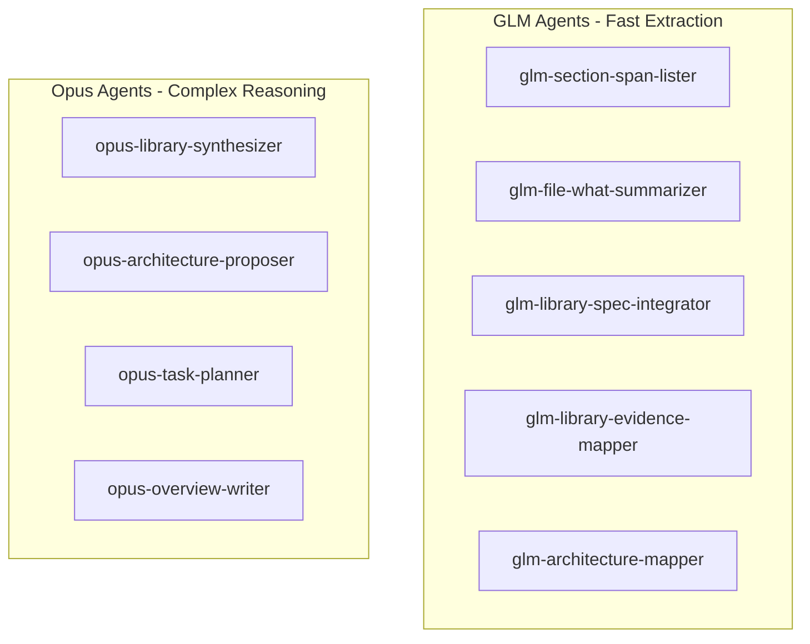

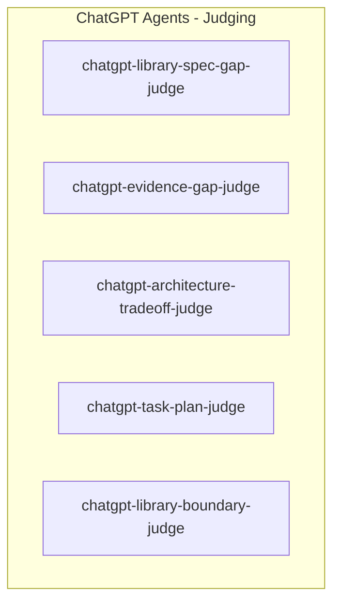

### Agent Summary Table

| Model Family | Count | Used For |
|--------------|-------|----------|
| GLM (Gemini) | 10+ | Fast structured extraction |
| Opus (Claude) | 5+ | Complex reasoning, synthesis |
| ChatGPT (GPT-5.2) | 9+ | Judging, evaluation, QA |

---

## Evidence Pointer Formats

### New Format (Phase 1+)

```text
[spec_snapshot/<relpath>::<section_id>]
```

Example: `[spec_snapshot/alpha.md::SEC-F0001-0002]`

### EVID Citation Format

```text
[EVID-F####-R####-L#-L#]
```

Example: `[EVID-F0001-R0001-L1-L25]`

---

## Gap Detection System

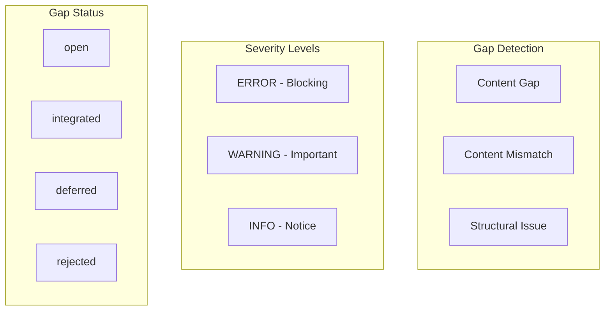

### Gap Evidence Structure

```json
{
  "id": "GAP-abc123",
  "gap_type": "content_gap",
  "severity": "ERROR",
  "source": ["spec_snapshot/alpha.md::SEC-F0001-0001"],
  "derived_artifact_target": "libraries/LIB-0001/spec.md",
  "description": "Missing algorithm for X",
  "status": "open"
}
```

---

## Trace Index System

Full traceability chain from atoms to patches:

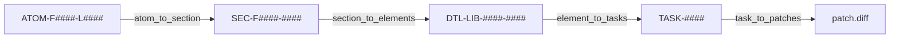

### Trace Commands

```bash
# Trace atom forward
uv run spec trace atom <run_id> ATOM-F0001-L0042

# Trace section
uv run spec trace section <run_id> SEC-F0001-0001

# Trace element
uv run spec trace element <run_id> DTL-LIB-0001-0001

# Trace task back
uv run spec trace task <run_id> TASK-0001
```

---

## CLI Command Reference

### Initialization

```bash
uv run spec init <run_id> <input_folder> [--force]
uv run spec status <run_id>
```

### Refinement Phases

```bash
# Phase 1
uv run spec spec sectionize <run_id> [--sequential]

# Phase 2
uv run spec spec summarize <run_id> [--sequential]

# Phase 3
uv run spec spec synthesize <run_id>

# Phase 4
uv run spec spec expand-evidence <run_id>
uv run spec spec spotcheck-evidence <run_id>

# Phase 5
uv run spec spec build-specs <run_id> [--max-iterations 5]

# Phase 6
uv run spec spec stabilize-specs <run_id> [--libs LIB-0001]
```

### Architecture Phases

```bash
uv run spec spec propose-architectures <run_id>
uv run spec spec select-architecture <run_id>
uv run spec spec map-libraries <run_id>
```

### Interface & Task Phases

```bash
uv run spec spec review-structure <run_id> [--apply-splits]
uv run spec spec build-interfaces <run_id>
uv run spec spec plan-tasks <run_id>
uv run spec spec implement <run_id> [--repo-root .]
```

### Gap Management

```bash
uv run spec gaps list <run_id> [--status open]
uv run spec gap investigate <run_id> <gap_id>
uv run spec gap resolve <run_id> <gap_id> integrate --pointer ...
```

### QA Commands

```bash
uv run spec qa list
uv run spec qa run <run_id> <case_id>
uv run spec qa run-all <run_id>
uv run spec qa lint-contracts
```

---

## Key Design Principles

### 1. Immutability

* `spec_snapshot/` created once, never modified
* Content hashes detect drift
* All processing references immutable snapshot

### 2. Stable IDs

* File UIDs persist across runs (ALG-CORE-0001)
* Content-based revision tracking (ALG-CORE-0002)
* Deterministic element ID allocation via fingerprints

### 3. Evidence Grounding

* All derived elements MUST have `evidence_atom_ids`
* Many-to-many relationships with confidence scores
* Full lineage tracking for transformations

### 4. Gap-Driven Convergence

* Iterative refinement until gaps close
* Stagnation detection via SHA-256 hash comparison
* Maximum iteration limits prevent infinite loops

### 5. Multi-Model Strategy

* GLM for high-volume extraction (fast, cheap)
* Opus for complex reasoning (high quality)
* ChatGPT for judging and evaluation (reliable)

---

## Hardcoded Thresholds

| Parameter | Value | Location |
|-----------|-------|----------|
| Max spec build iterations | 5 | `spec_building.py` |
| Compliance threshold | 0.90 | `coverage_gate.py` |
| Evidence priority high | 0.70 | `evidence_expansion.py` |
| Evidence priority drop | 0.30 | `evidence_expansion.py` |
| Overlap cosine similarity | 0.35 | `library_structure_review.py` |
| Quality gate threshold | 0.80 | `quality_gates.py` |
| Thread pool size | 4-10 | Various workflows |

---

## Summary

The Spec Manager implements a comprehensive specification management system with:

* **19 workflow phases** from initialization to implementation
* **30+ LLM agents** across 3 model families (GLM, Opus, ChatGPT)
* **Full provenance tracking** with lineage graphs and atom-level membership
* **100% coverage guarantee** through surgical decomposition
* **Compliance gating** at phase transitions (90% threshold)
* **4-tier trace indexes** from atoms through tasks to patches
* **Gap-driven convergence** with stagnation detection

The system transforms unstructured markdown specifications into:
* Structured library specifications with stable element IDs
* Executable implementation tasks with dependency ordering
* Complete traceability from source lines to implementation patches
