# Spec Manager System Analysis v4

## Post-Reorganization Architecture — Feb 12, 2026

The Spec Manager transforms unstructured specification prose into structured,
traceable implementations through a multi-layer promotion pipeline. This
document describes the system as it stands after the Feb 12 package
reorganization and constraint enforcement pass — design constraints are
baked into the code, not aspirational targets.

---

## 1. Package Architecture

20 packages organized into 4 dependency tiers. Each tier depends only on
lower tiers (no upward or cross-tier circular dependencies at the package
level; lazy imports mitigate the few bidirectional cases).

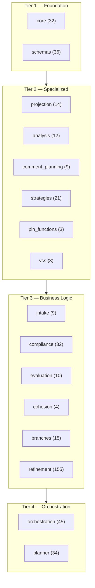
```mermaid
flowchart TB
    subgraph T1["Tier 1 — Foundation"]
        core["core (32)"]
        schemas["schemas (36)"]
    end

    subgraph T2["Tier 2 — Specialized"]
        projection["projection (14)"]
        analysis["analysis (12)"]
        comment_planning["comment_planning (9)"]
        strategies["strategies (21)"]
        pin_functions["pin_functions (3)"]
        vcs["vcs (3)"]
    end

    subgraph T3["Tier 3 — Business Logic"]
        intake["intake (9)"]
        compliance["compliance (32)"]
        evaluation["evaluation (10)"]
        cohesion["cohesion (4)"]
        branches["branches (15)"]
        refinement["refinement (155)"]
    end

    subgraph T4["Tier 4 — Orchestration"]
        orchestration["orchestration (45)"]
        planner["planner (34)"]
    end

    T1 --> T2
    T2 --> T3
    T3 --> T4
```

### Package Classification

| Package | Tier | Class | Files | Role |
|---------|------|-------|-------|------|
| `core` | 1 | Utility | 32 | Shared primitives, LLM wrapper, gap structures |
| `schemas` | 1 | Utility | 36 | 40+ Pydantic data models for all agent outputs |
| `projection` | 2 | Structural | 14 | Import graphs, lineage tracing, drift detection |
| `analysis` | 2 | Business | 12 | Adjacency graphs, restructuring suggestions |
| `comment_planning` | 2 | Business | 9 | Pseudocode comment insertion, reverse translation |
| `strategies` | 2 | Business | 21 | Reasoning strategy framework |
| `pin_functions` | 2 | Business | 3 | Pin extraction and registration orchestration |
| `vcs` | 2 | Structural | 3 | Git abstraction, worktree management |
| `decomposition` | 2 | Business | 12 | Spec decomposition (isolated, 0 consumers) |
| `intake` | 3 | Business | 9 | Phase 0 prose-to-spec routing |
| `compliance` | 3 | Business | 32 | Coverage, detection, promotion gates |
| `evaluation` | 3 | Business | 10 | Quality scoring, model comparison, reporting |
| `cohesion` | 3 | Business | 4 | Coupling/cohesion detection and refinement |
| `branches` | 3 | Structural | 15 | Multi-branch atom/slice management |
| `refinement` | 3 | Business | 155 | Workspace, evidence indexing, evals, judges |
| `orchestration` | 4 | Structural | 45 | PDD lifecycle, promotion loop, coordination |
| `planner` | 4 | Business | 34 | Single decision authority, layers, constraints |

---

## 2. Pipeline Architecture

### 2.1 Layer Pipeline

Work flows through three promotion layers, each stabilizing before the
next begins (Source Authority constraint: fix problems at the layer with
authority).

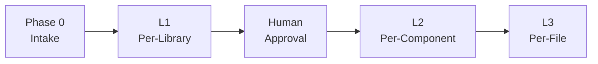
```mermaid
flowchart LR
    P0["Phase 0<br/>Intake"]
    L1["L1<br/>Per-Library"]
    HA["Human<br/>Approval"]
    L2["L2<br/>Per-Component"]
    L3["L3<br/>Per-File"]

    P0 --> L1
    L1 --> HA
    HA --> L2
    L2 --> L3
```

### 2.2 Promotion Loop (10-Step State Machine per Slice)

Each slice passes through 10 sequential steps. Steps dispatch differently
per layer (L1/L2/L3).

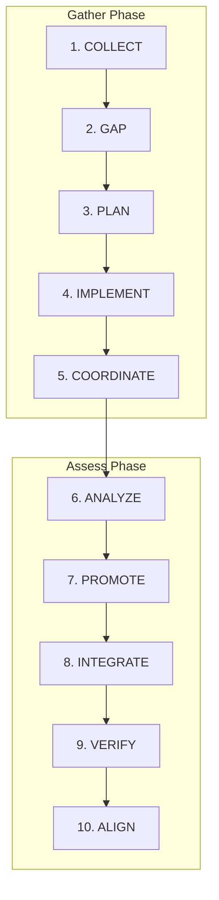
```mermaid
flowchart TB
    subgraph ROW1["Gather Phase"]
        COLLECT["1. COLLECT"]
        GAP["2. GAP"]
        PLAN["3. PLAN"]
        IMPL["4. IMPLEMENT"]
        COORD["5. COORDINATE"]
    end

    subgraph ROW2["Assess Phase"]
        ANALYZE["6. ANALYZE"]
        PROMOTE["7. PROMOTE"]
        INTEGRATE["8. INTEGRATE"]
        VERIFY["9. VERIFY"]
        ALIGN["10. ALIGN"]
    end

    COLLECT --> GAP --> PLAN
    PLAN --> IMPL --> COORD
    COORD --> ANALYZE --> PROMOTE
    PROMOTE --> INTEGRATE --> VERIFY
    VERIFY --> ALIGN
```

### 2.3 Layer-Specific Step Dispatch

| Step | L1 (Per-Library) | L2 (Per-Component) | L3 (Per-File) |
|------|------------------|--------------------|----|
| GAP | P3 compliance check | LLM arch gap analysis | 5 quality reviewers |
| PLAN | Function intentions (no-op: code IS spec) | Wiring intentions | Refactor intentions |
| IMPLEMENT | ImplementationRunner | Architecture assembler | Clean-code refactorer |
| COORDINATE | Signals → triage → WAITING | Signals → triage → WAITING | Signals → triage → WAITING |
| ANALYZE | SourceAnalysisCache | LLM arch graph | File metrics |
| PROMOTE | 5 algorithmic gates | 8 LLM-based gates | Quality gaps + diff-impact |
| VERIFY | Governance + lineage | Governance + topology | Governance + closure |

---

## 3. Design Constraint Enforcement

Six fundamental constraints govern all design decisions. Each constraint
is enforced by specific code mechanisms — the enforcement points listed
below are active in the current codebase.

### 3.1 Proportional Commitment (C00)

*"Solution quality is bounded by problem framing quality. Match method to
certainty. Surface ambiguity rather than resolving it silently."*

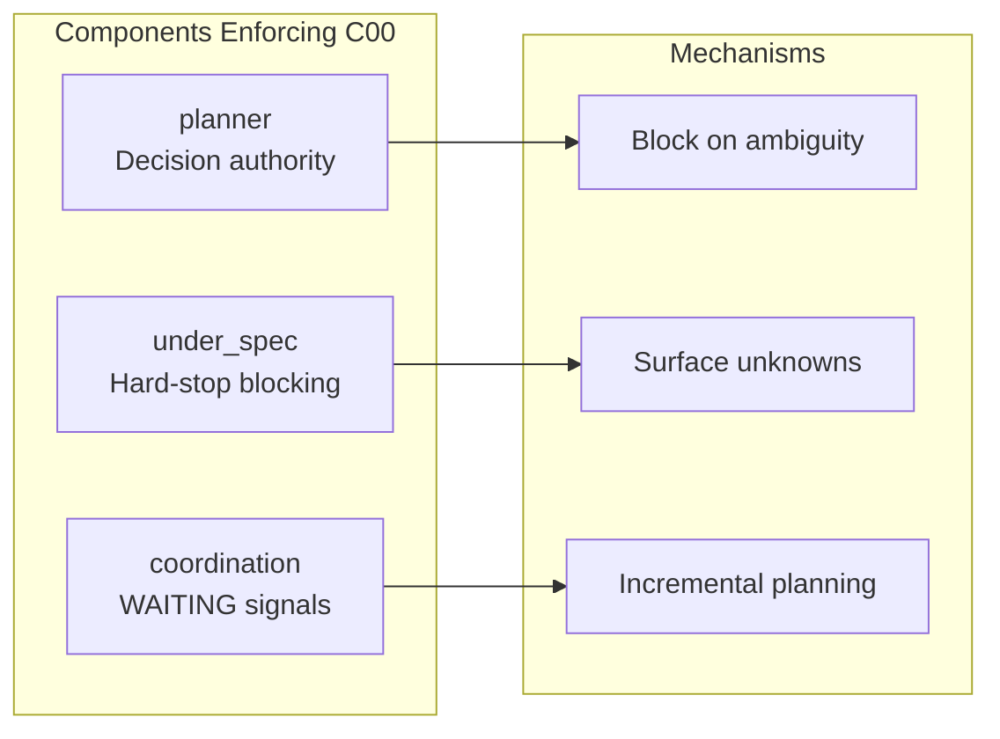
```mermaid
flowchart LR
    subgraph IMPLEMENTS["Components Enforcing C00"]
        PL["planner<br/>Decision authority"]
        US["under_spec<br/>Hard-stop blocking"]
        CO["coordination<br/>WAITING signals"]
    end

    subgraph MECHANISM["Mechanisms"]
        M1["Block on ambiguity"]
        M2["Surface unknowns"]
        M3["Incremental planning"]
    end

    PL --> M1
    US --> M2
    CO --> M3
```

| Component | How C00 Is Enforced |
|-----------|---------------------|
| `planner/api` | Routes decisions to layer-specific planners. NOOP when no decision needed.
  BLOCKED when insufficient info. WAITING when dependencies unresolved. |
| `planner/jit` | Micro-state-machine: plans only the next action, not the full sequence.
|  Re-evaluates after each step. |
| `planner/constraints` | `ConstraintFact` + `DecisionRequirement` — explicit records of
|  what is known vs. assumed. `ImpactClassification` sizes decisions to knowledge. |
| `orchestration/under_spec` | `UnderSpecManager` hard-stops when spec is insufficient. Does not
|  guess. Surfaces the gap. |
| `orchestration/coordination` | `CoordinationSignal` emitted on uncertainty. Slice
|  enters WAITING state instead of proceeding with assumptions. |
| `strategies` | `StrategyEvolutionPipeline` requires evidence before changing strategy. New
|  strategies evaluated against same inputs as old. |

**Active enforcement:**

* `implementation/types.py`: `_check_required()` logs warnings when LLM output is missing
  required fields — surfaces data gaps instead of silently defaulting.
* `implementation/runner.py`: Unknown under-spec event kinds log a warning and classify as
  `AMBIGUOUS_SPEC` (surfaced, not guessed).
* `pdd_orchestrator.py`: Missing `evidence_atom_ids` produces an empty list +
  warning — no fabricated `ATOM-0000` placeholders.
* `intake/summarize.py`: LLM `file_id` overrides are logged with both values so
  the override is visible.

### 3.2 Information Permanence (C01)

*"Information is non-renewable. Route, don't extract. Account for all
inputs. Maintain unbroken chains. Add, don't replace."*

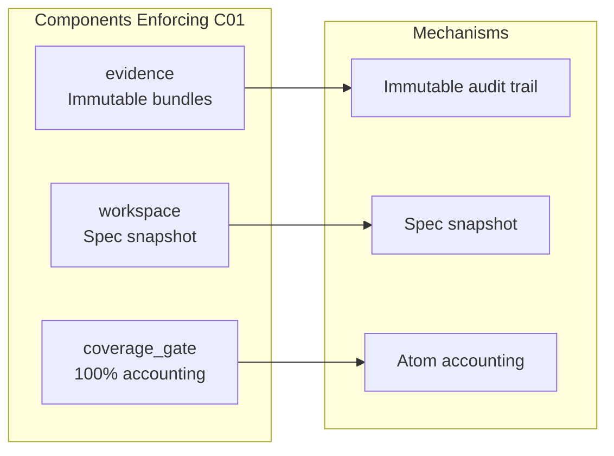
```mermaid
flowchart LR
    subgraph IMPLEMENTS["Components Enforcing C01"]
        EV["evidence<br/>Immutable bundles"]
        WS["workspace<br/>Spec snapshot"]
        CG["coverage_gate<br/>100% accounting"]
    end

    subgraph MECHANISM["Mechanisms"]
        M1["Immutable audit trail"]
        M2["Spec snapshot"]
        M3["Atom accounting"]
    end

    EV --> M1
    WS --> M2
    CG --> M3
```

| Component | How C01 Is Enforced |
|-----------|---------------------|
| `orchestration/evidence` | `EvidenceBundle` is immutable per slice/iteration. 18+ `Ref` sub-types trace
|  every finding back to source. Never overwritten — new iterations produce new bundles. |
| `refinement/workspace` | `WorkspaceManager` creates immutable `spec_snapshot/` on init. All processing
|  references the snapshot, never the mutable input. |
| `compliance/coverage_gate` | `verify_coverage_or_emit_gap()` enforces 100% atom accounting. Every atom
|  must be mapped, in remainder, or explicitly excluded. Unaccounted atoms block promotion. |
| `compliance/detection` | Executable gap scanning — no silent omission. Every gap is surfaced as a `GapElement`
|  with severity. |
| `core/ids` | Stable IDs (F####, SEC-*, ATOM-*, LIB-*) persist across runs. Content-based revision tracking
|  with SHA-256 hashes. |
| `projection/lineage` | `LineageBuilder` maintains forward/backward trace chains from atoms through
|  sections to elements. Chain is never broken. |
| `evaluation/snapshot` | `snapshot_run()` preserves all run artifacts for audit and
  replay. | |

**Active enforcement:**
* `implementation/runner.py`: `CoordinationSignal` payloads carry origin provenance (`origin_event_kind`,
  `origin_options`, `origin_needed_for`, `origin_evidence_paths`) — signals trace back to their source event.
* `pdd_orchestrator.py`: Elements with no `evidence_atom_ids` get an empty list + warning log instead
  of fabricated placeholder IDs. Broken provenance chains are visible, not hidden.
* `refinement/cli.py`: Same pattern — no `ATOM-PLACEHOLDER` values; missing atoms are empty + warned.
* `intake/coverage.py`: Empty source files are logged and skipped, not silently omitted from coverage accounting.

### 3.3 Source Authority (C02)

*"Authority decreases with derivation distance. Fix problems at the layer
with authority. Don't invest in derived work while source is changing."*

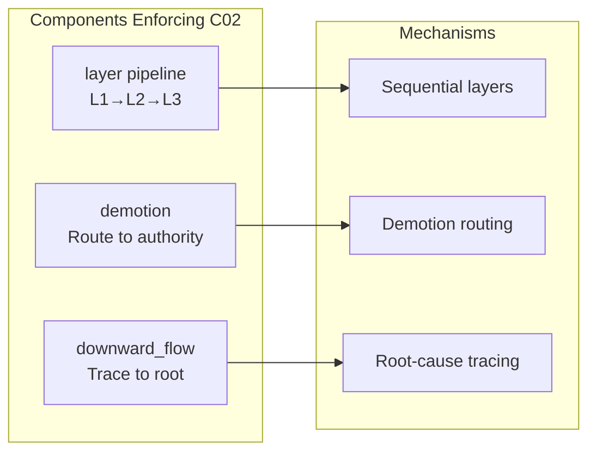
```mermaid
flowchart LR
    subgraph IMPLEMENTS["Components Enforcing C02"]
        LL["layer pipeline<br/>L1→L2→L3"]
        DM["demotion<br/>Route to authority"]
        DF["downward_flow<br/>Trace to root"]
    end

    subgraph MECHANISM["Mechanisms"]
        M1["Sequential layers"]
        M2["Demotion routing"]
        M3["Root-cause tracing"]
    end

    LL --> M1
    DM --> M2
    DF --> M3
```

| Component | How C02 Is Enforced |
|-----------|---------------------|
| `orchestration/pdd_lifecycle` | L1 (source-closest) stabilizes before L2 begins. L2 stabilizes before
|  L3. No derived layer starts while source layer is changing. |
| `orchestration/demotion` | `DemotionRouter.route()` sends failures to the layer with authority: behavior_change→L1,
|  wiring_only→L2, refactor_only→fix-in-layer. |
| `orchestration/downward_flow` | `DownwardFlowEngine.trace()` traces test failures through pin graph
|  to root cause. Does not patch symptoms. |
| `planner/layers/l1` | L1Planner operates on spec comments (source authority). Code IS the spec at L1. |
| `planner/layers/l2` | L2Planner operates on promoted L1 output only. Never reads raw spec — only L1-verified atoms. |
| `planner/layers/l3` | L3Planner operates on promoted L2 output. Quality refinement, not requirement interpretation. |
| `projection/drift` | `AtomAwareDriftComparator` detects when derived artifacts diverge from source.
|  Drift signals trigger re-derivation, not source editing. |

**Active enforcement:**
* Layer isolation is structural: `pdd_lifecycle.py` gates L2 start on L1 completion, L3 start on L2 completion.
  No bypass path exists.
* `demotion/triage.py` classifies every failure by `required_change_type` and routes to the layer with
  authority — not the layer where the symptom appeared.
* `downward_flow/engine.py` traces through the pin graph before any fix attempt — root cause identification
  is mandatory.

### 3.4 Error Amplification (C03)

*"Error cost grows multiplicatively with propagation distance. Check
quality in sequential gates. Surface errors immediately."*

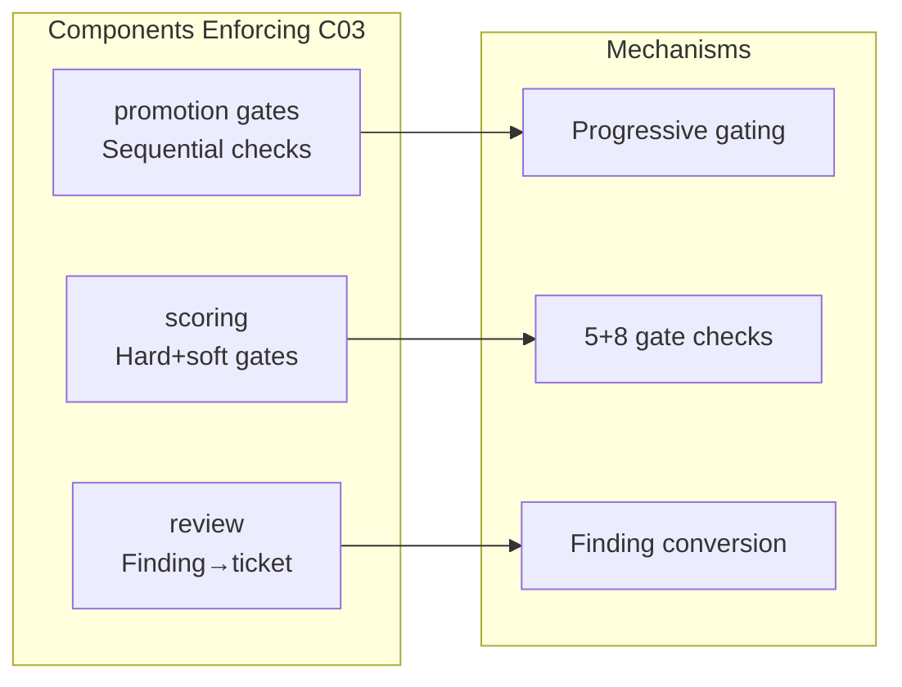
```mermaid
flowchart LR
    subgraph IMPLEMENTS["Components Enforcing C03"]
        PG["promotion gates<br/>Sequential checks"]
        SC["scoring<br/>Hard+soft gates"]
        RV["review<br/>Finding→ticket"]
    end

    subgraph MECHANISM["Mechanisms"]
        M1["Progressive gating"]
        M2["5+8 gate checks"]
        M3["Finding conversion"]
    end

    PG --> M1
    SC --> M2
    RV --> M3
```

| Component | How C03 Is Enforced |
|-----------|---------------------|
| `compliance/promotion` | Progressive gating: L1 has 5 algorithmic gates (no comments, no stubs, tests
|  pass, call graph connected, store monogamy). L2 has 8 LLM-based gates. Each gate blocks until passed. |
| `evaluation/scoring` | `RunReporter` computes 5 hard gates + 6 soft signals. Hard gate failure blocks
|  promotion. Soft signal degradation triggers warnings. |
| `evaluation/quality` | `QualityReporter` blends mechanical metrics (0.35-0.40 weight) with LLM judge
|  scores (0.60-0.65 weight). Thresholds: PASS ≥ 0.80, WARN 0.65-0.80, FAIL < 0.65. |
| `orchestration/review` | `convert_findings()` immediately converts reviewer findings to `DemotionTicket`s.
|  Errors don't accumulate — they route to the correct layer for fixing. |
| `orchestration/promotion_loop` | Each of 10 steps checks its preconditions. Failure at any step halts
|  forward progress until resolved. |
| `compliance/coverage_gate` | Coverage < 100% blocks promotion but produces valid fallback state (CON-0009)
|  . Error is caught before propagation. |

**Active enforcement:**
* All silent `except` handlers across the codebase now log with `logger.warning()` or `logger.debug()`
* All silent `except` handlers across the codebase now log with
  `logger.warning()` or `logger.debug()` and `exc_info=True`. 30+ handlers fixed in:
  `comment_planning/`, `decomposition/`, `compliance/`, `planner/strategies/`,
  `refinement/evals/`, `refinement/workflows/`, `strategies/`, `projection/`,
  `orchestration/`, `core/`, `evaluation/`.
* `promotion_loop.py`: Verify step agent failures log warnings (previously returned `{}` silently).
* `promotion_scheduler.py`: `TimeoutError` in polling loop is documented as expected behavior, not a swallowed error.
* `hollowed_spec/hooks.py`: Corrupted evidence index triggers a warning + fresh rebuild, not silent fallback.
* `core/gaps.py`: LLM-based claim/proof search failures log at debug level with full exception info.

### 3.5 Coupling (C04)

*"Coupling through internals amplifies fragility. Coordinate through
signals, not direct calls. Cross boundaries through projections."*

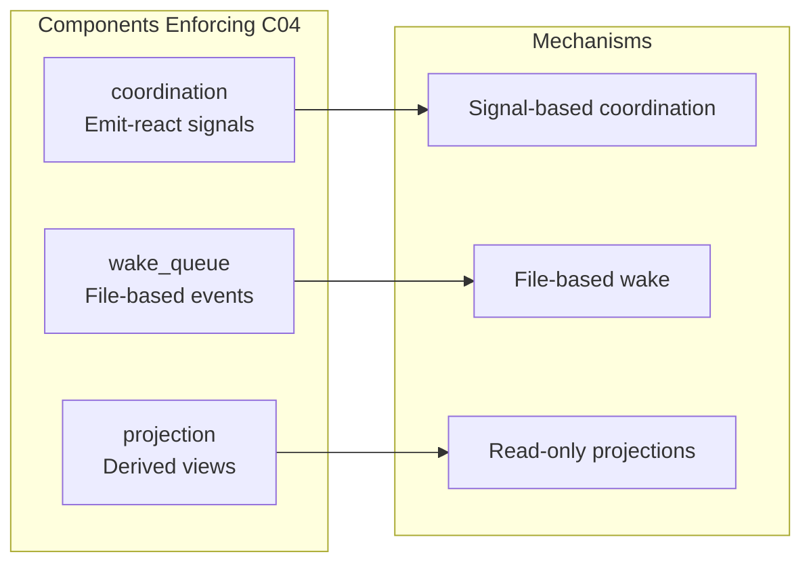
```mermaid
flowchart LR
    subgraph IMPLEMENTS["Components Enforcing C04"]
        CS["coordination<br/>Emit-react signals"]
        WQ["wake_queue<br/>File-based events"]
        PR["projection<br/>Derived views"]
    end

    subgraph MECHANISM["Mechanisms"]
        M1["Signal-based coordination"]
        M2["File-based wake"]
        M3["Read-only projections"]
    end

    CS --> M1
    WQ --> M2
    PR --> M3
```

| Component | How C04 Is Enforced |
|-----------|---------------------|
| `orchestration/coordination` | `CoordinationSignal` is an emit-react pattern. Producers emit signals;
|  consumers subscribe and react independently. No direct call coupling between slices. |
| `orchestration/coordination/wake_queue` | File-based wake events decouple scheduler from slice execution.
|  Slice completes → writes wake file → scheduler discovers. |
| `orchestration/coordination/wait_graph` | `WaitGraph` with cycle detection prevents deadlock from circular
|  dependencies. |
| `orchestration/coordination/monitors` | `MonitorSpec` (declarative JSON DSL) decouples condition definition
|  from condition checking. |
| `projection` | `ProjectionGenerator` produces read-only derived views.
|  Consumers never modify the projection — they read it. Source changes
|  → projection regenerated. |
| `planner/tools` | Each tool is an adapter over a subsystem. `ResearchTool` wraps
  `ResearchCoordinator`. |  `IntegrationTool` wraps `SourceAnalysisCache`. Tools provide stable interfaces
   that decouple planner from subsystem internals. |
| `orchestration/run_state` | `RunStateManager` isolates each run's state. No accidental sharing between runs. |
**Active enforcement:**
* Package `__init__.py` exports added for `orchestration`, `core`, `planner`, `planner/constraints`,
  `planner/architecture`, `planner/tools`, `planner/strategies`, `refinement`, `intake`. Consumers
  can import through the public API.
* Backward-compatible re-exports in `orchestration/models.py` (→ `core/layer_types.py`) allow gradual migration.
* `vcs/` and `evaluation/` extracted as independent packages — no longer coupled through `orchestration/` internals.

### 3.6 Fractal Scoping (C05)

*"Work at smallest self-contained scope. Compose scoped results. Apply
same process at every scale."*

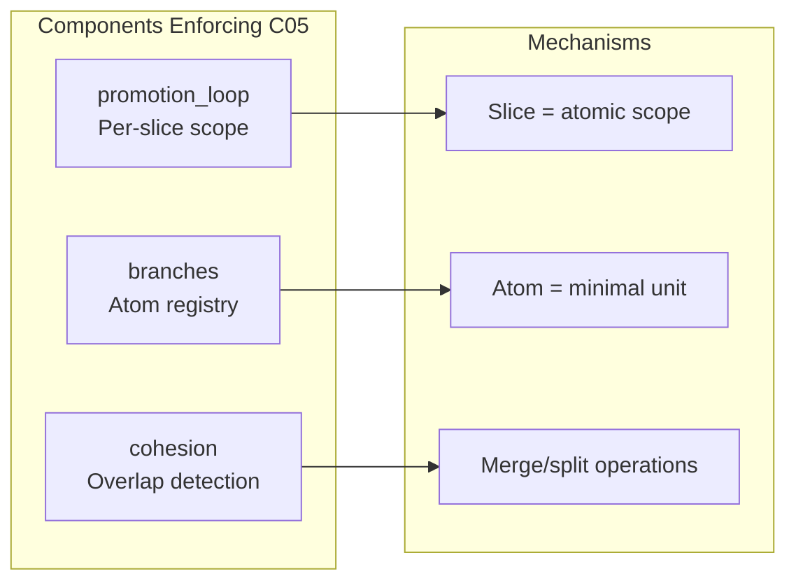
```mermaid
flowchart LR
    subgraph IMPLEMENTS["Components Enforcing C05"]
        PL["promotion_loop<br/>Per-slice scope"]
        BR["branches<br/>Atom registry"]
        CH["cohesion<br/>Overlap detection"]
    end

    subgraph MECHANISM["Mechanisms"]
        M1["Slice = atomic scope"]
        M2["Atom = minimal unit"]
        M3["Merge/split operations"]
    end

    PL --> M1
    BR --> M2
    CH --> M3
```

| Component | How C05 Is Enforced |
|-----------|---------------------|
| `orchestration/promotion_loop` | Each slice is an independent, self-contained scope. The 10-step state
|  machine runs per-slice. Results compose at the layer level. |
| `branches/atoms` | `AtomRegistry` manages atomic units of work. Each atom is self-contained and independently
|  verifiable. |
| `branches/slices` | `SliceNavigator` scopes work to the minimum set of atoms needed for a decision. |
| `cohesion/detector` | Detects scope violations: overlap (two units share responsibility), divergence
|  (one unit has unrelated responsibilities), overload (unit too large). |
| `compliance/promotion` | Same progressive gating pattern at L1, L2, and L3 — different gates, same
|  structure. Scale-invariant process. |
| `planner/layers` | L1, L2, L3 planners share the same `LayerPlanner` protocol. Same interface at every
|  scale, different implementations for different scopes. |
| `orchestration/pdd_lifecycle` | Composition: L1 outputs compose into L2 inputs. L2 outputs compose
|  into L3 inputs. Bottom-up assembly. |

**Active enforcement:**
* Scope isolation is structural: `promotion_loop.py` processes one slice at a time through all 10 steps.
  No batch operations mix slice scopes.
* `cohesion/detector.py` flags scope violations (overlap, divergence, overload) as structured findings
  that feed back into the demotion system.
* Layer planners share `LayerPlanner` protocol — same process shape at L1/L2/L3, enforced by the type system.

---

## 4. Code Quality Gate Enforcement

The spec manager enforces quality gates at three levels: algorithmic
(L1), architectural (L2), and code quality (L3). Below, each gate is
mapped to its enforcement points.

### 4.1 L1 Algorithmic Gates (5 Hard Gates)

These apply to every library at L1 promotion. All must pass.

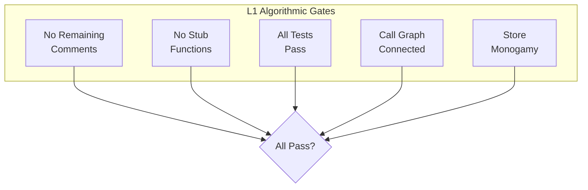
```mermaid
flowchart TB
    subgraph GATES["L1 Algorithmic Gates"]
        G1["No Remaining<br/>Comments"]
        G2["No Stub<br/>Functions"]
        G3["All Tests<br/>Pass"]
        G4["Call Graph<br/>Connected"]
        G5["Store<br/>Monogamy"]
    end

    G1 --> PASS{All Pass?}
    G2 --> PASS
    G3 --> PASS
    G4 --> PASS
    G5 --> PASS
```

| Gate | Module | What It Checks |
|------|--------|----------------|
| No remaining comments | `compliance/promotion/algorithmic_gates.py` | Every comment in algorithmic
|  code is unimplemented spec. None may remain. |
| No stub functions | `compliance/promotion/algorithmic_gates.py` | Scans for `pass`, `...`, `NotImplementedError`.
|  No stubs allowed. |
| All tests pass | `compliance/promotion/algorithmic_gates.py` | pytest verification. All tests must pass. |
| Call graph connected | `compliance/promotion/algorithmic_gates.py` | Adaptive call-edge extraction using AST +
  agent-prompt parsers + JIT-created text parser strategies, plus configured
  `entry_points` roots. |
| Store monogamy | `compliance/promotion/algorithmic_gates.py` | Each data store accessed by exactly
|  one component. No shared mutable state. |

### 4.2 L2 Architectural Gates (8 LLM-Based Gates)

These apply to every component at L2 promotion. LLM judges evaluate
architectural quality.

| Gate | What It Checks |
|------|----------------|
| No inlined atom logic | Architectural layer must not copy-paste algorithmic logic. Detection: hash
|  match, text similarity (>0.80), fingerprint overlap (>0.60). |
| Interface completeness | All consumed interfaces have matching providers. |
| Dependency direction | Dependencies flow downward through tiers. No upward violations. |
| Component cohesion | Each component has a single responsibility. |
| Contract consistency | Provided interfaces match consumed interface expectations. |
| Error handling | Errors are surfaced, not absorbed. Fallback states are valid. |
| Configuration externalization | No hardcoded configuration that should be parameterized. |
| Topology soundness | No cycles in the component dependency graph. |

### 4.3 L3 Quality Gates (Mechanical + Judge Blend)

These apply at L3 promotion. Blended scoring from mechanical metrics
and LLM judges.

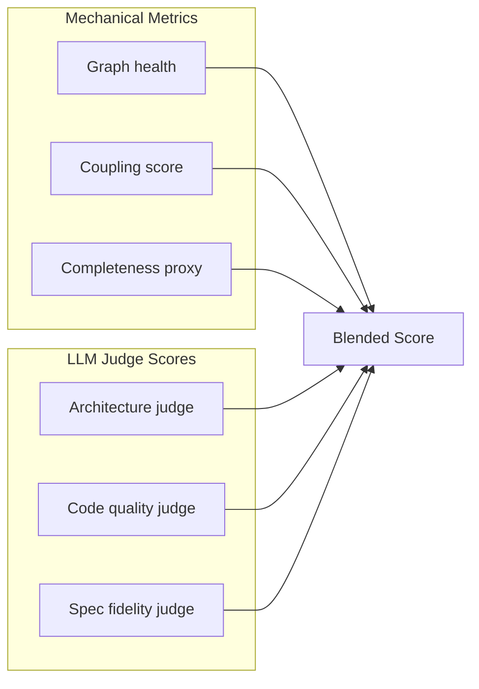
```mermaid
flowchart LR
    subgraph MECHANICAL["Mechanical Metrics"]
        M1["Graph health"]
        M2["Coupling score"]
        M3["Completeness proxy"]
    end

    subgraph JUDGE["LLM Judge Scores"]
        J1["Architecture judge"]
        J2["Code quality judge"]
        J3["Spec fidelity judge"]
    end

    BLEND["Blended Score"]

    M1 --> BLEND
    M2 --> BLEND
    M3 --> BLEND
    J1 --> BLEND
    J2 --> BLEND
    J3 --> BLEND
```

| Dimension | Mechanical Weight | Judge Weight | PASS | WARN | FAIL |
|-----------|-------------------|-------------|------|------|------|
| Architecture quality | 0.35 | 0.65 | ≥ 0.80 | 0.65-0.80 | < 0.65 |
| Code quality | 0.40 | 0.60 | ≥ 0.80 | 0.65-0.80 | < 0.65 |
| Spec fidelity | — | 1.00 | ≥ 0.80 | 0.65-0.80 | < 0.65 |

**CRITICAL risk** at any level forces FAIL regardless of score.

### 4.4 Per-Component Quality Gate Coverage

| Component | L1 Gates | L2 Gates | L3 Gates | Coverage Gate | Demotion Target |
|-----------|----------|----------|----------|---------------|-----------------|
| `core` | — | — | — | — | Foundation: not gated (tested via consumers) |
| `schemas` | — | — | — | — | Foundation: not gated (validated by Pydantic) |
| `intake` | — | — | — | — | Phase 0 output verified by eval harness |
| `compliance` | Enforces L1 gates | Defines L2 gates | — | Enforces 100% | Self-referential: gates gate the gates |
| `evaluation` | — | — | Produces L3 scores | — | Reports quality, does not gate |
| `refinement` | Workspace integrity | — | Evidence indexed | — | L1 (workspace errors) |
| `orchestration` | Step preconditions | Topology checks | Review findings | Per-slice | Routes to demotion |
| `planner` | Function intentions | Wiring intentions | Refactor intentions | — | L1 (decision errors) |
| `projection` | Lineage completeness | — | — | — | L1 (trace breaks) |
| `branches` | Atom completeness | — | — | — | Bidirectional with compliance |
| `cohesion` | — | Component boundaries | — | — | L2 (structural issues) |
| `vcs` | — | — | — | — | Infrastructure: tested directly |
| `comment_planning` | Comment insertion | — | — | — | L1 (comment errors) |
| `strategies` | Strategy validity | — | — | — | L1 (strategy failures) |
| `pin_functions` | Pin completeness | — | — | — | L1 (missing pins) |

---

## 5. Tradeoff Enforcement

The system uses lexicographic priority: **Fidelity > Robustness >
Diagnosability > Efficiency > Speed**. Each component's tradeoff
decisions are mapped below.

### 5.1 Fidelity Enforcement

| Component | Fidelity Mechanism | What It Sacrifices |
|-----------|--------------------|--------------------|
| `compliance/coverage_gate` | 100% atom accounting. Blocks on incomplete coverage. | Speed (blocks pipeline). |
| `orchestration/under_spec` | Hard-stop on ambiguity. Does not guess. | Automation (requires human input). |
| `evaluation/quality` | Multi-model judge scoring. Powerful models for verification. | Token cost (LLM
|  calls for every assessment). |
| `planner/api` | BLOCKED/WAITING states. Never proceeds with insufficient info. | Speed (slice waits). |
| `orchestration/promotion_loop` | Sequential 10-step validation per slice. | Speed (no shortcuts). |
| `refinement/workspace` | Immutable spec snapshot. Never modifies source. | Storage (duplicated artifacts). |

### 5.2 Robustness Enforcement

| Component | Robustness Mechanism | What It Sacrifices |
|-----------|----------------------|--------------------|
| `core/agent_utils` | `run_agent()` accepts arbitrary prompts, any model. Language/domain agnostic.
|  | Simplicity (generic interface). |
| `schemas` | Dynamic Pydantic models accommodate arbitrary domain types. | Type safety (flexible > rigid). |
| `intake` | LLM inference for library discovery (handles any prose format). | Determinism (LLM non-deterministic). |
| `strategies` | Strategy framework with evolution pipeline. Adapts to new domains. | Simplicity (strategy
|  infrastructure). |
| `orchestration/coordination` | 5 monitor condition types. Handles diverse coordination patterns. |
|  Complexity (rich coordination). |

### 5.3 Diagnosability Enforcement

| Component | Diagnosability Mechanism | What It Sacrifices |
|-----------|--------------------------|---------------------|
| `orchestration/evidence` | Immutable `EvidenceBundle` per slice/iteration. 18+ Ref sub-types. | Storage
|  (audit trail grows). |
| `planner/trace` | `PlannerTrace` + `DecisionRecord` + index. Every decision logged. | Storage (trace files). |
| `evaluation/report` | `FinalReportGenerator` writes end-of-run diagnostic reports. | Speed (report generation). |
| `evaluation/cost_ledger` | `CostLedger` tracks every LLM call with cost. | Overhead (per-call tracking). |
| `orchestration/review` | Findings converted to structured tickets. Nothing silently discarded. | Convenience
|  (verbose output). |

---

## 6. Data Flow

### 6.1 Primary Pipeline Flow

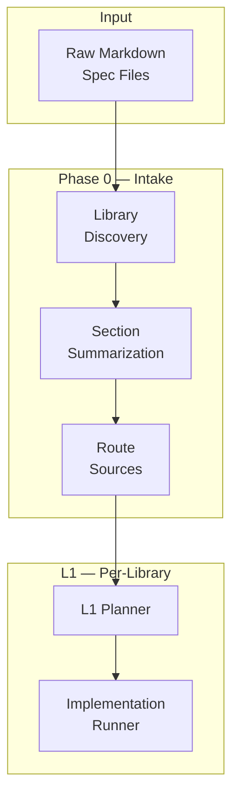
```mermaid
flowchart TB
    subgraph INPUT["Input"]
        RAW["Raw Markdown<br/>Spec Files"]
    end

    subgraph PHASE0["Phase 0 — Intake"]
        DISC["Library<br/>Discovery"]
        SUMM["Section<br/>Summarization"]
        ROUTE["Route<br/>Sources"]
    end

    subgraph L1_PIPE["L1 — Per-Library"]
        L1PL["L1 Planner"]
        L1IM["Implementation<br/>Runner"]
    end

    RAW --> DISC --> SUMM --> ROUTE
    ROUTE --> L1PL --> L1IM
```

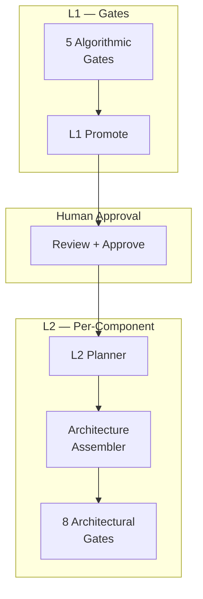
```mermaid
flowchart TB
    subgraph L1_GATE["L1 — Gates"]
        L1G["5 Algorithmic<br/>Gates"]
        L1P["L1 Promote"]
    end

    subgraph HUMAN["Human Approval"]
        HA["Review + Approve"]
    end

    subgraph L2_PIPE["L2 — Per-Component"]
        L2PL["L2 Planner"]
        ARCH["Architecture<br/>Assembler"]
        L2G["8 Architectural<br/>Gates"]
    end

    L1G --> L1P --> HA
    HA --> L2PL --> ARCH --> L2G
```

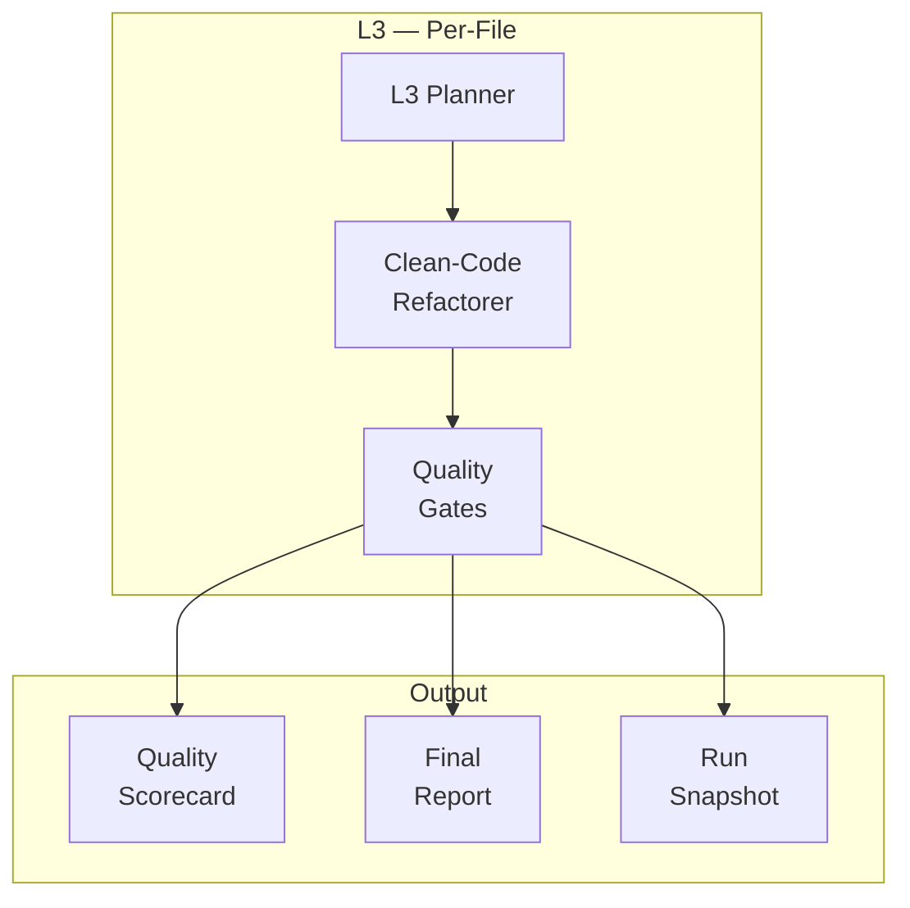
```mermaid
flowchart TB
    subgraph L3_PIPE["L3 — Per-File"]
        L3PL["L3 Planner"]
        REFAC["Clean-Code<br/>Refactorer"]
        L3G["Quality<br/>Gates"]
    end

    subgraph OUTPUT["Output"]
        SCORE["Quality<br/>Scorecard"]
        REPORT["Final<br/>Report"]
        SNAP["Run<br/>Snapshot"]
    end

    L3PL --> REFAC --> L3G
    L3G --> SCORE
    L3G --> REPORT
    L3G --> SNAP
```

### 6.2 Demotion Flow (Error Handling)

When a gate fails, the failure routes to the layer with authority:

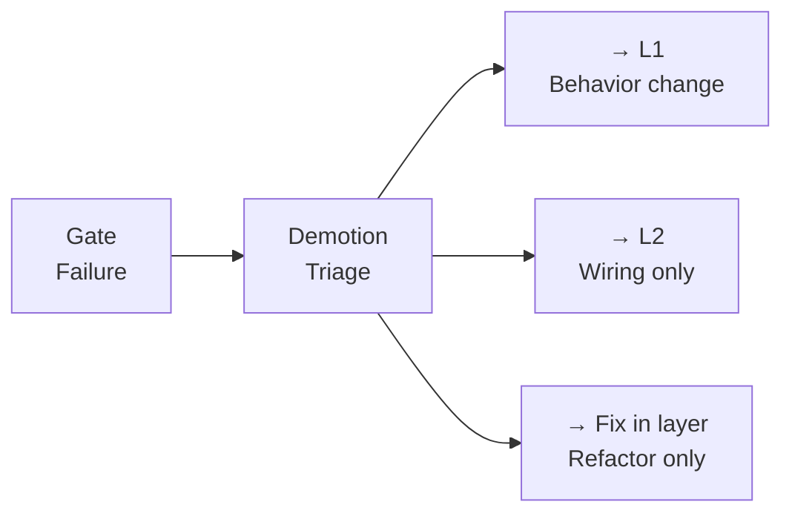
```mermaid
flowchart LR
    FAIL["Gate<br/>Failure"]
    TRIAGE["Demotion<br/>Triage"]
    L1D["→ L1<br/>Behavior change"]
    L2D["→ L2<br/>Wiring only"]
    L3D["→ Fix in layer<br/>Refactor only"]

    FAIL --> TRIAGE
    TRIAGE --> L1D
    TRIAGE --> L2D
    TRIAGE --> L3D
```

### 6.3 Coordination Flow (Cross-Slice)

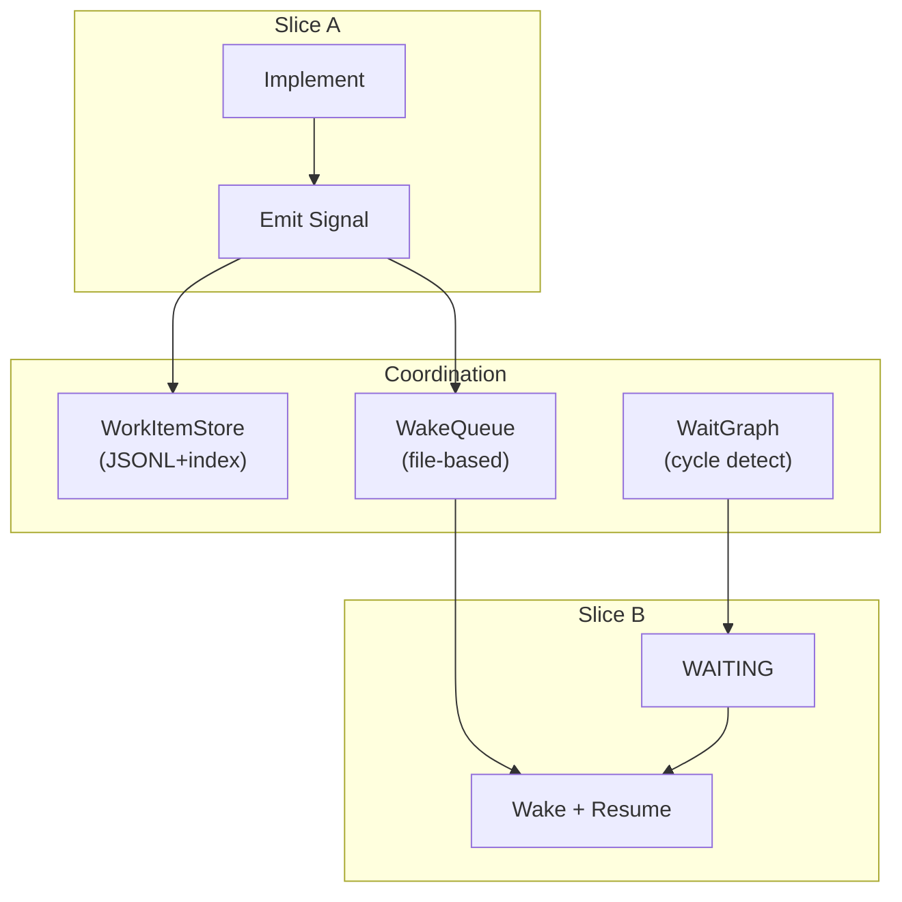
```mermaid
flowchart TB
    subgraph SLICE_A["Slice A"]
        SA_IMPL["Implement"]
        SA_SIG["Emit Signal"]
    end

    subgraph COORD["Coordination"]
        WI["WorkItemStore<br/>(JSONL+index)"]
        WQ["WakeQueue<br/>(file-based)"]
        WG["WaitGraph<br/>(cycle detect)"]
    end

    subgraph SLICE_B["Slice B"]
        SB_WAIT["WAITING"]
        SB_WAKE["Wake + Resume"]
    end

    SA_IMPL --> SA_SIG --> WI
    SA_SIG --> WQ
    WQ --> SB_WAKE
    WG --> SB_WAIT
    SB_WAIT --> SB_WAKE
```

### 6.4 Execution surfaces and entrypoints

| Surface | Entrypoint |
|--------|------------|
| Primary lifecycle | `PddLifecycle.run_loop` |
| Pipeline mode | `PddOrchestrator.run` (`mode='pipeline'`) |
| Agent / CLI paths | `spec_manager.agents`, CLI entry scripts |

Call-graph gating is adaptive and provenance-aware (AST + agent prompt parser alignment and
  JIT parser strategy creation), with `entry_points` in CALL_GRAPH_CONNECTED gate
  params marking externally-invoked roots that are valid despite missing direct edges.

---

## 7. Dependency Analysis

### 7.1 Hub Analysis

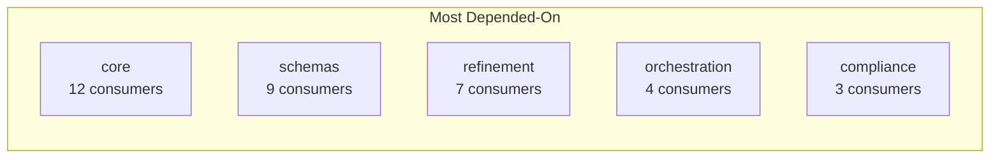
```mermaid
flowchart LR
    subgraph HUBS["Most Depended-On"]
        H1["core<br/>12 consumers"]
        H2["schemas<br/>9 consumers"]
        H3["refinement<br/>7 consumers"]
        H4["orchestration<br/>4 consumers"]
        H5["compliance<br/>3 consumers"]
    end
```

### 7.2 Bidirectional Dependencies

All mitigated by lazy imports within function bodies:

| Pair | Imports | Nature |
|------|---------|--------|
| `core` ↔ `schemas` | 8 | Schemas use core data structures |
| `orchestration` ↔ `planner` | 6 | Coordinator ↔ decision-maker |
| `orchestration` ↔ `refinement` | 11 | Orchestrator ↔ executor |
| `compliance` ↔ `branches` | 12 | Gates need atoms, atoms need compliance |
| `core` ↔ `refinement` | 45 | Highest coupling (expected: foundation ↔ primary user) |

### 7.3 Bottleneck Points

These are single points through which most work flows:

1. **`orchestration.promotion_loop.PromotionLoop`** — all slice work
2. **`planner.api.Planner`** — all planning decisions
3. **`refinement.workspace.WorkspaceManager`** — all file I/O
4. **`orchestration.evidence.EvidenceBundle`** — all audit trails
5. **`core.agent_utils.run_agent()`** — all LLM calls

---

## 8. Critical Thresholds

| Parameter | Value | Module | Constraint |
|-----------|-------|--------|------------|
| Atom coverage required | 100% | `compliance/coverage_gate` | C01 (Information Permanence) |
| Compliance threshold | 0.90 | `compliance/coverage_gate` | C03 (Error Amplification) |
| Quality gate PASS | ≥ 0.80 | `evaluation/quality` | C03 (Error Amplification) |
| Quality gate WARN | 0.65-0.80 | `evaluation/quality` | C03 (Error Amplification) |
| Quality gate FAIL | < 0.65 | `evaluation/quality` | C03 (Error Amplification) |
| Architecture quality blend | 0.35 mech + 0.65 judge | `evaluation/quality` | Fidelity > automation |
| Code quality blend | 0.40 mech + 0.60 judge | `evaluation/quality` | Fidelity > automation |
| Text similarity threshold | 0.80 | `compliance/promotion/architectural_quality` | C04 (Coupling) |
| Fingerprint overlap threshold | 0.60 | `compliance/promotion/architectural_quality` | C04 (Coupling) |
| Max spec build iterations | 5 | `refinement/spec_building` | C00 (Proportional Commitment) |
| Evidence priority high | 0.70 | `refinement/evidence_expansion` | C01 (Information Permanence) |
| Evidence priority drop | 0.30 | `refinement/evidence_expansion` | C01 (Information Permanence) |

---

## 9. Communication Patterns

### Synchronous (Direct Function Calls)

All inter-package communication uses direct imports. Circular
dependencies mitigated by lazy imports within function bodies.

### Asynchronous (File-Based Signals)

| Signal | Format | Location |
|--------|--------|----------|
| `CoordinationSignal` | JSON | `signals.json` per iteration |
| `WorkItemStore` | JSONL + index | `work_items.jsonl` + `index.json` |
| `EvidenceBundle` | Immutable artifacts | Per slice/iteration directory |
| `WakeEvent` | File marker | Wake queue directory |

### Shared State

| State | Manager | Scope |
|-------|---------|-------|
| Workspace files | `WorkspaceManager` | Per-run |
| Run config/metadata | `RunStateManager` | Per-run |
| Analysis cache | `SourceAnalysisCache` | SHA-256 keyed, cross-run |
| Planner trace | `PlannerTrace` | Per-run, append-only |

---

## 10. Package Public APIs

### 10.1 Stable APIs (Cross-Package Contract)

These APIs are used by multiple packages and must not change signature
without updating all consumers:

| API | Package | Consumers |
|-----|---------|-----------|
| `run_agent(prompt, model_id)` | `core` | 12 packages |
| `analyze_source(content, filepath)` | `core` | 6 packages |
| `Planner.plan(request)` | `planner` | orchestration |
| `PromotionLoop.run(slice_id, bundle)` | `orchestration` | pdd_lifecycle |
| `WorkspaceManager.*` | `refinement` | 7 packages |
| `EvidenceBundle.*` | `orchestration` | all promotion steps |
| `LayerPromotionGate.check()` | `compliance` | promotion_loop |
| `verify_coverage_or_emit_gap()` | `compliance` | promotion_loop |

### 10.2 Evolving APIs (Active Development)

| API | Package | Status |
|-----|---------|--------|
| `planner/strategies/*` | `planner` | Planning session pipeline |
| `planner/constraints/*` | `planner` | Constraint lifecycle |
| `orchestration/coordination/*` | `orchestration` | JIT monitors, work items |
| `refinement/evals/judges/*` | `refinement` | Judge infrastructure |
| `evaluation/*` | `evaluation` | Quality scoring, model comparison |

---

## 11. Eval Fixtures

### Chaotic Treasury Expanded (Primary Eval Corpus)

10 markdown spec files at `refinement/evals/inputs/fixtures/chaotic_treasury_expanded/`:

| File | Domain |
|------|--------|
| `overview.md` | System overview |
| `transaction_validation.md` | Transaction validation rules |
| `settlement_processing.md` | Settlement processing pipeline |
| `risk_engine.md` | Risk assessment engine |
| `reconciliation_service.md` | Reconciliation workflows |
| `event_pipeline.md` | Event processing pipeline |
| `regulatory_compliance.md` | Regulatory compliance checks |
| `notification_and_audit.md` | Notification and audit trails |
| `cross_system_invariants.md` | Cross-system invariants |
| `deployment_and_operations.md` | Deployment operations |

Phase 0 output workspace at `chaotic_treasury_expanded_phase0_output/`:
* `libraries.json` — 8 discovered libraries (LIB-01 through LIB-08)
* `coverage_ledger.jsonl` — atom accounting
* `route_table.jsonl` — source routing
* `libraries/LIB-*/` — per-library details, algorithms, constraints
* `summaries/*.json` — per-section summaries
* `system/constraints.md` — system-wide constraints

### Eval Results (Phase 0)

* Sectionization: 100% (10/10 sections)
* Library discovery: 7/8 (LLM merged TransactionValidator into SettlementProcessor)
* Requirement capture: 52/52 (100% — manual verification)
* PDD Phases 1-10: ALL PASS (38/38 functions, 0 errors, 0 gaps)

---

## 12. Planner Agent

Single decision authority for the PDD pipeline. All planning decisions
route through `Planner.plan()` — no back doors.

### 12.1 Internal Structure

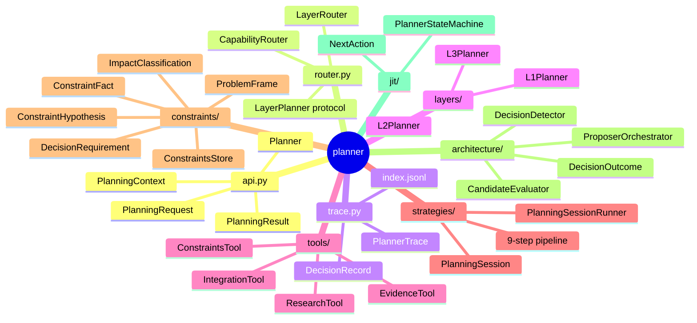
```mermaid
mindmap
  root((planner))
    api.py
      Planner
      PlanningContext
      PlanningRequest
      PlanningResult
    router.py
      LayerRouter
      CapabilityRouter
      LayerPlanner protocol
    trace.py
      PlannerTrace
      DecisionRecord
      index.jsonl
    layers/
      L1Planner
      L2Planner
      L3Planner
    tools/
      ResearchTool
      IntegrationTool
      EvidenceTool
      ConstraintsTool
    strategies/
      9-step pipeline
      PlanningSession
      PlanningSessionRunner
    constraints/
      ConstraintFact
      ConstraintHypothesis
      DecisionRequirement
      ImpactClassification
      ProblemFrame
      ConstraintsStore
    architecture/
      DecisionDetector
      ProposerOrchestrator
      CandidateEvaluator
      DecisionOutcome
    jit/
      PlannerStateMachine
      NextAction
```

### 12.2 Dispatch Flow

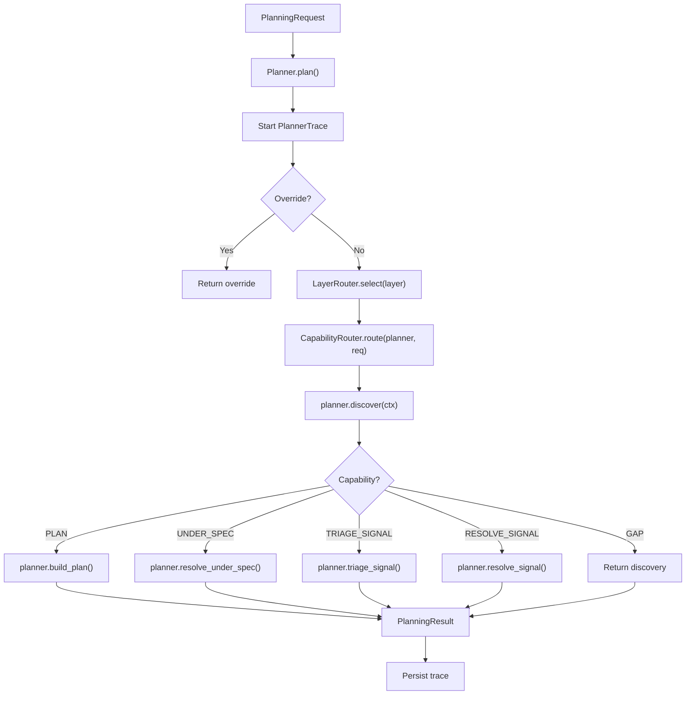
```mermaid
flowchart TB
    REQ["PlanningRequest"] --> API["Planner.plan()"]
    API --> TRACE["Start PlannerTrace"]
    TRACE --> OVR{Override?}
    OVR -->|Yes| RET1["Return override"]
    OVR -->|No| LR["LayerRouter.select(layer)"]
    LR --> CR["CapabilityRouter.route(planner, req)"]
    CR --> DISC["planner.discover(ctx)"]
    DISC --> CAP{Capability?}
    CAP -->|PLAN| BUILD["planner.build_plan()"]
    CAP -->|UNDER_SPEC| RESOLVE["planner.resolve_under_spec()"]
    CAP -->|GAP| RET2["Return discovery"]
    CAP -->|TRIAGE_SIGNAL| TRIAGE["planner.triage_signal()"]
    CAP -->|RESOLVE_SIGNAL| SIG["planner.resolve_signal()"]
    BUILD --> RES["PlanningResult"]
    RESOLVE --> RES
    TRIAGE --> RES
    SIG --> RES
    RET2 --> RES
    RES --> PERSIST["Persist trace"]
```

### 12.3 Capability Dispatch

| Capability | Method Chain | Returns |
|------------|-------------|---------|
| `GAP` | `discover()` | Discovery graph |
| `PLAN` | `discover()` → `build_plan()` | Intentions + strategy outputs |
| `UNDER_SPEC` | `discover()` → `resolve_under_spec()` | BLOCKED or OK + constraints |
| `RESOLVE_SIGNAL` | `resolve_signal()` | OK or NOOP |
| `TRIAGE_SIGNAL` | `triage_signal()` | WAITING or NOOP |
| `INTEGRATION_ANALYSIS` | `discover()` | Integration graph |

### 12.4 Layer Planners

| Aspect | L1 (Code-as-Spec) | L2 (Architecture) | L3 (Quality) |
|--------|--------------------|--------------------|---------------|
| Input | PDD skeleton files | Component manifests, YAML | Changed files, diffs |
| discover() | Parse skeletons → function/class/comment graph | Scan arch YAML → topology graph | Build
|  quality graph → file/smell/risk nodes |
| build_plan() | Map gaps → skeleton functions → intentions | Run 9-strategy pipeline OR research fallback
|  | Map gaps → smell nodes → refactor intentions |
| resolve_under_spec() | 3-strategy cascade: local → evidence → block | Evidence lookup per event, block
|  if unresolved | Match events to smell nodes, infer or block |
| triage_signal() | Full coordination triage (only L1 implements) | NOOP (defers to L1) | NOOP |
| Tools used | evidence_tool, research_tool | All 4 tools + strategy pipeline | integration_tool, evidence_tool |

### 12.5 Tool System

Four adapter tools injected at construction. Each wraps an external
subsystem behind a stable interface.

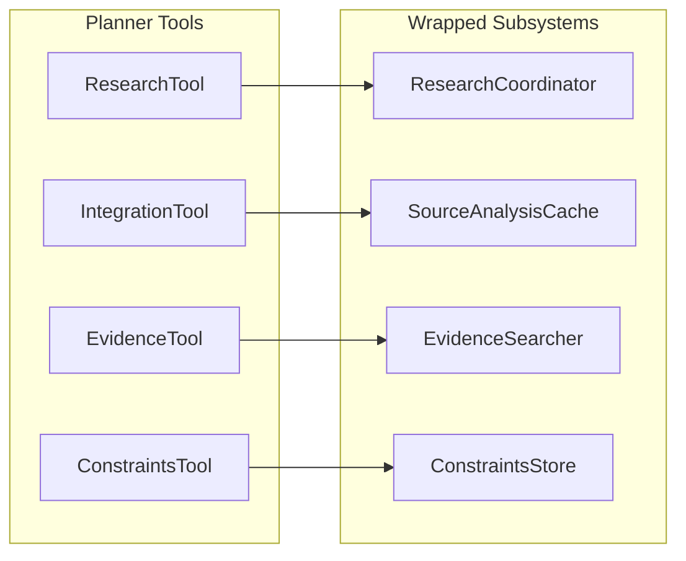
```mermaid
flowchart LR
    subgraph TOOLS["Planner Tools"]
        RT["ResearchTool"]
        IT["IntegrationTool"]
        ET["EvidenceTool"]
        CT["ConstraintsTool"]
    end

    subgraph SUBSYSTEMS["Wrapped Subsystems"]
        RC["ResearchCoordinator"]
        SAC["SourceAnalysisCache"]
        ES["EvidenceSearcher"]
        CS["ConstraintsStore"]
    end

    RT --> RC
    IT --> SAC
    ET --> ES
    CT --> CS
```

| Tool | Input | Output | Resolution Order |
|------|-------|--------|------------------|
| ResearchTool | `ResearchQuery(question, dimension)` | `ResearchResult(findings, confidence)` | Steering
|  script → evidence store → web research |
| IntegrationTool | `file_paths` | `IntegrationGraph(nodes, edges)` + `RiskAssessment` | SourceAnalysisCache
|  → BFS blast radius |
| EvidenceTool | `query` | `EvidenceSearchResult(hits)` | TF-IDF keyword + entity scoring
  over indexed hollowed spec paragraphs |
| ConstraintsTool | `slice_id` | `ConstraintsSnapshot` | Read-only constraint store access |

### 12.6 Research Pipeline

```mermaid
flowchart TB
    Q["ResearchQuery"] --> DIM{Dimension?}
    DIM -->|local/layer| SS["Steering Script"]
    DIM -->|web/external| WEB["Web Research"]
    SS --> HIT{Match?}
    HIT -->|Yes| RES["ResearchResult"]
    HIT -->|No| EV["Evidence Store<br/>(TF-IDF search)"]
    EV --> FOUND{Found?}
    FOUND -->|Yes| RES
    FOUND -->|No| WEB

    subgraph WEB["ResearchCoordinator"]
        direction TB
        S0["Step 0: Evidence store shortcut"]
        S1["Step 1: Signal extractor<br/>(Opus)"]
        S2["Step 2: Web researcher<br/>(GLM + Firecrawl)"]
        S3["Step 3: Synthesizer<br/>(GPT)"]
        S4["Step 4: Confidence < 0.5?<br/>→ TradeoffAnalyzer"]
        S0 --> S1 --> S2 --> S3 --> S4
    end

    WEB --> RES
```

### 12.7 L2 Strategy Pipeline (9 Steps)

Runs only at L2 with `ConstraintStoreAdapter` available. Each strategy
receives a mutable `PlanningSession` and returns it enriched.

```mermaid
flowchart TB
    S1["1. ImpactClassifier<br/>(deterministic)"]
    S2["2. ConstraintCollection<br/>(load from store)"]
    S3["3. TradeoffMapper<br/>(load TRADEOFFS.md)"]
    S4["4. ProblemFramer<br/>(LLM, gated: impact ≥ MEDIUM)"]
    S5["5. ConstraintEnricher<br/>(LLM, discovers hypotheses)"]
    S6["6. NonSoftwareChecklist<br/>(deterministic, gated)"]
    S7["7. ArchitecturePlanner<br/>(LLM, full decision pipeline)"]
    S8["8. AuthorityDecider<br/>(deterministic)"]
    S9["9. QuestionComposer<br/>(LLM, interactive only)"]

    S1 --> S2 --> S3 --> S4 --> S5 --> S6 --> S7 --> S8 --> S9
```

| Step | Type | Gated By | Produces |
|------|------|----------|----------|
| ImpactClassifier | Deterministic | Always runs | `ImpactClassification` (HIGH/MEDIUM/LOW) |
| ConstraintCollection | Store load | Always runs | `ConstraintContext` (facts + hypotheses) |
| TradeoffMapper | File load | Always runs | Tradeoff axes + assignments |
| ProblemFramer | LLM | impact ≥ MEDIUM | `ProblemFrame` (goal, scope, unknowns) |
| ConstraintEnricher | LLM | impact ≥ MEDIUM | New hypotheses, conflicts, requirements |
| NonSoftwareChecklist | Deterministic | impact ≥ MEDIUM | Legal/economic/operational checklist |
| ArchitecturePlanner | LLM | L2 + MEDIUM+ | `DecisionOutcome`s, wiring intentions |
| AuthorityDecider | Deterministic | Always runs | planner_ok → persist, human_required → escalate |
| QuestionComposer | LLM | Interactive mode | Formatted questions for human review |

### 12.8 Architecture Decision Pipeline

Runs inside step 7 (ArchitecturePlanner) of the strategy pipeline.

```mermaid
flowchart TB
    DETECT["DecisionDetector.detect()<br/>(LLM or heuristic)"]
    FILTER["Filter already-covered<br/>by authoritative constraints"]
    SCOPE["Build ScopePacket<br/>(artifacts + constraints + tradeoffs)"]
    PROPOSE["ProposerOrchestrator<br/>K candidates × distinct tradeoff positions"]
    EVAL["CandidateEvaluator<br/>(LLM or heuristic)"]
    SELECT{select_or_block()}

    DETECT --> FILTER --> SCOPE --> PROPOSE --> EVAL --> SELECT
    SELECT -->|Accept| COMMIT["Commit: wiring intentions + new constraints"]
    SELECT -->|Needs human| BLOCK["Block: decision_requirements → under_spec"]
    SELECT -->|All rejected| BLOCKED["Block: under_spec_events"]
    COMMIT --> PERSIST["Persist to reports/pdd/<run_id>/architecture/"]
    BLOCK --> PERSIST
```

| K Value | Condition | Tradeoff Positions |
|---------|-----------|-------------------|
| 3 | HIGH impact | Each candidate prioritizes different axes |
| 1 | MEDIUM impact | Single candidate |

### 12.9 Constraint Lifecycle

```mermaid
flowchart TB
    BOOT["Phase 0 bootstrap<br/>(parse constraints.md)"]
    STORE["ConstraintsStore<br/>(JSON per slice)"]
    LOAD["ConstraintCollection<br/>(merge system + slice)"]
    FRAME["ProblemFramer<br/>(identify unknowns)"]
    ENRICH["ConstraintEnricher<br/>(discover hypotheses)"]
    AUTH{Authority check}

    BOOT --> STORE
    STORE --> LOAD --> FRAME --> ENRICH --> AUTH
    AUTH -->|planner_ok| SAVE["Save via adapter<br/>→ on_constraint_saved callback"]
    AUTH -->|human_required| ESC["Escalate to under_spec"]
    SAVE --> WAKE["WakeQueue event"]
```

| Type | Purpose | Fields |
|------|---------|--------|
| `ConstraintFact` | Validated, authoritative | question, answer, source, confidence, dimension, scope |
| `ConstraintHypothesis` | Unverified, LLM-inferred | question, inferred_answer, confidence, reasoning |
| `DecisionRequirement` | Decision needed before proceeding | question, kind, dimension, impact, options |
| `ImpactClassification` | Change size assessment | impact (HIGH/MEDIUM/LOW), blast_radius, reversibility |
| `ProblemFrame` | Problem definition | goal, scope, domain_markers, decision_points, unknowns |

### 12.10 Planner vs Strategies (Disambiguation)

Two separate strategy systems exist in the codebase:

| Aspect | `planner/strategies/` | `strategies/` (top-level) |
|--------|----------------------|---------------------------|
| Purpose | Planning decision pipeline | Reasoning framework for Phase 0 |
| Protocol | `PlanningStrategy.run(session)` | `Strategy.execute(context)` |
| Context | `PlanningSession` (mutable) | `ProcessingContext` (units) |
| Runner | `PlanningSessionRunner` (sequential) | `StrategyRegistry` (phase-gated) |
| Count | 9 strategies | 12+ strategies |
| Phases | Impact → constraints → architecture | CLEANING → DECOMPOSITION → TRANSLATION |
| Evolution | None (fixed pipeline) | `StrategyEvolutionPipeline` (LLM-proposed) |

---

## 13. Orchestration Engine

Execution backbone. Manages the promotion loop, layer transitions,
coordination, demotion, and implementation.

### 13.1 Internal Structure

```mermaid
mindmap
  root((orchestration))
    promotion_loop.py
      10-step state machine
      Per-slice execution
    pdd_lifecycle.py
      L1→L2→L3 transitions
      Layer entry/exit refinement
    evidence.py
      EvidenceBundle
      18 Ref types
      Finding schema
    coordination/
      CoordinationSignal
      WorkItemStore
      WakeQueue
      WaitGraph
      MonitorSpec
      MonitorExecutor
    demotion/
      DemotionTicket
      Triage (4-tier)
      Router
    implementation/
      ImplementationRunner
      ImplementorOutput
    downward_flow/
      DownwardFlowEngine
      Failure → pins → atoms
    under_spec/
      UnderSpecManager
      Hard-stop blocking
    promotion_scheduler.py
      ReactivePromotionScheduler
      Monitor thread
    run_state.py
      RunConfig
      RunState
    source_analysis_cache.py
      SHA-256 keyed
```

### 13.2 Promotion Loop Steps

```mermaid
flowchart TB
    COLLECT["1. COLLECT<br/>Diff + manifest"]
    GAP["2. GAP<br/>Compliance + GapQueue"]
    PLAN["3. PLAN<br/>Planner intentions"]
    IMPL["4. IMPLEMENT<br/>ImplementationRunner"]
    COORD["5. COORDINATE<br/>Signal triage"]
    ANALYZE["6. ANALYZE<br/>SourceAnalysisCache"]
    PROMOTE["7. PROMOTE<br/>Layer gates"]
    INTEGRATE["8. INTEGRATE<br/>Merge + CI"]
    VERIFY["9. VERIFY<br/>Governance gates"]
    ALIGN["10. ALIGN<br/>Drift checks"]

    COLLECT --> GAP --> PLAN --> IMPL --> COORD
    COORD --> ANALYZE --> PROMOTE
    PROMOTE -->|fail| DEMOTE["Demotion"]
    DEMOTE --> COLLECT
    PROMOTE -->|pass| INTEGRATE
    INTEGRATE -->|test fail| DEMOTE
    INTEGRATE -->|pass| VERIFY
    VERIFY -->|fail| DEMOTE
    VERIFY -->|pass| ALIGN
    ALIGN -->|drift| DEMOTE
    ALIGN -->|clean| DONE{Done?}
    DONE -->|gaps remain| COLLECT
    DONE -->|all clear| COMPLETE["SLICE COMPLETE"]
```

**Termination**: All gaps closed + all atoms promoted, max iterations
reached, or stagnation detected (same gaps for N iterations).

### 13.3 Layer Transitions

```mermaid
flowchart TB
    L1["L1 Complete"] --> T12["L1→L2 Transition"]
    T12 --> REFINE["Arch refinement gate"]
    REFINE --> DEM{Demotions?}
    DEM -->|Yes| REWORK["Rework L1 slices"]
    REWORK --> REFINE
    DEM -->|No| PROP["Propagate clean → L2 dirty"]
    PROP --> CI["Readiness CI"]
    CI --> L2["L2 Start"]
    L2 --> T23["L2→L3 Transition"]
    T23 --> QREFINE["Quality refinement gate"]
    QREFINE --> DEM2{Demotions?}
    DEM2 -->|Yes| REWORK2["Rework L2 slices"]
    REWORK2 --> QREFINE
    DEM2 -->|No| PROP2["Propagate clean → L3 dirty"]
    PROP2 --> L3["L3 Start"]
```

Max 3 rounds per transition. Exceeding → transition STUCK.

### 13.4 Evidence System

| Ref Type | Contents |
|----------|----------|
| `ManifestRef` | Files + SHA-256 hashes |
| `DiffRef` | Changes since previous iteration |
| `ProvenanceBlock` | Tool versions, model IDs |
| `SourceIndexRef` | Per-file SourceAnalysis |
| `FactsRef` | Functions, stores, atoms, constraints, LLM claims |
| `GapReportRef` | Open gaps + stagnation |
| `PlanRef` | Intentions, edit targets, test plan, risks |
| `ImplementationRef` | Patch + pin/edge proposals + under_spec events |
| `UnderSpecRef` | Resolved decisions + blockers |
| `PinsSnapshotRef` | Pin registry state |
| `GraphSnapshotRef` | Full graph state |
| `GraphDeltaRef` | Incremental graph changes |
| `PromotionReportRef` | Gate results |
| `GatesReportRef` | Per-gate pass/fail |
| `RefinementRef` | Coupling/cohesion findings |
| `IntegrationRef` | Merge result |
| `TestsRef` | Test paths + results |
| `VerificationRef` | Governance check results |
| `DemotionsRef` | Emitted/applied/pending tickets |

### 13.5 Coordination System

```mermaid
flowchart TB
    AGENT["Agent halts"] --> SIG["Emit CoordinationSignal<br/>(signals.json)"]
    SIG --> TRIAGE["Planner.triage_signal()"]
    TRIAGE --> SEARCH["WorkItemStore<br/>3-stage search"]
    SEARCH --> CLASS{Classify}
    CLASS -->|Resolvable| RETURN["Return artifact"]
    CLASS -->|Need monitor| MON["Register MonitorSpec"]
    MON --> SCHED["Slice → WAITING"]

    subgraph MONITOR["Monitor Thread (every 20s)"]
        CHECK["MonitorExecutor.run_once()"]
        COND{Condition met?}
        CHECK --> COND
        COND -->|Yes| FIRE["Fire + WakeEvent"]
        COND -->|No| WAIT["Continue polling"]
    end

    FIRE --> DEQUEUE["Scheduler dequeues"]
    DEQUEUE --> RESUME["Re-queue slice"]
```

| Component | Storage | Purpose |
|-----------|---------|---------|
| CoordinationSignal | `signals.json` per iteration | Agent halt classification (6 types) |
| WorkItemStore | `work_items.jsonl` + `index.json` | Append-only work item registry |
| WakeQueue | `wake_events/wake_*.json` | File-backed per-slice wake events |
| WaitGraph | In-memory | Directed graph with cycle detection |
| MonitorSpec | `monitors/<id>.json` | Declarative condition DSL (5 types) |
| MonitorExecutor | In-memory | Hybrid poll+event condition checker |

**WorkItemStore 3-stage search**: exact (SHA-256 fingerprint) → fuzzy
(Jaccard + identifier boost, threshold 0.3) → semantic (LLM rerank placeholder).

**Monitor condition types**: GitSymbolExists, WorkItemDone,
ConstraintPresent, SliceMerged, Compound (AND/OR).

### 13.6 Demotion System

```mermaid
flowchart LR
    FAIL["Failure"] --> TRACE["DownwardFlowEngine<br/>files → pins → atoms"]
    TRACE --> TRIAGE["Triage<br/>(4-tier priority)"]
    TRIAGE --> TICKET["DemotionTicket"]
    TICKET --> APPLY["DemotionManager.apply()"]
    APPLY --> LEDGER["ledger.jsonl"]
    APPLY --> GAP["GapQueue"]
```

**Triage priority** (first match wins):

| Priority | Field | Routing |
|----------|-------|---------|
| 1 | `required_change_type` | behavior_change→L1, wiring_only→L2, refactor_only→fix-in-layer |
| 2 | `category` | LOGIC/SPEC→L1, ARCH→L2, STYLE→L3, GOVERNANCE→block |
| 3 | `gate` | Per-gate routing table |
| 4 | `source` | TEST_FAILURE→L1, REVIEW→L3, etc. |

### 13.7 Implementation Runner

| Field | Type | Description |
|-------|------|-------------|
| `edits` | `list[EditEntry]` | Path + unified diff |
| `pin_proposals` | `list[PinProposal]` | pin_id, fqn, file, role (ATOM/STORE/SHAPE/TEST/ARCH) |
| `edge_proposals` | `list[EdgeProposal]` | src, dst, signal (CALL/STORE_TOUCH/EVENT_EMIT/IMPORT) |
| `tests` | `list[TestArtifact]` | path, purpose, scope (UNIT/SLICE/INTEGRATION) |
| `under_spec_events` | `list[UnderSpecEvent]` | kind, question, options, needed_for |

Under-spec events emit `CoordinationSignal`s → written to `signals.json`.

### 13.8 Reactive Scheduler

```mermaid
flowchart TB
    SUBMIT["Submit slices to ThreadPool<br/>(max_parallel: 4)"]
    SUBMIT --> EXEC{Slice result?}
    EXEC -->|COMPLETE| OK["Record success"]
    EXEC -->|WAITING| REACT{Reactive support?}
    REACT -->|Yes| WAIT["Add to waiting_set"]
    REACT -->|No| FAIL["Convert to FAILED"]
    EXEC -->|FAILED| FAIL2["Record failure"]
    WAIT --> POLL["Monitor thread polls"]
    POLL --> WAKE["WakeEvent → re-queue"]
    WAKE -->|wake_count < max| SUBMIT
    WAKE -->|exceeded| FAIL
```

| Config | Default | Purpose |
|--------|---------|---------|
| `max_parallel` | 4 | Concurrent slice executions |
| `monitor_poll_interval_sec` | 20 | Monitor check frequency |
| `max_wait_cycles` | 10 | Max wakes before FAILED |
| `max_idle_polls` | 50 | Consecutive idle polls before exit |
| `integration_lock` | true | Serialize integration steps |

### 13.9 Under-Spec Manager

Hard-stop blocking policy. No guessing.

```mermaid
flowchart TB
    EVENT["UnderSpecEvent"] --> MODE{Resolution mode?}
    MODE -->|Auto| PLANNER["Planner.resolve_under_spec()"]
    MODE -->|Interactive| HUMAN["Generate constraint_request.md"]
    PLANNER --> VALID{Valid answer?}
    HUMAN --> VALID
    VALID -->|Yes| SAVE["Persist constraint"]
    VALID -->|No| BLOCK["Slice stays BLOCKED"]
    SAVE --> UNBLOCK["Unblock slice"]
```

**Validation rules**: Non-empty, not "TBD"/"TODO"/"unknown"/"N/A",
minimum 5 characters.

---

## 14. Refinement Pipeline

Largest package (155 files). Manages workspace persistence, evidence
indexing, 10-phase workflow orchestration, interactive research, and
eval harnesses.

### 14.1 Internal Structure

```text
mindmap
  root((refinement))
    workspace/
      WorkspaceManager
      WorkspaceState
      Immutable snapshots
    hollowed_spec/
      HollowedSpec parser
      EvidenceIndex
      EvidenceSearcher (TF-IDF)
    workflows/ (34 modules)
      Phase 0: Sectionization
      Phase 1-2: Summarize + Discover
      Phase 3: Evidence expansion
      Phase 4: Spec building
      Phase 5-6: Architecture
      Phase 7: Interfaces
      Phase 8: Tasks
      Phase 9: Implementation
      Phase 10: QA
    interactive/
      AmbiguityDetector
      ResearchCoordinator
      QuestionGenerator
    evals/
      e2e harness
      phase evals (10 modules)
      planner eval (7 modules)
      judges (7 modules)
    cli.py
      init, sectionize, summarize
      synthesize, build-specs, gaps
    formats.py
      JSON extraction
      Code fence stripping
```

### 14.2 Workspace Structure

```text

runs/<run_id>/
├── spec_snapshot/              # Immutable copy of input specs
├── manifest/
│   ├── files.json              # File UID → relpath + SHA-256
│   ├── sections/<file_id>.json # Per-file section manifests
│   ├── atoms/<file_id>.jsonl   # Per-file line atoms
│   └── terms/<file_id>.json    # Per-file domain terms
├── workspace/indexes/          # Edge list, interface index, lineage
├── libraries/<lib_id>/
│   ├── charter.md
│   ├── spec.md
│   ├── gaps.md
│   └── gap_queue.json
├── tasks/<task_id>/
├── audits/
├── reports/
└── state.json                  # Phase status, library IDs
```

**WorkspaceManager**: Run-scoped filesystem orchestrator with immutable
spec snapshot, stable file UIDs (`FileUidRegistry`), and SHA-256 revision
tracking (`RevisionRegistry`).

**WorkspaceState**: Phase tracking (`PhaseResult` per phase:
NOT_STARTED → IN_PROGRESS → COMPLETED/FAILED), library ID allocation
(LIB-0001 through LIB-9999), event history.

### 14.3 Evidence Indexing (Hollowed Spec)

```mermaid
flowchart TB
    SPEC["libraries/*/spec.md"] --> PARSE["HollowedSpec parser"]
    PARSE --> SEC["Sections<br/>(heading hierarchy)"]
    PARSE --> PARA["Paragraphs<br/>(blank-line boundaries)"]
    PARA --> KW["Keyword index<br/>(stop-word filtered)"]
    PARA --> ENT["Entity index<br/>(ENT-#### patterns)"]
    KW --> IDX["EvidenceIndex<br/>(global cross-library)"]
    ENT --> IDX
    IDX --> SEARCH["EvidenceSearcher"]
    SEARCH --> TFIDF["TF-IDF search<br/>(smoothed IDF, 0-1 scores)"]
```

**Paragraph kinds**: PROSE, CODE_BLOCK, TABLE, HEADING, BULLET_LIST.

**Search modes**: keyword, entity, hybrid (2× entity boost).

### 14.4 Workflow Phases

```mermaid
flowchart TB
    P0["Phase 0<br/>Sectionization + Atoms"]
    P12["Phase 1-2<br/>Summarize + Discover"]
    P3["Phase 3<br/>Evidence Expansion"]
    P4["Phase 4<br/>Spec Building"]
    P56["Phase 5-6<br/>Architecture"]
    P7["Phase 7<br/>Interfaces"]
    P8["Phase 8<br/>Tasks"]
    P9["Phase 9<br/>Implementation"]
    P10["Phase 10<br/>QA"]

    P0 --> P12 --> P3 --> P4 --> P56 --> P7 --> P8 --> P9 --> P10
```

| Phase | Module | Input | Output |
|-------|--------|-------|--------|
| 0 | `phase_01_sectionization.py` | Raw .md files | `sections/*.json`, `atoms/*.jsonl` |
| 1-2 | `summarization.py`, `library_synthesis.py` | Sections | `*.what.md`, `libraries.json` |
| 3 | `evidence_expansion.py` | Files + libraries | `evidence.json` per library |
| 4 | `spec_building.py` | Charter + evidence | `spec.md` per library (iterative) |
| 5-6 | `architecture.py`, `library_structure_review.py` | Specs | Architecture proposals, overlap detection |
| 7 | `interfaces.py` | Architecture | Interface contracts |
| 8 | `tasks.py` | Interfaces | Task decomposition + dependencies |
| 9 | `implementation.py` | Tasks | Patches + test execution |
| 10 | `qa_evaluation.py`, `quality_gates.py` | Implementation | Quality gate validation |

### 14.5 Spec Building Iteration

```mermaid
flowchart TB
    CHARTER["Charter"] --> TEMPLATE["Template spec.md"]
    TEMPLATE --> JUDGE["Gap Judge Agent"]
    JUDGE --> GAPS{Gaps found?}
    GAPS -->|No| DONE["CONVERGED"]
    GAPS -->|Yes| PATCH["Spec Patch Agent<br/>(JSON patches)"]
    PATCH --> VALID{Citations valid?}
    VALID -->|No| REPAIR["Repair Agent"]
    REPAIR --> VALID
    VALID -->|Yes| APPLY["Apply patch"]
    APPLY --> ITER["Iteration++"]
    ITER -->|< 5| JUDGE
    ITER -->|≥ 5| STOP["Max iterations"]
```

**Convergence**: `open_gaps == 0` OR (`new_open ≤ prev_open` AND
`closed_gaps > 0`).

### 14.6 Interactive Research

```mermaid
flowchart TB
    AMB["Ambiguity detected"] --> COORD["ResearchCoordinator"]

    subgraph COORD["Multi-Agent Pipeline"]
        S0["Evidence store search"]
        S1["Signal extractor (Opus)"]
        S2["Web researcher (GLM + Firecrawl)"]
        S3["Synthesizer (GPT)"]
        S4["TradeoffAnalyzer (if conf < 0.5)"]
        S0 -->|miss| S1 --> S2 --> S3 --> S4
    end

    COORD --> RES["SteeringResponse"]
```

Three different models used for consensus: Opus (extraction), GLM (web
search), GPT (synthesis).

### 14.7 Eval Harnesses

| Harness | Module | What It Tests |
|---------|--------|---------------|
| E2E eval | `evals/e2e_eval.py` | Full L1→L2→L3 pipeline with real LLM |
| Phase evals (10) | `evals/phase_evals/*.py` | Each phase in isolation |
| Planner eval | `evals/planner/harness.py` | e2e/slice/replay modes |
| Judges (7) | `evals/judges/*.py` | Architecture, code, spec, pairwise quality |

### 14.8 Judge Infrastructure

| Judge | What It Scores | Metrics |
|-------|---------------|---------|
| ArchitectureQualityJudge | Architectural quality | layering, coupling, clarity, cohesion, scalability, compliance |
| CodeQualityJudge | Code quality (samples K files) | 5 code metrics |
| SpecFidelityJudge | Spec-to-code alignment | coverage, precision, clarity, completeness |
| PairwiseArchJudge | A vs B architecture | Pairwise comparison |
| PairwiseCodeJudge | A vs B code | Pairwise comparison |

`JudgeClient`: enforces judge model ≠ producer model. `JudgeCache`:
disk-backed cache keyed by content hash.

---

## 15. Branch & Graph System

Four packages that manage code organization as graph structures:
atoms, projections, lineage, adjacency, and cohesion.

### 15.1 branches/ — Atom & Slice Management

```mermaid
flowchart TB
    CODE["Existing Code"] --> COLLAPSE["CollapseEngine<br/>(LLM classification)"]
    COLLAPSE --> ATOMS["AtomRegistry<br/>(ALGORITHM/STORE/SHAPE)"]
    ATOMS --> PINS["PinRegistry<br/>(atom → arch location)"]
    ATOMS --> SLICES["SliceNavigator<br/>(vertical + horizontal)"]
    PINS --> DRIFT["Drift detection<br/>(hash comparison)"]
    SLICES --> MONO["Store monogamy<br/>enforcement"]
```

| Module | Purpose |
|--------|---------|
| `atoms.py` | `AtomRegistry` — single source of truth, hash-based drift detection |
| `slices.py` | `SliceNavigator` — recursive vertical/horizontal hierarchy, navigation (down/up/across) |
| `pins.py` | `PinRegistry` — forward trace (atom→arch), backward trace (arch→atom), coverage analysis |
| `collapse.py` | `CollapseEngine` — ingest existing codebase via `analyze_source()` + LLM classification |
| `layout.py` | `BranchLayout` — directory structure: `branches/{atoms,algorithmic,architectural,analysis}/` |
| `manager.py` | `BranchManager` — unified facade: `collapse_codebase()`, `promote()`, `trace_issue()` |

**Atom kinds**: ALGORITHM (business logic), STORE (data persistence),
SHAPE (data structure).

**Pin projection types**: PASS_THROUGH, EVENT_BRIDGE, MIDDLEWARE_WRAP,
RETRY_DECORATE, SMEAR.

### 15.2 projection/ — Lineage & Drift

```mermaid
flowchart TB
    LIBS["Libraries + Elements"] --> GEN["ProjectionGenerator"]
    GEN --> ART["ProjectionArtifact<br/>(plan.md + pins)"]
    ART --> DRIFT["AtomAwareDriftComparator"]
    DRIFT --> REPORT["DriftReport<br/>(PIN_TARGET_MISSING, MISMATCH)"]
    REPORT --> GAPS["Gaps for promotion"]

    IMPORTS["Import scan"] --> LIN["LineageBuilder"]
    LIN --> TABLE["ProjectionLineageTable<br/>(forward + backward trace)"]
    TABLE --> ORPHANS["Find orphans<br/>+ introductions"]
```

| Module | Purpose |
|--------|---------|
| `generator.py` | `ProjectionGenerator` — generate plan.md, embed pins at character offsets |
| `drift.py` | `AtomAwareDriftComparator` — detect drift: PIN_TARGET_MISSING, PLAN_ONLY, MISMATCH |
| `lineage/builder.py` | `LineageBuilder` — scan imports, classify transformations, build lineage table |
| `lineage/table.py` | `ProjectionLineageTable` — forward/backward trace, orphan/introduction detection |
| `lineage/drift_detector.py` | `PinDriftDetector` — signature and wrapper hash drift |

### 15.3 analysis/ — Adjacency & Restructuring

```mermaid
flowchart LR
    SIGNALS["Call, Event, Store,<br/>CoOccurrence graphs"] --> UNIFY["build_unified_graph()"]
    UNIFY --> ADJ["AdjacencyGraph"]
    ADJ --> DETECT["detect_disconnected_components()"]
    DETECT --> REPORT["AdjacencyReport"]

    LIBS["Libraries"] --> DIV["detect_divergence()<br/>(should split?)"]
    LIBS --> CONV["detect_convergence()<br/>(should merge?)"]
    DIV --> ACTIONS["Restructuring actions"]
    CONV --> ACTIONS
```

| Module | Purpose |
|--------|---------|
| `adjacency/graph.py` | `AdjacencyGraph` — lightweight directed graph with `EdgeSignal` weights |
| `adjacency/detector.py` | Disconnected component analysis: TRULY_ISOLATED, POTENTIALLY_MISSED, SUSPICIOUSLY_ISOLATED |
| `operations.py` | Restructuring suggestions: split, merge, move_ids |

**Edge signal types**: CALL, REFERENCE, STORE_TOUCH, CO_OCCURRENCE, EVENT.

### 15.4 cohesion/ — Coupling Detection

```mermaid
flowchart LR
    GRAPH["AdjacencyGraph"] --> OVL["detect_overlap()<br/>(entity in multiple units)"]
    GRAPH --> DVG["detect_divergence()<br/>(disconnected subgraphs)"]
    GRAPH --> OVR["detect_overload()<br/>(degree > mean+2σ)"]
    OVL --> ISSUES["CouplingIssue list"]
    DVG --> ISSUES
    OVR --> ISSUES
    ISSUES --> OPS["propose_operations()"]
    OPS --> REFINE["MOVE / MERGE / SPLIT"]
```

| Detector | Trigger | Proposed Operation |
|----------|---------|-------------------|
| Overlap | Entity in 2 units | MOVE (or MERGE if 3+) |
| Divergence | Unit with disconnected subgraphs | SPLIT per cluster |
| Overload | Entity degree > mean + 2σ | SPLIT (decompose) |

---

## 16. Foundation Packages

### 16.1 core/ — System Primitives

```mermaid
mindmap
  root((core))
    agent_utils.py
      run_agent()
      LLM wrapper + retry
      Model routing
    code_analysis.py
      analyze_source()
      RawFunctionInfo
      RawCommentInfo
      SHA-256 cache
    gap.py
      Gap dataclass
      GapEvidence
      GapSynthesizer
    ids.py
      IdValidator
      LIB-####, ALG-LIB-###
      Sort key generation
    layer_types.py
      Layer, Lane, MergeResult
    json_extraction.py
      Tolerant JSON extraction
      Code fence handling
```

| Module | Key API | Description |
|--------|---------|-------------|
| `agent_utils.py` | `run_agent(name, prompt, workspace, model_id)` | LLM wrapper with retry, file output
|  pointers, cost hooks |
| `code_analysis.py` | `analyze_source(content, filepath)` | LLM-based code analysis → `SourceAnalysis`
|  (functions, comments) |
| `gap.py` | `GapSynthesizer.cluster_evidence()` | Cluster evidence → gaps via target + invariant |
| `ids.py` | `IdValidator` | Regex validation for all ID types |
| `json_extraction.py` | `_extract_json_payload(output)` | Tolerant extraction from fenced blocks, preamble noise |
| `layer_types.py` | `Layer`, `Lane`, `MergeResult` | Shared type definitions |

### 16.2 schemas/ — Pydantic Models

40+ Pydantic schemas organized by domain:

| Group | Schemas |
|-------|---------|
| Evidence | `EvidCitation`, `EvidenceGraph`, `EvidenceMapperOutput` |
| Architecture | `ArchitectureProposal`, `ArchitectureBrief`, `EdgeListSchema`, `InterfaceContractSchema` |
| Tasks | `TaskSchema`, `TaskIndexSchema`, `TaskImplementationStatusSchema` |
| Entities | `EntitiesArtifact`, `Entity`, `EntityMention`, `LineAtom` |
| Pins | `PinFunction`, `ImportEdge`, `PinFunctionRegistry` |
| Judges | `ArchJudgeSchema`, `CodeJudgeSchema`, `SpecFidelityJudgeSchema`, `PairwiseJudgeSchema` |

---

## 17. Specialized Packages

### 17.1 intake/ — Phase 0 Routing

```mermaid
flowchart LR
    MD[".md files"] --> SUM["Summarize"]
    SUM --> DISC["Discover libraries"]
    DISC --> ROUTE["Route spans"]
    ROUTE --> COV["Check coverage"]
    COV --> ASM["Assemble libraries"]
```

| Step | Module | Output |
|------|--------|--------|
| Summarize | `summarize.py` | Per-file key sections |
| Discover | `discover.py` | `libraries.json` |
| Route | `route.py` | `route_table.jsonl` (DETAIL/ALGORITHM, DETAIL/STORE, DETAIL/SHAPE, CONSTRAINTS,
|  ANALYSIS, IGNORED) |
| Coverage | `coverage.py` | `coverage_ledger.jsonl` (all lines accounted) |
| Assemble | `assemble.py` | `libraries/LIB-####/*.md` (verbatim copy) |

**Routing classification test**: "Would this survive a complete
reimplementation?" Yes → CONSTRAINTS. No → ALGORITHM/STORE/SHAPE.

### 17.2 strategies/ — Reasoning Framework

```mermaid
flowchart TB
    CTX["ProcessingContext<br/>(units + phase)"] --> REG["StrategyRegistry<br/>(phase gate + evidence gate)"]
    REG --> STRAT["Strategy.execute()"]
    STRAT --> RES["StrategyResult<br/>(transformed units)"]
    RES --> FAIL{Failures?}
    FAIL -->|Yes| GAP["StrategyGapEvidence"]
    GAP --> EVO["StrategyEvolutionPipeline"]
    EVO --> NEW["LLM-proposed strategy"]
    NEW --> VAL["Validation + promotion"]
```

| Phase | Strategies |
|-------|-----------|
| CLEANING | `surgical`, `sentence_decomposition` |
| DECOMPOSITION | Various decomposition strategies |
| EXTRACTION | Evidence extraction |
| RESOLUTION | `entity_resolution`, `ambiguity_research` |
| TRANSLATION | Spec-to-code translation |
| PROJECTION | Projection generation |
| VERIFICATION | `coverage_verification` |

### 17.3 compliance/ — Coverage & Promotion Gates

```mermaid
flowchart TB
    subgraph DETECTION["Gap Detection"]
        RT["RuntimeDetector<br/>(sandbox execution)"]
        ST["StubScanner<br/>(pass, ..., NotImplementedError)"]
        CM["CommentScanner<br/>(TODO markers)"]
    end

    subgraph COVERAGE["Coverage Gate"]
        COV["EntityCoverageAnalyzer"]
        MATCH["Fuzzy entity matching"]
    end

    subgraph PROMOTION["Promotion Gates"]
        L1G["L1: 5 algorithmic gates"]
        L2G["L2: 8 LLM-based gates"]
        L3G["L3: Quality reviewers"]
    end

    RT --> REPORT["ExecutableGapReport"]
    ST --> REPORT
    CM --> REPORT
    COV --> GATE["GateCheckResult"]
    MATCH --> GATE
    L1G --> PROMO["PromotionReport"]
    L2G --> PROMO
    L3G --> PROMO
```

### 17.4 evaluation/ — Quality & Comparison

```mermaid
flowchart TB
    RUN["Completed Run"] --> SNAP["snapshot_run()"]
    SNAP --> DIGEST["build_architecture_digest()<br/>build_code_digest()"]
    DIGEST --> JUDGES["LLM Judges<br/>(arch + code + spec)"]
    JUDGES --> QUALITY["QualityReporter<br/>(mechanical + judge blend)"]
    QUALITY --> SCORE["QualityScorecard"]

    MULTI["MultiModelRunner<br/>(same spec × N models)"] --> COMPARE["ComparisonRunner<br/>(pairwise judges)"]
    COMPARE --> RANK["Model ranking"]

    COST["CostLedger<br/>(every LLM call)"] --> PROFILE["ModelProfile<br/>(role-based routing)"]
```

| Module | Purpose |
|--------|---------|
| `quality.py` | Blended scoring: mechanical metrics + LLM judges |
| `scoring.py` | `RunReporter`: 5 hard gates + 6 soft signals |
| `comparison.py` | Canonical alignment + pairwise model comparison |
| `multi_model.py` | Run same spec through multiple models |
| `cost_ledger.py` | Track every LLM call with cost |
| `digests.py` | Architecture and code quality digests |
| `snapshot.py` | Capture workspace state for forensics |
| `model_profile.py` | Role-based model routing (planner, implementor, judge) |
| `report.py` | `FinalReportGenerator` — end-of-run diagnostic reports |

### 17.5 comment_planning/ — Pseudocode Insertion

```mermaid
flowchart LR
    SKEL["Python skeleton"] --> PARSE["CodeFile.parse_file()"]
    PARSE --> INSERT["plan_insertions()<br/>(intention → micro-units)"]
    INSERT --> ADJ["Adjacency discovery<br/>(call graph + store touches)"]
    ADJ --> GAPS["Gap bridge<br/>(stubs → gaps)"]
```

| Module | Purpose |
|--------|---------|
| `inserter.py` | Decompose intentions → insertion points → comments |
| `adjacency.py` | Build call graph, find store touches, discover related functions |
| `gap_bridge.py` | Scan stubs/comments → gaps |
| `workflow.py` | Orchestrate all steps |

### 17.6 pin_functions/ — Pin Extraction

```mermaid
flowchart LR
    FILES["Python files"] --> SCAN["PinFunctionOrchestrator.scan()<br/>(analyze_source)"]
    SCAN --> FILTER["Convention filter<br/>(atoms/, shapes/ dirs)"]
    FILTER --> MERGE["Merge LLM proposals<br/>(from P9 implementation)"]
    MERGE --> REG["PinFunctionRegistry"]
```

Uses `analyze_source()` (LLM-based) instead of AST. Edges come
exclusively from LLM proposals (no filesystem scan).

### 17.7 vcs/ — Git Abstraction

```mermaid
flowchart LR
    LIFECYCLE["Layer pipeline"] --> WTM["WorktreeManager"]
    WTM --> VCS["VcsOperations protocol"]
    VCS --> GIT["GitVcs implementation"]
```

**WorktreeManager**: 6-worktree hierarchy (L1/L2/L3 × dirty/clean).
Operations: merge slice, promote dirty→clean, propagate clean→next layer.

### 17.8 decomposition/ — Spec Decomposition

```mermaid
flowchart TB
    ORIG["Original.md"] --> STAGE["Staging<br/>(line-level ops)"]
    STAGE --> EXTRACT["Extract entities<br/>(E-001.md)"]
    STAGE --> RELATE["Extract relations<br/>(R-001.md)"]
    EXTRACT --> INDEX["entity_index.json"]
    RELATE --> INDEX
    INDEX --> TAG["tag_facts()<br/>(F-001, F-002, ...)"]
    TAG --> RECOMP["recompose()<br/>(spec.json + facts.md)"]
    RECOMP --> EXEC["Execution ledger<br/>(PENDING → COMPLETE)"]
```

| Module | Purpose |
|--------|---------|
| `id_generator.py` | ID allocation (E-001, R-001, C-001, F-001) + `id_map.json` |
| `extract.py` | Create entity/relation/context documents with evidence |
| `staging.py` | Line-level embed/mark/collect/remove operations |
| `entity_index.py` | Entity registry with rediscovery prevention |
| `tagging.py` | Assign fact IDs to spec statements |
| `recompose.py` | Merge all artifacts → `spec.json` + human-readable docs |
| `execution.py` | Ledger tracking per-ID status, drift detection, prompt generation |
