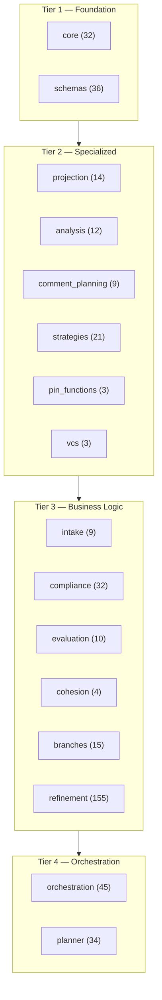
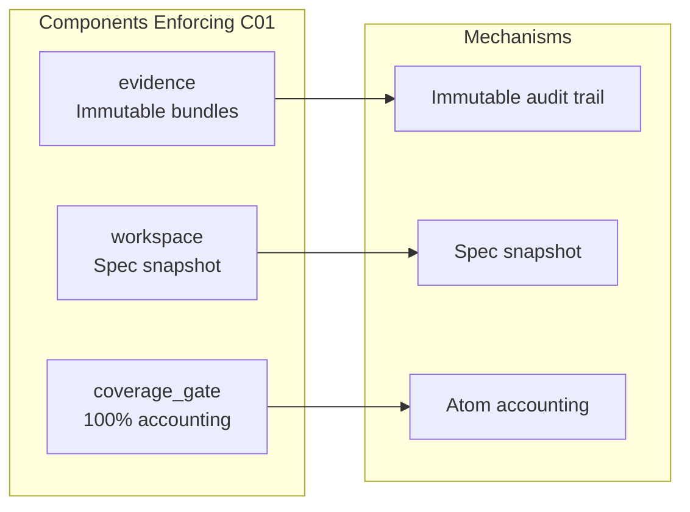

# Spec Manager System Analysis v4

## Post-Reorganization Architecture — Feb 12, 2026

The Spec Manager transforms unstructured specification prose into structured,
traceable implementations through a multi-layer promotion pipeline. This
document describes the system as it stands after the Feb 12 package
reorganization and constraint enforcement pass — design constraints are
baked into the code, not aspirational targets.

---

## 1. Package Architecture

20 packages organized into 4 dependency tiers. Each tier depends only on
lower tiers (no upward or cross-tier circular dependencies at the package
level; lazy imports mitigate the few bidirectional cases).

### Package Classification

| Package | Tier | Class | Files | Role |
|---------|------|-------|-------|------|
| Component | How C00 Is Enforced |
|-----------|---------------------|
| `planner/api` | Routes decisions to layer-specific planners. NOOP when
| | no decision needed. BLOCK Laurel needed.
| | WAITING when dependencies unresolved. |
| `planner/jit` | Micro-state-machine: plans only the next action, not the
| | full sequence. Re-evaluates after each step. |
| `planner/constraints` | `ConstraintFact` + `DecisionRequirement` — explicit
| | records of what is known vs. assumed. |
| | `ImpactClassification` sizes decisions to knowledge. |
| `orchestration/under_spec` | `UnderSpecManager` hard-hard-stops when spec is
| | insufficient. Does not guess. Surfaces the gap. |
| `orchestration/coordination` | `CoordinationSignal` emitted on uncertainty.
| | Slice enters WAITING state instead of proceeding with
| | assumptions. |
| `intake` | Phase 0 discovers library boundaries through LLM inference
| | (match method to certainty on uncontrolled prose input). |
| `strategies` | `StrategyEvolutionPipeline` requires evidence before changing
| | strategy. New strategies evaluated against same inputs as old. |

**Active enforcement:**

* `implementation/types.py`: `_check_required()` logs warnings when LLM
  output is missing required fields — surfaces data gaps instead of silently
  defaulting.
* `implementation/runner.py`: Unknown under-spec event kinds log a warning
  and classify as `AMBIGUOUS_SPEC` (surfaced, not guessed).
* `pdd_orchestrator.py`: Missing `evidence_atom_ids` produces an empty list +
  warning — no fabricated `ATOM-0000` placeholders.
* `intake/summarize.py`: LLM `file_id` overrides are logged with both
  values so the override is visible.

### 3.2 Information Permanence (C01)

*"Information is non-renewable. Route, don't貌 extract. Account for all
inputs. Maintain unbroken chains. Add, don't replace."*

| Component | How C01 Is Enforced |
|-----------|---------------------|
| `orchestration/evidence` | `EvidenceBundle` is immutable per slice/iteration.
| | 18+ `Ref` sub-types trace every finding back to source.
| | Never overwritten — new iterations produce new bundles. |
| `refinement/workspace` | `WorkspaceManager` creates immutable
| | `spec_snapshot/` on init. All processing references the
| | snapshot, never the mutable input. |
| `compliance/coverage_gate` | `verify_coverage_or_emit_gap()` enforces 100%
| | atom accounting. Every atom must be mapped, in remainder,
| | or explicitly excluded. Unaccounted atoms block promotion. |
| `compliance/detection` | Executable gap scanning — no silent omission. Every
| | gap is surfaced as a `GapElement` with severity. |
| `core/ids` | Stable IDs (F####, SEC-*, ATOM-*, LIB-*) persist across
| | runs. Content-based revision tracking with SHA-256 hashes. |
| `projection/lineage` | `LineageBuilder` maintains forward/backward trace
| | chains from atoms through sections to elements. Chain is never broken. |
| `evaluation/snapshot` | `snapshot_run()` preserves all run artifacts for
| | audit and replay. |

**Active enforcement:**

* `implementation/runner.py`: `CoordinationSignal` payloads carry origin
  provenance (`origin_event_kind`, `origin_options`, `origin_needed_for`,
  `origin_evidence_paths`) — signals trace back to their source event.
* `pdd_orchestrator.py`: Elements with no `evidence_atom_ids` get
  an empty list + warning log instead of fabricated placeholder IDs.
  Broken provenance chains are visible, not hidden.
* `refinement/cli.py`: Same pattern — no `ATOM-PLACEHOLDER` values;
  missing atoms are empty + warned.
* `intake/coverage.py`: Empty source files are logged and skipped, not
  silently omitted from coverage accounting.