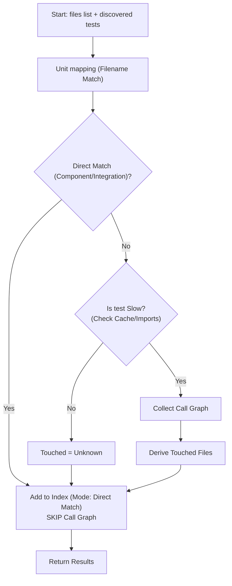

          Based on the analysis of the PRD, I have identified three major algorithmic optimizations that directly target your efficiency goals (specifically `MET-03` and `MET-05`).

Here is the breakdown of the improved, added, and removed algorithms.

### **Summary of Changes**

| Algorithm | Status | optimization Summary |
| --- | --- | --- |
| **ALG-01** (Resolve Tests) | **Improved** | Added **"Direct-Match Short-Circuiting"** to prevent redundant call-graph collection (enforcing `MAP-02`). |
| **ALG-02** (Slow Detection) | **Improved** | Added **"Static AST Pre-Flight"** to detect slow imports without incurring runtime startup costs. |
| **ALG-03** (Schedule) | **Improved** | Replaced "Wave/Batch Scheduling" with **"Continuous Resource-Constrained Scheduling"** to eliminate barrier synchronization delays. |
| **ALG-04** (Cache Mgmt) | **Added** | Added **"Merkle-Tree Caching"** to formalize the cache invalidation logic implicit in `EXEC-03`. |

---

### **Detailed Analysis of Algorithms**

#### **1. ALG-01: Resolve tests that touch input files (Improved)**

**Optimization:** Short-circuit logic and Parallelization.
The original algorithm (`C --> D`) implies that even if a test is identified via **Direct Match**, it proceeds to check if it is "Slow" and potentially collects a Call Graph. This violates the intent of `MAP-02` ("include that mapping without call-graph collection") and wastes resources on expensive instrumentation for tests we have already mapped by convention.

* **Change:** If `Direct Match` is successful, the algorithm now immediately branches to Indexing, skipping the `Is Slow?` and `Collect Call Graph` steps entirely.
* **Benefit:** Reduces analysis time significantly for well-structured component tests (`MET-03`).

**Revised Flow:**

#### **2. ALG-02: Classify slow vs fast tests (Improved)**

**Optimization:** Static Analysis Pre-Flight.
The original algorithm requires executing a test (`EXEC-02`) to capture imports. Spinning up a Python runtime (especially one that might eventually import `pytorch` or `docker`) is expensive.

* **Change:** Insert a static analysis step using Python's `ast` module before execution.
1. Parse test file AST.
2. If `import <slow_lib>` is found in the AST, mark as `slow` immediately.
3. Only proceed to dynamic `EXEC-02` (Import Capture) if AST is inconclusive (e.g., dynamic `__import__` or obscure aliasing).

* **Benefit:** Reduces "Fast Path" classification time from ~500ms+ (interpreter startup) to ~5ms (text parsing).

#### **3. ALG-03: Generate debug schedule (Improved)**

**Optimization:** Continuous Scheduling (removing "Waves").
The original algorithm generates "Parallel Waves" (`OUT-03`). This creates **Barrier Synchronization** inefficiencies: if Wave 1 has 4 fast tests and 1 slow test, 4 workers will sit idle waiting for the slow test to finish before Wave 2 begins.

* **Change:** Replace "Waves" with a **Stateful Scheduler Loop**.
1. Maintain a `Running` set and a `Ready` queue.
2. When a worker becomes free, scan `Ready` queue (sorted by Priority `SCHED-05`).
3. Pick the first test  where .
4. Dispatch  immediately.

* **Benefit:** Maximizes worker utilization (`MET-05`) by removing artificial barriers. Note: The output artifact `debug_schedule` will now represent a "log of execution order" rather than pre-planned batches.

#### **4. ALG-04: Hierarchical Caching Strategy (Added)**

**Context:** The PRD mentions caching (`EXEC-03`, `RES-06`) but lacks a specific algorithm for reliable invalidation.

* **Logic:**
1. Compute `H_test = hash(test_source_code)`.
2. Compute `H_env = hash(pyproject.toml + slow_signatures)`.
3. Key = `H_test + H_env`.
4. If Key exists in SQLite: return cached `is_slow` status and `touched_files`.
5. Else: Run ALG-01/02 and write to SQLite.

* **Benefit:** Ensures `INV-01` (Determinism) and `MET-06` (Cache Reuse).