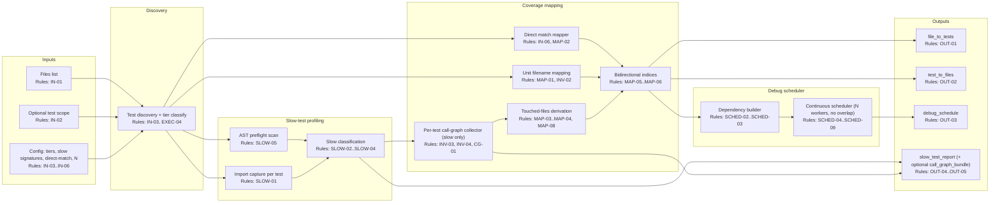
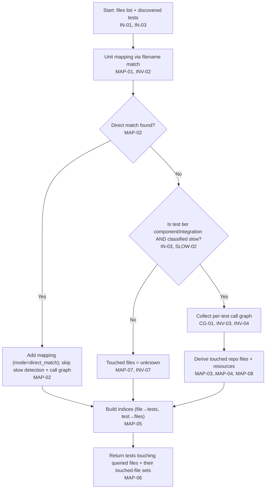
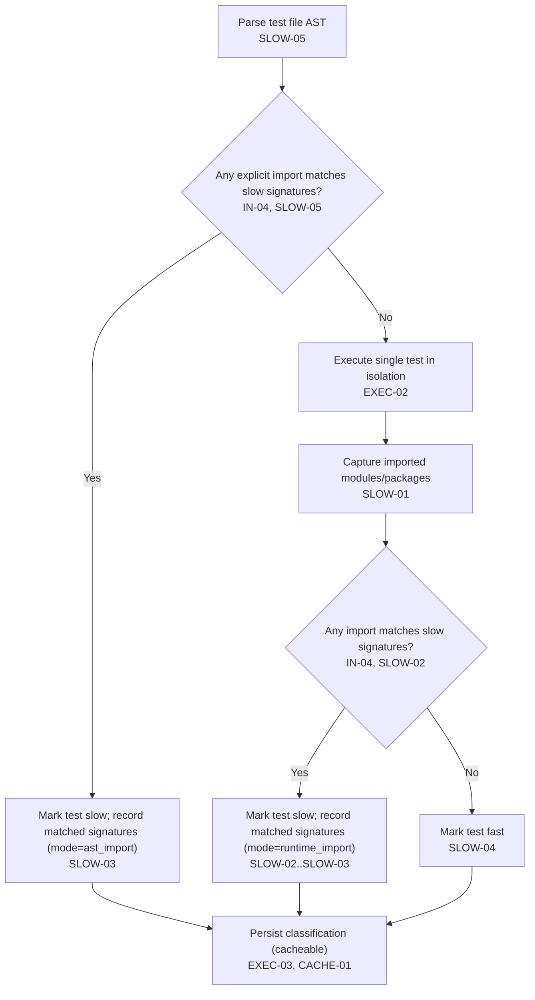
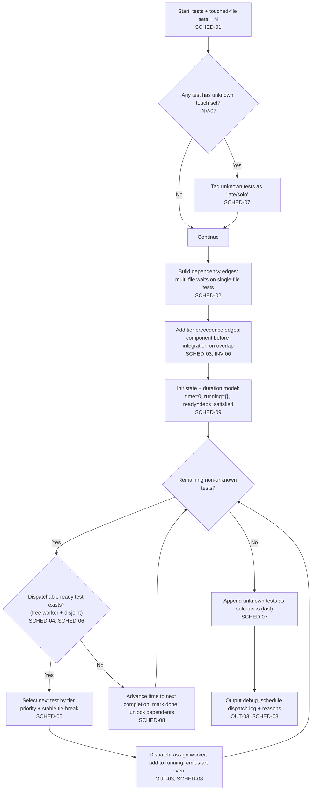
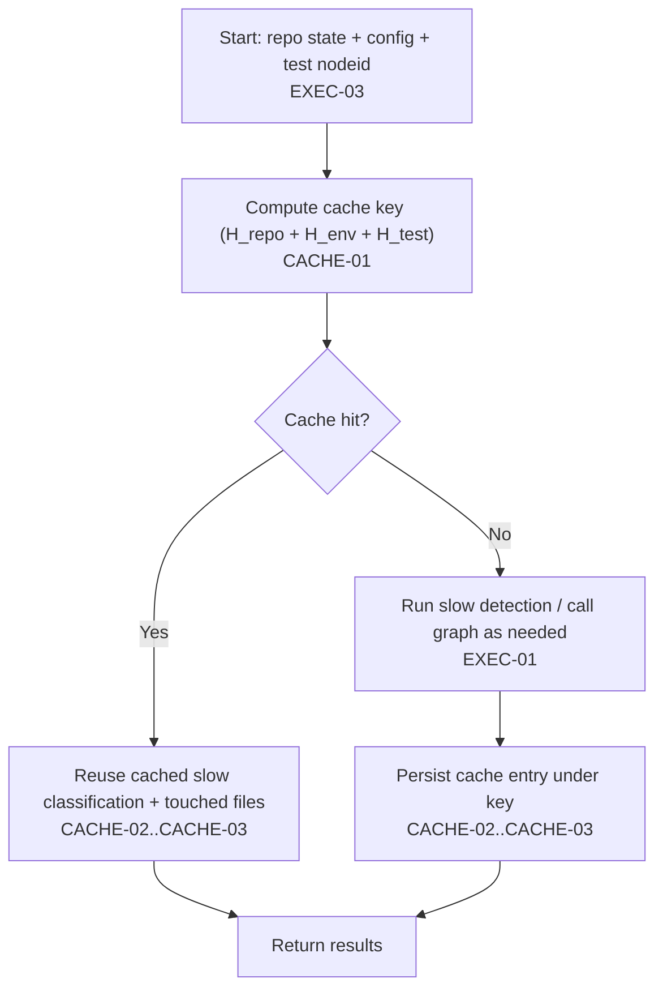

# PRD: Test Coverage Resolver + Debug Schedule Planner

Sources: `.tasks/processes/prd structure.md` · `pyproject.toml` · `scripts/dev/test_runner/test_files.py` · `scripts/dev/test_runner/test_coverage.py`

## Resources

* `RES-01` Python runtime — analysis harness + instrumentation.
* `RES-02` pytest — test discovery and per-test execution.
* `RES-03` Trace/coverage collector — captures per-test “touched files”.
* `RES-04` Call graph collector — captures per-test call edges + file associations.
* `RES-05` Graph engine — dependency graphs + topological scheduling.
* `RES-06` Local cache store (SQLite/JSON) — persists touched-file sets, slow-test classification, run metadata.

## Problem Statement

Given a set of repo files, developers need (1) a reliable mapping from files ⇄ tests (unit/component/integration) and (2) a parallelizable debug schedule that avoids conflicting work on overlapping files; current approaches either miss relevant higher-tier tests or require expensive per-test call-graph runs across the suite, so the system must produce deterministic, evidence-backed mappings and a conflict-free, tier-aware schedule while limiting call-graph cost via slow-test gating.

## Goal List

* **GOAL-01 — File→tests discovery:** given file paths, return all unit/component/integration tests that touch those files.
* **GOAL-02 — Test→files discovery:** for each returned test, list the repo files it touches.
* **GOAL-03 — Tier-aware correctness:** enforce unit vs component vs integration handling rules (filename match vs per-test call graph).
* **GOAL-04 — Call-graph cost control:** run per-test call-graph collection only where required by the “slow test” policy.
* **GOAL-05 — Debug schedule generation:** given tests with touched-file sets and worker count `N`, emit a topologically valid schedule with maximal safe parallelism.
* **GOAL-06 — Overlap + priority handling:** resolve overlaps with component higher priority than integration, and ensure multi-file tests wait on per-file tests.
* **GOAL-07 — Auditability:** every mapping and scheduling constraint is explainable (source: direct match vs call-graph; dependency reasons).

## Indexed rule list

### Invariants

* **Precedence:** invariants apply globally and override any conflicting requirements.
* **INV-01 — Determinism:** identical repo state + config + inputs MUST produce identical mapping artifacts and schedules. (GOAL-07)
* **INV-02 — Unit mapping is 1:1 filename-based:** unit coverage mapping MUST be derived by filename/path matching only; no call-graph collection for unit tests. (GOAL-03)
* **INV-03 — Per-test granularity for higher tiers:** component/integration call graphs (when collected) MUST be computed for each individual pytest test case (nodeid, including parameterizations), not per test file. (GOAL-03)
* **INV-04 — Call-graph gating:** call-graph collection MUST run only for component/integration tests classified as “slow” by SLOW-* rules. (GOAL-04)
* **INV-05 — Conflict-free parallelism:** no two concurrently scheduled debug tasks may touch the same repo file. (GOAL-05)
* **INV-06 — Tier precedence on overlap:** for any overlap, component tests MUST be scheduled before integration tests. (GOAL-06)
* **INV-07 — No inferred coverage:** if touched files cannot be proven (direct match or call-graph output), coverage MUST be labeled `unknown` rather than guessed. (GOAL-07)

### Input rules

* **IN-01 — Files input:** accept a list of repo-relative file paths as the query target. (GOAL-01)
* **IN-02 — Optional test scope:** accept an optional list of tests (nodeids or file paths) to constrain analysis; default is “all discovered tests”. (GOAL-01)
* **IN-03 — Tier classification (manifest):** each test MUST be classifiable as `unit`, `component`, or `integration` using the explicit tier manifest in `pyproject.toml` `[tool.test_coverage.tiers.*]` (`test_path`); pytest markers MUST NOT be used for tier classification. (GOAL-03)
* **IN-04 — Slow import signatures:** accept a configurable list of module/package signatures that define “slow import” (default includes `pytorch`, `docker`, `httpx`). (GOAL-04)
* **IN-05 — Worker count:** accept `N` (integer) for schedule parallelism. (GOAL-05)
* **IN-06 — Direct-match rules (non-unit):** identify “test matches file” for component/integration by naming conventions (mirrored directory structure + `test_<module>.py`) with fallback glob search within the tier `test_path` (`test_*<module_name>*.py`); no explicit mapping table. (GOAL-03)

### Execution rules

* **EXEC-01 — Two-stage analysis:** a run MUST support (1) slow-import detection and (2) call-graph collection for selected tests only. (SLOW-*, CG-*, INV-04)
* **EXEC-02 — Per-test isolation:** when collecting per-test call graphs, execute each selected test independently to avoid cross-test contamination of touched files. (INV-03)
* **EXEC-03 — Cache utilization:** if repo state + test nodeid + config match cached results, reuse touched-file sets and slow classification without rerun. (GOAL-04, GOAL-07)
* **EXEC-04 — Repeatable discovery:** test discovery output MUST be stable (sorted, deterministic) under identical inputs. (INV-01)

### Caching rules

* **CACHE-01 — Cache key (Merkle-style):** derive a cache key as `H_repo + H_env + H_test`, where `H_repo` identifies repo state, `H_env` identifies configuration (including `pyproject.toml` + slow signatures), and `H_test` identifies test nodeid + test source. (EXEC-03, INV-01)
* **CACHE-02 — Cache entry reuse:** on cache hit, reuse slow classification and touched-file sets without rerun. (EXEC-03)
* **CACHE-03 — Cache entry contents:** cache entries MUST include (a) slow/fast classification + evidence and (b) touched-file sets + evidence. (GOAL-07)

### Slow-test detection rules

* **SLOW-01 — Import capture (dynamic path):** each test execution performed for slow-import detection MUST capture the set of imported modules/packages attributable to that test run. (GOAL-04)
* **SLOW-02 — Signature match:** if any captured import matches `IN-04` signatures, the test MUST be classified as `slow`. (INV-04)
* **SLOW-03 — Reportability:** slow classification MUST include the matched signature(s) and detection mode (`ast_import` | `runtime_import`) as evidence. (GOAL-07)
* **SLOW-04 — Non-slow default:** if no slow signatures match, the test MUST be classified as `fast`. (GOAL-04)
* **SLOW-05 — Static AST preflight:** before executing a test for slow-import detection, parse its test file AST; if explicit imports match `IN-04` signatures, classify the test as `slow` with detection mode `ast_import` without executing it. (GOAL-04, PERF-01)

### Mapping rules

* **MAP-01 — Unit 1:1 mapping:** for unit tests, map code file ↔ unit test by filename/path matching; each unit test MUST touch exactly one primary file for mapping purposes. (INV-02)
* **MAP-02 — Direct match (component/integration):** if `IN-06` determines a direct match between a component/integration test and a file, include that mapping with evidence mode `direct_match`, record match mode (`convention` | `fallback_glob`), and MUST NOT run slow-import detection or call-graph collection for that test case. (GOAL-07, PERF-01)
* **MAP-03 — Call-graph-derived touch set (non-direct-match):** for component/integration tests classified `slow` and not covered by `MAP-02`, derive touched repo files from per-test call-graph output. (INV-03, INV-04)
* **MAP-04 — Touch definition (conservative):** a test “touches” a repo file if the call graph includes at least one potentially-executable frame/function whose source maps to that file; false positives are acceptable; the touch set MUST be repo-local (exclude stdlib/site-packages). (GOAL-02)
* **MAP-05 — Bidirectional indices:** produce both `file→tests` and `test→files` indices, sourced from (MAP-01..04, MAP-08). (GOAL-01, GOAL-02)
* **MAP-06 — Query behavior:** given a file list, return (a) all tests that touch any queried file and (b) each returned test’s full touched-file set. (GOAL-01, GOAL-02)
* **MAP-07 — Unknown handling:** if a component/integration test is `fast` and not directly matched, mark touched files as `unknown` (no call graph) and exclude it from “touches file X” results unless configured to include unknowns separately. (INV-07)
* **MAP-08 — Resource touches (non-Python):** capture repo-local filesystem resources opened/read/written by selected tests (e.g., YAML/JSON/templates) and include them in touched-file sets. (GOAL-02)

### Call-graph rules

* **CG-01 — Per-test call graph artifact:** for each selected test, capture a call graph with nodes annotated by source file identity sufficient to compute MAP-04. (MAP-03)
* **CG-02 — Minimal output requirement:** the system MAY omit full call edges if it can still prove touched files; if omitted, record that only “touched files” were captured. (GOAL-07)
* **CG-03 — Failure semantics:** if call-graph collection fails for a selected test, mark that test’s touch set as `unknown` and record failure reason. (INV-07)
* **CG-04 — Resource trace artifact:** for each selected test, capture repo-local filesystem paths opened/read/written and associate them with the test nodeid sufficient to compute MAP-08. (MAP-08)

### Scheduling rules

* **SCHED-01 — Inputs:** scheduling consumes a set of tests with known touched-file sets (or `unknown`), plus `N`. (IN-05, GOAL-05)
* **SCHED-02 — Multi-file dependency rule:** if test `t` touches multiple files, and any touched file `f` has an available “single-file test” `u` where `touches(u)={f}`, then `u` MUST precede `t`. (GOAL-06)
* **SCHED-03 — Component before integration on overlap:** for any component test `c` and integration test `i` where `touches(c) ∩ touches(i) ≠ ∅`, `c` MUST precede `i`. (INV-06)
* **SCHED-04 — Continuous dispatch constraint:** a test MAY be dispatched only if (a) a worker is free (`running_count < N`) and (b) its touched-file set is disjoint from all currently-running tests’ touched-file sets. (IN-05, INV-05)
* **SCHED-05 — Tier priority:** when choosing among ready tests, prioritize `unit` > `component` > `integration`; integration is lower priority when conflicts exist. (GOAL-06)
* **SCHED-06 — Disjoint early execution:** if tests are ready and disjoint, allow cross-tier parallelization (e.g., component tests disjoint from integration/unit may run in parallel with unit). (matches requested “non-overlap first” behavior) (GOAL-05)
* **SCHED-07 — Unknown isolation:** tests with `unknown` touched-file sets MUST be scheduled last and run alone (no other concurrent tests) unless explicitly overridden. (INV-07)
* **SCHED-08 — Output explainability:** schedule output MUST include (a) dependency edges used and (b) conflict reasons preventing co-scheduling. (GOAL-07)
* **SCHED-09 — Duration model (relative):** scheduler MUST assign a deterministic relative duration estimate `dur(t)` where `dur(t)=2` for tests classified `slow` and `dur(t)=1` otherwise; `dur(t)` is used only for schedule planning + `MET-05`, not for correctness constraints. (GOAL-05)

### Output rules

* **OUT-01 — `file_to_tests` artifact:** for each queried file, list touching tests grouped by tier and include evidence mode: `unit_filename_match | direct_match | call_graph | resource_trace`. (GOAL-01, GOAL-07)
* **OUT-02 — `test_to_files` artifact:** for each returned test, list touched files (or `unknown`) and evidence mode: `unit_filename_match | direct_match | call_graph | resource_trace`. (GOAL-02)
* **OUT-03 — `debug_schedule` artifact:** output a deterministic dispatch log for `N` workers: ordered `start` events with `(worker_id, nodeid, start_time, end_time)` in units of `dur(t)` (SCHED-09), plus per-test dependency edges + conflict reasons. (GOAL-05, GOAL-07)
* **OUT-04 — `slow_test_report` artifact:** list slow tests with matched import signatures. (SLOW-03)
* **OUT-05 — Optional `call_graph_bundle` artifact:** for tests where call graphs were collected, store per-test outputs addressable by nodeid. (CG-01)

### Validation rules

* **VAL-01 — Unit 1:1 integrity:** detect and report violations of expected unit 1:1 mapping (multiple unit tests mapping to one file, or no unit test for a file that should have one). (MAP-01)
* **VAL-02 — Schedule validity:** verify emitted schedule respects all SCHED-* constraints (topology + disjointness + tier precedence). (GOAL-05)
* **VAL-03 — Evidence completeness:** every mapping entry MUST carry an evidence mode and (when applicable) the matched signature(s) or match rule identifier. (GOAL-07)

### Performance rules

* **PERF-01 — Call-graph budget:** call-graph collection MUST be limited to slow component/integration tests (INV-04) and MUST support caching to avoid repeated runs. (EXEC-03)
* **PERF-02 — Run-time protection:** support per-test timeouts for call-graph collection; timeout results become `unknown` with reason. (CG-03)

### QA rules

* **QA-01 — Scheduler property tests:** verify SCHED-04 (disjointness) and SCHED-02/03 (dependencies) via generated random graphs + deterministic seeds. (INV-01)
* **QA-02 — Mapping fixtures:** include fixture repos where expected `file↔test` mapping is known for unit/direct-match/call-graph/resource-trace paths. (MAP-01..04, MAP-08)
* **QA-03 — Slow signature fixtures:** include tests that import `pytorch`/`docker`/`httpx` (or stubbed equivalents) to validate SLOW-02/03 behavior. (SLOW-02)

## Component diagrams

### Component diagram: Coverage resolver + scheduler

## Algorithms as Mermaid flowcharts

### ALG-01: Resolve tests that touch input files

### ALG-02: Classify slow vs fast tests using imports

### ALG-03: Generate debug schedule (continuous resource-constrained dispatch)

### ALG-04: Cache key + reuse (Merkle-style)

## Success Metrics

| ID       | Metric                                        |                  Target | Measurement                                                            | Goals            |
| -------- | --------------------------------------------- |------------------------:| ---------------------------------------------------------------------- | ---------------- |
| `MET-01` | Unit mapping determinism                      |             100% stable | Repeat run 10x on same commit; identical artifacts                     | GOAL-03, INV-01  |
| `MET-02` | Component/integration mapping recall (sample) |             100% stable | Compare against “full instrumentation” ground truth on a sampled suite | GOAL-01, GOAL-02 |
| `MET-03` | Call-graph overhead containment               |      ≤20% added runtime | Benchmark: normal run vs slow-only call-graph run                      | GOAL-04          |
| `MET-04` | Schedule validity                             |            0 violations | Automated check of SCHED-02/03/04 invariants over produced schedule    | GOAL-05, GOAL-06 |
| `MET-05` | Parallel efficiency                           | ≥70% worker utilization | Compute utilization from dispatch log: `sum(dur) / (N * makespan)`      | GOAL-05          |
| `MET-06` | Cache reuse rate                              |              ≥80% reuse | Re-run after no code/test changes; compute % tests reused              | GOAL-04, GOAL-07 |

## Open Questions

* [x] **Q-01:** Tier classification source-of-truth — resolved: `pyproject.toml` `[tool.test_coverage.tiers.*]` (`test_path`); pytest markers are for use-case linkage, not tier classification. (IN-03)
* [x] **Q-02:** Direct-match semantics for component/integration — resolved: naming convention (mirrored directory structure + `test_<module>.py`) with fallback glob search within tier `test_path` (`test_*<module_name>*.py`); no explicit mapping table. (IN-06, MAP-02)
* [x] **Q-03:** Touch definition — resolved: “potentially executable frames” from call graph; false positives are acceptable; no additional simulation required. (MAP-04)
* [x] **Q-04:** Non-Python files — resolved: include via repo-local resource tracing (filesystem open/read/write). (MAP-08, CG-04)
* [x] **Q-05:** Parametric tests — resolved: treat each pytest parameterization as a distinct nodeid (one “individual test”) for call-graph and scheduling. (INV-03)
