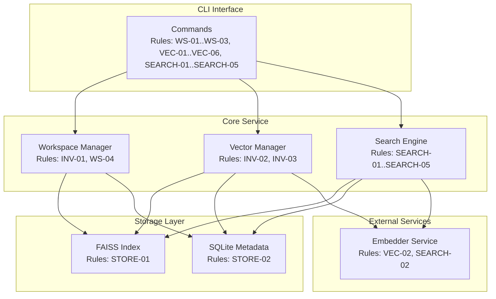

# Vector Store Service PRD

Sources: AGENTS.md

## Resources

- `RES-01` Python 3.12+ — runtime environment
- `RES-02` NumPy — vector operations
- `RES-03` FAISS or Annoy — approximate nearest neighbor search
- `RES-04` SQLite — metadata storage and workspace isolation
- `RES-05` Embedder Service — vector generation (dependency)
- `RES-06` Every Code — orchestration harness (consumer)

## Problem Statement

AI agents need persistent storage for vector embeddings with fast similarity search.
Rather than file I/O for context, agents should be able to create named workspaces,
store vectors with metadata, and query by similarity. This enables semantic search
over conversation history, code snippets, documentation, and any text corpus.

## Goal List

* **GOAL-01 — Workspace isolation:** Support multiple named workspaces with independent
  vector collections.
* **GOAL-02 — CRUD operations:** Create, read, update, delete vectors with metadata.
* **GOAL-03 — Similarity search:** Find top-k most similar vectors to a query vector.
* **GOAL-04 — Metadata filtering:** Filter search results by metadata predicates.
* **GOAL-05 — Persistence:** Workspaces persist across process restarts.
* **GOAL-06 — CLI interface:** All operations available via command-line for agent use.

## Indexed Rule List

### Invariants

* **Precedence:** Invariants apply globally and override any conflicting requirements.
* **INV-01 — Workspace isolation:** Operations on one workspace cannot affect another.
* **INV-02 — ID uniqueness:** Vector IDs are unique within a workspace.
* **INV-03 — Dimension consistency:** All vectors in a workspace must have same dimension.

### Workspace Rules

* **WS-01 — Create workspace:** `create <name> --dim <int>` initializes empty workspace.
* **WS-02 — List workspaces:** `list` shows all workspaces with stats.
* **WS-03 — Delete workspace:** `delete <name>` removes workspace and all vectors.
* **WS-04 — Workspace location:** Workspaces stored in `.vectorstore/` directory.

### Vector Rules

* **VEC-01 — Add vector:** `add <workspace> --id <id> --vector <json> --meta <json>`
* **VEC-02 — Add with text:** `add <workspace> --id <id> --text "..." --meta <json>`
  (auto-embeds via embedder service).
* **VEC-03 — Get vector:** `get <workspace> <id>` returns vector and metadata.
* **VEC-04 — Update metadata:** `update <workspace> <id> --meta <json>` updates metadata only.
* **VEC-05 — Delete vector:** `remove <workspace> <id>` removes single vector.
* **VEC-06 — Bulk add:** `bulk-add <workspace> --file vectors.jsonl` for batch import.

### Search Rules

* **SEARCH-01 — Query by vector:** `search <workspace> --vector <json> --top-k <int>`
* **SEARCH-02 — Query by text:** `search <workspace> --text "query" --top-k <int>`
  (auto-embeds query).
* **SEARCH-03 — Metadata filter:** `--filter 'key=value'` applies equality filter.
* **SEARCH-04 — Score threshold:** `--min-score <float>` filters low-similarity results.
* **SEARCH-05 — Include vectors:** `--include-vectors` includes vectors in results.

### Output Rules

* **OUT-01 — Search result format:** JSON array of `{id, score, metadata}` objects.
* **OUT-02 — Get result format:** JSON object with `{id, vector, metadata}`.
* **OUT-03 — Error reporting:** Errors to stderr; non-zero exit on failure.

### Storage Rules

* **STORE-01 — Index format:** FAISS index file per workspace for vectors.
* **STORE-02 — Metadata format:** SQLite database per workspace for metadata.
* **STORE-03 — Atomic writes:** Index updates are atomic (write to temp, rename).
* **STORE-04 — Rebuild index:** `rebuild <workspace>` reconstructs index from metadata.

## Component Diagrams

### Component Diagram: Vector Store Service

## Success Metrics

| ID | Metric | Target | Measurement | Goals |
|----|--------|--------|-------------|-------|
| `MET-01` | Add latency | <10ms | Benchmark 1000 adds | GOAL-02 |
| `MET-02` | Search latency (10k vectors) | <50ms | Benchmark 100 queries | GOAL-03 |
| `MET-03` | Search latency (1M vectors) | <200ms | Benchmark 100 queries | GOAL-03 |
| `MET-04` | Recall@10 | >0.95 | Compare to brute-force | GOAL-03 |
| `MET-05` | Workspace isolation | 100% | Cross-workspace query returns empty | GOAL-01, INV-01 |
| `MET-06` | Persistence verification | 100% | Restart and query | GOAL-05 |
