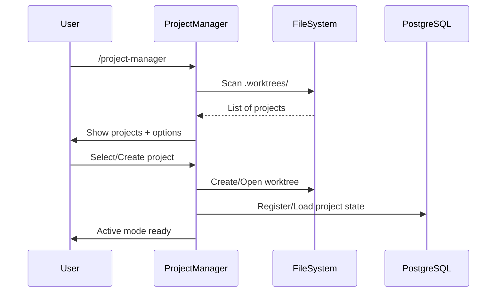
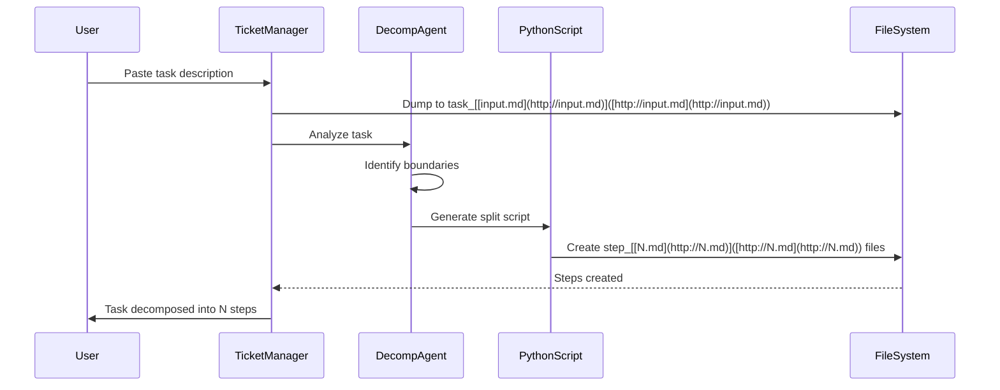
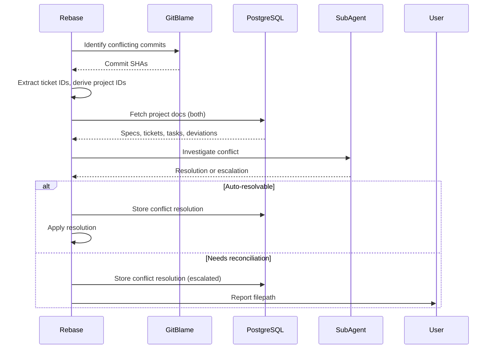
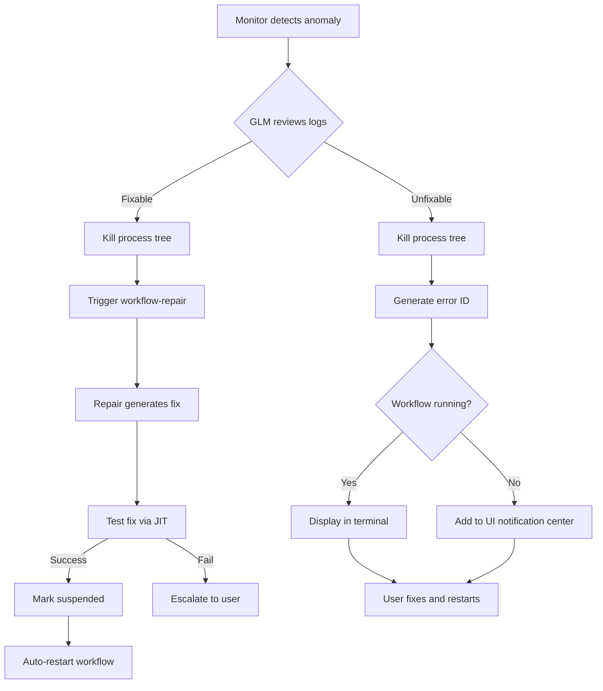

# Core Flows: Project Management & Autonomous Monitoring

## # Core Flows: Project Management & Autonomous Monitoring

## Overview

This spec documents the user flows for the multi-layered project management system and its autonomous monitoring infrastructure. The system consists of user-facing workflows (project-manager, ticket-manager, task execution) and autonomous background infrastructure (PostgreSQL logging, anomaly detection, self-healing, Rust/React monitoring UI).

## Flow 1: Project Manager - Initial Entry

**Trigger**: User runs `/project-manager` command

**Steps**:

1. Command scans `.worktrees/` directory for existing project worktrees (via Python script)
2. If projects found: Display list with project IDs and names
3. User selects option: "Open existing project" or "Create new project"
4. If creating new:
  - Prompt for project name/ID
  - Create worktree at `.worktrees/project-{name}/`
  - Register repository + project in PostgreSQL `repositories`, `projects`)
  - Create `.tmp/` subdirectory for workspace data
5. If opening existing:
  - User selects project from list
  - Load project state from PostgreSQL `projects`, `tickets`, `tasks`)
6. Enter active mode (interactive terminal session)

**Exit**: Project manager remains active, waiting for user input



## Flow 2: Project Manager - Loading Documentation

**Trigger**: User in active project manager session

**Steps**:

1. User pastes markdown content OR provides file path
2. If pasted: Agent parses content directly
3. If file path: Agent reads file from filesystem
4. Agent categorizes content as spec, ticket, or task
5. Content stored in PostgreSQL `projects`, `tickets`, `tasks`) and/or referenced from markdown files
6. Agent confirms: "Added [spec/ticket/task]: {title}"
7. User continues adding more documentation or proceeds to next action

**Exit**: Returns to active mode prompt

## Flow 3: Project Manager - Ticket Ordering & Dependencies

**Trigger**: User requests "show tickets" or "order tickets"

**Steps**:

1. Agent retrieves all tickets from PostgreSQL `tickets` table)
2. AI analyzes ticket descriptions to infer dependencies
3. Agent generates ASCII dependency tree showing:
  - Ticket execution order
  - Parent-child relationships
  - Which tickets can run in parallel
4. Display tree to user
5. User can accept ordering or manually adjust
6. Final ordering stored in PostgreSQL `tickets.ordering`)

**Exit**: Returns to active mode prompt

**Example Output**:

```

Ticket Dependency Tree:

├─ PROJ-1: Setup infrastructure (no dependencies)

├─ PROJ-2: Database schema (depends on PROJ-1)

├─ PROJ-3: API endpoints (depends on PROJ-2)

└─ PROJ-4: UI components (depends on PROJ-1) [can run parallel with PROJ-2, PROJ-3]

```

**Note**: Parallel execution means user opens multiple terminals, one ticket-manager per terminal. Each ticket tied to separate worktree.

## Flow 4: Project Manager - Opening Ticket Manager

**Trigger**: User requests to work on a ticket

**Steps**:

1. Agent displays next available ticket(s) based on dependency order
2. Agent generates command: `/ticket-manager --project {project-id} --ticket {ticket-id}`
3. User copies and pastes command to open ticket manager (can open multiple in parallel terminals)
4. Ticket manager checks if ticket worktree exists via Python script (fresh vs. resumed)
5. If fresh: Creates new worktree branching from project worktree
6. If resumed: Opens existing ticket worktree, loads state from PostgreSQL
7. Ticket manager enters active mode

**Exit**: User now in ticket manager session

## Flow 5: Ticket Manager - Task Input & Decomposition

**Trigger**: User provides complete task description

**Steps**:

1. User pastes free-form task description (natural language, must have clearly labeled step boundaries)
2. Ticket manager dumps task to file: `.tmp/task-{id}/task_input.md`
3. Ticket manager invokes **task execution workflow** (which includes decomposition as first phase)
4. Task execution workflow invokes **decomposition orchestrator** (multi-pass system):
   - **Pass 1**: Pattern discovery agent identifies potential step boundaries
   - **Pass 2**: Candidate surfacing script presents each candidate to approval agent
   - **Pass 3**: Approval agent approves/denies each candidate split
   - **Pass 4**: Verification agent checks each split file for multiple steps
   - **Pass 5**: If multiple steps found, recursion (repeat splitting on that file)
   - **Circuit breaker**: Progress-based termination (state hash + novelty tracking)
5. Orchestrator creates: `step_1.md`, `step_2.md`, etc. (mutation-free splitting)
6. Task execution workflow confirms: "Task decomposed into {N} steps"
7. Task execution workflow proceeds to step execution phase

**Exit**: Task execution workflow begins



## Flow 6: Task Execution Workflow

**Trigger**: Ticket manager invokes after task decomposition

**Steps**:

1. Workflow reads all step files from `.tmp/task-{id}/`
2. For each step (sequential execution):
  - Context manager (GLM) reviews **incremental diff** from previous step (not all prior steps)
  - Context manager updates running summary with what was delivered
  - Context manager refines summary for current step (adds relevant info, removes irrelevant)
  - Context manager looks into commits to understand deviations from plan
  - Step execution agent receives:
    - Current step description
    - **Incremental git diff** (previous step → current)
    - Context summary from context manager (cumulative understanding)
  - Agent implements step (reuses update-pr workflow pattern)
  - Agent creates commit for step
  - Context manager tracks deviations from plan
3. After all steps complete:
  - Squash all step commits into single task commit
  - Context manager generates task-level deviation report
  - Run implementation review (fil`.claude/commands/review-implementation.md`) with task plan + deviations
4. If review passes: Task complete
5. If review fails: Triggers update-pr workflow (error handling via workflow-repair)

**Exit**: Returns to ticket manager

**Note**: Deviations tracked by context manager are not shown to user. Review agents use deviations to understand why changes occurred (avoid "NOT PART OF THE PLAN" false positives).

## Flow 7: Ticket Manager - User Feedback

**Trigger**: User provides feedback after task completion

**Steps**:

1. User describes issues conversationally (natural language)
2. Ticket manager interprets feedback
3. Ticket manager invokes update-pr workflow with feedback
4. Update-pr workflow handles fixes (existing workflow, reused for task execution)
5. Ticket manager confirms: "Feedback applied"

**Exit**: Returns to active mode, ready for next task or ticket closure

## Flow 8: Ticket Manager - Ticket Closure Attempt

**Trigger**: User requests "close ticket"

**Steps**:

1. Ticket manager squashes all task commits into single ticket commit
2. Commit message format: `{description}` with Git trailers (primary method):
   ```
   Implement user authentication
   
   Ticket-ID: LIN-1-NES-123
   Project-ID: LIN-1
   ```
   **Fallback**: For backwards compatibility with older commits, also support `[TICKET-{id}]` prefix parsing. All new commits MUST use trailers.
3. Run ticket review against ticket requirements + all task deviations
4. If gaps found:
  - Generate gap report file: `.tmp/ticket-{id}/gaps.txt`
  - Display filepath to user: "Gaps found: .tmp/ticket-{id}/gaps.txt"
  - Ticket closure blocked
  - User must address gaps (create new tasks or update ticket)
5. If no gaps:
  - Run rebase workflow (fil`.claude/commands/rebase.md`)
  - Run merge workflow (fil`.claude/commands/merge.md`)
  - Ticket closed successfully

**Exit**: Ticket manager session ends, returns to project manager

## Flow 9: Enhanced Rebase - Conflict Investigation

**Trigger**: Rebase workflow detects conflicts

**Steps**:

1. Rebase uses `git blame` to identify conflicting commits
2. Extract ticket IDs from commit trailers (primary: `Ticket-ID:` / `Project-ID:`)
   - Parse Git trailers first using `git interpret-trailers`
   - Fallback to `[TICKET-{id}]` prefix parsing for legacy commits
3. Derive project IDs from ticket IDs if not in trailers (first two components)
4. Query PostgreSQL for project metadata (specs, tickets, tasks, deviations) for both projects
5. Invoke sub-agents to investigate conflicts
6. Sub-agents determine:
  - Dependencies between projects
  - Consequences of conflict
  - Whether auto-resolution is possible
7. If auto-resolvable: Apply resolution, store in PostgreSQL, continue rebase
8. If requires reconciliation plan:
  - Generate conflict resolution record (documents why lines were merged)
  - Store in PostgreSQL `conflict_resolutions` table
  - Generate report file: `.tmp/rebase-conflicts-{timestamp}.txt`
  - Display filepath to user (via ticket-manager/project-manager)
  - User must create reconciliation plan in Traycer
9. If conflicts resolved: Rebase completes

**Exit**: Rebase complete or blocked pending reconciliation

**Note**: Conflict resolution records created when merging changes lose some git history traceability. Future rebases query PostgreSQL (scoped by `repo_id`) to understand merged state origins. Rebase is **repository-scoped** (no cross-repo rebases).



## Flow 10: Evaluation Worktree - Final Review

**Trigger**: Project manager user requests final review

**Steps**:

1. Create evaluation worktree
2. Squash all ticket commits into one commit
3. Run implementation review against all planning docs (specs, tickets, tasks)
4. Review agent (GPT-5.2 xhigh) receives all deviations to understand changes
5. Generate gap report file: `.tmp/evaluation-{timestamp}/gaps.txt`
6. Display filepath to user
7. User reviews gaps
8. User creates new tickets in Traycer based on gaps
9. User adds new tickets to project manager
10. Repeat evaluation after new tickets complete

**Exit**: Returns to project manager

## Flow 11: Logging System - Step Execution Capture

**Trigger**: Any workflow step executes

**Steps**:

1. Agent runner wraps step invocation (each step is atomic action, may be a workflow)
2. Assigns unique step execution ID
3. Captures stdout/stderr from subprocess
4. Parses output for tool calls, reasoning blocks, code blocks, errors
5. Stores structured log in PostgreSQL `context_logs` + related tables)
6. Tracks step timing for anomaly detection baseline
7. Log entry includes:
  - Step execution ID (unique per execution)
  - Parent step ID (for hierarchical workflows)
  - Workflow ID
  - Timestamp (start and end)
  - Event type (agent_output, tool_invocation, phase_transition, error)
  - Structured data (parsed output)
  - Process ID (for subprocess management)
8. Logs persist for workflow repair and monitoring

**Exit**: Step execution completes, logs stored

**Note**: Steps and workflows are the same concept. A step is one atomic action (which may be a workflow containing N steps). Tracking happens at step granularity, not workflow granularity.

## Flow 12: Monitoring UI - Real-Time Updates

**Trigger**: User launches monitoring UI application

**Steps**:

1. UI loads local config (DB URL, repo path aliases, last-seen cursors)
2. Rust backend connects to the **local PostgreSQL** workflow database
3. Backend starts change monitoring:
  - `LISTEN workflow_events` (wakeup-only)
  - Polling fallback (timer) for reconnect/catch-up
4. On notify (or poll tick):
  - Query `context_logs` for new events `id > last_context_log_id`) for the selected `repo_id`
  - Query `workflow_runs`, `step_executions`, and `errors` for recent updates
  - Stream updates to React frontend via internal IPC / Tauri events
5. UI shows:
  - Active workflows/agents per repository
  - Step-by-step execution progress
  - Errors and warnings
  - Deviation tracking
  - Workflow hierarchy (steps containing sub-steps)
  - Notification center for unfixable errors
6. User can drill down into specific workflow runs and view full execution trace
7. User can view auto-resolution audit trail and pending `control_actions`

**Exit**: User closes UI

**UI Components** (high-level):

- Repository selector (monitor multiple repos)
- Workflow list (active and recent)
- Execution timeline (steps over time)
- Log viewer (filterable by event type)
- Notification center (unfixable errors requiring user action)
- Error dashboard (auto-resolved and pending issues)
- Deviation tracker (per ticket/task)

**Platform**: Cross-platform Tauri desktop app (Linux, macOS, Windows). Can run on Windows while monitoring agents running in WSL because DB access is over TCP (not filesystem sharing).

## Flow 13: Autonomous Monitoring - Anomaly Detection & Recovery

**Trigger**: Monitoring agent runs continuously in background

**Steps**:

1. Monitor tracks step execution times, builds baseline per step type
2. Detect long-running steps (time is trigger, not decision factor)
3. **Investigate first** (do not kill immediately):
  - Increase tracing for that workflow/step (function call tracing + timing)
  - Analyze call graph for patterns (long calls, cycles, exceptions, memory growth)
  - GLM agent forms hypothesis (legitimate long call vs bug)
4. On hypothesis formation:
  - If legitimate: let process continue
  - If bug confirmed: proceed to kill and repair
  - If unclear: optionally create investigation worktree for deeper analysis
5. If fixable:
  - Kill process tree (below project-manager/ticket-manager, preserve root)
  - Trigger workflow-repair agent with execution trace
  - Repair agent analyzes logs, generates fix via JIT scripting
  - Repair agent tests fix
  - Insert suspension record in PostgreSQL `suspended_processes`) linked to the step execution (and error, if created)
  - Automatically restart workflow from the last safe step boundary (new attempt linked to prior)
6. If unfixable (API keys, permissions, etc.):
  - Kill process tree
  - Use DB-generated numeric error id; display as `ERR-{zero_padded}` (e.g., `ERR-000041`)
  - Store error in PostgreSQL with instructions
  - If workflow actively running: Root agent (project-manager/ticket-manager) displays error text
  - If workflow not running: Add notification to UI notification center
  - User addresses issue, references error ID to restart affected workflows (see Flow 14)
7. All auto-resolutions logged for audit trail (visible in UI)

**Exit**: Workflow auto-restarts or awaits user action

**Note**: Multiple agents may encounter same error. User must acknowledge fix for each affected workflow.



## Flow 14: Project Manager QA Mode - Handling Unfixable Errors

**Trigger**: User sees notification in UI for unfixable error, opens project manager

**Steps**:

1. User opens project manager for affected project
2. User describes what they fixed (e.g., "added API key for ERR-003")
3. Project manager parses error ID from user input
4. Project manager queries PostgreSQL for error details and affected workflows/runs
5. Project manager triggers workflow-repair agent for each affected workflow
6. Repair agent restarts workflows from the last safe step boundary (state already stored; new attempt)
7. Project manager confirms: "ERR-003 resolved, {N} workflows restarted"

**Exit**: Returns to project manager active mode

**Note**: Project manager acts as QA interface, adapting to any error scenario with full project context.

## Flow 15: Artifact Export

**Trigger**: Project manager user requests artifact export

**Steps**:

1. Collect all artifacts from PostgreSQL + worktree files:
  - Specs (markdown files)
  - Tickets (markdown files)
  - Tasks (markdown files, one per task)
  - Deviations (tracked throughout execution)
  - Conflict resolutions (if any)
2. Generate project description with hierarchy/index
3. Export to `.tmp/exports/{project_id}/` with hierarchical structure:
  - `specs/`, `tickets/`, `tasks/`, `deviations/`, `conflict_resolutions/`, `index.md`
4. Return filepath to user: "Artifacts exported to: .tmp/exports/{project_id}/"

**Exit**: Project manager displays filepath

**Note**: No external API integration. User can manually upload exported files to Linear or other systems if desired.

## Supporting Infrastructure

### PostgreSQL Database Structure

**Single local database**: A local PostgreSQL instance (typically a Docker container) is the system of record for workflow state. Data is persisted in a local Docker volume / PGDATA directory and is **not committed**.

**Key tables** (see Core Infrastructure spec for full schema):

- `repositories`: Repository registry + cross-platform path aliases
- `projects`, `tickets`, `tasks`: Project management state
- `workflow_runs`: Run grouping across restarts
- `step_executions`: Hierarchical step execution graph (with attempt lineage)
- `context_logs`: Append-only event stream (UI/agents consume via cursor reads)
- `deviations`: Deviations logged during execution
- `conflict_resolutions`: Rebase conflict documentation
- `suspended_processes`: Killed processes pending repair/restart
- `errors`: Unfixable errors requiring user action (instructions + affected runs/steps)
- `step_timings`: Historical execution times for anomaly detection baseline
- `control_actions`: Append-only operational requests (UI → monitor)
- `trace_overrides`: Effective trace levels (updated by monitor)

### Agent Runner Integration

**Wrapping mechanism** (based on fil`scripts/article_writer/tools/agents.py`):

- `AgentRunner` class wraps all step invocations
- Assigns `repo_id`, `run_id`, and `step_execution_id` before invocation
- Captures stdout/stderr via subprocess
- Parses output using regex patterns
- Stores structured logs in PostgreSQL `context_logs` + related tables)
- Emits `NOTIFY workflow_events` after committing log batches (wakeup-only)
- Tracks process ID / process group for subprocess management
- Provides context logger to agents

**Retrofitting**: All workflows used by project-manager, ticket-manager, and task execution must be wrapped (review-implementation, update-pr, rebase, merge, etc.).

### Context Manager (GLM)

**Based on** fil`scripts/article_writer/tools/workflow/context_summarizer.py`:

- Maintains running summary of step execution
- Reviews commits from prior steps to understand what was delivered
- Refines summary for each new step (adds relevant, removes irrelevant)
- Tracks deviations from plan (different naming, implementation changes)
- Provides context to step execution agents
- Stores summaries and deviations in PostgreSQL for review agents
- Generates task-level and ticket-level deviation reports

### Autonomous Monitoring Agent (GLM)

**Responsibilities**:

- Continuously monitors step execution times (from `step_executions` + `step_timings`)
- Builds baselines per step type (adaptive learning)
- Detects anomalies (steps exceeding expected duration)
- Investigates first (trace promotion) before killing
- Kills runaway process trees (preserves root interactive agents)
- Triggers workflow-repair for fixable issues
- Generates error records and instructions for unfixable issues
- Applies `control_actions` (e.g., trace escalation, suspend/restart requests)

### Workflow Repair Enhancement

**With logging access**:

- Queries full execution trace from PostgreSQL by `run_id` / `step_execution_id`
- Navigates hierarchical workflow structure (steps containing steps)
- Can execute individual workflow steps via JIT scripting for testing
- Tests fixes before applying
- Restarts workflows from the last safe step boundary (new attempt linked to prior)

### Process Management

**Subprocess tracking**:

- Track process group / parent-child relationships for each step execution
- Kill process trees below the root agent (preserve project-manager/ticket-manager)
- Store suspensions in PostgreSQL `suspended_processes`) linked to step execution + error

**Restart semantics**:

- Workflow state is already persisted at step boundaries
- A “restart” creates a new step execution attempt linked to the prior attempt
- Monitoring + UI can show lineage and audit

## File References

- Existing workflows: fil`.claude/commands/review-implementation.md`, fil`.claude/commands/update-pr.md`, fil`.claude/commands/rebase.md`, fil`.claude/commands/merge.md`
- Agent runner example: fil`scripts/article_writer/tools/agents.py`
- Context logging: fil`scripts/article_writer/tools/workflow/context_logger.py`
- Context summarization: fil`scripts/article_writer/tools/workflow/context_summarizer.py`
- Epic brief: spec:1b2cab25-f5f3-4cdd-bce6-21b16a9e68b3/4f9481c9-455d-4808-b7b4-a60eabb66a43

