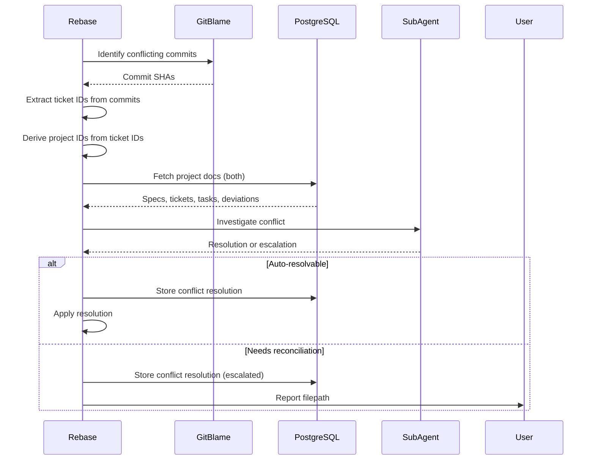

# Tech Plan: Enhanced Rebase & Evaluation

## # Tech Plan: Enhanced Rebase & Evaluation

## Overview

This spec defines the enhanced rebase mechanism for project-aware conflict resolution and the evaluation worktree system for gap analysis.

**Related Specs**: 

- spec:1b2cab25-f5f3-4cdd-bce6-21b16a9e68b3/4f9481c9-455d-4808-b7b4-a60eabb66a43 (Epic Brief)
- spec:1b2cab25-f5f3-4cdd-bce6-21b16a9e68b3/27e8f1ea-0534-442e-8508-03e5eb38be68 (Core Flows)

---

## Enhanced Rebase `scripts/pr/rebase_enhanced.py`)

**Purpose**: Project-aware conflict resolution with documentation analysis.

**Integration Points**:

- Extends existing file`.claude/commands/rebase.md` and file`scripts/pr/commands/rebase_command.py`
- Queries `projects`, `tickets`, `tasks`, `deviations` tables from PostgreSQL
- Stores conflict resolutions in `conflict_resolutions` table (PostgreSQL)
- Invokes sub-agents for conflict investigation

**Flow**:

1. Detect conflict via `git status`
2. Use `git blame` to identify conflicting commits
3. Extract ticket IDs from commit messages `[TICKET-{id}]` prefix)
4. Derive project IDs from ticket IDs (first two components)
5. Query PostgreSQL for project metadata (specs, tickets, tasks, deviations)
6. Invoke sub-agents to analyze conflict using project documentation
7. Auto-resolve or escalate with conflict resolution record
8. Store resolution in `conflict_resolutions` table (queryable by future rebases)

**Note**: Rebase is repository-scoped. It derives `repo_id` from the current repo root and queries PostgreSQL directly (no external API calls).

**Conflict Resolution Flow**:



**Sub-Agent Investigation**:

- Analyzes both projects' documentation
- Determines dependencies between projects
- Identifies consequences of conflict
- Detects if one project refactored while other used old version
- Determines if implementations are legitimately different (cannot merge)
- Surfaces tradeoffs for user decision

**Conflict Resolution Types**:

- **Auto**: System resolves automatically (e.g., non-overlapping changes)
- **Manual**: System provides recommendation, user decides
- **Escalated**: Requires reconciliation plan (user creates new tickets in Traycer)

**When to Create Conflict Resolution Records**:

- When merging changes lose git history traceability
- When state changes make it impossible to trace where lines came from
- NOT needed when picking one side or keeping side-by-side (git history sufficient)

---

## Evaluation Worktree `scripts/evaluation/`)

**Purpose**: Final review and gap analysis.

### `create_evaluation_worktree.py`

- Creates evaluation worktree on new branch
- Squashes all ticket commits into one commit
- Runs implementation review against all planning docs (specs, tickets, tasks)
- Review agent (GPT-5.2 xhigh) receives all deviations to understand changes

### `gap_analyzer.py`

- Compares implementation against specs, tickets, tasks
- Generates gap report file: `.tmp/evaluation-{timestamp}/gaps.txt`
- Stores gaps in PostgreSQL for tracking
- Returns filepath to user (project-manager presents filepath)

**Gap Report Format**:

```markdown

# Gap Analysis Report

## Project: LIN-1

### Missing Functionality

1. User authentication (specified in spec, not implemented)

2. Error logging (specified in ticket T-3, partially implemented)

### Incomplete Implementation

1. API rate limiting (implemented but missing configuration)

### Deviations Requiring Review

1. Database backend uses a local PostgreSQL container (verify local-only setup + migration story)

```

**User Workflow**:

1. User reviews gap report
2. User creates new tickets in Traycer based on gaps
3. User adds new tickets to project manager
4. New tickets executed, create new commits
5. New evaluation run to verify gaps addressed
6. Repeat until no gaps remain

---

## Artifact Export `scripts/artifact_export/`)

**Purpose**: Export project artifacts to files for user consumption.

### `export_project.py`

- Collects artifacts from PostgreSQL (specs, tickets, tasks, deviations, conflict_resolutions)
- Generates project description with hierarchy ([index.md](http://index.md))
- Exports to `.tmp/exports/{project_id}/`:
  - `specs/` - Specification documents
  - `tickets/` - Ticket descriptions
  - `tasks/` - Task breakdowns
  - `deviations/` - Implementation deviations
  - `conflict_resolutions/` - Rebase conflict documentation
  - `index.md` - Hierarchical overview
- Returns file path to user (project-manager/ticket-manager present filepath)

**Note**: No external API integration. User can manually upload exported files to Linear or other systems if desired.

**Export Structure Example**:

```

.tmp/exports/LIN-1/

├── [index.md](http://index.md)                    # Hierarchical overview

├── specs/

│   ├── [architecture.md](http://architecture.md)

│   └── [api-design.md](http://api-design.md)

├── tickets/

│   ├── [NES-123.md](http://NES-123.md)

│   └── [NES-124.md](http://NES-124.md)

├── tasks/

│   ├── [NES-123-task-1.md](http://NES-123-task-1.md)

│   └── [NES-123-task-2.md](http://NES-123-task-2.md)

├── deviations/

│   └── [NES-123-deviations.md](http://NES-123-deviations.md)

└── conflict_resolutions/

    └── [conflict-abc123.md](http://conflict-abc123.md)

```

---

## References

- Core infrastructure: spec:1b2cab25-f5f3-4cdd-bce6-21b16a9e68b3/[CORE_INFRA_SPEC_ID]
- Existing workflows: file`.claude/commands/review-implementation.md`

