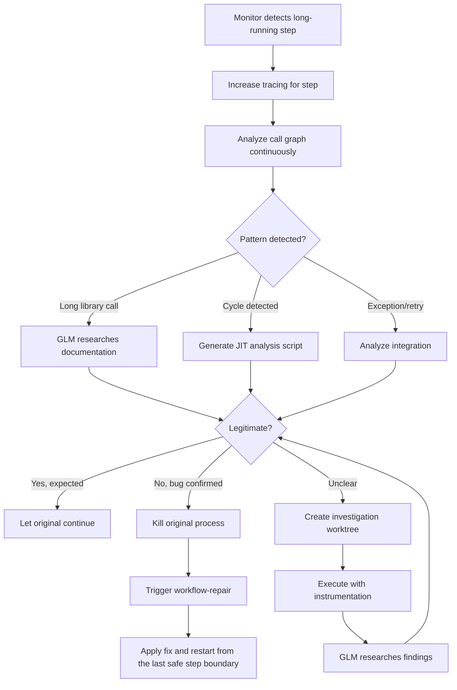

# Tech Plan: Monitoring & Self-Healing

## # Tech Plan: Monitoring & Self-Healing

## Overview

This spec defines the autonomous monitoring and self-healing infrastructure that detects anomalies, investigates issues, and repairs workflows without user intervention.

**Related Specs**: 

- spec:1b2cab25-f5f3-4cdd-bce6-21b16a9e68b3/4f9481c9-455d-4808-b7b4-a60eabb66a43 (Epic Brief)
- spec:1b2cab25-f5f3-4cdd-bce6-21b16a9e68b3/27e8f1ea-0534-442e-8508-03e5eb38be68 (Core Flows)

---

## Architectural Decision: Investigate-First Strategy

**Decision**: Investigate long-running processes before killing them. Use trace escalation and pattern analysis to distinguish bugs from legitimate long-running operations.

## Suspension/Resumption Semantics (Restart, not OS-level Resume)

**Decision**: “Suspend” means **terminate the misbehaving process**, persist the state already captured in the database, and later **restart** from the last safe step boundary as a new attempt. We do not rely on OS-level pause/resume semantics.

**Implications**:

- Every restart creates a new `step_execution` attempt linked to the prior attempt (lineage is preserved).
- The monitoring agent records a suspension record `suspended_processes`) that references the failed step execution attempt and the associated error record.
- “Resume” is implemented by starting a new process at the next safe boundary, not by continuing the old PID.

## Trace Promotion Model (In-Flight Tracing)

**Final pivot**: Tracing is **always available** (on/off or leveled), and can be enabled **mid-process** for a specific step/workflow. This reduces the need for isolated simulations.

**Model**:

- New/unstable workflows start in **verbose trace mode** (function enter/exit + timing; inputs/outputs where safe).
- As workflows mature and branch coverage grows, reduce emitted trace events (“promote” to optimized mode).
- Monitoring can escalate tracing **on demand** for:
  - a specific `step_execution_id`
  - a workflow subtree (root step + children)
  - a workflow type (e.g., rebase/merge/review)

**Implementation options** (local-only):

- **Signal toggle**: `SIGUSR1SIGUSR2` sets trace level in-process (Unix).
- **DB-config toggle**: monitoring agent writes desired trace level to PostgreSQL `trace_settings` or `control_actions`); instrumented code polls (or listens) at safe points.
- Windows: prefer DB-config toggle (signals are limited).

**Storage**:

- Trace output is stored as structured `context_logs` rows `event_type="trace_event"`), making it visible in the UI and usable by workflow-repair.

**Impact on investigation worktrees**:

- Investigation worktrees remain a **fallback** only (use when in-place tracing is insufficient or when you need isolation for reproduction).

**Investigation Strategy** (investigate first, kill only if confirmed bug):

1. **Detect long-running step** (time is just a trigger, not the decision factor)
2. **Increase tracing** for that workflow/step (function call tracing + timing)
3. **Analyze evidence** using call graph analyzer:
  - Long calls (library functions exceeding threshold)
  - Cycles (repeated calls with same inputs/outputs)
  - Exceptions/retries (broken integrations)
  - Memory growth patterns
4. **Form hypothesis**:
  - If legitimate long call (e.g., large API response): let it continue
  - If cycle/bug detected: kill process and trigger repair
  - If unclear: optionally create investigation worktree for deeper analysis (fallback only if in-place tracing is insufficient)
5. **Investigation worktree** (optional fallback; use only if in-place tracing is insufficient):
  - Creates investigation worktree on new branch
  - Exports a **run snapshot** from PostgreSQL (filtered by `repo_id` + `run_id`) into the investigation worktree for offline replay
  - Executes real code with enhanced instrumentation
  - GLM agent researches findings (documentation, source code, patterns)
  - Cleans up immediately after hypothesis formed
6. **Kill only if bug confirmed** (not on suspicion)
7. **Trigger workflow repair** or generate error ID for unfixable issues
8. **Track conclusions** tied to code state (reviewable when code changes)
9. **Preserve conclusions** in `investigation_conclusions` table

**Investigation Flow**:



**Error ID Format**: Display form `ERR-{zero_padded_numeric_id}` derived from the database error primary key (stable, concurrency-safe).

**Trade-offs**:

- ✅ No false positives (investigate before killing)
- ✅ Learns from legitimate long-running processes
- ✅ Detailed diagnosis before intervention
- ✅ Conclusions tied to code state (reviewable on changes)
- ⚠️ Requires separate worktree per investigation (optional, cleaned immediately)
- ⚠️ Higher resource usage (parallel execution for investigations)
- ⚠️ GLM model costs for research and analysis

---

## JIT Scripting for Workflow Repair

**Decision**: Workflow repair agent generates Python scripts on-the-fly for testing fixes.

**Pattern**:

1. Repair agent analyzes execution trace from PostgreSQL
2. Identifies failure point (step execution ID)
3. Generates Python script to reproduce failure context
4. Tests fix by executing script: `uv run python /tmp/repair_test_{uuid}.py`
5. If test passes: Apply fix to workflow, restart from the last safe step boundary
6. If test fails: Escalate to user with diagnostic report

**Generated Script Example**:

```python

# Auto-generated by workflow-repair agent

# Tests fix for step execution: abc-123-def

from [[scripts.pr.review](http://scripts.pr.review)]([http://scripts.pr.review)_loop](http://scripts.pr.review)_loop) import main

# Reproduce failure context

result = main(

    ticket_id="NES-123",

    tasks_file=".tmp/tasks.txt"

)

# Verify fix

assert result.status == "success"

```

**Trade-offs**:

- ✅ Scripts are auditable (saved to `.tmp/repair_scripts/`)
- ✅ Safe execution via subprocess (no eval)
- ✅ Can use existing modules and functions
- ⚠️ Requires repair agent to understand Python syntax
- ⚠️ Generated scripts may not cover all edge cases

---

## Component Architecture

### Process Management `scripts/core/process_management/`)

**Purpose**: Subprocess tracking, monitoring, and lifecycle management.

#### `monitored_run.py` (CLI entry point)

- Safe wrapper for subprocess invocations (process management only)
- Captures PID for process tree tracking
- Handles process termination signals
- **Does NOT create step execution records** (that's @step's job)
- **Does NOT create step context** (that's @step's job)
- Provides process safety and killability only
- Wraps subprocess in its own process group for clean termination

**Usage**:

```bash

monitored-run uv run pr review-loop --ticket NES-123

```

#### `process_tracker.py`

- Queries `step_executions` for running processes
- Builds process tree from PIDs using `psutil`
- Provides kill operations (preserves root agents)
- Kills process tree below project-manager/ticket-manager

#### `snapshot_export.py`

- Exports a workflow/run snapshot from PostgreSQL for offline replay and investigation
- Filters by `repo_id` and `run_id` (and optionally `step_execution_id` subtree)
- Writes a self-contained artifact bundle (no live DB copy):
  - `run.json` (run + step tree)
  - `context_logs.jsonl` (append-only events)
  - `errors.json` / `suspensions.json` (if any)
- Preserves referential integrity by exporting in dependency order

#### `investigation_cleanup.py`

- Deletes investigation worktree after hypothesis formed
- Preserves conclusions in `investigation_conclusions` table
- Removes investigation branch from git

#### `call_graph_analyzer.py`

- Python script for continuous call graph analysis
- Tracks function calls with inputs/outputs/duration
- Detects patterns:
  - Long calls (library functions exceeding threshold)
  - Cycles (repeated calls with same inputs)
  - Exceptions/retries (broken integrations)
  - Memory growth (via debugger if available)
- Outputs findings for GLM agent review

#### `anomaly_detector.py`

- Monitors step execution times
- Flags long-running steps (exceeds expected duration)
- **Triggers trace escalation** (increases instrumentation for that workflow/step)
- **Does NOT kill immediately** - investigation first, kill only if bug confirmed
- Tracks aborted executions (excluded from baseline)
- Focuses on detecting patterns (cycles, long calls, exceptions) not just duration

---

### Autonomous Monitoring `scripts/monitoring/`)

**Purpose**: Continuous anomaly detection and self-healing.

#### `monitoring_agent.py`

- Background process (runs continuously)
- Queries `step_executions` for running processes
- Detects long-running steps via `anomaly_detector`
- **Investigation Strategy** (investigate first, kill only if confirmed bug):
  1. **Detect long-running step** (time is just a trigger, not the decision factor)
  2. **Increase tracing** for that workflow/step (function call tracing + timing)
  3. **Analyze evidence** using call graph analyzer:
    - Long calls (library functions exceeding threshold)
    - Cycles (repeated calls with same inputs/outputs)
    - Exceptions/retries (broken integrations)
    - Memory growth patterns
  4. **Form hypothesis**:
    - If legitimate long call (e.g., large API response): let it continue
    - If cycle/bug detected: kill process and trigger repair
    - If unclear: optionally create investigation worktree for deeper analysis (fallback only if in-place tracing is insufficient)
  5. **Investigation worktree** (optional fallback; use only if in-place tracing is insufficient):
    - Creates investigation worktree on new branch
    - Exports a **run snapshot** from PostgreSQL (filtered by `repo_id` + `run_id`) into the investigation worktree for offline replay
    - Executes real code with enhanced instrumentation
    - GLM agent researches findings (documentation, source code, patterns)
    - Cleans up immediately after hypothesis formed
  6. **Kill only if bug confirmed** (not on suspicion)
  7. **Trigger workflow repair** or generate error ID for unfixable issues
  8. **Track conclusions** tied to code state (reviewable when code changes)
  9. **Preserve conclusions** in `investigation_conclusions` table

**Error Handling**:

- Fixable errors: Kill process, trigger workflow-repair, auto-restart (from last safe boundary)
- Unfixable errors: Kill process, generate error ID, notify user
  - If workflow actively running: Root agent displays error text
  - If workflow not running: Add notification to UI notification center
- User addresses issue, references error ID (e.g., "ERR-003 fixed")
- Project manager triggers workflow-repair for affected workflows

#### `workflow_repair_agent.md`

- Enhanced with execution trace access
- Queries PostgreSQL for step execution history
- Navigates hierarchical workflow structure (steps containing steps)
- Generates JIT Python scripts for testing fixes
- Tests fixes before applying
- Restarts workflows from the last safe step boundary
- Self-healing approach (no pre-written tests, "break things" philosophy)

---

## Workflow Repair Enhancement

**With Logging Access**:

- Queries full execution trace from PostgreSQL by step execution ID
- Navigates hierarchical workflow structure (steps containing steps)
- Can execute individual workflow steps via JIT scripting for testing
- Tests fixes before applying
- Restarts workflows from the last safe step boundary

**JIT Testing Pattern**:

1. Generate Python script that reproduces failure context
2. Execute script with proposed fix
3. If test passes: Apply fix to actual workflow
4. If test fails: Escalate to user with diagnostic report

**Convergence Guards (avoid max-iteration caps)**:

- **Progress signature**: Each repair attempt records a signature (error class + stack excerpt + diff hash + reproduction outcome).
- **No-novelty stop**: If a new attempt produces the same signature (or alternates between two signatures), stop and escalate to user with a consolidated diagnostic report.
- **Safety stop**: If a fix attempt would require destructive actions (mass deletes, force pushes, irreversible migrations) without explicit user confirmation, stop and request user action via an error record.

**Self-Healing Philosophy**:

- No pre-written automated tests (models are expensive and slow)
- Instead: detect errors during execution, fix them, then restart from the last safe boundary
- "Break things" approach with autonomous recovery

---

## Safety Boundaries for Self-Healing

**Decision**: Enforce strict safety boundaries to prevent self-healing from damaging the repository or dev machine.

**Enforced Constraints**:

1. **Sandbox JIT Scripts**: All generated repair scripts run in temporary sandbox directory (`.tmp/repair_sandbox/{uuid}/`)
2. **Deny Out-of-Root Writes**: Scripts cannot write outside repo/worktree root (enforced via path validation)
3. **Deny .git/ Mutation**: Scripts cannot modify `.git/` directory directly (enforced via denylist)
4. **Require Patch/Commit Trail**: Every repair must produce a git patch or commit (no direct working tree mutation)
5. **Record Repair Provenance**: Store inputs, prompt hash, tool outputs in `repair_provenance` table for audit
6. **Destructive Action Gate**: Repairs requiring destructive actions (force push, mass delete) require explicit user confirmation

**Implementation**:

```python
# In workflow_repair_agent
class RepairSandbox:
    def __init__(self, repo_root: str):
        self.repo_root = Path(repo_root).resolve()
        self.sandbox = Path(f".tmp/repair_sandbox/{uuid.uuid4()}")
        self.denylist = [self.repo_root / ".git"]
    
    def validate_write(self, path: Path) -> bool:
        resolved = path.resolve()
        # Must be under repo root
        if not resolved.is_relative_to(self.repo_root):
            return False
        # Must not be in denylist
        for denied in self.denylist:
            if resolved.is_relative_to(denied):
                return False
        return True
```

**Provenance Table** (already in Core Infrastructure spec):

```sql
CREATE TABLE repair_provenance (
    id UUID PRIMARY KEY DEFAULT gen_random_uuid(),
    repo_id UUID NOT NULL REFERENCES repositories(repo_id),
    step_execution_id UUID NOT NULL REFERENCES step_executions(step_execution_id),
    repair_type TEXT NOT NULL,
    inputs JSONB NOT NULL,
    prompt_hash TEXT NOT NULL,
    outputs JSONB NOT NULL,
    patch_path TEXT,
    commit_sha TEXT,
    created_at TIMESTAMPTZ NOT NULL DEFAULT now()
);
```

---

## References

- Core infrastructure: spec:1b2cab25-f5f3-4cdd-bce6-21b16a9e68b3/[CORE_INFRA_SPEC_ID]
- Existing patterns: fil`scripts/article_writer/tools/workflow/context_logger.py`, fil`scripts/article_writer/tools/workflow/context_summarizer.py`

