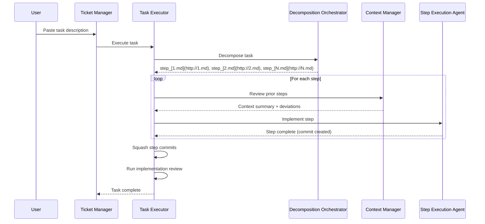

# Tech Plan: Project & Ticket Management

## # Tech Plan: Project & Ticket Management

## Overview

This spec defines the project manager and ticket manager commands that provide interactive workspace management for projects and task coordination for tickets.

**Related Specs**: 

- spec:1b2cab25-f5f3-4cdd-bce6-21b16a9e68b3/4f9481c9-455d-4808-b7b4-a60eabb66a43 (Epic Brief)
- spec:1b2cab25-f5f3-4cdd-bce6-21b16a9e68b3/27e8f1ea-0534-442e-8508-03e5eb38be68 (Core Flows)

---

## Task Decomposition System `scripts/core/task_decomposition/`)

**Purpose**: Interactive multi-pass task splitting with agent approval.

### `orchestrator.py`

- Main orchestration script (called by task execution workflow, NOT by ticket-manager directly)
- Manages agent invocations and file operations
- Maintains state: approved files, denied files, pending files, history per file
- **No max iterations** - converges through bug fixing
- Agents must explicitly give up with reasoning if unable to split

**State Tracking**:

```python

{

  "approved_files": ["step_[1.md](http://1.md)", "step_[2.md](http://2.md)"],

  "denied_files": ["step_[3.md](http://3.md)"],

  "pending_files": [],

  "file_history": {

    "step_[3.md](http://3.md)": [

      {"iteration": 1, "action": "denied", "reason": "Contains multiple steps"},

      {"iteration": 2, "action": "split_attempted", "result": "no_split_performed"},

      {"iteration": 3, "action": "denied", "reason": "Still contains multiple steps"}

    ]

  }

}

```

### `pattern_discovery_agent.md`

- Analyzes task description
- Identifies step boundary patterns (must be "absolutely obvious")
- Generates regex for candidate surfacing
- If boundaries not obvious, format failed

### `candidate_surfacing.py`

- Python script template (generated by pattern discovery agent)
- Uses regex to find potential split points
- Outputs candidate list with line numbers
- Presents each candidate to approval agent

### `approval_agent.md`

- Reviews each candidate split point
- Receives full file history (denials, split attempts, reasoning)
- Approves or denies split
- Provides reasoning for decision
- If file denied but no split performed: must determine why and either split or give up

### `verification_agent.md`

- Checks split files for multiple steps
- Flags files needing further splitting
- If multiple steps found, file goes back to orchestrator for another pass

**Convergence Logic**:

- "Split this" agent must eventually accept "don't split this" and mark problem
- No arbitrary max iterations
- Convergence through bug fixing and explicit give-up

**Progress-Based Circuit Breakers (no max-iteration caps)**:

- **Repeat detection**: If the orchestrator observes the same input file hash + identical candidate set + identical agent decision twice, it must mark the file as **unsplittable** and emit a structured problem record (with reasons).
- **Novelty requirement**: Each additional pass must introduce new evidence (new boundary pattern, new candidate rule, or a fixed surfacing script). If not, the system must give up with an explicit explanation.
- **Oscillation detection**: If decisions alternate (approve/deny) without producing a valid split artifact, stop and escalate to user review.

---

## Project Manager `scripts/project_manager/`)

**Purpose**: Interactive workspace management for projects.

### `cli.py`

- Entry point for `/project-manager` command
- **Passive mode** (default): 
  - Scans `.worktrees/` for existing project worktrees (via Python script)
  - Lists projects with IDs and names
  - Prompts: "Open existing project or create new?"
- **Active mode**: 
  - Interactive terminal session
  - Accepts documentation (paste or file paths)
  - Manages tickets and ordering
  - Provides ticket-manager commands
  - Acts as QA interface for error resolution

**User Interactions**:

- Load documentation: User pastes markdown OR provides file path
- Show tickets: Displays all tickets with dependency tree
- Order tickets: AI infers dependencies, generates ASCII tree
- Open ticket: Provides `/ticket-manager --project {id} --ticket {id}` command
- Handle errors: User references error ID (e.g., "ERR-003 fixed"), triggers repair

### `project_dao.py`

- Database access layer for projects
- CRUD operations on `projects` table
- Worktree detection via Python script (scans `.worktrees/` for project worktrees)
- State management (active, completed, archived)

### `ticket_ordering.py`

- AI-based dependency inference from ticket descriptions
- Generates ASCII dependency tree showing:
  - Ticket execution order
  - Parent-child relationships
  - Which tickets can run in parallel
- Stores ordering in PostgreSQL

**Example Output**:

```

Ticket Dependency Tree:

├─ LIN-1-T-1: Setup infrastructure (no dependencies)

├─ LIN-1-T-2: Database schema (depends on T-1)

├─ LIN-1-T-3: API endpoints (depends on T-2)

└─ LIN-1-T-4: UI components (depends on T-1) [can run parallel with T-2, T-3]

```

---

## Ticket Manager `scripts/ticket_manager/`)

**Purpose**: Task coordination and execution for individual tickets.

### `cli.py`

- Entry point for `/ticket-manager --project {project-id} --ticket {ticket-id}` command
- Detects fresh vs. resumed tickets (via Python script checking worktrees)
- If fresh: Creates new worktree branching from project worktree
- If resumed: Opens existing ticket worktree, loads state from PostgreSQL
- Interactive terminal session for task management

**User Interactions**:

- Add task: User pastes complete task description (free-form natural language)
- View tasks: Lists all tasks for ticket
- Close ticket: Attempts closure (runs reviews, rebase, merge)
- Provide feedback: User describes issues, triggers update-pr workflow

### `ticket_dao.py`

- Database access layer for tickets
- CRUD operations on `tickets` table
- Worktree management (create, open, detect)

### `task_executor.py`

- Orchestrates task execution workflow
- **Does NOT directly call decomposition** - invokes larger workflow that includes decomposition
- Manages step-by-step execution:
  1. Invokes task decomposition orchestrator
  2. For each step (sequential):
    - Context manager reviews prior steps
    - Step execution agent implements step (reuses update-pr pattern)
    - Creates commit for step
    - Context manager tracks deviations
  3. Squashes all step commits into single task commit
  4. Runs implementation review with task plan + deviations
- Triggers context manager after each step
- Squashes commits after task completion

**Task Execution Flow**:



---

## References

- Core infrastructure: spec:1b2cab25-f5f3-4cdd-bce6-21b16a9e68b3/[CORE_INFRA_SPEC_ID]
- Monitoring: spec:1b2cab25-f5f3-4cdd-bce6-21b16a9e68b3/[MONITORING_SPEC_ID]
- Existing workflows: file`.claude/commands/update-pr.md`, file`.claude/commands/review-implementation.md`

