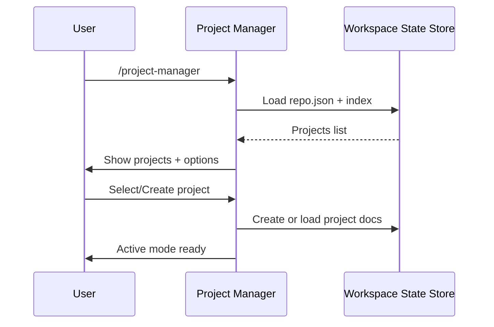
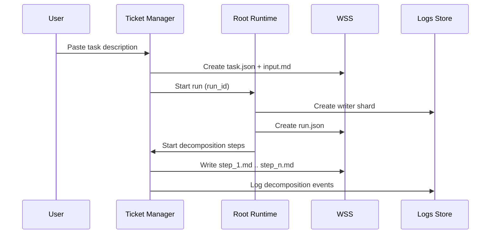

# Core Flows: Project Management & Autonomous Monitoring

## Overview

This spec documents the user flows for the multi-layered project management system after migrating to:

- durable Workspace State Store (WSS)
- sharded JSONL Logs Store
- filesystem Notifications and Control Actions queues
- Patch-Stream (jj-backed) ticket change stacks
- ephemeral sandboxes for tooling
- flat orchestration with mandatory PAUSE

**Constraints & Invariants**

- Local-only, single-machine execution. Not distributed, not cloud.
- Runtime artifacts are local and not committed to git.
- Prefer robustness over micro-optimizing I/O.
- Step logging is always on (step enter/exit + key events).
- Dynamic tracing is optional and enabled per-step when needed.
- Root orchestration is flat: root directly owns/controls all step/agent processes (no grandchildren).
- Pause is mandatory: on PAUSE, processes must stop promptly; enforcement is inside each process.
- Patch-Stream code-change model (jj-backed change graph). Persistent worktrees are not required for the system to function.
- Lint/tests/build run in ephemeral sandboxes (queued execution).
- UI is optional and must not gate workflows; MVP UI surfaces out-of-band notifications only.
- Users do not search logs by text; logs are retrieved and navigated by IDs.
- Keyword/fuzzy search is sufficient for project and ticket lookup; no embedding-model requirement.
- We avoid fixed iteration caps as termination criteria (progress-based circuit breakers instead).
- The system must support many concurrent writers without a single-writer bottleneck.
- All runtime files live under a single predictable root for easy cleanup and backup.

## Actors

- **User**: interacts via Project Manager, Ticket Manager, and optionally the UI.
- **Project Manager**: interactive CLI for project-level orchestration and QA.
- **Ticket Manager**: interactive CLI for ticket execution and task coordination.
- **Root runtime**: spawns and controls step processes (flat orchestration).
- **Step process**: executes one step, emits logs, honors PAUSE, and may spawn tool subprocesses.
- **Monitor** (optional): background watcher that raises notifications and applies control actions.
- **UI** (optional): notifications-only viewer and control-action sender.

## Flow 1: Project Manager - Initial Entry

**Trigger**: User runs `/project-manager`

**Steps**:

1. Determine `repo_uid` for the current repo (create `repo.json` if missing).
2. Load the project index from WSS:
   - `workspace/index.json` (or scan `workspace/projects/` if no index)
3. Display list of projects (ID + name) with fuzzy search.
4. User selects:
   - open existing project, or
   - create new project
5. If creating:
   - create `workspace/projects/<project_id>/project.json`
   - create `workspace/projects/<project_id>/docs/`
   - update `workspace/index.json` (derived index)
6. Enter interactive active mode.

**Exit**: Project Manager remains active, waiting for user input.

## Flow 2: Project Manager - Loading Documentation

**Trigger**: User in active project manager session

**Steps**:

1. User pastes markdown content or provides a file path.
2. Project Manager stores content under:
   - `workspace/projects/<project_id>/docs/` (project-level specs)
   - `workspace/tickets/<ticket_id>/docs/` (ticket-level docs), when applicable
3. Project Manager updates derived indexes (optional) for fast lookup.
4. Project Manager confirms the document was added and where it was stored.

**Exit**: Returns to active prompt.

## Flow 3: Project Manager - Ticket Ordering and Dependencies

**Trigger**: User requests “show tickets” or “order tickets”

**Steps**:

1. Load tickets for the project from WSS:
   - scan `workspace/tickets/` filtered by `project_id`
   - or consult `workspace/index.json`
2. Infer dependencies from ticket docs.
3. Write ordering to each ticket’s `ticket.json` (or to a project-level ordering file).
4. Display an ASCII dependency tree to the user.

**Exit**: Returns to active prompt.

## Flow 4: Project Manager - Opening Ticket Manager

**Trigger**: User requests to work on a ticket

**Steps**:

1. Project Manager selects the next runnable ticket from dependency ordering.
2. Project Manager prints the command:
   - `/ticket-manager --project <project_id> --ticket <ticket_id>`
3. User runs the command in a new terminal (parallel execution is supported).

**Exit**: User is now in Ticket Manager.

## Flow 5: Ticket Manager - Ticket Open or Create (Patch-Stream)

**Trigger**: User runs `/ticket-manager --project <project_id> --ticket <ticket_id>`

**Steps**:

1. Load or create `workspace/tickets/<ticket_id>/ticket.json`.
2. If no `stack_id` exists:
   - create jj change stack for the ticket (PGS)
   - store stack metadata in `ticket.json`
3. Set ticket status to `in_progress`.
4. Enter interactive active mode.

**Exit**: Ticket Manager remains active.

## Flow 6: Ticket Manager - Task Input and Decomposition

**Trigger**: User provides a complete task description

**Steps**:

1. Ticket Manager creates a new task directory in WSS:
   - `workspace/tickets/<ticket_id>/tasks/<task_id>/`
2. Store input under `input.md`.
3. Start a workflow run:
   - allocate `run_id`
   - create `workspace/runs/<run_id>/run.json`
4. Invoke decomposition orchestrator (multi-pass, approval gated).
5. Write step files under:
   - `workspace/tickets/<ticket_id>/tasks/<task_id>/steps/step_<n>.md`
6. Log decomposition events to the run’s log shards.

**Exit**: Task execution begins.

## Flow 7: Task Execution Workflow (Patch creation)

**Trigger**: Decomposition finished

**Steps**:

For each step (sequential):

1. Context manager determines required file reads and hydrates them from the ticket stack (virtual hydration).
2. Step process generates a patch:
   - Mode A: blind patch editor (hydrate and patch)
   - Mode B: sandbox editor (hydrate sandbox, run tools, capture diff)
3. Patch is applied to the ticket’s jj stack.
4. Deviations are recorded to WSS and logged as events.
5. Step emits `step_stop`.

After all steps:

- run sandbox validation (as configured)
- run implementation review against step plans and deviations
- write evaluation outputs under WSS
- raise notification if review or validation fails

**Exit**: Control returns to Ticket Manager.

## Flow 8: Ticket Manager - User Feedback Loop

**Trigger**: User provides feedback after task completion

**Steps**:

1. Ticket Manager interprets feedback and creates a new task (or appends a follow-up step plan).
2. Execute using the same decomposition and step execution flow.
3. Record deviations and evaluation artifacts.

**Exit**: Returns to active prompt.

## Flow 9: Ticket Completion

**Trigger**: User requests “close ticket”

**Steps**:

1. Run final sandbox validation for the ticket stack.
2. If gaps are found:
   - write gap report to WSS
   - raise notification and block closure
3. If validation passes:
   - export stack to target branch policy (squash or linear)
   - record export metadata in `ticket.json`
   - mark ticket as `done`

**Exit**: Ticket Manager returns control to Project Manager context.

## Flow 10: Enhanced Rebase - Conflict Investigation (jj)

**Trigger**: Rebase of a ticket stack reports conflicts

**Steps**:

1. Run `jj rebase` stack pointer move to new parent.
2. If conflicted changes exist:
   - create resolver jobs
   - gather evidence from:
     - hydrated file versions
     - WSS docs (project, ticket, tasks, deviations)
     - prior conclusions and conflict records
3. Investigator sub-agent proposes a resolution.
4. Apply resolution as a patch on top of the stack.
5. Persist conflict resolution record under WSS.
6. If escalated:
   - write report file
   - raise notification with instructions

**Exit**: Rebase completes or is blocked pending user action.

## Flow 11: Evaluation (sandbox-based)

**Trigger**: User requests project-level final review

**Steps**:

1. Create evaluation sandbox for the selected scope (ticket or project aggregate).
2. Run lint/tests/build as configured.
3. Run gap analyzer against planning docs and deviations.
4. Write evaluation report(s) under WSS.
5. Raise notification if gaps exist.

**Exit**: Returns to Project Manager.

## Flow 12: Logging and Step Evidence Capture

**Trigger**: Any step executes

**Steps**:

1. Root allocates `run_id` (if needed) and `step_execution_id`.
2. Step process writes:
   - `workspace/runs/<run_id>/steps/<step_execution_id>.json`
   - log events to its shard file
3. Step emits:
   - `step_start`
   - `tool_start` and `tool_stop` around tool subprocesses
   - stdout/stderr chunk events
   - `step_stop`
4. On user-visible issues, step writes a notification file with refs.

**Exit**: Evidence persists for investigation and replay.

## Flow 13: Optional Monitoring UI - Notifications

**Trigger**: User launches the UI

**Steps**:

1. UI uses helper to tail notifications JSONL or queue changes.
2. UI displays new notifications in the Notification Center.
3. UI sends control actions (pause, resume, trace, retry) via helper.

**Exit**: User closes UI.

## Flow 14: Autonomous Monitoring - Anomaly Detection and Recovery

**Trigger**: Optional monitor runs continuously or root applies basic detection

**Steps**:

1. Detect anomaly triggers (time is a signal, not the decision):
   - missing heartbeat updates
   - repeated identical failure signatures
   - tool subprocess no-progress indicators
2. Investigate first:
   - request trace escalation for the target step
   - collect bounded evidence (log shard slice, WSS docs)
3. Request PAUSE for the step or run.
4. Step must ACK PAUSE promptly.
5. If step cannot pause:
   - step spawns investigator job and emits classification
6. If fixable:
   - workflow-repair agent proposes a patch fix
   - validate in sandbox
   - RESUME or RETRY step
7. If needs user:
   - emit notification with concrete instructions
   - wait for user acknowledgement/control action

**Exit**: Workflow resumes, retries, or blocks for user action.

## Flow 15: Project Manager QA Mode - Handling Notifications

**Trigger**: User sees notification and responds in Project Manager

**Steps**:

1. User references notification ID or related run/step ID.
2. Project Manager locates the notification file and evidence refs.
3. Project Manager writes a control action:
   - `resolve`, `retry`, `resume`, or `set_trace`
4. Target step or root applies the action and logs outcome.

**Exit**: Returns to active prompt.

## Flow 16: Artifact Export

**Trigger**: User requests export

**Steps**:

1. Collect artifacts from WSS:
   - planning docs
   - tasks and steps
   - deviations and evaluation reports
   - conflict records
   - investigation bundles (if any)
2. Export to a timestamped directory under runtime root.
3. Print export path to the user.

**Exit**: User consumes exported files.

---

## Related Specs

- Epic brief: Epic_Brief__Multi-Layered_Project_Management_System.md
- Core infrastructure: Tech_Plan__Core_Infrastructure_&_Data_Model.md
- Project and ticket management: Tech_Plan__Project_&_Ticket_Management.md
- Enhanced rebase and evaluation: Tech_Plan__Enhanced_Rebase_&_Evaluation.md
- Monitoring and self-healing: Tech_Plan__Monitoring_&_Self-Healing.md
- Monitoring UI: Tech_Plan__Monitoring_UI_(Tauri).md
