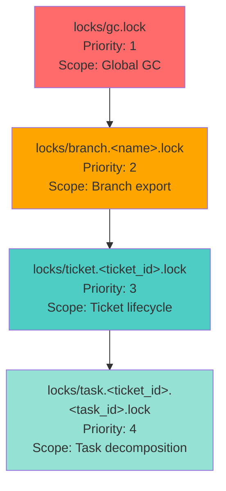

# Core Infrastructure — Multi-writer Correctness (Ownership + Concurrency)

- **Doc**: Tech_Plan__Core_Infrastructure/05_Multi_Writer_Correctness.md
- **Updated**: 2026-01-26
- **Library**: `workflow_engine.core.concurrency`
- **Depends on**: [`00_Foundation.md`](00_Foundation.md), [`03_IDs_and_Time.md`](03_IDs_and_Time.md), [`04_WSS_Workspace_State_Store.md`](04_WSS_Workspace_State_Store.md)
- **Primary responsibility**: Enforce ownership, optimistic concurrency (`expected_rev`), and cross-process serialization (locks) for correctness.

## 6) Multi-writer correctness (ownership + concurrency)

### 6.1 Ownership map (enforced at WSS helper layer)

| Document | Owner | Rationale |
|---|---|---|
| `workspace/runs/<run_id>/run.json` | Root runtime | lifecycle + grouping + routing |
| `workspace/runs/<run_id>/steps/<step_execution_id>.json` | Step process | step status/metrics and tool PID set |
| `workspace/projects/**` | Project Manager session | planning + import |
| `workspace/tickets/**` | Ticket Manager session | planning + ticket lifecycle |
| `workspace/index.json` | Root runtime | derived index |
| `workspace/conclusions/**` | Root runtime (investigator role) | promotion requires global gating |

Ownership violations MUST fail loudly (structured error), without retries.

### 6.2 Optimistic concurrency (`expected_rev`) and `rev` rules

For every JSON document write:
- the writer loads current doc
- validates ownership
- validates schema_version (must be <= supported)
- validates `expected_rev` when required
- applies merge patch
- increments `rev` by 1
- writes atomically

**When `expected_rev` is mandatory**:
- any doc with multiple plausible writers or sessions:
  - `ticket.json` lifecycle and metadata
  - `project.json` lifecycle fields
  - `run.json` lifecycle fields
  - derived indexes (`index.json`)
  - workflow registry overlays (if stored in WSS)

**Mismatch behavior**:
- fail once with a structured error containing:
  - `path`
  - `expected_rev`
  - `actual_rev`
  - `last_updated_at`
- no automatic retries
- notify user only if manual action is required

### 6.3 Cross-process locks (when correctness requires serialization)

Some operations must not interleave across processes:

| Operation | Lock | Scope |
|---|---|---|
| Export to the same target branch/ref | `locks/branch.<name>.lock` | repo_uid |
| Mutating the same ticket stack | `locks/ticket.<ticket_id>.lock` | repo_uid |
| Mutating a task’s decomposition artifacts (task.json, step_plan.yaml, candidates, deviations) | `locks/task.<ticket_id>.<task_id>.lock` | repo_uid |
| GC / compaction | `locks/gc.lock` | repo_uid |

**Branch lock naming (normative)**:
- Branch/ref names may include `/` and other characters that are not filename-safe.
- For `locks/branch.<name>.lock`, `<name>` MUST be:
  - `sha256(branch_or_ref_string).hexdigest()[:16]`
- The lock file body MUST include the original `branch_or_ref_string` for diagnostics.

Lock implementation:
- cross-platform lockfile using atomic create (`O_EXCL`) + process id + start time in file body
- stale lock reaping only via explicit `workflowctl recover-locks` (loud)

Implementation requirements (normative):
- The lock implementation MUST track the set of locks currently held by the process (including lock path and the corresponding priority defined in §6.4).
- Before acquiring any new lock, the implementation MUST validate that the acquisition complies with the global lock order defined in §6.4.
- Attempting to acquire a lock out of order MUST fail immediately with `E_LOCK_ORDER_VIOLATION` (no retries).

`E_LOCK_ORDER_VIOLATION` structure (normative):
```json
{
  "error_code": "E_LOCK_ORDER_VIOLATION",
  "requested_lock": "<lock_path>",
  "requested_priority": <int>,
  "held_locks": [{"path": "<lock_path>", "priority": <int>}],
  "message": "Cannot acquire <requested_lock> (priority <N>) while holding <held_lock> (priority <M>)"
}
```

### 6.4 Global lock acquisition order (normative)

The lock hierarchy is (highest priority / outermost scope → lowest priority / innermost scope):
1. `locks/gc.lock`
2. `locks/branch.<name>.lock`
3. `locks/ticket.<ticket_id>.lock`
4. `locks/task.<ticket_id>.<task_id>.lock`

Same-class ordering rule (normative):
- If multiple locks of the same class are required, they MUST be acquired in lexicographic order of the full lock filename (e.g., `locks/ticket.A.lock` before `locks/ticket.B.lock`).

Strict ordering invariant (normative):
- A process MUST NOT acquire a higher-priority lock after acquiring a lower-priority lock.

Violation behavior (normative):
- Attempting to acquire locks out of order MUST fail immediately with `E_LOCK_ORDER_VIOLATION`, including:
  - the lock being requested
  - the locks currently held
  - the expected acquisition order (via priorities and the hierarchy above)

Rationale (informative):
- This prevents deadlock by ensuring all processes acquire locks in the same total order, eliminating circular wait conditions.



| Scenario | Lock Sequence | Valid? | Reason |
|----------|---------------|--------|--------|
| GC then ticket inspection | gc → ticket | ❌ | Cannot acquire lower-priority lock while holding gc |
| Ticket then task decomposition | ticket → task | ✅ | Follows priority order (3 → 4) |
| Task then ticket update | task → ticket | ❌ | Violates order (4 → 3) |
| Branch export then ticket read | branch → ticket | ❌ | Violates order (2 → 3) |
| Two tickets (alphabetical) | ticket.A → ticket.B | ✅ | Same class, lexicographic order |
