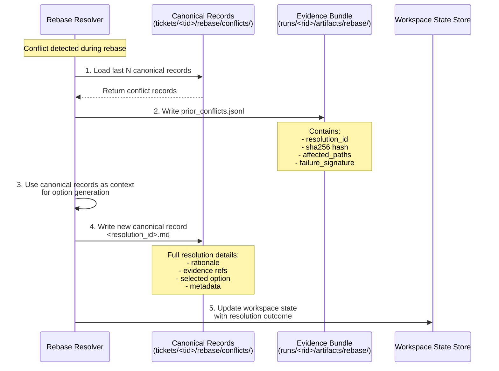

# Tech Plan: Enhanced Rebase & Evaluation (Restructured)

- **Doc**: Tech_Plan__Enhanced_Rebase_&_Evaluation.md
- **Updated**: 2026-01-24
- **Component**: Rebase Engine + Evaluation Engine
- **Primary responsibility**: Make integration pain evidence-backed and repeatable (conflicts as data; validation and gap analysis as durable artifacts).

## 1) Enhanced rebase (jj Patch-Stream)

### 1.1 Purpose
Rebase a ticket’s jj change stack onto a new parent revision while:

- treating conflicts as resolver jobs (not “repo breakage”)
- gathering evidence from planning docs, deviations, prior conflict records
- persisting durable resolution records so the system learns

### 1.2 JJ capabilities relied upon
- colocated repos and normal repos are supported
- multiple workspaces (worktrees) are supported (`jj workspace add`)
- reading file contents at revisions (`jj file show`) is supported

References:
- CLI reference: https://docs.jj-vcs.dev/latest/cli-reference/
- Working copy / workspaces: https://docs.jj-vcs.dev/latest/working-copy/

### 1.3 Rebase workflow (high-level)
This is executed via workflow `rebase_enhanced_v1` by default.

1. Acquire `locks/ticket.<ticket_id>.lock`
2. Invoke jj rebase operation for the ticket stack (pointer move + replay)
3. If jj reports conflicts:
   - enumerate conflicts
   - create a resolver job per conflict (step executions)
4. For each conflict:
   - gather evidence:
     - hydrated versions of conflicted files on both sides
     - relevant WSS docs (project, ticket, task steps, deviations)
     - relevant conclusions (tool/perf)
     - past conflict resolution records
   - spawn investigator/resolver to propose options
5. Apply chosen resolution as a new patch on top of the stack
6. Persist a conflict resolution record referencing evidence
7. If unresolved automatically:
   - persist an escalated record
   - emit notification with concrete user instructions and artifact paths

### 1.4 Evidence gathering for conflicts (normative)

When a rebase produces a conflict, the system MUST gather bounded, relevant evidence to support:
- automated resolution proposals
- durable learning (Conflict Resolution Records, §2)
- post-mortems and reproducibility

#### 1.4.1 Evidence bundle location

For each conflict, create an evidence bundle directory:

```text
workspace/runs/<run_id>/artifacts/rebase/<bundle_id>/
  manifest.json
  files/
    <path_hash>/
      base.txt
      ours.txt
      theirs.txt
      conflict.txt
      meta.json
  wss/
    ticket.json
    project.json
    step_plan.yaml
    deviations.jsonl
  refs/
    prior_conflicts.jsonl
```

`bundle_id` MUST be a ULID.

#### 1.4.2 Relevance rules (v1)

The evidence bundle MUST include:

See also:
- Storage relationship: Conflict Resolution Records §2.1.1
- `prior_conflicts.jsonl` schema: §2.1.2
- Hash verification protocol: §2.1.4

Always:
- the ticket document `workspace/tickets/<ticket_id>/ticket.json`
- the project document `workspace/projects/<project_id>/project.json`
- the current step plan used to produce the patch (`step_plan.yaml`) if available
- the most recent deviations log for the ticket (`deviations.jsonl`) (bounded to last 200 lines)

Per conflicted file path:
- “base/ours/theirs/conflict” text snapshots when the file is UTF-8 text and <= 1 MiB
- a `meta.json` containing:
  - repo-relative path
  - detected type: `text|binary|oversize`
  - byte size
  - sha256 of each snapshot (or of the working file if binary/oversize)

Prior conflict records (bounded):
- Include up to the last 10 conflict resolution records from:
  - `workspace/tickets/<ticket_id>/rebase/conflicts/`
  filtered by:
  - matching file path (exact match), OR
  - matching `failure_signature` when available (Hunk-lint §3.1.2)

#### 1.4.3 Bounding rules (v1)

The evidence gatherer MUST be bounded:

- Max conflicted paths to snapshot: 20  
  - If more, store only:
    - `manifest.json` listing all paths and hashes
    - snapshot the first 20 paths in deterministic order (lexicographic)

- Max per-file snapshot size: 1 MiB  
  - If larger: mark `oversize` and do not include full contents (store hash + path only)

Binary handling:
- If a file is detected as binary (NUL byte in first 8 KiB), mark `binary` and do not include full contents.

Any time content cannot be captured (binary/oversize), the resolver MUST treat the conflict as requiring user involvement (i.e., do not attempt speculative automated edits).
## 2) Conflict resolution records (durable learning)

### 2.1 Storage
```text
workspace/tickets/<ticket_id>/rebase/conflicts/<resolution_id>.md
```

Evidence bundles (§1.4.2) MUST reference canonical conflict records (not duplicate them) via `workspace/runs/<run_id>/artifacts/rebase/<bundle_id>/refs/prior_conflicts.jsonl` (see §2.1.1).

#### 2.1.1 Storage Architecture and Relationship

- **Canonical Storage (Source of Truth):**
  - Location: `workspace/tickets/<ticket_id>/rebase/conflicts/<resolution_id>.md`
  - Purpose: Durable, human-readable conflict resolution records
  - Lifecycle: Created once per conflict resolution, never modified after creation
  - Content: Full resolution details including rationale, evidence refs, selected option, and metadata

- **Evidence Bundle References (Reproducibility Pointers):**
  - Location: `workspace/runs/<run_id>/artifacts/rebase/<bundle_id>/refs/prior_conflicts.jsonl`
  - Purpose: Snapshot reference list for reproducibility and context loading
  - Lifecycle: Created per rebase run, references existing canonical records
  - Content: Lightweight metadata only - MUST NOT duplicate full record content

- **Key Principle:** Evidence bundles contain **references to** canonical records, not copies of them. This ensures:
  - Single source of truth for conflict resolution history
  - Efficient storage (no duplication)
  - Reproducibility through hash verification
  - Ability to reconstruct resolver context from any run

| Aspect | Canonical Records | Evidence Bundle References |
|--------|-------------------|---------------------------|
| **Location** | `workspace/tickets/<ticket_id>/rebase/conflicts/` | `workspace/runs/<run_id>/artifacts/rebase/<bundle_id>/refs/` |
| **Format** | Markdown (`.md`) | JSONL (`.jsonl`) |
| **Content** | Full resolution details | Metadata only (IDs, hashes, paths) |
| **Purpose** | Source of truth, human-readable history | Reproducibility, context reconstruction |
| **Lifecycle** | Permanent (subject to retention policy) | Per-run, ephemeral evidence |
| **Mutability** | Immutable after creation | Immutable after creation |
| **Size** | Variable (full rationale + evidence) | Fixed per entry (~200 bytes) |
| **Query Pattern** | By ticket_id, affected_paths, failure_signature | By run_id, bundle_id |

#### 2.1.2 Evidence Bundle Reference Schema

Schema (JSONL; one object per line):

```jsonl
{"resolution_id": "string", "sha256": "string", "affected_paths": ["string"], "failure_signature": "string?", "ticket_id": "string", "created_at": "ISO8601"}
```

Field definitions:

- `resolution_id`: Unique identifier of the canonical conflict record (matches filename without `.md`)
- `sha256`: SHA-256 hash of the canonical record content for verification
- `affected_paths`: List of file paths involved in the conflict (for quick filtering)
- `failure_signature`: Optional failure signature from §3.1.2 (for pattern matching)
- `ticket_id`: Ticket ID owning the canonical record (for path reconstruction)
- `created_at`: ISO timestamp when the canonical record was created

Constraints:

- Each line is a valid JSON object (JSONL format)
- Lines are ordered by `created_at` descending (most recent first)
- Maximum N entries (workflow-configurable, default 10)
- Hash MUST match canonical record content at reference creation time

#### 2.1.3 Data Flow and Lifecycle



1. **Context Loading:** Resolver queries canonical storage for last N conflict records matching current conflict signature or affected paths
2. **Reference Snapshot:** Resolver writes `prior_conflicts.jsonl` to evidence bundle with metadata (IDs, hashes, paths) of loaded records
3. **Option Generation:** Resolver uses full canonical records as context to generate resolution options
4. **Record Creation:** On successful resolution, resolver writes new canonical record to `workspace/tickets/<ticket_id>/rebase/conflicts/<resolution_id>.md`
5. **State Update:** Workspace state store is updated with resolution outcome and evidence bundle reference

#### 2.1.4 Hash Verification and Reproducibility

Verification protocol:

- **At Reference Creation:**
  - Compute SHA-256 hash of canonical record content (full `.md` file)
  - Store hash in `prior_conflicts.jsonl` entry
  - Hash is computed on normalized content (LF line endings, UTF-8 encoding)

- **At Context Loading:**
  - Load canonical record from path reconstructed from `ticket_id` and `resolution_id`
  - Compute SHA-256 hash of loaded content
  - Compare with hash in `prior_conflicts.jsonl`
  - If mismatch: Log warning, mark record as potentially modified, continue with loaded content
  - If canonical record missing: Log error, skip this reference, continue with remaining records

- **Reproducibility Guarantees:**
  - Evidence bundle can reconstruct exact resolver context by loading referenced canonical records
  - Hash mismatches indicate canonical record modification (should be rare - records are immutable)
  - Missing canonical records indicate cleanup/GC (acceptable - resolver degrades gracefully)

Error handling:

- Hash mismatch: `WARN` level, include both hashes in log, continue processing
- Missing canonical record: `ERROR` level, include expected path in log, skip reference
- Malformed JSONL: `ERROR` level, skip malformed line, continue with valid lines

#### 2.1.5 Implementation Guidance

Key implementation points:

- **Path Construction:** Canonical record path is `workspace/tickets/{ticket_id}/rebase/conflicts/{resolution_id}.md` where `resolution_id` is a ULID or deterministic hash
- **Atomic Writes:** Canonical records MUST be written atomically (write to temp file, then atomic rename)
- **No Modifications:** Once written, canonical records are immutable - never modify existing records
- **Reference Limits:** Evidence bundles should reference at most N canonical records (default 10, workflow-configurable)
- **Query Optimization:** Index canonical records by `affected_paths` and `failure_signature` for efficient context loading
- **GC Considerations:** Canonical records may be subject to retention policies (see Core Infrastructure §11 Retention and GC), but evidence bundle references remain valid (degrade gracefully on missing records)

Data structures:

- Use `ConflictBundle` from `file:scripts/spec_manager/spec_manager/core/data_structures.py` as foundation
- Extend with fields for canonical storage (`resolution_id`, `sha256_self`, `created_at`, `immutable`)
- Create new `ConflictReference` dataclass for `prior_conflicts.jsonl` entries

### 2.2 Required fields
- `resolution_id`, `ticket_id`
- `sha256_self`, `created_at`, `immutable` (always `true`)
- baseline + target stack identifiers
- affected paths
- `resolution_type`: `auto | manual | escalated`
- rationale (why this resolution)
- evidence refs:
  - run_id, step_execution_id, writer_id + seq ranges
  - WSS paths
  - jj change IDs

**Rationale:** Self-hash enables verification when the record is referenced from evidence bundles, ensuring integrity across the lifecycle.

### 2.3 Resolution option format and selection policy

Resolvers MUST output at least two options when feasible:

- Option A: conservative / minimal change
- Option B: higher-level refactor (only when it improves correctness)

Each option MUST be a fully specified patch proposal that can be validated by the same gates as normal patch creation (hunk-lint, scope rules, etc.).

**Required option metadata**:

Each option MUST include:
- `option_id`: A unique and stable identifier per conflict (e.g., deterministic ordinal or hash of the patch content)
- `patch`: The unified diff patch content
- `description`: Human-readable rationale for this option
- `paths_affected`: List of file paths this option modifies

**option_id requirements**:
- MUST be unique within a single conflict's option list
- MUST be stable (idempotent) across multiple resolution attempts for the same conflict
- Recommended: Use a deterministic ordinal (e.g., `opt_001`, `opt_002`) or content-based hash
- All option lists use this field for ordering and persistence during gating (see §2.3.3)

#### 2.3.1 Hard constraints

Before any option can be selected, it MUST satisfy all applicable hard constraints:

- Patch applies cleanly to the current ticket stack tip (or produces a resolvable conflict record)
- Stage 1 hunk-lint passes (see §3.1)
- Patch touches only allowed paths:
  - the conflict set paths, plus
  - explicitly allowed adjacent context paths (if declared)
- No new unresolved conflicts are introduced (unless the resolution type is explicitly `escalated`)
- Capability gating passes (Integration §7.3)

#### 2.3.2 Strict domination

Option X is **strictly dominated** by option Y if:

- X violates any hard constraint that Y satisfies, OR
- X fails Stage 1 hunk-lint and Y passes, OR
- X touches a strict superset of paths compared to Y while both satisfy all hard constraints

Strict domination is evaluated deterministically from artifacts (patch, hunk-lint results, scope lists).

#### 2.3.3 Selection policy

The selection policy is fully deterministic based on hard constraints, strict domination, and option count.

**Algorithm**:

```
options = all proposed options
feasible = [o for o in options if o satisfies ALL hard constraints]

if feasible empty:
  persist escalated conflict record
  stop needs_user (no auto retries)
elif len(feasible) == 1:
  select feasible[0] (MUST auto-select)
else:
  nondominated = remove_strictly_dominated(feasible)
  if len(nondominated) == 1:
    select nondominated[0] (MUST auto-select)
  else:
    require user selection (gate)
    present options sorted by option_id lexicographic
```

**Strict domination computation**:

Y dominates X if:

- X fails any hard constraint and Y passes all, OR
- both pass all constraints AND paths(X) is a strict superset of paths(Y)

If patches touch different files (neither a superset), neither dominates ⇒ gate.

In all cases, the chosen option and its selection rationale MUST be persisted in the conflict record (`resolution_id>.md` + optional `resolution_choice.json`).


## 3) Patch quality gates (ties rebase + patch generation together)

### 3.1 Stage 1: Hunk-lint

Stage 1 is a fast, deterministic gate that rejects invalid or unsafe patches **before** they are applied.

Required checks:

- Validate unified diff format
- Dry-run apply patch to the hydrated base (Mode A) or sandbox base (Mode B)
- Enforce scope: patch MUST NOT modify paths outside the step's allowed write set
- Optional syntax checks on changed files (tooling is workflow-defined)

#### 3.1.1 Hunk-Lint Specification

##### 3.1.1.1 Unified diff format validation

**Accepted formats (v1)**:

Hunk-lint accepts ONLY the following unified diff formats:

1. **Git-style unified diff**: Starts with `diff --git a/<path> b/<path>` headers. Additional git-style headers are permitted and ignored by hunk parsing:
   - `index <hash>..<hash> <mode>`
   - `new file mode <mode>`
   - `deleted file mode <mode>`
   - `rename from <path>`
   - `rename to <path>`
2. **Plain unified diff**: Standard POSIX format with `---`/`+++` file headers

No other patch formats are accepted.

**Explicit reject rules**:

Hunk-lint MUST reject patches that:

1. **Binary diffs**: Contain NUL bytes, base64-encoded binary content, or git binary patch markers:
   - NUL bytes in patch content
   - Lines prefixed with `GIT binary patch`
   - Lines starting with `literal` or `delta` (git binary diff format)
2. **Absolute paths**: File headers contain paths starting with `/`, **EXCEPT** for `/dev/null` which is permitted in `---`/`+++` headers for add/delete patches
3. **Parent directory escapes**: File headers contain `../` sequences or paths with `..` segments
4. **Malformed hunks**: Cannot be parsed into valid hunk headers and bodies

Standard unified diff format requirements (for accepted formats):

- **Header format**: All hunks MUST be preceded by one or more `---`/`+++` file headers
- **Hunk format**: Each hunk MUST follow the pattern:
  ```
  @@ -old_start,old_count +new_start,new_count @@
  <context lines>
  <removed lines (prefixed with `-`)>
  <added lines (prefixed with `+`)>
  ```
- **Line endings**: Both `\n` (LF) and `\r\n` (CRLF) line endings are accepted for display purposes, but all lines are internally normalized to `\n` for validation
- **Encoding**: Patches MUST be decodable as UTF-8 with replacement of invalid sequences

**Required constraints**:

1. **No trailing whitespace markers**: `patch` may treat trailing whitespace inconsistently across platforms. Hunk-lint MUST flag hunks where lines have inconsistent trailing whitespace between old and new versions.
2. **Hunk range consistency**: Hunk ranges (`@@ -x,y +a,b @@`) MUST correspond to the actual line counts in the hunk body. Mismatches indicate a malformed diff.
3. **File path sanity**: File paths in `---` and `+++` headers MUST NOT contain parent directory escapes (`../` or absolute `/`)
4. **No overlapping hunks**: Within a single file, hunks MUST NOT describe overlapping line ranges. Overlapping hunks result in application failures.

**Malformed diff detection**:

A patch is **malformed** if ANY of the following conditions hold:

1. **Parsing error**: The patch cannot be parsed into a sequence of well-formed hunks
2. **Empty hunk body**: A hunk header is present but the hunk body contains no line changes (all context)
3. **Range/count mismatch**: Declared hunk ranges do not match the actual context/change line counts
4. **Path injection**: File header paths contain `../` sequences or start with `/`
5. **Invalid line start characters**: Hunk body lines do not start with ` ` (context), `-` (remove), or `+` (add)
6. **Non-UTF-8**: Cannot be decoded as UTF-8 with replacement

On malformed diff detection, hunk-lint MUST fail with `error_code: MALFORMED_DIFF` and include:
- `failure_signature` (per §3.1.2)
- `parse_error_detail` describing which constraint failed
- Offending line numbers if available

##### 3.1.1.2 Dry-run apply mechanics (in-repo, cross-platform)

**Algorithm overview**:

Hunk-lint implements an in-repo dry-run apply algorithm that parses hunks and applies them in memory without dependency on external `patch` commands. This ensures cross-platform compatibility (including Windows) and deterministic behavior.

**Step 1: Parse hunks**

1. Extract all hunk headers (`@@ -old_start,old_count +new_start,new_count @@`)
2. For each hunk, parse:
   - `old_start`: Line number in base file (1-indexed)
   - `old_count`: Number of context + removed lines
   - `new_start`: Line number in patched file (1-indexed)
   - `new_count`: Number of context + added lines
3. Accumulate hunk bodies into structured data:
   - Context lines (prefix ` `)
   - Removed lines (prefix `-`)
   - Added lines (prefix `+`)

**Step 2: Identify modified files**

For each hunk, track:
- The file path(s) affected (from `---`/`+++` headers)
- The hunk range(s) on that file

**Step 3: Load base file contents**

1. For each modified file:
   - Read the base file content at `base_rev`
   - Normalize line endings to `\n` (CRLF and LF are converted to LF)
   - Split into normalized lines
2. Store as `FileContent { path, lines }` (line endings are normalized)

**Line-ending normalization note**: Base file content is normalized to `\n` before any comparison, making dry-run matching line-ending agnostic. This uses the same normalization as patch parsing/validation (see §3.1.1.1 line 259).

**Step 3a: Dry-run apply with fuzz matching**

For each hunk on a file:

1. **Locate match region**: Search the base file for the hunk's context lines within `+/- max_fuzz_lines` positions around `old_start`
   - `max_fuzz_lines` defaults to 50 (workflow-configurable)
   - Use exact preimage matching at anchor position `old_start` within fuzz range
   - Matching is performed on normalized lines (line-ending agnostic)

2. **Match types**:
   - **Exact match**: Found at exactly `old_start`
   - **Offset match**: Found within `+/- max_fuzz_lines` of `old_start`
   - **No match**: Context lines not found anywhere in the file

3. **Apply in memory**: Simulate the hunk application:
   - Remove the removed lines at the match position
   - Insert the added lines at the match position

4. **Result determination**:
   - **Success**: Hunk applies cleanly (exact or offset match)
   - **Failure**: Hunk found no context match (no_match) OR multiple matches found (ambiguous) within fuzz range

**Step 4: Aggregate results**

1. If all hunks succeed: dry-run passes, proceed to scope validation
2. If any hunk fails:
   - Record `failure_signature` with:
     - `error_code: apply_failed_no_match | apply_failed_ambiguous` (under E_TOOL_FAILED)
     - `hunk_id`: Index of failing hunk
     - `file_path`: Path of failing file
     - `expected_context`: The context lines that could not be matched
   - Fail hunk-lint

**Failure modes**:

- **apply_failed_no_match** (E_TOOL_FAILED): No context lines from the hunk could be found in the base file within fuzz range. Indicates the base has changed significantly, hunk is stale, or hunk is malformed.
- **apply_failed_ambiguous** (E_TOOL_FAILED): Multiple positions matched the hunk context within fuzz range. Indicates duplicate content or insufficient context. Application would be unpredictable.

**Mode A vs Mode B distinction**:

Both modes use the same in-repo algorithm. The only difference is the source of base file contents:
- **Mode A (hydrated base)**: Load hydrated content from hydrate manifest matching `base_rev`
- **Mode B (sandbox base)**: Load sandbox filesystem at baseline revision (via `jj workspace attach` + `jj file show`)

The dry-run algorithm itself is unchanged between modes—only the file source differs.

**Configuration parameters** (workflow-level):

```json
{
  "hunk_fuzz": {
    "max_fuzz_lines": 50
  }
}
```

**Error reporting format**:

On failure, hunk-lint MUST include:

```json
{
  "error_code": "apply_failed_no_match",
  "hunk_index": 2,
  "file_path": "src/main.py",
  "hunk_header": "@@ -42,7 +42,8 @@",
  "expected_context_lines": ["    def foo(", "        pass"],
  "expected_removed_lines": ["        print('old')"],
  "expected_added_lines": ["        print('new')"]
}
```

##### 3.1.1.3 Scope enforcement algorithm (v1 rules)

**Allowed write paths matching**:

The step declares `allowed_write_paths[]` which is a list of path patterns that the patch MAY modify. Per v1 specification, globs are forbidden—only exact matches and directory prefixes are supported.

**Pattern types (v1)**:

1. **Exact file path**: `"src/main.py"` matches only `src/main.py`
2. **Directory prefix**: `"src/"` matches `src/` and all files/directories under it

**Glob patterns are NOT supported**:
- `*`, `**`, `?`, `[abc]` wildcard patterns are rejected
- Negation patterns (`!`) starting with `!` are rejected
- If a pattern contains these characters, hunk-lint MUST fail with `error_code: INVALID_SCOPE_PATTERN`

**Matching algorithm (v1)**:

For each file path `p` in the patch:
```
allowed = false
for pattern in allowed_write_paths:
    if pattern ends with "/":
        # Directory prefix match
        if p starts with pattern:
            allowed = true
            break
    else:
        # Exact file match
        if p == pattern:
            allowed = true
            break
```

**Path normalization**:

Before matching, both patch paths and allowed patterns MUST be normalized:
- Collapse `./` and redundant `//` sequences
- Convert all path separators to forward slashes (`\` → `/`)
- Strip leading `a/` or `b/` prefixes from file paths (typically from `--- a/path` or `+++ b/path` headers)
- Strip trailing slashes from paths before comparison (except for patterns explicitly ending with `/`)

**Scope failure**:

If ANY modified file path in the patch does NOT match `allowed_write_paths[]`:
- Fail with `error_code: E_OWNERSHIP_VIOLATION`
- Include `failure_signature` and list of offending paths in error report

**Strict enforcement**:

Scope enforcement is ALWAYS applied:
- Empty `allowed_write_paths` is NOT valid—if empty, hunk-lint MUST fail with `error_code: E_OWNERSHIP_VIOLATION`
- There is no "disable enforcement" behavior
- Any path in the patch that is not in `allowed_write_paths[]` is a violation, no exceptions

**File addition vs modification**:

Scope enforcement applies equally to:
- File additions (paths present in `+++` headers but not `---`)
- File modifications (paths present in both `+++` and `---`)
- File deletions (paths present in `---` but not `+++`)

Any of these operations on a path outside `allowed_write_paths[]` is a scope violation.

##### 3.1.1.4 Rename handling

**Scope validation for renames**:

When a patch includes a rename operation (indicated by `rename from` and `rename to` git-style headers), both the `from` path and the `to` path MUST be validated independently against `allowed_write_paths[]`.

**Requirement**:

- Both `rename from` (old path) and `rename to` (new path) MUST each match at least one pattern in `allowed_write_paths[]`
- A mismatch on EITHER side is a scope violation

**Path normalization for renames**:

Both paths are normalized using the same rules as other paths:
- Collapse `./` and redundant `//` sequences
- Convert all path separators to forward slashes (`\` → `/`)
- Strip leading `a/` or `b/` prefixes if present
- Strip trailing slashes before comparison

**Scope failure on rename mismatch**:

If either the `from` path or the `to` path does NOT match `allowed_write_paths[]`:
- Fail with `error_code: E_OWNERSHIP_VIOLATION`
- Include `failure_signature` and list the offending path(s) in error report:
  - If `from` mismatches: list `"rename from: <old_path>"` as offending
  - If `to` mismatches: list `"rename to: <new_path>"` as offending
  - If both mismatch: list both paths as offending

##### 3.1.1.5 Optional syntax checks

**Purpose and surface (per plan.txt §2.4.4)**:

Syntax checks are optional, explicit tools that run AFTER the patch is successfully applied (in sandbox or hydrated base). If no sandbox is available, hunk-lint MUST either create one or fail loudly—it MUST NOT silently skip syntax checking.

**Configuration surface**:

Syntax checkers are specified in the step specification as `step_spec.hunk_lint.syntax_checks[]`:

```json
{
  "step_spec": {
    "hunk_lint": {
      "syntax_checks": [
        {
          "name": "python_ast",
          "file_patterns": ["**/*.py"],
          "command": ["python", "-m", "py_compile"],
          "fail_fast": false
        },
        {
          "name": "flake8",
          "file_patterns": ["src/**/*.py"],
          "command": ["flake8"],
          "fail_fast": true
        }
      ]
    }
  }
}
```

**Explicit per-step specification**:

- Each step declares its own `syntax_checks` array
- No automatic discovery, no default checkers, no inheritance
- If `syntax_checks` is omitted or null: syntax checking is SKIPPED (optional feature)
- If `syntax_checks` is an empty array: syntax checking is explicitly disabled for this step
- If `syntax_checks` contains entries: ALL specified checkers MUST run

**Execution logic**:

1. **Prerequisite**: Patch must have successfully applied (dry-run passed in Mode A/B)
2. **Sandbox requirement**: Syntax checks run in the sandbox (or created sandbox):
   - **If sandbox exists**: Run checks directly in the sandbox directory
   - **If no sandbox exists**:
     - Create a temporary sandbox from the base revision
     - Apply the patch to the sandbox
     - Run checks in the sandbox
     - Clean up the temporary sandbox
   - **Failure to create sandbox**: Fail hunk-lint with `error_code: SANDBOX_REQUIRED` (no silent skip)

3. **File selection**:
   - For each checker, compute the set of affected files from the patch (files with additions or modifications)
   - Filter by `file_patterns` using glob matching
   - Empty filtered set: checker passes trivially

4. **Run checker**:
   - Execute the checker `command` with filtered files as arguments
   - Capture `stdout`, `stderr`, and exit code
   - Exit code 0: checker passed
   - Exit code non-zero: checker failed

5. **Result aggregation**:
   - If `fail_fast` is true for any checker and that checker fails: immediately fail hunk-lint
   - If `fail_fast` is false: run ALL checkers, fail if ANY checker fails

**Failure reporting**:

On syntax check failure, hunk-lint MUST include in `failure_signature`:
- `checker_name`: Which checker failed
- `affected_files`: List of files checked
- `exit_code`: Checker's exit code
- `stderr_sha256`: Hash of normalized stderr (strip temp paths, line numbers)
- `error_code: SYNTAX_CHECK_FAILED`

**Supported checkers (examples)**:

| Checker | Languages | Example command |
|---------|-----------|-----------------|
| `python_ast` | Python | `["python", "-m", "py_compile"]` |
| `eslint` | JavaScript/TypeScript | `["eslint", "--no-eslintrc", "--parser-options=ecmaVersion:latest"]` |
| `go_compile` | Go | `["go", "build", "-o", "/dev/null"]` |
| `rust_check` | Rust | `["rustc", "--emit=metadata"]` |
| `flake8` | Python | `["flake8"]` |
| `pylint` | Python | `["pylint", "--errors-only"]` |

Checkers are NOT predefined—they are explicitly declared per step with their full command.

| Checker | Languages | Command (default) | Required by default? |
|---------|-----------|-------------------|---------------------|
| `python_ast` | Python | `python -m py_compile` | No |
| `eslint` | JavaScript/TypeScript | `eslint --no-eslintrc --parser-options=ecmaVersion:latest` | No |
| `go_compile` | Go | `go build -o /dev/null` | No |
| `rust_check` | Rust | `rustc --emit=metadata` | No |
| `flake8` | Python | `flake8` | No |
| `pylint` | Python | `pylint --errors-only` | No |

#### 3.1.2 Failure signature

#### 3.1.2 Failure signature

When hunk-lint fails, it MUST produce a stable `failure_signature` for convergence detection.

Normative computation:

1. Build a JSON object:

```json
{
  "schema_version": 1,
  "kind": "hunk_lint_failure",
  "error_code": "<enum>",
  "patch_sha256": "<sha256 of patch.diff bytes>",
  "base_rev": "<resolved base commit id>",
  "tool_fingerprint": "<fingerprint string>",
  "stderr_sha256": "<sha256 of normalized stderr>"
}
```

2. Normalize stderr:
- UTF-8 decode with replacement
- Convert `\r\n` → `\n`
- Strip absolute paths that point inside sandboxes / temp dirs
- Strip line/column numbers (`:<digits>[:<digits>]`) to reduce noise

3. Canonicalize JSON:
- Sort object keys lexicographically
- Emit minified UTF-8 JSON (no whitespace)

4. Compute:
- `failure_signature = "sha256:" + sha256(canonical_json_bytes).hexdigest()`

The `failure_signature` MUST be stored in `hunk_lint.json`.

Storage (normative):
- Per attempt: `workspace/runs/<run_id>/artifacts/steps/<step_execution_id>/hunk_lint.json`
- Per ticket history (append-only): `workspace/tickets/<ticket_id>/indices/hunk_lint_failures.jsonl`

The per-ticket history record MUST include at least:
- `ts`, `ticket_id`, `step_id`, `run_id`, `step_execution_id`, `mode` (`A` or `B`), and `failure_signature`.


#### 3.1.3 Repeated failure handling policy

Repeated identical failures are tracked across attempts for the same `(ticket_id, step_id)`.

**Time window (v1)**:
- A failure is considered “repeated” when the same `failure_signature` has occurred **twice within the last 24 hours** for the same `(ticket_id, step_id)`.

**Source of truth for history**:
- `workspace/tickets/<ticket_id>/indices/hunk_lint_failures.jsonl` (append-only)

**Normative handling**:

On every hunk-lint failure:
1. Write `hunk_lint.json` into the current step execution artifacts (see §3.1.2).
2. Append a record to the per-ticket history file.
3. Count matching history records for `(ticket_id, step_id, failure_signature)` where `now - ts <= 24h`.

If the count is **>= 2**:

- If the current attempt was running in **Mode A**:
  - force the next attempt to run in **Mode B** (sandbox required)
  - record a deviation noting the mode change
  - emit a notification (`warn`) describing why Mode B is being forced

- Otherwise (already Mode B, or Mode B cannot be created):
  - escalate: stop the step and require user action

“Force Mode B” means:
- set step sandbox policy `required: true` for the retry attempt
- re-run the step with the same declared file scope

Escalation (normative):
- The step MUST end `failed` with error code `E_TOOL_FAILED` (or a more specific patch-apply code).
- The workflow runner MUST apply the step’s `on_failure` policy (Integration §7.2.9).
- The notification MUST include:
  - `failure_signature`
  - `mode` attempted
  - a pointer to the `hunk_lint.json` artifact path
### 3.2 Stage 2: Sandbox validation (required at ticket close)
- create sandbox (jj workspace) from ticket tip
- capture environment metadata (`env_capture.json`)
- run workflow-defined validation commands
- persist raw outputs + structured summary
- block ticket close on failure

## 4) Evaluation (sandbox-based gap analysis)

### 4.1 Purpose
Produce a durable report comparing:

- planned intent (WSS project/ticket/task docs)
- what was implemented (jj stack + deviations)
- what tools observed (validation artifacts + logs)

### 4.2 Outputs
Ticket-level:
```text
workspace/tickets/<ticket_id>/tasks/<task_id>/evaluation/gaps.md
```

Project-level:
```text
workspace/projects/<project_id>/evaluation/<timestamp>/gaps.md
```

If gaps found:
- raise notification with report path
- Project Manager can create new tickets directly from gaps

### 4.3 Evidence sourcing rule (trust)
Evaluation must source “what happened” from:
- logs shards
- WSS artifacts
- jj stack identifiers
Not from agent memory.

### 4.4 Evaluation algorithm v1

Evaluation is an evidence-backed comparison between:

- **Plan**: step plan + approvals + recorded deviations
- **Reality**: the actual ticket stack and validation artifacts

Normative algorithm:

1. Load plan artifacts (per task):
   - `tasks/<task_id>/steps/step_plan.json`
   - `tasks/<task_id>/steps/approval_decision.json`
   - `tasks/<task_id>/steps/verification_result.json`
   - `tasks/<task_id>/deviations/` (if present)

   **Handle empty plans**: If `step_plan` has `steps: []`, mark task as `empty_plan_executed` and proceed to section 4.4.1.

2. Load reality artifacts:
   - `base_rev` and `tip_rev` from `ticket.json`
   - VCS diff summary for `base_rev..tip_rev` (changed paths + stats)
   - validation summaries from `tasks/<task_id>/validation/` (or run artifacts)

3. Compute `planned_path_set`:
   - union of `step.inputs.files[*].path` across planned steps

4. Compute `actual_path_set`:
   - changed file paths in `base_rev..tip_rev`

5. Emit gaps:

- **Unplanned change**:
  - `path ∈ actual_path_set` but `path ∉ planned_path_set`
  - and there is no deviation that justifies the change

- **Missing planned change**:
  - a planned step is marked `done` but none of its declared files appear in `actual_path_set`
  - (this is a strong indicator that the plan was not actually implemented)
  - **Exception**: This gap MUST NOT be emitted for tasks with empty step plans (`steps: []`). Empty plans are explicitly "no work needed" - not a gap.

- **Validation missing**:
  - required validation workflow did not run for the ticket close attempt

- **Validation failed**:
  - validation workflow ran and produced failing status

6. Persist outputs:
   - `gaps.md` (human-readable)
   - `gaps.json` (machine-readable; suitable for ticket creation)

### 4.4.1 Empty plan evaluation record

When a task has an empty step plan (`steps: []`), the evaluation MUST emit a specific record indicating that the plan was intentionally empty:

**Required fields**:
- `task_id`: The identifier of the task with the empty plan
- `status`: `completed`
- `empty_plan_executed`: `true`
- `rationale`: Either `"no work needed"` or `"already satisfied"`
- `evidence_refs[]`:
  - `plan_hash`: Hash of the step plan document for reproducibility
  - `validation_run_id`: Reference to the validation run that confirmed the empty state

**Purpose**: This record distinguishes between:
- Intentionally empty plans (no changes required)
- Accidentally incomplete implementations

### 4.5 Gap taxonomy

Each gap item in `gaps.json` MUST include:

- `gap_id` (ULID)
- `gap_type` (enum): `unplanned_change|missing_planned_change|validation_missing|validation_failed|deviation_unresolved`
- `severity` (enum): `info|warn|error`
- `evidence_refs[]` (paths + run/step ids)

### 4.6 Invocation

Evaluation is executed:

- automatically during ticket close (after validation), and
- manually via Project Manager for project-level audits.

Evaluation MUST be repeatable from artifacts; it MUST NOT depend on agent memory.


## 5) Test selection (workflow-defined, evidence-backed)

Ticket close requires validation, but validation commands may be expensive. Test selection provides a default, evidence-backed way to choose which commands to run.

Test selection is **not** a silent optimization:
- the selection algorithm must emit a durable rationale artifact
- the user can override selection policy via workflow config or CLI flags

### 5.1 Inputs

- `base_rev` (ticket base)
- `tip_rev` (ticket tip)
- `changed_paths[]` (derived from VCS diff)
- workflow-defined validation commands (Project & Ticket Management: Validation library (`project_ticket_system/Lib__Validation.md` §3))
  - Command schema is defined in `Lib__Validation.md` §3; test selection references commands by `cmd_id`.

### 5.2 Default algorithm v1

1. Compute `changed_paths` as the set of files changed between `base_rev..tip_rev`.

2. Derive `changed_packages`:
   - For each changed path, walk upward toward repo root until one of these “package root markers” is found:
     - `pyproject.toml`, `setup.cfg`, `setup.py`
     - `package.json`
     - `go.mod`
     - `Cargo.toml`
   - The nearest marker directory is the package root.
   - If no marker is found, the package root is repo root.

3. Select commands:
   - Always include commands where `'smoke' ∈ tags`.
   - Include package-scoped commands where `'package' ∈ tags` once per `changed_package`:
     - The runner sets `PWD` (or `cwd`) to the package root before running.
   - If no commands are tagged, run the full validation command list (loud: emit a warning notification that selection was impossible).
   - Selection produces an ordered list of `cmd_id` values; the rationale artifact records `cmd_id` + selection reason pairs.

4. Emit rationale artifact:
   - `workspace/runs/<run_id>/artifacts/test_selection_rationale.json`

Minimum fields:

```json
{
  "schema_version": 1,
  "base_rev": "<commit>",
  "tip_rev": "<commit>",
  "changed_paths": ["..."],
  "changed_packages": ["..."],
  "selected_commands": [
    { "cmd_id": "pytest_smoke", "reason": "tag:smoke" }
  ]
}
```

### 5.3 Pluggability

Workflows may override the default by providing one of:

- a custom validation workflow (`ticket_validate_v1` override) that implements its own selection, or
- a tool step that writes `test_selection_rationale.json` and a filtered command list artifact.

The runner MUST persist the rationale artifact regardless of selection strategy.


## 6) Risk register (rebase/eval layer)

| Risk | Severity | Control(s) |
|---|---:|---|
| Conflict resolution repeats without learning | Medium | persist conflict records + conclusions; consult before investigating |
| Validation results are not reproducible | Medium | env capture + tool fingerprints; workflow-defined commands |
| Evaluation artifacts drift from reality | Medium | source truth from logs + jj stack, not memory |
| Tool output is noisy | Low | persist raw output + structured summary; avoid silent filtering |
| **Reference Drift:** Evidence bundle references point to modified or deleted canonical records | Medium | Hash verification protocol (§2.1.4), immutable record policy, graceful degradation on missing records, retention policy coordination |
