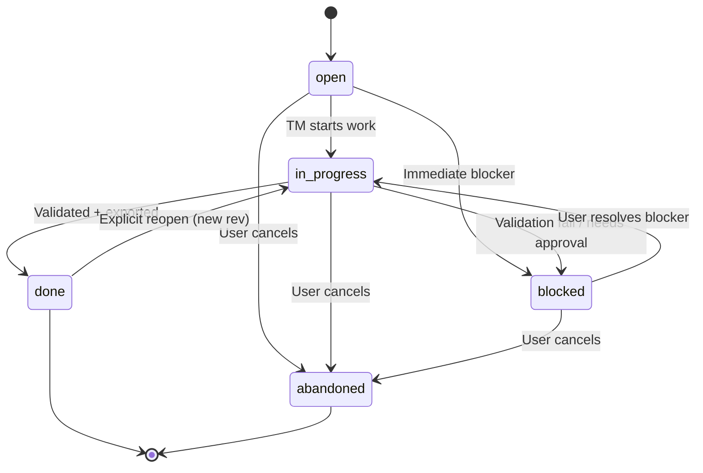

# Library: Lifecycle (`lifecycle`)

- **Primary responsibility**: Ticket/task state machines and concurrency/locking rules for durable status updates.
- **Depends on**: `wss_surfaces`
- **Used by**: `tm`, `decompose`, `execute`, `export`

**Authoritative spec**: This document’s **§1 “Ticket lifecycle (state machine)”** is the authoritative definition of ticket status transitions. All other specs MUST reference §1 rather than defining transitions independently.

## 1) Ticket lifecycle (state machine)

Ticket status is durable and updated with optimistic concurrency (`expected_rev`).

### 1.1 States (normative)

- `open`: Ticket created but work not started.
- `in_progress`: Active work in progress.
- `blocked`: Work paused; requires user intervention to proceed.
  - `blocked` MUST include `blocker_kind` (enum): `validation_failure`, `approval_required`, `missing_dependency`, `user_input_required`.
- `done`: Completed and validated (terminal).
- `abandoned`: Explicitly cancelled (terminal).

### 1.2 Allowed transitions (normative)

All ticket status changes MUST use the state machine below. Transitions not listed here are forbidden.

- `open → in_progress`: TM starts work.
- `open → blocked`: Created but immediately needs user input.
- `in_progress → blocked`: Needs user intervention (approval, missing dependency, validation failure).
- `blocked → in_progress`: User resolved blocker; TM resumes.
- `in_progress → done`: All tasks completed + validation pass + export success.
- `open → abandoned`: Explicit user command (cancel).
- `in_progress → abandoned`: Explicit user command (cancel).
- `blocked → abandoned`: Explicit user command (cancel).
- `done → in_progress`: ONLY via explicit `workflowctl ticket reopen` (creates new `ticket_rev`; never implicit).

### 1.3 Transition recording requirements (normative)

Every attempted *successful* transition MUST be recorded with:

- `reason` (string): Human-readable explanation.
- `evidence_refs` (array): References to artifacts/logs that justify the transition.
- `expected_rev` (string): Optimistic concurrency check value used for the transition.
- `transitioned_at` (RFC3339 timestamp).
- `transitioned_by` (actor identifier): `user` | `agent` | `system`.

Additional requirements:
- Any transition *to* `blocked` MUST record `blocker_kind` (see §1.1).
- `done → in_progress` MUST include a justification suitable for audit (see §1.7).

### 1.4 Visual diagram (informative)

### 1.5 Normative rules (normative)

- Terminal states:
  - `done` and `abandoned` are terminal.
  - Terminal states MUST NOT transition except via explicit reopen (`done → in_progress` only).
- Reopen semantics:
  - `done → in_progress` MUST be initiated only by `workflowctl ticket reopen`.
  - Reopen MUST create a new `ticket_rev` and MUST include justification.
  - Reopen MUST NOT be performed implicitly by any workflow or agent.
- Validation gating:
  - `done` requires validation workflow success (no bypass by default).
- Blocking requirements:
  - `blocked` requires an explicit `reason` field + `evidence_refs`.
  - `blocked` MUST include `blocker_kind` (see §1.1).
- Locking and atomicity:
  - All lock acquisition MUST comply with the global lock order defined in `Tech_Plan__Core_Infrastructure/05_Multi_Writer_Correctness.md` §6.4.
  - TM MUST perform ticket status transitions under `locks/ticket.<ticket_id>.lock`.
  - Transitions MUST be atomic while the ticket lock is held.

Clarifications (normative):
- Tickets created via `/project-manager tickets create …` start in `open`.
- When `/ticket-manager open <ticket_id>` begins work, it transitions `open → in_progress` (see §1.2).
- If a ticket is created implicitly by Ticket Manager (create+start), it MUST be created directly in `in_progress` and treated as equivalent to `open` followed immediately by `in_progress`.

### 1.6 State transition validation rules (normative)

Validation contract (TM MUST check before attempting a transition):
- Current ticket status matches the expected source status.
- `expected_rev` matches the current `ticket.json.rev`.
- Required evidence exists and is accessible (per `evidence_refs` being written).
- The transition is allowed per §1.2.

Failure handling (when transition validation fails):
- TM MUST log the validation failure with full context.
- TM MUST emit a notification that includes:
  - current status
  - attempted transition (`from_status → to_status`)
  - failure reason
- TM MUST NOT modify ticket state.
- TM MUST return an error to the caller with actionable guidance.

Concurrency conflict resolution (when `expected_rev` check fails):
- Reload current ticket state.
- Re-evaluate transition validity.
- If still valid, retry with the new `expected_rev`.
- If invalid, fail with a conflict notification (include both observed and expected values).

### 1.7 Transition audit trail (normative)

Audit log structure:
- Log event type: `ticket_status_transition`
- Required fields:
  - `ticket_id`
  - `from_status`
  - `to_status`
  - `reason`
  - `evidence_refs`
  - `transitioned_at`
  - `transitioned_by`
  - `ticket_rev_before`
  - `ticket_rev_after`
- Optional fields:
  - `blocker_kind` (for transitions to `blocked`)
  - `reopen_justification` (for `done → in_progress`)

Queryability:
- Logs query: filter by `ticket_id` and event type `ticket_status_transition`.
- Ticket metadata: `ticket.json` includes `status_history` array with the last N transitions.

Retention:
- Audit log and evidence retention is governed by Core Infrastructure retention policies (see `Tech_Plan__Core_Infrastructure/11_Retention_and_GC.md`).

## 2) Task lifecycle (state machine)

Task status is durable and updated by TM (single-writer under the ticket lock):

`open → decomposing → ready → executing → completed`

Additional terminal / interruption states:
- `needs_user_plan` (decomposition gave up; user must edit/approve plan)
- `failed` (execution failed with evidence; may be retried via new task/run)
- `aborted` (explicit user abort)

Rules (normative):
- `needs_user_plan` is resolved only by an explicit user action (`task approve-plan`) or by re-running decomposition with new constraints.
- Retrying does not “loop”; retries produce new run IDs and MUST add new evidence.

Locking (normative):
- All lock acquisition MUST comply with the global lock order defined in `Tech_Plan__Core_Infrastructure/05_Multi_Writer_Correctness.md` §6.4.
- Task lifecycle updates MUST occur under `locks/ticket.<ticket_id>.lock` (single-writer).
- When decomposition requires both ticket and task locks:
  - MUST acquire `locks/ticket.<ticket_id>.lock` first
  - THEN acquire `locks/task.<ticket_id>.<task_id>.lock`
  - MUST release in reverse order (task lock first, then ticket lock)
- Decomposition-specific lock acquisition details are defined in `project_ticket_system/Lib__Task_Decomposition.md` §4.
