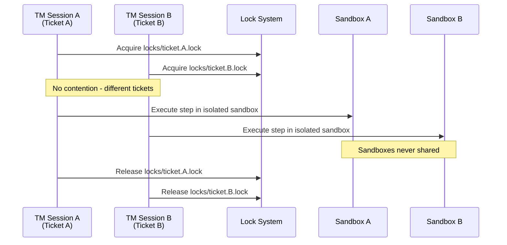
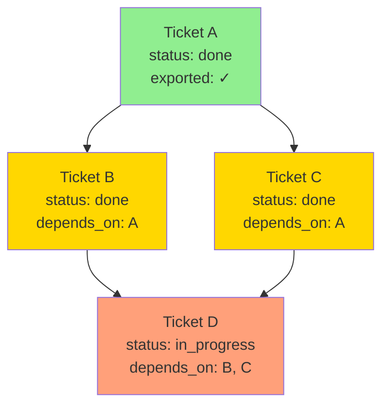

# Library: Ticket Manager (`tm`)

- **Primary responsibility**: Execute a specific ticket end-to-end: tasks → steps → patches → validation → export, producing durable evidence.
- **Depends on**: `cli`, `wss_surfaces`, `workflow_resolver`, `lifecycle`, `decompose`, `execute`, `validate`, `export`
- **Out of scope**: runtime log sharding, run schema details (see `Tech_Plan__Core_Infrastructure.md`).

## 1) Responsibilities (normative)

Ticket Manager MUST:
1. Create/open a ticket and its Patch-Stream stack (jj/PGS integration).
2. Create tasks (input → steps) with decomposition and an approval gate.
3. Execute steps sequentially (unless workflow explicitly enables safe parallelism); each step produces patch(es) on the ticket stack.
4. Run validation workflows (sandbox) and block ticket completion on failure.
5. Manage deviations and evaluation artifacts.
6. Run user-selected workflows (first-class customization).

## 2) Ticket execution lifecycle (orchestration)

### 2.1 Open / start work
- When opening a ticket for work, TM MUST perform ticket status transitions per `project_ticket_system/Lib__Lifecycle.md` §1 (authoritative state machine + recording requirements).
  - When `/ticket-manager open <ticket_id>` begins work, TM transitions the ticket from `open` to `in_progress` as defined by Lifecycle §1.
- If a ticket is created implicitly by TM (create+start), TM MUST create it directly in `in_progress`.

### 2.2 Plan (decomposition)
- `plan` invokes `task_decompose_v1` by default via `workflow_resolver`.
- Outputs and convergence rules are defined by `decompose`.

### 2.3 Execute
- `run` executes remaining steps in order using `step_execute_v1` by default.
- Step execution, evidence, and deviation rules are defined by `execute`.

### 2.4 Validate
- `validate` runs `ticket_validate_v1` by default.
- Artifacts and interpretation rules are defined by `validate`.

### 2.5 Close (complete ticket)
- `close` runs validate + evaluation + export + marks done (only if validation passes).
- Export policies and “review export” rules are defined by `export`.
- Ticket state transition to `done` is governed by `project_ticket_system/Lib__Lifecycle.md` §1.

## 3) Failure behavior (normative)

If any TM command fails, TM MUST:
- write a notification
- preserve run artifacts
- present the next recommended action (retry / investigate / user decision)

TM MUST NOT delete or overwrite evidence artifacts on failure.

## 4) Concurrency model (normative)

### 4.1 Single-ticket concurrency (existing content)

All lock acquisition MUST comply with the global lock order defined in `Tech_Plan__Core_Infrastructure/05_Multi_Writer_Correctness.md` §6.4.

TM MUST:
- perform ticket status transitions under `locks/ticket.<ticket_id>.lock`
- perform task lifecycle writes under the same ticket lock (single-writer)
- respect the decomposition lock `locks/task.<ticket_id>.<task_id>.lock` when invoking `decompose`

TM lock acquisition pattern (normative):
- TM acquires `locks/ticket.<ticket_id>.lock` at the start of ticket operations.
- TM holds this lock for the duration of ticket status transitions and task lifecycle writes.
- When invoking decomposition (which needs `locks/task.<ticket_id>.<task_id>.lock`), the decomposition inherits the ticket lock context and acquires the task lock (compliant with the global order).
- TM MUST NOT release the ticket lock while decomposition holds the task lock (maintains the lock nesting invariant).

### 4.2 Multi-ticket concurrency (NEW)

#### 4.2.1 Concurrent ticket work (normative)
- Multiple tickets MAY be worked simultaneously by different TM sessions
- Each TM session operates on exactly one ticket at a time
- Concurrent work on different tickets does NOT contend for locks (per §4.1)

#### 4.2.2 Resource isolation rules (normative)
- **Locks**: Per-ticket; `locks/ticket.<ticket_id>.lock` and `locks/task.<ticket_id>.<task_id>.lock` are scoped to individual tickets
- **Sandboxes**: Per-run/per-ticket; sandboxes are NEVER shared between tickets
- **Patch stacks**: Each ticket maintains its own jj bookmark and stack (see `wss_surfaces`)

#### 4.2.3 File conflict detection (normative)
- File conflicts between tickets are NOT prevented upfront
- Conflicts are detected at rebase/export time when ticket stacks are merged
- Early-warning detection is available via: `workflowctl tickets detect-overlap --active`
  - Compares `changed_paths` sets across all `in_progress` tickets (see `wss_surfaces` §2.1)
  - Emits warnings for overlapping file modifications
  - Does NOT block ticket work (informational only)

#### 4.2.4 Dependency tracking (normative)
- Tickets MAY declare dependencies on other tickets via `ticket.json.depends_on[]` (see `wss_surfaces` §2.1)
- `depends_on[]` contains ticket IDs that MUST be exported before this ticket
- Dependencies are validated at export time (see `export` §2.1)
- Circular dependencies MUST be rejected with `E_CIRCULAR_DEPENDENCY` (see `export` §2.2)

#### 4.2.5 Rebase ordering enforcement (normative)
- If ticket B depends on ticket A (`B.depends_on = ["A"]`), then:
  - A MUST export/rebase first
  - B's export MUST fail with `E_DEPENDENCY_NOT_EXPORTED` if A is not yet exported (see `export` §2.2)
- Enforcement occurs in `workflowctl ticket close` (see `export` §2.1)
- Dependency resolution is topological; cycles are forbidden

Diagram 1: Concurrent Ticket Isolation

Diagram 2: Dependency-Based Export Ordering

