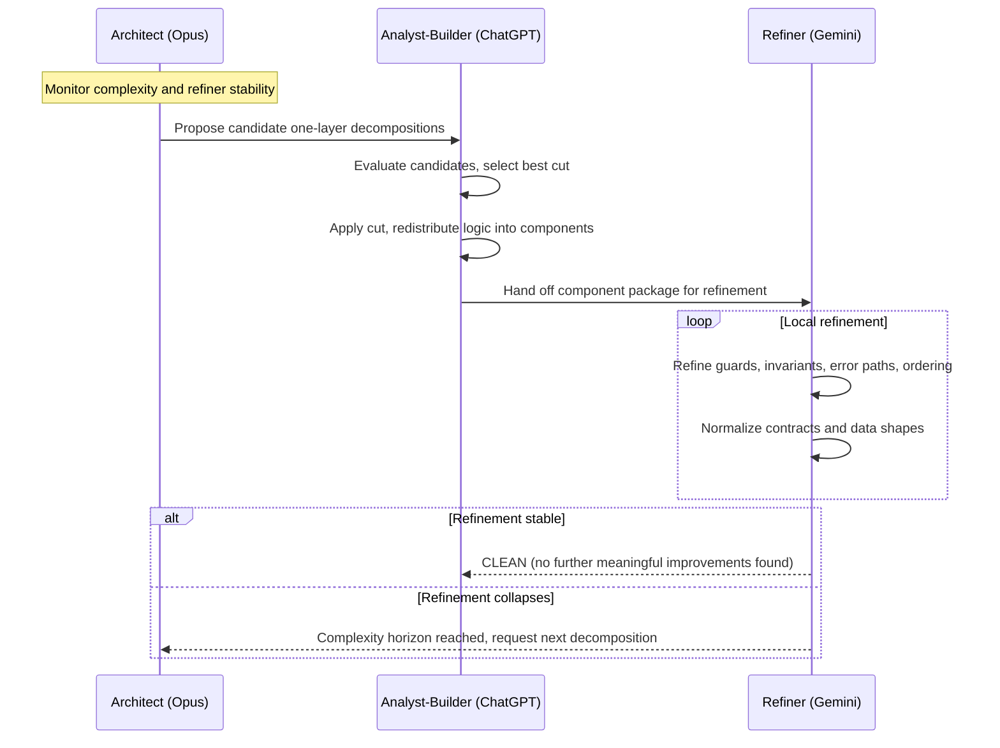
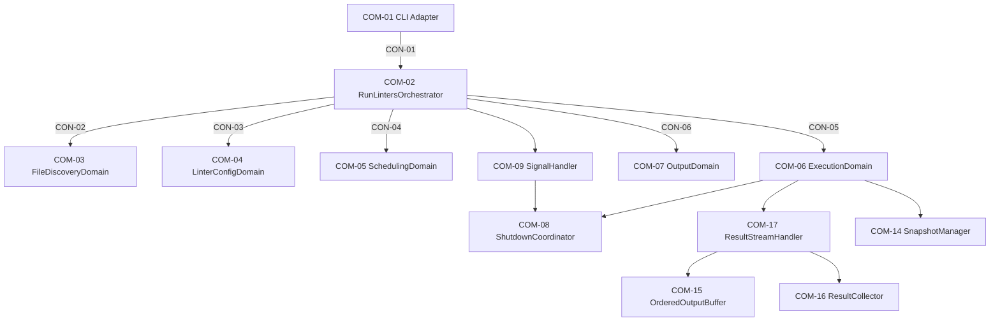
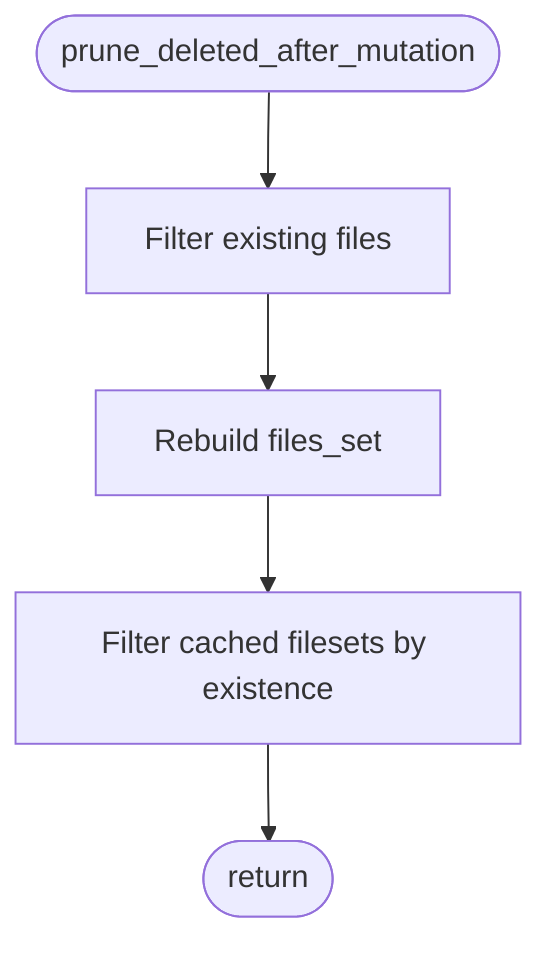
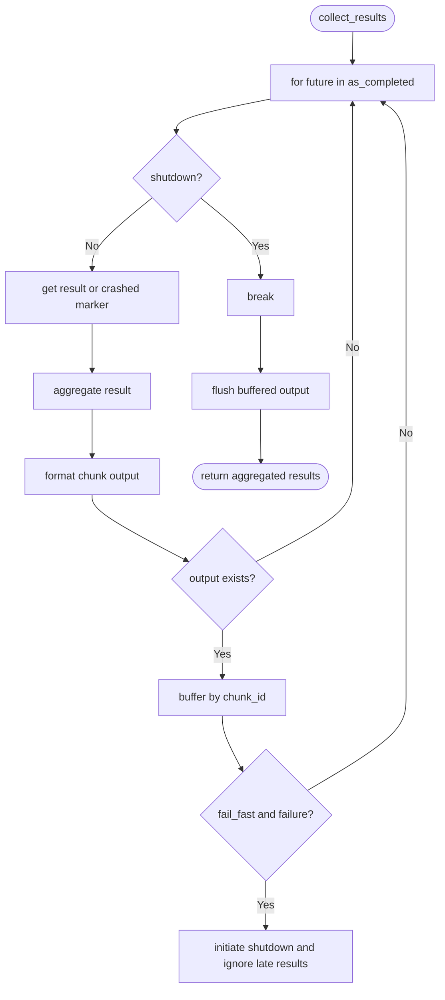

# Complexity-Driven Development: Diagram-First, Complexity-Triggered Decomposition for Agentic Software Architecture

## Abstract

Complexity-Driven Development (CDD) is an agentic methodology for producing software architecture where the primary artifact is not source code, but a compact, end-to-end flowchart model that embeds control flow, state, contracts, invariants, and error behavior. The system begins as a single algorithmic flowchart (or a small list of top-level flowcharts), is refined until changes stop producing meaningful gains, and is decomposed only when refinement reliability degrades. Decomposition is performed one layer at a time: an Architect model proposes candidate cuts, an Analyst-Builder selects and applies the best cut while redistributing logic, and a Refiner model stabilizes semantics inside the new components. This cycle repeats when the Refiner begins to collapse under complexity. CDD is positioned as an alternative to spec-first methodologies that can amplify context drift and contract hallucination in autonomous agent workflows.

---

## 1. Why diagram-first CDD exists

LLM-based development workflows fail in ways that are predictable and expensive:

* Premature modularization encourages guessed boundaries and invented interfaces.
* Bottom-up assembly creates locally coherent parts that do not compose cleanly.
* Error handling is treated as an afterthought, so shutdown, retries, determinism, and recovery become emergent bugs.
* State ownership becomes implicit and scattered, making the system hard to reason about and hard to refactor safely.

CDD addresses this by keeping the system as one coherent algorithmic representation until there is evidence that human or model reasoning is degrading.

In contrast, Spec-Driven Development (SDD) has recently emerged as a prominent AI-era workflow where specs become the primary artifact and drive generation and maintenance. The definition is still evolving, but tooling and commentary from GitHub, Thoughtworks, and Martin Fowler show SDD is being actively framed as a modern practice for AI-assisted engineering rather than a decades-old, stabilized term. ([GitHub][1])

Given that SDD is a new label in active flux, this paper keeps the name CDD.

---

## 2. The primary artifact is the algorithm, expressed as flowcharts

CDD treats the algorithm as the source of truth, but the algorithm is not “one big file.” It is a compact diagram package:

* A top-level flowchart that captures the end-to-end lifecycle.
* Embedded error behavior as explicit branches and terminal outcomes.
* Explicit state holders (named structures that persist across steps).
* Invariants that override all lower-level decisions.
* Contracts and data shapes at boundaries once decomposition begins.

This is closely aligned with the motivation behind model-centric development: models can become the main artifact that drives design and implementation, with code as a projection. ([SEI][2])

CDD also benefits from the long-standing value of visual formalisms for complex systems, including hierarchical modeling (statecharts) where hierarchy and decomposition are explicit, rather than implicit in files and call graphs. ([Modern Embedded Software | Quantum Leaps][3])

---

## 3. Surfaces are introduced deliberately: contracts, invariants, and state ownership

CDD uses “surface” to mean any artifact that reduces ambiguity and limits coupling.

Surfaces show up as:

* **Invariants**

    * Global rules that override requirements and implementation preferences.
    * Example: “deterministic ordering” or “parallel execution must be conflict-free.”

* **Contracts**

    * Explicit boundaries between components with obligations.
    * A contract defines what crosses a boundary and what must be preserved.

* **Internal artifacts**

    * Typed, named data shapes exchanged across boundaries.
    * The point is to make data flow explicit and stable.

* **State holders**

    * Named structures with a single owner component.
    * Their mutation points are restricted and visible.

This is conceptually related to Design by Contract, where obligations and guarantees are made explicit and enforceable. ([Software Engineering Lab][4])

The key CDD twist is sequencing:

* Contracts are not the starting point.
* Contracts are introduced only when complexity forces decomposition and the algorithm’s “true shape” is already visible.

---

## 4. The CDD multi-model loop

CDD is implemented as a role-separated loop where each role has a narrow responsibility.

### Roles

* **Architect (Opus)**

    * Proposes candidate decompositions.
    * Decomposes only one layer at a time.
    * May recompose components when earlier cuts were wrong.

* **Analyst-Builder (ChatGPT)**

    * Evaluates Opus candidates.
    * Selects the best decomposition (or a hybrid).
    * Applies the cut and redistributes logic across new components.
    * Fills in missing connective tissue and aligns contracts with the algorithm.

* **Refiner (Gemini)**

    * Iteratively refines component-local semantics.
    * Strengthens invariants, guards, and error behavior.
    * Continues until refinement becomes unstable or inconsistent, which signals a complexity horizon.

### Loop diagram

---

## 5. Case study: a lint dispatcher as a decomposed, contract-first surface layer

A concrete example of “surfaces introduced under pressure” is the evolution from a monolithic algorithm flowchart to a decomposed dispatcher architecture.

### 5.1 Before refinement: one monolithic flowchart

The pre-refinement artifact is a single flowchart describing the complete lifecycle, including:

* Global initialization and state setup
* A main loop over outstanding errors and investigation futures
* Concurrency controls (prevent concurrent edits to the same targets)
* Staleness and external-change handling via fingerprints and hashes
* Termination conditions that depend on actionable errors and locked resources
* Explicit modeling of “unlintable” targets and abort conditions

This artifact is represented directly as a flowchart.

The important point is not the domain, but the shape:

* Error behavior is not “off to the side.”
* State is not implicit.
* Concurrency and staleness are part of the algorithm, not implementation details.

### 5.2 After refinement: decomposition into domains and internals

Under complexity pressure, the architecture emerges as a set of components with explicit contracts and internal artifacts.

At a high level, the system decomposes into:

* CLI adapter
* Orchestrator (composition root)
* File discovery domain
* Linter configuration domain
* Scheduling domain
* Execution domain
* Output domain
* Execution internals (shutdown, snapshots, process tree management, ordered output buffering, result collection)

A simplified system map:

This is not an aesthetic decomposition. It is an explicit surfacing of contracts and ownership boundaries.

### 5.3 Invariants as first-class architecture drivers

The dispatcher requirements define invariants that override everything else, for example:

* Linter instance identity is correctness-critical.
* Deterministic ordering is mandatory.
* Drift handling at execution time uses existence checks only.
* Parallel execution must be conflict-free.
* There is no legacy compatibility path.

These invariants are not commentary. They constrain scheduling, caching, output ordering, shutdown, and snapshot design.

### 5.4 Contracts and internal artifacts make “surface area” explicit

The design map names contracts (CON-xx) and internal artifacts (IAR-xx), including schemas for run args, runtime facts, file discovery results, scheduling results, execution results, and output meta. This is what “introducing surfaces” looks like in a diagram-first workflow.

### 5.5 State ownership is encoded as dedicated components

A representative example is FileRegistry, which exists to prevent scattered conditionals and unclear ownership of cross-cutting file state. It owns:

* `files[]`
* a derived `files_set`
* `fileset_by_linter` cache keyed by linter instance identity
* explicit mutation timing rules

It also encodes a small, isolated algorithm for existence-only pruning and filtering.

The effect is architectural: execution can re-check reality without rebuilding the schedule or re-running discovery.

### 5.6 Error behavior is part of the algorithm, not a side channel

The orchestrator flowchart includes explicit error branches and exit semantics:

* invalid inputs and scheduling errors map to exit code 1
* no files or no applicable linters map to exit code 0
* SIGINT maps to exit code 130
* output logic is centralized in OutputDomain

This is encoded in the orchestration algorithm itself.

### 5.7 Isolation of high-risk couplings

ResultStreamHandler isolates a notorious coupling: “as-completed concurrency” plus “shutdown” plus “deterministic output ordering.”

This is a clear example of CDD surfacing:

* The coupling exists in the algorithm.
* The surface introduced is a named component with a small, auditable local algorithm.

---

## 6. How CDD compares to classic methodologies in the AI landscape

### 6.1 Stepwise refinement and top-down design

CDD’s decomposition lineage is closest to stepwise refinement, where a system is developed through successive refinement and decomposition. ([ACM Digital Library][5])

Key differences in an agentic setting:

* Stepwise refinement assumes humans maintain global coherence during decomposition.
* CDD delays decomposition until there is enough algorithmic evidence to cut safely, and it uses model stability as a practical signal for when decomposition is required.

### 6.2 Model-driven development and state-based formalisms

CDD is aligned with model-driven engineering in the sense that models are primary artifacts that can drive implementation. ([SEI][2])

CDD differs in emphasis:

* Traditional MDE often begins with an explicit model and transformations.
* CDD begins with an end-to-end algorithm model and introduces contracts and schemas only when complexity forces stable boundaries.

Statecharts are relevant precedent for representing complex control and hierarchy compactly. CDD can be viewed as applying a similar “hierarchical diagram as system” idea, but with agentic refinement and decomposition triggers. ([ScienceDirect][6])

### 6.3 Design by Contract

CDD’s contracts and invariants are directly compatible with the Design by Contract worldview: specify obligations, benefits, and invariants at boundaries. ([Software Engineering Lab][4])

CDD differs mainly in timing:

* DbC can be applied from the start.
* CDD introduces boundary contracts when boundaries are justified by complexity.

### 6.4 Spec-Driven Development

SDD is widely discussed as an AI-era practice that puts specs at the center and treats code as downstream. ([GitHub][1])

Where CDD is different:

* SDD elevates specification text as the canonical artifact.
* CDD elevates the algorithmic diagram as the canonical artifact, and treats error behavior and state as part of that algorithm, not as prose.

Practical tradeoffs:

* SDD strengths:

    * Easier human review early
    * Better parallelization for teams
    * Clear compliance story

* SDD weaknesses with agents:

    * Specs can drift from implementation intent
    * Large specs can exceed what models can reliably keep coherent
    * Contract text can be misinterpreted unless grounded in executable structure

* CDD strengths:

    * Higher information density per token
    * Reduced boundary hallucination early
    * Decomposition is evidence-driven

* CDD weaknesses:

    * Less upfront predictability for teams
    * Later emergence of ownership boundaries

---

## 7. Related AI research: pieces exist, but the full CDD loop is a synthesis

Several research threads cover parts of the CDD loop:

* **Iterative refinement**

    * Self-Refine formalizes iterative critique and revision, which mirrors the Refiner role in CDD. ([arXiv][7])
    * Reflexion adds memory and feedback-driven improvement for agents, including coding tasks. ([arXiv][8])

* **Candidate generation and selection**

    * Tree of Thoughts frames deliberate search over candidate reasoning branches, similar to generating candidate decompositions and selecting among them. ([arXiv][9])

* **Role-separated multi-agent software development**

    * ChatDev and MetaGPT propose role-based multi-agent workflows for software development. ([arXiv][10])

* **Autonomous software engineering agents**

    * SWE-agent and related repair agents highlight the importance of interfaces, tool use, and evaluation loops for software tasks. ([NeurIPS Proceedings][11])

What appears distinctive in CDD as applied here is the combination:

* A diagram-first algorithmic artifact
* One-layer-at-a-time decomposition
* Decomposition triggered by refiner instability as a complexity horizon
* Explicit surfacing of contracts, schemas, and state ownership as the primary decomposition product

The phrase “complexity-driven development” has been used previously in unrelated ways, often as a general management idea rather than an agentic diagram workflow. ([Charlie Alfred's Weblog][12])

---

## 8. Strengths and weaknesses of diagram-first CDD

### Strengths

* **High information density**

    * Flowcharts compress control flow and error handling into a form that fits within bounded context windows better than code.

* **Fewer invented interfaces**

    * Boundaries are created after the algorithm stabilizes, reducing “clean but wrong” interface design.

* **Explicit error behavior**

    * Shutdown, fail-fast, snapshot restore, and determinism are part of the algorithm, which reduces late-stage reliability surprises.

* **Clear ownership of cross-cutting state**

    * Components like FileRegistry make cache invalidation and mutation timing explicit rather than implicit.

* **Incremental decomposition reduces risk**

    * One-layer decomposition limits the blast radius of architectural decisions.

### Weaknesses

* **The complexity horizon is heuristic**

    * “Refiner collapse” is an operational signal, not a formal proof.
    * Different models or settings may shift the horizon.

* **Late decomposition can be expensive**

    * Waiting too long can require a large redistribution of logic during a single cut.

* **Diagram semantics can be underspecified**

    * If nodes are not typed with preconditions, postconditions, and state effects, ambiguity can move downstream into code generation.

* **Surface explosion risk**

    * Poorly controlled decomposition can create too many contracts and artifacts, increasing overhead and reducing agility.

---

## 9. Practical guardrails for applying CDD

To keep CDD from degenerating into endless refinement or uncontrolled decomposition:

* Define refinement budgets

    * max refinement passes per component
    * max change size per pass
    * churn detection (repeated edit reversals)

* Require minimal node semantics for diagrams

    * inputs and outputs
    * state read and state write
    * failure modes and recovery behavior
    * invariants touched

* Treat state holders as architecture, not implementation

    * name them
    * define owners
    * define safe mutation points

* Keep decomposition conservative

    * one layer at a time
    * minimal contracts
    * recomposition allowed when a cut was wrong

---

## References and example artifacts

### Public references

* Spec-Driven Development toolkits and commentary (GitHub, Thoughtworks, Martin Fowler). ([GitHub][1])
* Stepwise refinement (Wirth). ([ACM Digital Library][5])
* Design by Contract (Meyer). ([Software Engineering Lab][4])
* Statecharts (Harel). ([ScienceDirect][6])
* Tree of Thoughts, Self-Refine, Reflexion, ChatDev, MetaGPT, SWE-agent. ([arXiv][9])

### Example artifact set used for the case study

* Lint Dispatcher requirements and invariants.
* Execution plan.
* Design map with components, contracts, and internal artifacts.
* Composition root algorithm (RunLintersOrchestrator).
* Result streaming and ordered output component algorithm.
* Architecture overview.
* Pre-refinement monolithic algorithm flowchart.
* FileRegistry as an explicit integration state holder.

[1]: https://github.com/github/spec-kit?utm_source=chatgpt.com "Toolkit to help you get started with Spec-Driven Development"
[2]: https://www.sei.cmu.edu/library/file_redirect/2015_004_001_435420.pdf/?utm_source=chatgpt.com "Model-Driven Engineering: Automatic Code Generation and ..."
[3]: https://www.state-machine.com/doc/Harel87.pdf?utm_source=chatgpt.com "Statecharts: A Visual Formalism for Complex Systems"
[4]: https://se.inf.ethz.ch/~meyer/publications/old/dbc_chapter.pdf?utm_source=chatgpt.com "Design by Contract"
[5]: https://dl.acm.org/doi/10.1145/362575.362577?utm_source=chatgpt.com "Program development by stepwise refinement"
[6]: https://www.sciencedirect.com/science/article/pii/0167642387900359?utm_source=chatgpt.com "Statecharts: a visual formalism for complex systems"
[7]: https://arxiv.org/abs/2303.17651?utm_source=chatgpt.com "Self-Refine: Iterative Refinement with Self-Feedback"
[8]: https://arxiv.org/abs/2303.11366?utm_source=chatgpt.com "Reflexion: Language Agents with Verbal Reinforcement Learning"
[9]: https://arxiv.org/abs/2305.10601?utm_source=chatgpt.com "Deliberate Problem Solving with Large Language Models"
[10]: https://arxiv.org/abs/2307.07924?utm_source=chatgpt.com "ChatDev: Communicative Agents for Software Development"
[11]: https://proceedings.neurips.cc/paper_files/paper/2024/file/5a7c947568c1b1328ccc5230172e1e7c-Paper-Conference.pdf?utm_source=chatgpt.com "SWE-agent: Agent-Computer Interfaces Enable Automated ..."
[12]: https://charliealfred.wordpress.com/complexity-driven-1/?utm_source=chatgpt.com "Complexity-Driven #1 | Charlie Alfred's Weblog"
