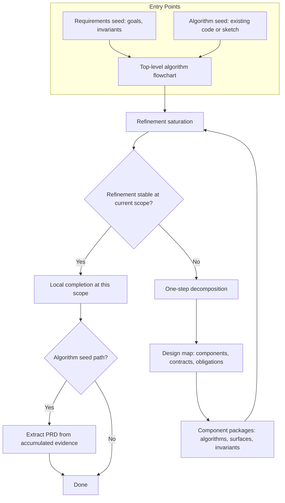
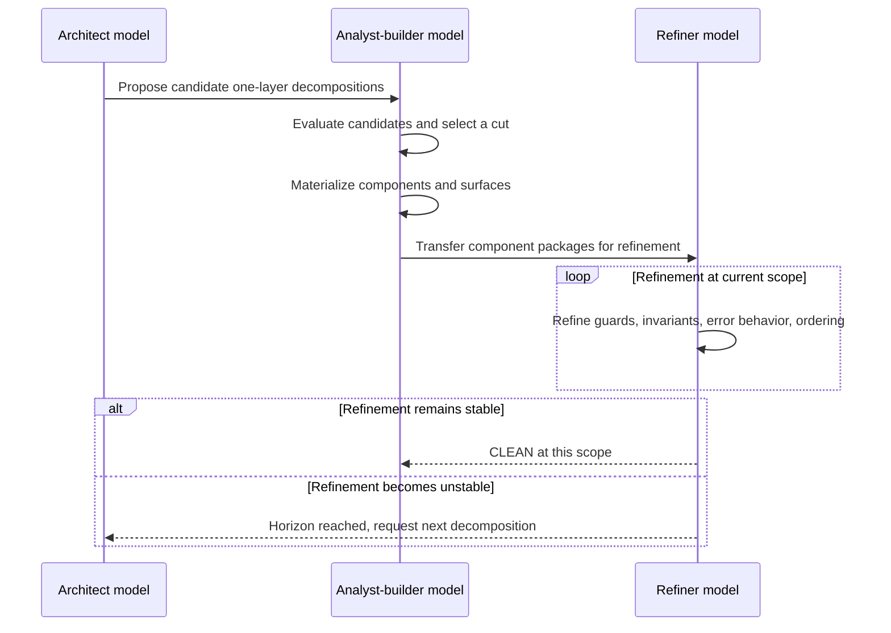

# Refinement-Gated Decomposition: Invariant-Centered Planning Artifacts for Agentic Software Engineering

## Abstract

This paper presents **Refinement-Gated Decomposition (RGD)**, a planning algorithm for agentic software engineering in which the canonical system representation is an end-to-end algorithm expressed as **hierarchical flowcharts**. RGD delays architectural decomposition until iterative refinement of the algorithm becomes unstable. When instability is observed, the planner performs a single decomposition step, introduces explicit **surfaces** as contracts expressed through **invariant obligations**, redistributes algorithmic responsibility into component packages, and resumes local refinement.

RGD supports two entry points: a **requirements seed** (goals and invariants defined upfront) and an **algorithm seed** (existing code or sketches refined first, with requirements extracted retroactively). Invariants are not fixed inputs but **emerge through refinement**—growing as the algorithm grows, crystallizing when decomposition introduces surfaces, and expanding when tradeoffs require explicit decisions. The **delayed organization principle** ensures that architecture is introduced only when cognitive limits demand it, and then minimally; final organization emerges at the end rather than being committed upfront. This inverts the traditional sequence: algorithms accumulate evidence, and architecture follows.

The method is paired with an identifier-indexed documentation scheme that prioritizes invariants, traceability, and graph construction over schema commitments. A case study of a parallel lint dispatcher illustrates the artifact family produced by RGD, including a requirements document with global invariants, a design map specifying components and boundary obligations, and component-local algorithms for shutdown coordination, deterministic output ordering, and state registry ownership. The paper compares RGD to spec-driven development (SDD) toolchains and to classical methods in software engineering and AI planning.

---

## 1. Terminology and naming

### 1.1 Motivation for a distinct name

The phrase “complexity-driven development” has existing usage in software practice to describe approaches that prioritize addressing the most significant complexities early. ([Charlie Alfred's Weblog][1]) This paper adopts different terminology to avoid ambiguity.

### 1.2 Definition of Refinement-Gated Decomposition

**Refinement-Gated Decomposition (RGD)** is defined by three commitments:

* **Primary artifact**: the system algorithm is represented as flowcharts that encode control flow, failure paths, and state handling.
* **Refinement gate**: refinement proceeds until improvement becomes unstable, inconsistent, or regressive at the current scale.
* **One-step decomposition**: decomposition is applied one layer at a time, producing components and surfaces, followed by renewed refinement at smaller scopes.

### 1.3 Definition of Spec-Driven Development in the current tool ecosystem

This paper uses **Spec-Driven Development (SDD)** to refer to emerging agentic workflows in which structured specifications are elevated to primary artifacts and are used to drive implementation generation and task breakdown. ([GitHub][2])

---

## 2. Artifact system: identifiers, invariants, and graph construction

RGD is operationalized through a documentation system designed for machine parsing and graph construction. The system is organized around identifiers that can be referenced across documents without duplication.

### 2.1 Requirements documents (PRDs)

A PRD is structured as indexed items with explicit precedence for invariants and explicit cross-references. It is designed to minimize duplication and ambiguity through typed references rather than narrative restatement.

Key properties:

* Unique identifiers for goals, invariants, rules, resources, external boundaries, algorithms, metrics, and open questions.
* Explicit precedence: invariants apply globally and override conflicting lower-level rules.
* Traceability via typed cross-references, enabling requirement coverage checks and graph derivations.

### 2.2 Design maps

A design map defines:

* **Components** (COM-IDs)
* **Contracts** (CON-IDs), representing surfaces between components or between a component and an artifact
* **Component invariants** (INV-STORES-*, INV-*), describing state storage requirements and other guarantees
* **Boundary obligations** (OBL-IDs), representing enforceable obligations at surfaces

The design map enforces PRD traceability and specifies when derived requirements may remain local versus when ambiguities must be escalated back into the PRD.

A central constraint is that **surfaces are specified as invariants on inputs and outputs**, not as concrete schema definitions.

### 2.3 Component packages

Component packages are the location of algorithms. A component package groups:

* Algorithm flowcharts
* Surface definitions for that component
* Optional internal artifacts owned or used by that component

Component documentation is constrained to express boundary behavior through invariants rather than embedded schema definitions.

### 2.4 Architecture decision records

Decisions are recorded in ADRs and referenced by identifier only from PRDs or design maps. Rationale is not embedded in planning artifacts.

---

## 3. The RGD planning algorithm

### 3.1 Input and state

RGD operates over a set of algorithm units at each layer. The initial unit may be a single top-level flowchart or a list of top-level flowcharts.

Each unit is treated as a package containing:

* An algorithm flowchart
* Component invariants describing state storage (if any)
* Surfaces (if any)

### 3.2 Entry points: requirements seed vs algorithm seed

RGD supports two distinct entry points:

**Requirements seed**: Begin with goals, constraints, and invariants. The algorithm is synthesized to satisfy these requirements. This is appropriate when the problem domain is well-understood and constraints are known upfront.

**Algorithm seed**: Begin with existing code or an algorithm sketch. Extract the algorithm as flowcharts, then refine it. Invariants, goals, and requirements emerge from the refinement process rather than preceding it. This is appropriate for:

* Refactoring legacy code
* Resolving bugs where the root cause is unclear
* Extracting implicit design from existing implementations
* Exploratory development where requirements are underspecified

In the algorithm seed path, invariants are not defined upfront. The algorithm itself serves as the seed. As refinement proceeds and decomposition occurs, invariants crystallize from the patterns observed in the algorithm. Requirements documents are generated retroactively from the evidence accumulated during refinement.

### 3.3 Invariant emergence

Invariants in RGD are not static declarations established at the start. They grow with the system:

* **Initial invariants** may be sparse or absent entirely
* **Refinement-discovered invariants** emerge as the algorithm is improved and edge cases are addressed
* **Architecture-driven invariants** arise when decomposition introduces surfaces that require contracts
* **User-decided invariants** are introduced when tradeoffs become unclear and require explicit decisions

The invariant set expands to improve, refine, and grow the system toward its goals. This contrasts with specification-first approaches where invariants are treated as fixed inputs to the design process.

### 3.4 Phases

#### Phase A: Requirements seeding (optional for algorithm seed path)

* Produce a PRD containing goals, invariants, and indexed rules.
* Encode precedence constraints as invariants.
* Define external artifacts and boundaries.

This phase is consistent with identifier-indexed PRDs.

When using the algorithm seed path, Phase A is deferred. The algorithm is refined first (Phases B-C), and requirements are extracted retroactively after sufficient evidence has accumulated through refinement.

#### Phase B: Algorithm synthesis

* Produce an end-to-end flowchart that represents the system algorithm.
* Encode error behavior and termination conditions as explicit branches.

A representative pre-refinement artifact can be a single compact flowchart describing initialization, scheduling, execution, staleness handling, and termination.

#### Phase C: Refinement saturation

* Refine algorithm logic until the refiner cannot identify additional improvements that reduce defects or increase coherence at the current scale.
* Refinement targets include guards, invariants, ordering constraints, failure modes, and state transitions.

This phase is an iterative refinement process aligned with test-time refinement concepts in the LLM literature. ([arXiv][3])

#### Phase D: Horizon detection

Decomposition is triggered when refinement becomes unstable. Observable signals include:

* Inconsistent edits across passes
* Local improvements that increase global complexity
* Repeated regressions introduced by patches
* Growth of cross-cutting couplings that are difficult to stabilize

#### Phase E: One-step decomposition

* Generate candidate decompositions of the current unit into components and surfaces.
* Select a decomposition and materialize it as:

  * A design map with COM, CON, IAR, and OBL identifiers
  * Component packages with algorithm flowcharts and surface invariants

This corresponds to hierarchical decomposition in planning, with a constrained decomposition step applied iteratively. ([arXiv][4])

#### Phase F: Recursion

* Apply the same refinement and decomposition process to resulting components.
* Recomposition is permitted when later evidence indicates the previous cut increased coupling or reduced reasoning stability.

### 3.5 The delayed organization principle

A core tenet of RGD is to **delay organization as long as possible**. The algorithm is not organized into components until cognitive limits force decomposition. When decomposition is required, organize **minimally**—just enough to restore comprehensibility and enable continued refinement.

The rationale:

* **Algorithms as evidence**: Refined algorithms provide concrete evidence for architectural decisions. Premature decomposition relies on speculation about the right boundaries. Delayed decomposition allows the architecture to emerge from observed complexity rather than predicted complexity.
* **Cognitive forcing function**: Decomposition is triggered by the inability to reason coherently at the current scale, not by predetermined architectural blueprints. This ensures that structure is introduced precisely when needed.
* **Minimal organization**: Each decomposition step introduces only enough structure to restore working conditions. Final organization is completed only at the end, when the full algorithmic picture is known.

This principle inverts the traditional sequence of architecture-then-implementation. In RGD, the algorithm accumulates evidence, and the architecture crystallizes from that evidence.

### 3.6 RGD loop diagram

---

## 4. Role separation and multi-model execution

RGD can be implemented as a role-separated agentic system. One effective instantiation assigns distinct responsibilities to distinct models:

* **Architect model**: proposes candidate decompositions and potential recompositions.
* **Analyst-builder model**: evaluates candidates, selects a cut, and redistributes logic across components.
* **Refiner model**: performs iterative refinement inside components and reports horizon conditions.

This separation is consistent with multi-agent software frameworks that encode distinct roles and verification stages. ([arXiv][5])

### 4.1 Capability-specialized model assignment

Different models exhibit distinct strengths that can be exploited for specific RGD phases:

* **Algorithm refinement**: Models strong in mathematical reasoning, proofs, and algorithmic analysis (e.g., models optimized for STEM tasks) are effective for iterative refinement of algorithm logic, edge case handling, and invariant formulation.
* **Architecture pattern generation**: Models with broad pattern recognition and creative synthesis capabilities excel at generating candidate decompositions and crafting hybrid architectural solutions from accumulated algorithmic evidence.
* **Analysis and synthesis**: Models optimized for detailed analysis, synthesis across sources, and context retention are effective for evaluating candidates, distributing algorithms across architectures, and ensuring consistency.

An effective workflow routes algorithm diagrams through specialized refiners until limits are reached, then hands off to pattern-oriented models for architecture generation, and finally uses analysis-oriented models to evaluate and distribute the result.

### 4.2 Decomposition and refinement sequence

---

## 5. Surfaces, contracts, invariants, and state ownership

### 5.1 Surfaces as invariant obligations

RGD treats a surface as an enforceable boundary characterized by invariant obligations. In the design map structure, a contract specifies interaction type, input invariants, output invariants, required constraint identifiers, and boundary obligation identifiers.

The contract is expressed in terms of what must be guaranteed, using identifiers that can be traced to PRD invariants. This approach is aligned with contract-based reasoning in software design, while remaining independent of concrete schema declarations. ([Software Engineering ETH Zurich][6])

### 5.2 State storage invariants and ownership rules

State storage requirements are expressed as component invariants (e.g., INV-STORES-FILE-REGISTRY) with explicit ownership and guarantees. The goal is to confine mutation and make invalidation rules explicit.

In the lint dispatcher case study, the FileRegistry abstraction is documented via a state storage invariant that specifies how the component owns file state and caches, with explicit ownership rules and mutation boundaries designed to preserve invariants during parallel execution.

### 5.3 Error behavior as algorithm structure

In RGD, error behavior is encoded as branches in the algorithm flowcharts and is refined as part of the same process that refines nominal behavior.

In the lint dispatcher case study, orchestrator behavior includes explicit exit conditions and error-handling structure as part of the orchestration algorithm.

---

## 6. Case study: parallel lint dispatcher artifacts

This section summarizes a representative RGD artifact set.

### 6.1 Requirements: global invariants

The lint dispatcher requirements define global invariants that constrain architecture and implementation, including:

* identity and keying constraints
* deterministic ordering constraints
* drift handling constraints
* conflict-free parallel execution constraints
* constraints on compatibility layers

These invariants are explicitly prioritized as globally overriding constraints.

### 6.2 Design map: components, contracts, boundary obligations

The design map introduces a component graph with explicit contracts (CON identifiers) and boundary obligations (OBL identifiers), mapping each element back to requirement identifiers.

### 6.3 Component packages: local algorithms with explicit couplings

A representative component package isolates a known coupling: concurrent completion of futures, shutdown detection, and deterministic output ordering. The artifact documents this coupling explicitly and localizes it in a component algorithm.

### 6.4 Pre-refinement algorithm compactness

The pre-refinement artifact for the dispatcher can be represented as a single flowchart that remains compact while encoding end-to-end behavior.

---

## 7. Comparison to related methodologies

### 7.1 Relationship to stepwise refinement

Wirth’s stepwise refinement develops programs by successive refinement from specification to implementation. ([ACM Digital Library][7]) RGD aligns with successive refinement but differs in its gating rule: decomposition is triggered by refinement instability rather than by a predetermined refinement schedule.

### 7.2 Relationship to model-driven architecture and visual formalisms

Model-driven architecture places models at the center of software specification. ([OMG][8]) RGD adopts a similar primacy for models, with the additional requirement that the model is algorithmic and contains error behavior and state transitions.

Statecharts demonstrate that hierarchical visual models can represent complex systems with well-defined semantics. ([Modern Embedded Software | Quantum Leaps][9]) RGD uses hierarchical flowcharts as the planning substrate and relies on decomposition to manage scale.

### 7.3 Relationship to Design by Contract

Design by Contract specifies module obligations through preconditions, postconditions, and invariants. ([Software Engineering ETH Zurich][6]) RGD applies contract concepts at boundaries but constrains representation to invariant obligations linked to requirement identifiers, enabling traceability across planning artifacts.

### 7.4 Relationship to classical AI planning algorithms

RGD is structurally related to planning methods that delay commitments until required:

* Partial-order planning defers ordering constraints until forced by causal requirements. ([Wikipedia][10])
* Refinement planning formalizes plan synthesis as iterative refinement of partial plans. ([AAAI Online Journal][11])
* Hierarchical task network planning constructs solutions via iterative decomposition of abstract tasks. ([arXiv][4])

RGD can be interpreted as hierarchical decomposition of algorithm graphs, with a gating criterion based on refiner stability.

### 7.5 Comparison to Spec-Driven Development toolchains

SDD is currently described as an emerging agentic workflow that begins with structured specifications and proceeds through breakdown and implementation generation. ([thoughtworks.com][12])

A planning-level distinction can be stated in terms of commitment timing:

* SDD approaches commonly establish decomposition and contracts early in the planning chain, using specification artifacts as the primary driver. ([GitHub][2])
* RGD establishes an end-to-end algorithm first and applies decomposition after stability degradation is observed at the current scope.

---

## 8. Novelty assessment in the AI landscape

RGD is best characterized as a synthesis of existing concepts with a distinct operational structure:

* Iterative refinement resembles self-feedback refinement and reflection-based improvement frameworks. ([arXiv][3])
* Candidate generation and selection resembles deliberate branching and evaluation frameworks. ([arXiv][13])
* Role separation resembles multi-agent development frameworks that encode specialized responsibilities. ([arXiv][5])

The novel elements are:

* **Algorithm-first planning substrate**: Hierarchical flowchart artifacts as the primary representation, with architecture derived from algorithmic evidence rather than speculated upfront.
* **Dual entry points**: Support for both requirements-seed and algorithm-seed workflows, enabling use in greenfield development and legacy refactoring alike.
* **Emergent invariants**: Invariants grow with the system rather than being fixed inputs; they crystallize from refinement activity and decomposition decisions.
* **Evidence-based architecture**: Refined algorithms provide concrete evidence for architectural decisions. Decomposition is informed by observed complexity rather than predicted complexity.
* **Delayed organization principle**: Architecture is deferred until cognitive limits force it, and then applied minimally. Final organization emerges at the end rather than being committed upfront.
* **Decomposition gated by instability**: Decomposition is triggered by refiner instability, executed as one-step cuts with recursion.

No single referenced framework specifies this combination as an explicit planning algorithm for software architecture induction.

---

## 9. Strengths, limitations, and applicability

### 9.1 Strengths

* High information density due to algorithmic flowcharts as primary artifacts.
* Dual entry points enable both greenfield development and legacy code refactoring.
* Emergent invariants reduce upfront specification burden and allow requirements to crystallize from evidence.
* Evidence-based architecture avoids speculative decomposition by grounding decisions in refined algorithmic artifacts.
* Surfaces defined as invariant obligations, supporting traceability and reducing dependency on schema details.
* Explicit representation of shutdown behavior, deterministic ordering, and cross-cutting state ownership in component-local algorithms.
* Delayed organization reduces premature abstraction and keeps the system malleable until complexity demands structure.

### 9.2 Limitations

* The horizon detection criterion is empirical and depends on the refiner’s capabilities at the current scope.
* Late decomposition can increase redistribution cost when a component boundary is introduced.
* Diagram semantics require discipline: nodes and surfaces must reference invariant identifiers with sufficient specificity to prevent ambiguity drift.
* SDD-aligned artifacts can be operationally advantageous when external governance requires early specification checkpoints. ([thoughtworks.com][12])

### 9.3 Applicability conditions

RGD is most appropriate for systems where correctness depends on:

* concurrency semantics
* shutdown and partial failure behavior
* deterministic ordering constraints
* explicit state invalidation and ownership rules

The lint dispatcher case study falls into this class.

RGD is also well-suited for:

* **Legacy code refactoring**: Extract algorithms from existing code, refine them to expose latent bugs and unclear invariants, then restructure.
* **Bug resolution with unclear root causes**: Extract the relevant algorithm, refine it until the defect becomes visible, then fix and decompose as needed.
* **Underspecified requirements**: Begin with an algorithm sketch, let invariants emerge through refinement, and extract requirements retroactively.

---

## 10. Conclusion

Refinement-Gated Decomposition defines a planning algorithm and artifact system for agentic software engineering that centers algorithmic flowcharts as the primary representation and defers decomposition until refinement instability is observed. RGD supports dual entry points—requirements seed and algorithm seed—enabling both greenfield development and legacy code refactoring. Invariants emerge through refinement rather than being fixed upfront, and architecture crystallizes from accumulated algorithmic evidence rather than being speculated early.

The delayed organization principle ensures that structure is introduced only when cognitive limits demand it, and then minimally. This inverts the traditional architecture-then-implementation sequence: algorithms accumulate evidence, and architecture follows. The resulting artifacts provide traceability from requirements through contracts and components, while keeping boundary definitions anchored in invariant obligations rather than schema commitments.

The method is compatible with classical ideas in refinement, contract-based design, and hierarchical planning, and it provides a concrete mechanism for managing bounded reasoning limits during agentic construction.

---

## Selected references

* SDD definitions and tool framing: GitHub Spec Kit, Thoughtworks Radar and analysis, Martin Fowler’s exploration of SDD tools. ([GitHub][2])
* Complexity-driven development as a distinct existing term: examples of complexity-first framing. ([Charlie Alfred's Weblog][1])
* Stepwise refinement: Wirth (1971). ([ACM Digital Library][7])
* Statecharts: Harel (1987). ([Modern Embedded Software | Quantum Leaps][9])
* Design by Contract: Meyer. ([Software Engineering ETH Zurich][6])
* AI planning: HTN surveys and refinement planning frameworks. ([arXiv][4])
* LLM planning and refinement: Tree of Thoughts, Self-Refine, Reflexion, MetaGPT. ([arXiv][13])
* Artifact structure guidelines: PRD structure, design map structure, component package structure, ADR template.

[1]: https://charliealfred.wordpress.com/complexity-driven-2/?utm_source=chatgpt.com "Complexity-Driven #2 | Charlie Alfred's Weblog"
[2]: https://github.com/github/spec-kit?utm_source=chatgpt.com "Toolkit to help you get started with Spec-Driven Development"
[3]: https://arxiv.org/abs/2303.17651?utm_source=chatgpt.com "Self-Refine: Iterative Refinement with Self-Feedback"
[4]: https://arxiv.org/abs/1403.7426?utm_source=chatgpt.com "An Overview of Hierarchical Task Network Planning"
[5]: https://arxiv.org/abs/2308.00352?utm_source=chatgpt.com "MetaGPT: Meta Programming for A Multi-Agent Collaborative Framework"
[6]: https://se.inf.ethz.ch/~meyer/publications/old/dbc_chapter.pdf?utm_source=chatgpt.com "Design by Contract"
[7]: https://dl.acm.org/doi/10.1145/362575.362577?utm_source=chatgpt.com "Program development by stepwise refinement"
[8]: https://www.omg.org/mda/?utm_source=chatgpt.com "Model Driven Architecture (MDA)"
[9]: https://www.state-machine.com/doc/Harel87.pdf?utm_source=chatgpt.com "Statecharts: A Visual Formalism for Complex Systems"
[10]: https://en.wikipedia.org/wiki/Partial-order_planning?utm_source=chatgpt.com "Partial-order planning"
[11]: https://ojs.aaai.org/aimagazine/index.php/aimagazine/article/download/1295/1196?utm_source=chatgpt.com "Refinement Planning as a Unifying Framework for ..."
[12]: https://www.thoughtworks.com/en-us/radar/techniques/spec-driven-development?utm_source=chatgpt.com "Spec-driven development | Technology Radar"
[13]: https://arxiv.org/abs/2305.10601?utm_source=chatgpt.com "Deliberate Problem Solving with Large Language Models"
