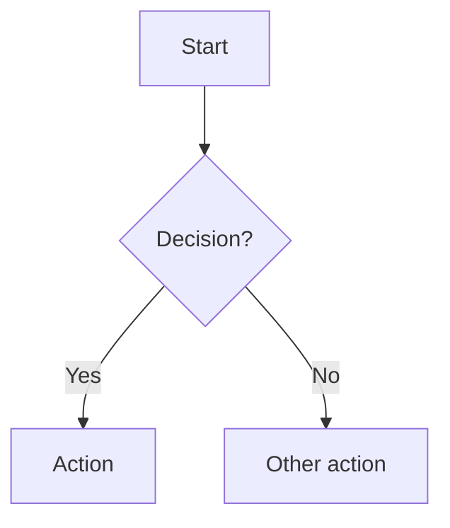

# Components (Packages) — Structure

Component packages are where **components** live. A component package groups:

- `COM-XX` components (may be purely architectural composition of other `COM-XX`)
- `ALG-XX` algorithms (Mermaid flowcharts + cross-references back to PRD IDs)
- optional state holders (`IAR-XX`) used or owned by the component
- `CON-XX` surfaces (contracts/boundaries) expressed as input/output invariants (not
  schemas)

This module defines the standard structure for component packages. It intentionally
specifies **invariants on inputs/outputs** (what they MUST include / guarantee), not
concrete schemas, field/key names, data types, or strict data "shapes".

## Invariants

- **INV-COM-01 — PRD traceability:** every `COM-XX` / `ALG-XX` / `CON-XX` / `IAR-XX`
  section MUST cite PRD IDs via `Cross-references:` or `Implements:`.
- **INV-COM-02 — Surfaces are invariant contracts:** surfaces MUST be documented as
  input/output invariants per `.tasks/processes/design map structure.md`.
- **INV-COM-03 — Start with one component:** begin with a single root component package
  that contains the full component graph and all algorithms; split only when the
  decomposition is clear.
- **INV-COM-04 — No shape embedding:** do not embed schema definitions, field/key names,
  data types, or example payload shapes inside component packages; express "shape"
  requirements as invariant IDs and reference them.
- **INV-COM-05 — Architectural components allowed:** a `COM-XX` may exist only to
  compose other components (no algorithms/state); it still participates in the graph and
  must reference relevant invariants and boundaries.

## Root Component Package: `architecture.md`

The root component package is the starting point:

- Contains the initial component graph and **all** `ALG-XX` algorithms
- Defines the component's surfaces (`CON-XX`) and their input/output invariants
- Acts as the index when additional component packages are created

When splitting into multiple components:

- Create new component packages as `com-XX-<kebab-name>.md`
- Move the relevant `ALG-XX` sections into the new package
- Keep `architecture.md` as the root index + cross-component invariants + system diagram

## Templates

### Template: Root component package (`architecture.md`)

````markdown
# Component: Architecture (root)

Sources: {links to PRD, Design Map, ADRs}

## Component and surface map (optional until split)


## Surfaces (CON-XX)

### Contract: CON-__

Between: (COM-__, COM-__)
For: (ART-__/IAR-__)
Interaction: {request-response|pub-sub|batch|stream|filesystem|...}
Cross-references: (requires: INV-__; satisfies: SET-__; decided-by: ADR-###)

Input MUST include (IDs only; no schema fields/types):

- {ID} — {required semantic element / operational metadata / gating invariant}

Output MUST include (IDs only; no schema fields/types):

- {ID} — {required semantic element / operational metadata / gating invariant}

Boundary obligations:

- OBL-__ — {short obligation description}
  Cross-references: (requires: INV-__; satisfies: SET-__)

## Algorithms (ALG-XX)

### ALG-01: {algorithm name}


````

### Template: Split component package (`com-XX-*.md`)

````markdown
# Component: COM-__ — {component name}

Sources: {links}

## Surfaces (CON-XX)

### Contract: CON-__
... (same surface sections/invariants as above)

## Algorithms (ALG-XX)

### ALG-__: {algorithm name}
... (Mermaid flowchart; cite PRD IDs in Cross-references)
````

## Reference Example (splitting)

For a concrete example of a root `architecture.md` plus split component package(s),
see:

- `.tasks/plans/parallel linter/lint dispatcher/architecture.md`
- `.tasks/plans/parallel linter/lint dispatcher/com-02-run-linters-orchestrator.md`
