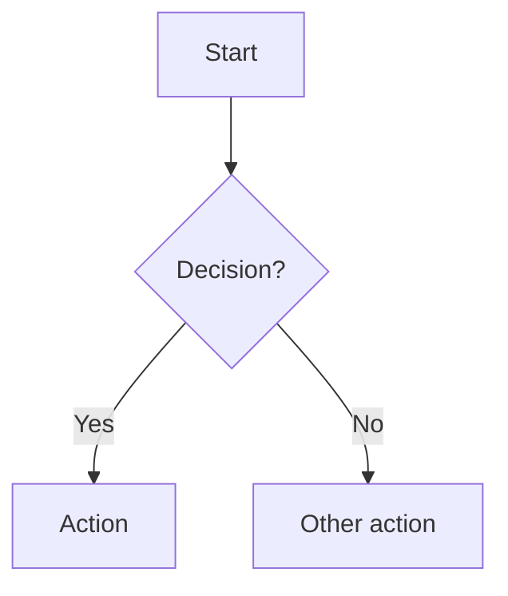

# Components (Packages) — Structure

Component packages are where **components** live. A component package groups:

- `COM-XX` components (may be purely architectural composition of other `COM-XX`)
- `SUR-XX` surfaces (1:1 with components; the public boundary)
- `CON-XX` contracts (on surfaces; bundles of guarantees and demands)
- `CAP-XX` capabilities (what the component is responsible for; derived from GOAL)
- `ALG-XX` algorithms (Mermaid flowcharts + cross-references back to PRD IDs)
- `INV-STORES-*` invariants describing state storage requirements (e.g., INV-STORES-FILE-REGISTRY)

This module defines the standard structure for component packages. It intentionally
specifies **invariants on inputs/outputs** (what they MUST include / guarantee), not
concrete schemas, field/key names, data types, or strict data "shapes".

## Structural Model

```
COM-XX (component)
├── SUR-XX (surface, 1:1 with COM)
│   └── CON-XX (contracts on surface)
│       ├── INV-XX (guarantees)
│       └── OBL-XX (demands)
├── CAP-XX (capabilities — what this component does)
├── ALG-XX (algorithms — how it does it)
└── INV-STORES-* (state storage invariants)
```

**Key relationships:**

- Each COM has exactly one SUR (its public boundary)
- SUR is a package of CON contracts
- CON bundles INV (what it guarantees) and OBL (what it demands)
- CAP derives from GOAL (GOAL → CAP decomposition)
- ALGs communicate through surfaces
- Violations detected when ALG guarantees ≠ CON guarantees

## Invariants

- **INV-COM-01 — PRD traceability:** every `COM-XX` / `SUR-XX` / `CON-XX` / `CAP-XX` /
  `ALG-XX` / `INV-STORES-*` section MUST cite PRD IDs via `Cross-references:` or `Implements:`.
- **INV-COM-02 — Surfaces are invariant contracts:** surfaces MUST be documented as
  contract bundles per `.tasks/processes/design map structure.md`.
- **INV-COM-03 — Start with one component:** begin with a single root component package
  that contains the full component graph and all algorithms; split only when the
  decomposition is clear.
- **INV-COM-04 — No shape embedding:** do not embed schema definitions, field/key names,
  data types, or example payload shapes inside component packages; express "shape"
  requirements as invariant IDs and reference them.
- **INV-COM-05 — Architectural components allowed:** a `COM-XX` may exist only to
  compose other components (no algorithms/state storage); it still participates in the graph and
  must reference relevant invariants and boundaries.
- **INV-COM-06 — Capability tracking:** every `COM-XX` MUST declare its capabilities
  (`CAP-XX`) with traceability to PRD goals (`GOAL-XX`).

## Root Component Package: `architecture.md`

The root component package is the starting point:

- Contains the initial component graph and **all** `ALG-XX` algorithms
- Defines each component's surface (`SUR-XX`) and its contracts (`CON-XX`)
- Declares capabilities (`CAP-XX`) for each component
- Acts as the index when additional component packages are created

When splitting into multiple components:

- Create new component packages as `com-XX-<kebab-name>.md`
- Move the relevant `ALG-XX`, `CAP-XX`, and `SUR-XX`/`CON-XX` sections into the new package
- Keep `architecture.md` as the root index + cross-component invariants + system diagram

## Templates

### Template: Root component package (`architecture.md`)

````markdown
# Component: Architecture (root)

Sources: {links to PRD, Design Map, ADRs}

## Component and surface map (optional until split)


## Components

### Component: COM-__

Composed-of (optional): (COM-__, COM-__)
Pattern: {pattern-name-or-id}
Implements: (GOAL-__)
Cross-references: (requires: INV-__; satisfies: SET-__; decided-by: ADR-###)

#### Capabilities

- CAP-__: {capability description}
  Derived-from: (GOAL-__)

#### Surface: SUR-__

Contracts: (CON-__, CON-__)

#### Algorithms

- ALG-__: {algorithm name}
  Guarantees: (INV-__)

#### State Storage Invariants

- INV-STORES-__: {description of state storage requirement}
  Kind: {queue|table|cache|file-registry|...}
  Cross-references: (requires: INV-__; decided-by: ADR-###)

## Contracts (CON-XX)

### Contract: CON-__

Surface: (SUR-__)
Interaction: {request-response|pub-sub|batch|stream|filesystem|...}
Cross-references: (requires: INV-__; satisfies: SET-__; decided-by: ADR-###)

Guarantees (what this contract promises):

- INV-__ — {invariant this contract guarantees}

Demands (what callers must satisfy):

- OBL-__ — {obligation callers must fulfill}

## Algorithms (ALG-XX)

### ALG-__: {algorithm name}

Owner: (COM-__)
Guarantees: (INV-__)
Cross-references: (requires: RULE-__, INV-__)


````

### Template: Split component package (`com-XX-*.md`)

````markdown
# Component: COM-__ — {component name}

Sources: {links}

## Capabilities

- CAP-__: {capability description}
  Derived-from: (GOAL-__)

## Surface: SUR-__

Contracts: (CON-__, CON-__)

### Contract: CON-__

Guarantees:
- INV-__ — {invariant}

Demands:
- OBL-__ — {obligation}

## Algorithms (ALG-XX)

### ALG-__: {algorithm name}

Guarantees: (INV-__)

```mermaid
flowchart TD
  ... (Mermaid flowchart; cite PRD IDs in Cross-references)
```

## State Storage Invariants (INV-STORES-*)

### INV-STORES-__: {description of state storage requirement}

Kind: {queue|table|cache|file-registry|...}
Cross-references: (requires: INV-__; decided-by: ADR-###)
````

## Reference Example (splitting)

For a concrete example of a root `architecture.md` plus split component package(s),
see:

- `.tasks/plans/parallel linter/lint dispatcher/architecture.md`
- `.tasks/plans/parallel linter/lint dispatcher/com-02-run-linters-orchestrator.md`
