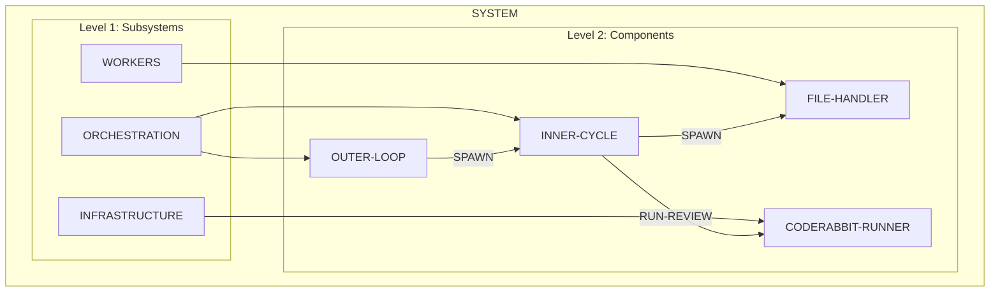

# Plan Structure

## Building Block Architecture

For complex systems, use hierarchical building blocks instead of flat rule lists.
Work from **large to small** - identify the biggest units first, then decompose.

### Building Block Schema

```markdown
## Block: {BLOCK-ID}

Parent: {PARENT-BLOCK-ID} | ROOT
Children: [{CHILD-ID}, ...]

### Purpose

{one sentence describing what this block does}

### Capabilities

| ID | Description |
|----|-------------|
| CAP-{BLOCK}-{N} | {what this block can do} |

### Algorithms

| ID | Implements | Description |
|----|------------|-------------|
| ALG-{BLOCK}-{N} | CAP-{BLOCK}-{N} | {how the capability is realized} |
```

### Protocol Schema

Protocols define how blocks communicate.

```markdown
## Protocol: {PROTOCOL-ID}

Participants: [{BLOCK-A}, {BLOCK-B}]
Direction: {A → B | A ↔ B}

### Messages

| ID | From | To | Payload |
|----|------|----|---------|
| MSG-{PROTOCOL}-{N} | {BLOCK-A} | {BLOCK-B} | {data schema} |

### Sequence

\`\`\`mermaid
sequenceDiagram
    participant A as BLOCK-A
    participant B as BLOCK-B
    A->>B: MSG-1
    B-->>A: MSG-2
\`\`\`
```

### Contract Schema

Contracts define guarantees between blocks.

```markdown
## Contract: {CONTRACT-ID}

Between: {BLOCK-A} ↔ {BLOCK-B}
Via: {PROTOCOL-ID}

### Preconditions

- {what must be true before interaction}

### Postconditions

- {what will be true after interaction}

### Invariants

- {what remains true during interaction}

### Errors

| Condition | Response |
|-----------|----------|
| {error condition} | {how to handle} |
```

### Ticket Schema

Tickets implement building blocks by referencing plan.md sections.

```markdown
# Ticket {N}: {Title}

## Implements

- Block: [{BLOCK-ID}](#block-block-id)
- Capabilities: [{CAP-ID}](#cap-id), ...
- Algorithms: [{ALG-ID}](#alg-id), ...

## Uses

- Protocols: [{PROTOCOL-ID}](#protocol-protocol-id), ...
- Contracts: [{CONTRACT-ID}](#contract-contract-id), ...

## Dependencies

- Requires: [Ticket {M}](ticket-M-name.md), ...

## Files

| Action | Path |
|--------|------|
| create | `path/to/new/file.md` |
| modify | `path/to/existing.py` |

## Acceptance Criteria

- [ ] Capability CAP-{N} is functional
- [ ] Tests pass for ALG-{N}
```

### Decomposition Hierarchy Example


