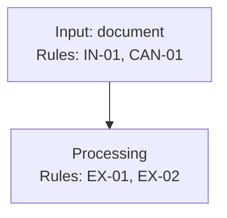
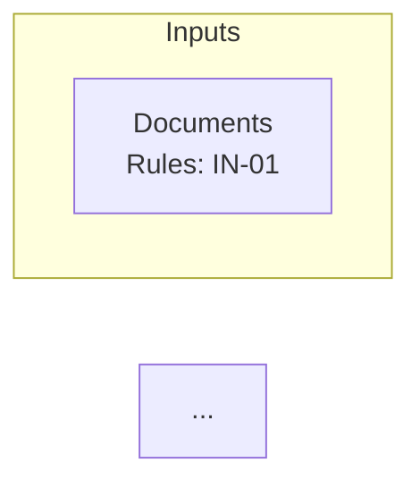
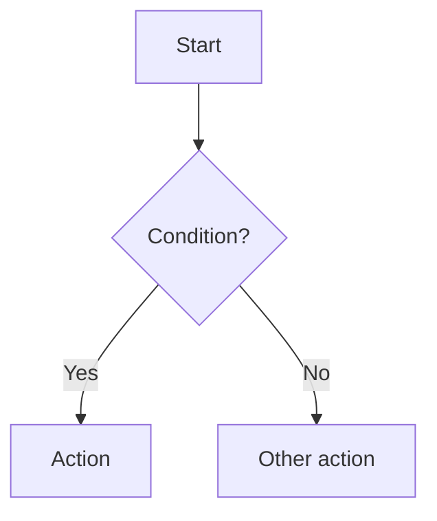

# PRD Structure and Composition Theory

## Purpose

This document defines the principles and structure for composing Product Requirements
Documents (PRDs) in this project. The format prioritizes machine-parseable structure,
traceability, and zero duplication over traditional prose-based documentation.

---

## Core Principles

### 1. No Prose

PRDs must avoid narrative paragraphs. All content should be expressed as:
- Bulleted lists
- Indexed rules with unique identifiers
- Tables (for structured comparisons)
- Diagrams (Mermaid flowcharts/component diagrams)

**Why:** Prose introduces ambiguity, makes requirements hard to trace, and encourages
duplication through restating the same concept in different words.

**Bad example (prose):**
```
The system should extract facts from documents. These facts need to be atomic,
meaning each fact contains exactly one assertion. The extraction process must
preserve the original location in the source document for traceability purposes.
```

**Good example (structured):**
```
* **EX-05 — Atomicity:** no compound facts; split conjunctions ("and/or/but") into separate facts.
* **EX-06 — Source context required:** each fact carries provenance offsets (not ownership).
```

### 2. Indexed Identifiers

Every discrete requirement, resource, goal, or rule receives a unique identifier
following these conventions:

| Prefix | Meaning | Example |
|--------|---------|---------|
| `RES-XX` | Resource (tool, library, external dependency) | `RES-01` Claude Code |
| `GOAL-XX` | High-level objective | `GOAL-03` Atomic information units |
| `INV-XX` | Invariant (immutable constraint) | `INV-01` Byte-exact provenance |
| `MET-XX` | Success metric (measurable verification) | `MET-01` Fact extraction accuracy |
| `XXX-XX` | Domain-specific rule (e.g., EX, VAL, REC) | `EX-05` Atomicity |

**Why:** Indexed identifiers enable:
- Cross-referencing without duplication
- Traceability from implementation to requirement
- Precise citations in discussions and reviews
- Machine parsing for coverage analysis

### 3. DRY (Don't Repeat Yourself)

Each concept appears exactly once. When a rule depends on or relates to another,
use cross-references instead of restating:

**Bad (duplication):**
```
* **VAL-G-01:** All facts must be atomic with one assertion each.
* **EX-05:** Each stored fact contains exactly one assertion.
```

**Good (cross-reference):**
```
* **EX-05 — Atomicity:** no compound facts; split conjunctions into separate facts.
* **VAL-G-01 — Detect grammar fabrication:** (validates EX-05 atomicity constraint)
```

### 4. Precedence Through Invariants

Invariants are constraints that:
- Apply globally across the entire document
- Override any conflicting requirements
- Cannot be violated by lower-level rules

Place invariants first and explicitly state their precedence:

```
### Invariants

* **Precedence:** invariants apply globally and override any conflicting requirements.
* **INV-01 — Byte-exact provenance:** ...
```

### 5. Hierarchical Organization

Group related rules into logical categories. Standard categories include:

| Category | Purpose |
|----------|---------|
| **Invariants** | Global constraints that override all other rules |
| **Execution rules** | How the system runs (harness, orchestration) |
| **Input rules** | Input formats, validation, canonicalization |
| **Processing rules** | Core logic, extraction, transformation |
| **Validation rules** | Quality gates, error detection |
| **Output rules** | Artifacts, formats, packaging |
| **Maintenance rules** | Updates, merges, idempotency |
| **Performance rules** | Constraints on resources, timing |
| **QA rules** | Testing strategy, coverage requirements |

### 6. Visual Representation

Use Mermaid diagrams for:
- **Component diagrams:** System architecture showing major components and data flow
- **Algorithm flowcharts:** Step-by-step decision logic with rule annotations

Annotate diagram nodes with rule references:



---

## Standard Sections

### Required Sections

These sections should appear in every PRD:

#### 1. Sources (optional header line)

References to related documents that inform or extend this PRD.

```
Sources: QA_strategy.md · requirements.md
```

#### 2. Resources

Indexed list of external dependencies (tools, libraries, APIs, models).

```
## Resources

- `RES-01` Claude Code — execution harness
- `RES-02` Python — deterministic helper scripts runtime
- `RES-03` SQLite — local DB engine / file format
```

**Guidelines:**
- One resource per line
- Include brief description of role/purpose
- Resources may reference each other (e.g., "used by `RES-04`")

#### 3. Problem Statement

Single paragraph (exception to no-prose rule) explaining:
- What problem exists
- Why it matters
- What success looks like

Keep under 200 words. This is the only prose allowed.

#### 4. Goal List

Indexed objectives the system must achieve.

```
## Goal List

* **GOAL-01 — Structured fact index:** Extract all unique, atomic facts...
* **GOAL-02 — Completeness by derivability:** Preserve base facts sufficient for...
```

**Guidelines:**
- Use `GOAL-XX —` format with short title and description
- Goals are outcome-focused (what), not implementation-focused (how)
- Goals should be measurable or verifiable

#### 5. Indexed Rule List

The bulk of the PRD. Organized into subsections by category.

```
## Indexed rule list

### Invariants

* **INV-01 — Rule name:** Description.
* **INV-02 — Rule name:** Description referencing (INV-01, GOAL-02).

### Execution rules

* **EXEC-01 — Rule name:** Description.
```

**Guidelines:**
- Each rule has unique prefix+number identifier
- Include cross-references in parentheses where applicable
- Rules should be atomic (one concern per rule)
- Use consistent verb tense (present/imperative)

#### 6. Component Diagrams

Mermaid diagrams showing system architecture.

```
## Component diagrams

### Component diagram: System Name


```

**Guidelines:**
- Annotate nodes with relevant rule IDs
- Use subgraphs to group related components
- Show data flow direction with arrows
- Include legend if diagram is complex

#### 7. Algorithms as Flowcharts

Detailed algorithmic logic as Mermaid flowcharts.

```
## Algorithms as Mermaid flowcharts

### ALG-01: Algorithm name


```

**Guidelines:**
- Name algorithms with `ALG-XX` prefix
- Reference rules at top of diagram in comment
- Decision nodes use `{}`
- Action nodes use `[]`
- Show all branches to completion

#### 8. Success Metrics

Indexed, measurable criteria that define when goals are achieved. Each metric
links to specific goals and provides objective verification criteria.

```
## Success Metrics

| ID | Metric | Target | Measurement | Goals |
|----|--------|--------|-------------|-------|
| `MET-01` | Fact extraction accuracy | >95% | Manual review of 100 samples | GOAL-01, GOAL-03 |
| `MET-02` | Reconstruction success rate | 100% | Automated byte-comparison | GOAL-02, INV-01 |
| `MET-03` | Processing throughput | <5min/page | Benchmark on 50-page doc | GOAL-10, PERF-02 |
| `MET-04` | Deduplication precision | >99% | No false merges in test set | GOAL-04, DED-05 |
```

**Guidelines:**
- Use `MET-XX` prefix for metric identifiers
- Each metric must link to at least one GOAL or INV
- Targets must be specific and testable (not "high accuracy" but ">95%")
- Measurement column specifies HOW the metric is validated
- Include both functional metrics (accuracy, coverage) and operational metrics (speed, resource use)

**Metric Categories:**

| Category | Purpose | Examples |
|----------|---------|----------|
| **Correctness** | Validates functional requirements | Accuracy, precision, recall, F1 |
| **Completeness** | Validates coverage requirements | % of source covered, reconstruction rate |
| **Performance** | Validates resource constraints | Throughput, latency, memory usage |
| **Reliability** | Validates stability requirements | Error rate, idempotency, crash frequency |

**Writing Good Metrics:**

1. **Derived from Goals:** Every goal should have at least one metric that validates it
2. **Binary Testable:** At any point, you can definitively say pass/fail
3. **Realistic Targets:** Based on baseline measurements or industry standards
4. **Measurable Now:** Don't defer measurement to "later" — define the test procedure
5. **Independent:** Metrics should not be redundant with each other

**Bad metrics:**
```
| Metric | Target |
|--------|--------|
| Quality | High |
| Speed | Fast enough |
| User satisfaction | Good |
```

**Good metrics:**
```
| ID | Metric | Target | Measurement |
|----|--------|--------|-------------|
| `MET-01` | Fact precision | >95% | Manual audit of 100 random facts |
| `MET-02` | Cold start time | <10s | Time from invocation to first output |
| `MET-03` | Task completion rate | 100% | No CQ artifacts in golden test set |
```

### Optional Sections

Include when applicable:

#### Personas / User Scenarios

When the product serves distinct user types or use cases.

```
## Personas

### Primary: Developer

- Uses CLI interface
- Needs batch processing
- Values accuracy over speed

### Secondary: Reviewer

- Uses output artifacts
- Needs clear provenance
- Values auditability
```

#### Open Questions

Unresolved decisions that require future input.

```
## Open Questions

- [ ] **Q-01:** Should we support PDF input directly? (blocked on RES-XX evaluation)
- [x] **Q-02:** Embedding model selection — resolved: RES-10 Qwen-3
```

---

## Composition Workflow

### Step 1: Define Problem and Goals

Start with:
1. Problem Statement (single paragraph)
2. Goal List (3-10 indexed objectives)

These frame all subsequent requirements.

### Step 2: Define Success Metrics

For each goal, define at least one measurable metric:
1. What measurement validates this goal?
2. What is the specific target threshold?
3. How will measurement be performed?

This ensures goals are verifiable from the start.

### Step 3: Identify Resources

List all external dependencies. This inventory constrains what rules can specify.

### Step 4: Establish Invariants

Define immutable constraints that must never be violated. These are your
"constitutional" requirements.

### Step 5: Derive Rules by Category

For each category (execution, input, processing, etc.):
1. Enumerate the rules needed to achieve goals
2. Ensure each rule is atomic
3. Cross-reference related rules and invariants
4. Avoid duplicating concepts already covered

### Step 6: Add Visual Diagrams

Create component diagrams and algorithm flowcharts that:
- Summarize the system visually
- Annotate with rule references
- Clarify complex interactions

### Step 7: Review for DRY Violations

Scan the document for:
- Similar wording in multiple rules (consolidate or cross-reference)
- Implicit dependencies (make explicit via references)
- Prose creep (convert to structured format)

### Step 8: Validate Metric Coverage

Verify that:
- Every GOAL has at least one MET that validates it
- Every MET has a defined measurement procedure
- No MET is redundant with another

---

## Rule Writing Guidelines

### Atomic Rules

Each rule captures exactly one requirement:

**Bad (compound):**
```
* **EX-01:** Extract facts atomically, deduplicate them, and store with provenance.
```

**Good (atomic):**
```
* **EX-01:** Extract facts from input documents.
* **EX-02:** Ensure extracted facts are atomic (one assertion each).
* **DED-01:** Deduplicate identical facts.
* **EX-06:** Attach provenance offsets to each fact.
```

### Self-Contained Description

Rules should be understandable without reading others, but may reference others
for context:

```
* **REC-03 — Byte-for-byte comparison:** reconstruction validation requires exact
  character match between original and reconstructed text (not semantic equivalence).
```

### Consistent Formatting

Use this template for rules:

```
* **PREFIX-XX — Short title:** Description in imperative or declarative form.
  Additional detail if needed. Cross-references: (REF-01, REF-02).
```

### Expanded Sections

For complex invariants or rules, add an expanded subsection:

```
### Invariants

* **INV-01 — Byte-exact provenance:** canonical UTF-8 source; reconstruction success.

#### INV-01: Byte-exact Provenance (expanded)

* **Canonical source text:** ingestion produces canonical UTF-8 string (CAN-01).
* **Provenance via offsets:** references stored as character offsets (GOAL-06).
* **Pass condition:** byte-for-byte match required (REC-03).
```

---

## Common Anti-Patterns

### 1. Prose Descriptions

**Problem:** Narrative paragraphs that bury requirements in sentences.

**Fix:** Convert to indexed rules with explicit IDs.

### 2. Duplicate Concepts

**Problem:** Same requirement stated differently in multiple places.

**Fix:** Consolidate to single rule; use cross-references elsewhere.

### 3. Implicit Dependencies

**Problem:** Rule assumes another without citing it.

**Fix:** Add explicit cross-reference: "(requires INV-01)"

### 4. Vague Rules

**Problem:** "The system should handle errors appropriately."

**Fix:** Specify exact behavior: "EXEC-05 — On extraction failure, emit
FailureArtifact with span_id, error_type, and original_text."

### 5. Implementation Details in Goals

**Problem:** Goals that specify how, not what.

**Fix:** Keep goals outcome-focused. Move implementation to rules.

### 6. Missing Diagrams

**Problem:** Complex multi-component system described only in text.

**Fix:** Add component diagram showing relationships and data flow.

---

## Summary

The PRD format used in this project differs from traditional prose-based PRDs by:

1. **Eliminating prose** in favor of indexed, atomic rules
2. **Enabling traceability** through unique identifiers
3. **Preventing duplication** through cross-references
4. **Establishing precedence** through invariants
5. **Visualizing complexity** through Mermaid diagrams
6. **Organizing hierarchically** by concern (execution, validation, output, etc.)

This approach produces documents that are:
- Machine-parseable for coverage analysis
- Unambiguous for implementation
- Maintainable through modular updates
- Traceable from requirement to code

The trade-off is reduced readability for casual readers. These PRDs are optimized
for precision and completeness, not narrative flow.
