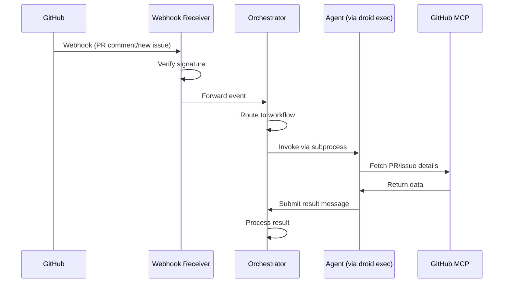

# AI Agent Entry Point

Welcome to the **Developing With AI 2.0** system. This repository previously followed a human-orchestrated
architecture but has been upgraded to an **automated, orchestrator-based system** where a central orchestrator
service manages workflows and agent invocations. You, the AI agent, act as a specialized role within a larger
workflow coordinated by this service.

## Project Overview

This project implements an automated AI workflow system using a 5-role skeleton across four domains: Product,
UX, UI, and Technical. The system uses a **FastAPI orchestrator service** to route messages to workflows and a
separate **webhook receiver service** to handle GitHub integration. Agents submit messages to the
orchestrator, which then invokes other agents via `droid exec`. The goal is to facilitate high-quality
software development through structured, automated collaboration.

## Repository Structure

* **`.factory/droids/`**: Agent definitions (POML) organized by domain. **`docs/`**: The Coarse Knowledge
  Graph (source of truth) with subdirectories for each domain. **`app/routes/`**: API endpoint routers,
  including `orchestrator_router.py`. **`app/services/`**: Business logic layer, including
  `orchestrator_service.py` and `agent_invoker.py`. **`app/contracts/`**: Pydantic models, including
  `orchestrator_contracts.py`. **`webhook_receiver/`**: Standalone service for handling GitHub webhooks.
  **`openapi/`**: Generated OpenAPI schema JSON. **`tests/`**: Test organization (`unit/`, `integration/`,
  `e2e/`). **`tools/`**: Workflow support tools (e.g., deep research). **`scripts/`**: Helper scripts for
  setup and validation.

## Operational Protocols

1. **Consult the Knowledge Graph**: Before starting any task, review `docs/README.md` for the index and
   consult relevant domain documentation in `docs/product/`, `docs/ux/`, `docs/ui/`, `docs/tech/`, and
   `docs/qa/`.
2. **Adhere to Roles**: Strictly adhere to your assigned role (R1, R2, R3, R4, or R5). Do not deviate from
   your domain or function.
3. **Communication**: Use TOON (Token-Oriented Object Notation) for structured data handoffs (specs, plans)
   when required by the workflow.
4. **Orchestrator Submission**: Agents submit messages to the orchestrator via POST to
   `/api/v1/orchestrator/submit` instead of calling other agents directly.
5. **No Long-Running Operations**: Agents must not make long-running tool calls directly; instead, submit
   messages to the orchestrator to request long-running tasks.
6. **Git Worktree Usage**: Agents may work in parallel using git worktrees managed by the orchestrator.
7. **Execution Standards**: After performing edits, run local validation commands (tests/linting) as defined
   in the technical documentation.
8. **Documentation Edits**: Documentation updates are allowed when needed to complete tasks or satisfy review
   feedback.
9. **Review Feedback Coverage**: Address every review comment (including documentation and formatting). If a
   comment is unclear, forward it to the orchestrator instead of skipping it.

## The 5-Role Skeleton

* **R1: Strategy Planner**: Defines "big phases" using deep research; reviews R2's detailed plan and performs
  final review after R4 passes output. **R2: Planner**: Breaks phases into discrete tasks; reviews R3's
  implementation (diff) before it moves to R4. **R3: Implementor/Editor**: Executes a single task at a time.
  **R4: Quality Reviewer**: Automated checks (cloud-based, e.g., CodeRabbit) that apply feedback labels
  (routed by orchestrator). **R5: QA & Maintenance**: Monitors production metrics (cloud-based) and feeds
  issues back to R1 via the orchestrator.

## Orchestrator Architecture

The system is built around a central **FastAPI Orchestrator Service** that manages the lifecycle of all
workflows.

* **Message Routing**: The orchestrator receives messages from agents and routes them to the appropriate
  workflow instance. **Workflow State**: Manages the state of active workflows and coordinates handoffs
  between roles. **Agent Invocation**: Uses `app/services/agent_invoker.py` to spawn `droid exec` subprocesses
  for agent execution. **Ticket Claiming**: Implements a first-come-first-served mechanism for agents to claim
  tasks (`app/services/ticket_manager.py`). **PR Comment Routing**: Analyzes PR comments and routes them to
  the appropriate agent based on context (`app/services/pr_comment_router.py`). **Git Worktrees**: Manages
  temporary git worktrees to allow multiple agents to work in parallel without conflict.

## Webhook Receiver Service

A standalone **Webhook Receiver Service** (`webhook_receiver/`) handles all incoming events from GitHub.

* **Signature Verification**: Verifies HMAC SHA256 signatures to ensure security. **Event Parsing**: Parses PR
  comments, new issues, and other GitHub events. **Event Forwarding**: Forwards validated events to the
  Orchestrator Service for routing. **No MCP Access**: The receiver service does NOT use GitHub MCP; it
  delegates GitHub API interactions to agents via the orchestrator.

## Event Flow Architecture



## Command Types and Invocation Patterns

### Orchestrator Message Submission

Agents invoke other agents or report status by submitting messages to the orchestrator:

```bash
# Agent submits a message to orchestrator
curl -X POST http://localhost:8000/api/v1/orchestrator/submit \
  -H "Content-Type: application/json" \
  -d '{
    "role": "R2 Tech Planner",
    "task": "break down phase X into tasks",
    "context": {"phase_doc": "docs/plans/phase1.md"},
    "requesting_agent": "R1 Tech Strategist"
  }'
```

### Orchestrator Invokes Agents

The orchestrator manages the execution environment and invokes agents using subprocess calls to `droid exec`.
Agents should not worry about this mechanism but should be aware they are running in this context.

### GitHub Integration

All GitHub interactions start with a webhook to the receiver service, flow to the orchestrator, and result in
an agent being invoked with GitHub MCP access.

## Inter-Domain Handoffs

* **Product R1** -> **UX R1** **UX R1** -> **Technical R1** All handoffs are automated via orchestrator
  message routing based on the workflow definitions.

## Ticket and PR URL Handling

Users can initiate workflows by providing PR or ticket URLs to the orchestrator.

1. **User Submission**: User POSTs a URL to the orchestrator.
2. **GitHub Agent**: Orchestrator invokes the specialized GitHub Agent to fetch details using MCP.
3. **Automatic Routing**: Based on the content (e.g., labels, file paths), the orchestrator routes the ticket
   to the appropriate domain and role.
4. **Claiming**: For new tickets, the orchestrator broadcasts availability, and agents claim tickets on a
   first-come-first-served basis.

## Documentation-First Approach

When an agent makes a mistake, corrections are made by updating the Knowledge Graph (via R1 agents) rather
than editing output directly. This ensures the system learns and maintains a single source of truth.

## Development Scripts

The project includes several helper scripts in the `scripts/` directory to streamline development and
validation tasks.

### start-server

Launches the FastAPI application using Uvicorn with built-in health checks and graceful shutdown handling.

* **Usage**: `uv run start-server [OPTIONS]` **Options**:
  * `--host`: Server bind address (default: `127.0.0.1`). Use `0.0.0.0` for external access. `--port`: Server
    port (default: `8000`). `--reload`: Enable auto-reload for development. `--no-reload`: Explicitly disable
    auto-reload. `--skip-health-check`: Skip the post-start health probe (not recommended).
* **Environment Variables**: `HOST`, `PORT` **Examples**:

  ```bash
  # Default start (localhost:8000)
  uv run start-server

  # Development mode with auto-reload
  uv run start-server --reload

  # Bind to all interfaces on port 8080
  uv run start-server --host 0.0.0.0 --port 8080
  ```

### gen_openapi

Generates the OpenAPI 3.1 schema JSON file from the FastAPI application code.

* **Usage**: `uv run gen_openapi` **Output**: Saves to `openapi/openapi.json`. **Note**: This script must be
  run before `lint` or security scans to ensure the schema is up-to-date. **Timeout guidance**: Allow up to 2
  hours for this command; do not stop it early when invoked via `uv run`.

### lint

Runs a comprehensive suite of static analysis and security tools.

* **Usage**: `uv run lint` **Operations Performed**:
  1. `ruff format .`: Auto-formats code.
  2. `ruff check --fix .`: Fixes linting issues.
  3. `mypy`: Type checking.
  4. `checkov`: Scans the generated `openapi/openapi.json` against policies in `.checkov.yaml`.
* **Prerequisite**: Run `uv run gen_openapi` first to generate the schema for Checkov. **Timeout guidance**:
  Allow up to 2 hours for this command; do not stop it early when invoked via `uv run`.
* **Markdown lint expectation**: The lint job runs `pymarkdown` with the repo config `.pymarkdown.json` and
  excludes listed paths in `scripts/lint.py`. When it flags documentation, adjust the doc text (e.g., wrap
  long lines, align bullet markers) to satisfy the reported rules; do not silence rules or change the lint
  configuration. Rerun `uv run lint` until it passes.
* **TCH003 handling**: Reintroduce `TYPE_CHECKING` gates where runtime inspection is not needed. For files
  that feed runtime type introspection (e.g., `app/contracts/**`, `app/schemas/**`), keep imports loaded at
  runtime and rely on the scoped TCH003 ignore already configured.

### sonar_scan

Runs SonarQube analysis using a Docker-based wrapper with caching enabled. Agents must not run this command; a
human must run it, and the agent will fetch the latest artifact afterward.

* **Usage**: `./scripts/sonar_scan.sh [OPTIONS]` **Options**:
  * `-t, --token`: Authentication token (overrides `SONAR_TOKEN` env var). `-u, --url`: SonarQube server URL
    (default: `http://localhost:9000`). `--`: Arguments after this flag are passed directly to
    `sonar-scanner-cli`.
* **Environment Variables**: `SONAR_TOKEN`, `SONAR_HOST_URL` **Examples**:

  ```bash
  # Run with token
  ./scripts/sonar_scan.sh -t <token>

  # Run with debug output
  ./scripts/sonar_scan.sh -- -X
  ```

* **Human-run wrapper**: `uv run sonar-review -- [sonar_scan args]`. **Agent retrieval**: After the human run,
  the agent will fetch the newest artifact via `uv run latest-review --type sonar` (prints the newest
  `.review/*.review.sonar` path). **Log output**: Wrapper writes to `.review/<timestamp>.review.sonar` and
  echoes the path. **Timeout guidance**: Allow up to 2 hours for this command; do not stop it early when
  invoked via `uv run`.

## Review Artifact Handling

* Store all review tool outputs under `.review/` using UTC timestamps (`<YYYYMMDDTHHMMSSZ>.review.coderabbit`
  or `.review.sonar`). Record any follow-up questions for humans in `.review/review-questions-<timestamp>.txt`
  directly after running reviews. Keep these artifacts excluded from scans and VCS per ignore configurations.

## Code Coverage

Test coverage is enforced via `pytest-cov` with configuration in `pyproject.toml`.

* **Threshold**: Minimum 80% coverage required (`fail_under = 80`). **Tracked Sources**: `app/`, `scripts/`,
  `tools/`. **Omitted Paths**: Tests, caches, site-packages, and virtual environments. **Excluded Lines**:
  Standard non-executable patterns plus: `if TYPE_CHECKING:` `class .*Protocol\):` Abstract methods
  **Validation Commands**:

  ```bash
  # Set required DB creds for settings validation
  export SURREALDB_USER=root SURREALDB_PASS=root

  # Check coverage in terminal
  uv run pytest --cov

  # Generate HTML report
  uv run pytest --cov --cov-report=html

  # Show missing lines
  uv run pytest --cov --cov-report=term-missing
  ```

## Code Review

Automated code reviews are performed using the CodeRabbit CLI.

### coderabbit

Automated CodeRabbit review wrapper (adds `--prompt-only` automatically). Agents must not run this command; a
human must run it, and the agent will fetch the latest artifact afterward.

* **Human-run command**: `uv run coderabbit-review -- [--base <branch> | --type <mode> | --base-commit <sha>]
  [extra coderabbit args]` (defaults to `--base main` when no target flag is provided). **Selection rule**:
  Choose exactly one of `--base`, `--type`, or `--base-commit`; do not combine. **Purpose**: Provides
  AI-driven feedback on work-in-progress code before it is committed. **Agent retrieval**: After the human
  run, the agent will fetch the newest artifact via `uv run latest-review --type coderabbit` (prints the
  newest `.review/*.review.coderabbit` path). **Timeout guidance**: Allow up to 2 hours for this command; do
  not stop it early when invoked via `uv run`.

## Architectural Patterns

The application follows a strict layered architecture to ensure separation of concerns and testability.

### Routers (`app/routes/`)

* **Role**: Handle HTTP request/response lifecycle. **Pattern**: Use `APIRouter` instances registered in
  `app/core/factory.py`. **Standards**:
  * No business logic in routers. Use Pydantic models for `response_model`. Include `summary`, `description`,
    and `responses` for OpenAPI documentation.
* **Example**: `app/routes/example_router.py`.

### Services (`app/services/`)

* **Role**: Encapsulate business logic. **Pattern**: Class-based services with dependency injection.
  **Lifecycle**:
  * `__init__`: Initialize dependencies. `process()`: Core logic methods. `shutdown()`: Cleanup resources.
* **Standards**: Pure Python objects, agnostic of the HTTP layer. **Example**:
  `app/services/example_service.py`.

### Contracts/DTOs (`app/contracts/`)

* **Role**: Define data structures and validation rules. **Pattern**: Pydantic models with strict
  configuration. **Standards**:
  * `ConfigDict(extra="forbid")` to reject unknown fields. Use `Annotated` and `Field` for validation
    constraints. Define custom validators (`@model_validator`) for complex logic.
* **Example**: `app/contracts/example_contract.py`.

## Testing Workflow

Testing is divided into two tiers to balance feedback speed and comprehensive verification.

### Integration Tests

* **Location**: `tests/integration/` **Speed**: Fast (in-process). **Fixture**: `async_client` (uses
  `httpx.ASGITransport`). **Scope**: Tests application logic with mocked external dependencies where
  appropriate. No network overhead. **Command**: `uv run pytest tests/integration/`

### E2E Tests

* **Location**: `tests/e2e/` **Speed**: Slow (requires live server). **Fixture**: `api_client` (builds and
  runs a Docker container on port 8008). **Marker**: `@pytest.mark.e2e`. **Scope**: Validates full stack,
  startup scripts, health checks, and network handling. **Command**: `uv run pytest -m e2e`

### Common Test Commands

> **Note**: `pytest-check` is available for multiple soft assertions in a single test. Example:
`check.equal(result, expected)`.

```bash
# Run all tests (including E2E)
uv run pytest

# Run only fast tests (skip E2E)
uv run pytest -m "not e2e"

# Run only E2E tests
uv run pytest -m e2e

# Run with verbose output
uv run pytest -v
```

## Orchestrator Invocation Examples

These examples show how the orchestrator internally invokes agents via `droid exec`. **These commands are for
internal orchestrator use only and should not be executed by humans or agents directly.**

The orchestrator executes:

```bash
# INTERNAL USE ONLY: Orchestrator invoking an agent
droid exec --skip-permissions-unsafe --model custom:gemini-3-pro-preview-low --f "/tmp/agent_context_123.json"
```

## Docstring Linter Errors

See docs/docstrings-guide.md
