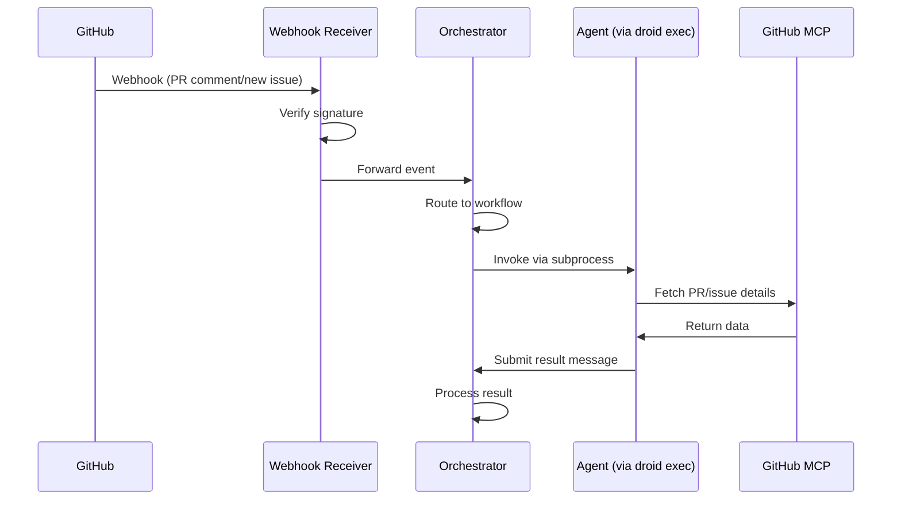

# Event Flow Architecture

This document visualizes the end-to-end event flow from GitHub webhook to agent execution
and result processing.

## Sequence Diagram

## Flow Stages

1. **Webhook Reception**: GitHub sends a webhook to the Webhook Receiver service
2. **Signature Verification**: The receiver verifies the HMAC SHA256 signature
3. **Event Forwarding**: Validated events are forwarded to the Orchestrator
4. **Workflow Routing**: The orchestrator determines which workflow should handle the event
5. **Agent Invocation**: The orchestrator spawns an agent via `droid exec` subprocess
6. **GitHub MCP Access**: The agent fetches additional details from GitHub using MCP
7. **Result Submission**: The agent submits its result back to the orchestrator
8. **Result Processing**: The orchestrator processes the result and continues the workflow
